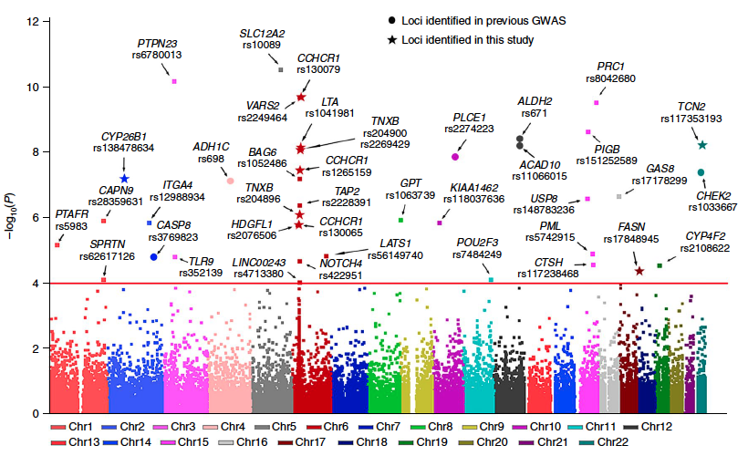

**Author(s)**: `r params$author`  
**Date**: `r Sys.Date()`  


# Academic Citation
If you use this code in your work or research, we kindly request that you cite our publication:

Xiaofan Lu, et al. (2025). FigureYa: A Standardized Visualization Framework for Enhancing Biomedical Data Interpretation and Research Efficiency. iMetaMed. https://doi.org/10.1002/imm3.70005


```{r setup, include=FALSE}
knitr::opts_chunk$set(echo = TRUE)
```

## 需求描述
## Requirement description

画出paper里的曼哈顿图，文字标签好看些。

Draw a picture of Manhattan from the paper, the text labels look better.



出自<https://www.nature.com/articles/s41588-018-0045-8>

from<https://www.nature.com/articles/s41588-018-0045-8>

## 应用场景
## Application scenario

展示每条染色体上的SNP分布，通常作为外显子组测序文章里的第一个图。

Show the distribution of SNP on each chromosome, usually presented as the first figure in an exon sequencing article.

## 输入文件
## Input file

easy_input.csv，包括染色体名字、SNP编号、在染色体上的位置（第几个碱基）、pvalue、类型type、基因名gene。

其中type和gene，非必需，如果能提供基因名，就写在gene列；如果要用不同形状来展示不同类的SNP，会把类型写到type。

easy_input.csv, including chromosome name, SNP number, position on the chromosome (which base), pvalue, type, gene name.

Type and gene are not required, if the gene name can be provided, it should be written in the gene column; if different shapes are used to display different classes of SNPs, the type will be written in type.

```{r,message=FALSE}
source("install_dependencies.R")
library(dplyr)

gwas <- read.csv("easy_input.csv", as.is = T)
head(gwas)
str(gwas)

gwas$chr <- factor(gwas$CHR,levels=c(1:18,"X","Y"))#给染色体排序 order chromosomes
```

如果自己不提供染色体长度，就用SNP位置最大值作为染色体长度，运行下面这段

If you don't provide the chromosome length yourself, use the SNP position maximum as the chromosome length and run the following paragraph

```r
chrx <- gwas %>% 
  group_by(chr) %>% 
  summarise(chr_len=max(POS)) %>% 
  
  #计算每条染色体在x轴上的起始位置
  #calculate the starting position of each chromosome on the x-axis
  mutate(chrx=cumsum(chr_len)-chr_len) %>%
  select(-chr_len) %>% #删除染色体长度 delete chromosome length
  data.frame()
```

Karyotype.txt，如果你自己提供染色体长度文件，就运行下面这段

Karyotype.txt, if you provide your own chromosome length file, run the following paragraph

```{r}
chrom <- read.table("Karyotype.txt", header = T, as.is = T)
head(chrom)
#计算每条染色体在x轴上的起始位置
#calculate the starting position of each chromosome on the x-axis
chrom$chrx <- c(0,cumsum(as.numeric(chrom$chr_len))[-nrow(chrom)])
chrx <- data.frame(chr = chrom$chr, chrx = chrom$chrx)
chrx$chr <- factor(chrx$chr,levels=c(1:18,"X","Y"))#给染色体排序 order chromosomes
```

## 计算每个SNP的坐标
## Calculate the coordinates of each SNP

```{r}
#计算每条染色体在x轴上的坐标
#calculate the coordinates of each chromosome on the x-axis
gwas <- left_join(gwas, chrx, by=c("chr"="chr")) %>%
  #arrange(chr, POS) %>%
  mutate(SNPx=POS+chrx)

#取-log10(P-value)作为y轴坐标
#take -log10(P-value) as the y-axis coordinate
gwas$SNPy <- -log10(gwas$P_value)
```

## 用阈值分类
## Classify by threshold

```{r}
#设置阈值
#set threshold
logPcutoff <- 4

#是否超过阈值分为两类，后面将用不同大小的点来区分
#whether or not the threshold is exceeded is divided into two categories, which will be distinguished later by dots of different sizes
gwas$pcut <- rep("0", nrow(gwas))
gwas[gwas$SNPy > logPcutoff,]$pcut <- "1"

#只给超过一定阈值的SNP写文字标签
#write text labels only for SNP above a certain threshold
gwas$label <- rep(NA, nrow(gwas))
gwas[gwas$SNPy > logPcutoff,]$label <- paste(gwas[gwas$SNPy > 4,]$gene,gwas[gwas$SNPy > 4,]$SNP,sep = "\n")
#如果没有提供基因名，就用下面这行
#if the gene name is not provided, use the following line
#gwas[gwas$SNPy > logPcutoff,]$label <- gwas[gwas$SNPy > 4,]$SNP

tail(gwas)
str(gwas)
```

## 开始画图
## Start drawing

#### 先画点
#### Draw dots first

```{r,fig.width=7,fig.height=4}
#不喜欢默认的配色，自定义足够多的颜色
#don't like the default color scheme, customize enough colors
mycol <- rep(c("#223D6C","#D20A13","#FFD121","#088247","#11AA4D","#58CDD9","#7A142C","#5D90BA","#431A3D","#91612D","#6E568C","#E0367A","#D8D155","#64495D","#7CC767"),2)

#染色体的名字作为x轴标签
#chromosome names as x-axis labels
axisdf = gwas %>% group_by(chr) %>% summarize(center=( max(SNPx) + min(SNPx) ) / 2 )

library("ggplot2")
p <- ggplot(data = gwas, mapping = aes(x = SNPx, y = SNPy)) + 
  geom_point(aes(colour = chr, #每条染色体用不同的颜色 use a different color for each chromosome
                 shape = type, #不同类型用不同形状 different shapes for different types
                 size = pcut)) + #阈值上下的点用不同大小 dots above and below the threshold use different sizes
  #如果没有分类信息，或者不需要用不同的形状显示分类，就运行下面这行
  #if there are no categories, or if you don't need to display the categories in a different shape, run the following line
  #geom_point(aes(colour = CHR)) +
  scale_size_discrete(range = c(0.5,2)) + #点的大小范围 range of dot sizes
  #scale_shape_manual(values = c(20,8,15)) + #点的形状 shape of the dot
  
  #添加阈值的红色直线
  #add a red line with threshold
  geom_hline(yintercept = logPcutoff, color = 'red') +
  
  xlab("") + ylab(expression(-log[10](P))) + 
  scale_x_continuous(label = axisdf$chr, breaks= axisdf$center,
                     expand = expand_scale(mult = c(0,0.02))) + #左边到头，右边留空 left to the end, leave the right blank
  scale_y_continuous(expand = expand_scale(mult = c(0,0.04))) + #下面到头，上面留空 bottom to the end, leave the top blank
  
  theme_bw() + #去除背景色 remove background color
  theme(panel.grid =element_blank()) + #去除网格线 remove gridlines
  theme(panel.border = element_blank()) + #去除外层边框 remove outer border
  theme(axis.text = element_text(size = rel(0.8)), #坐标轴标签字号 axis label font size
        axis.line = element_line(colour = "black")) #沿坐标轴显示直线 display lines along the axes
  
p1 <- p + scale_color_manual(values = mycol) + #使用自定义的颜色 use custom colors
  guides(colour = FALSE, size = FALSE) + #不显示染色体图例 chromosome legend not shown
  theme(legend.background = element_blank(), 
        legend.title = element_blank(),
        legend.text = element_text(size = 8), #图例字号 legend font size
        legend.position = c(1,1),legend.justification = c(1,1)) #形状的图例放在右上角 the legend for the shape is placed in the upper right corner
p1

#图例放到底部
#the legend is placed at the bottom
p2 <- p + theme(axis.ticks.x = element_blank(), axis.text.x = element_blank()) +#去除x轴刻度和标签 remove x-axis scale and labels
  guides(color = guide_legend(nrow = 2), #染色体的图例排两行 the legend for the chromosomes is in two rows
         size = FALSE) + #不显示点大小的图例 the legend does not show the point size
  theme(legend.background = element_blank(), 
        legend.title = element_blank(),
        legend.box = "vertical", #两个图例垂直摆放 two legends are placed vertically
        legend.margin=margin(t= 0, unit='cm'), #图例不留边 the legend does not leave a margin
        legend.spacing = unit(0,"in"), #两个图例紧挨着 two legends are next to each other
        legend.position = "bottom") + #图例放在底部 the legend is placed at the bottom
  scale_color_manual(labels = paste0("Chr",unique(gwas$chr)),
                     values = mycol)
p2
```

### 再加箭头和标签
### Add more arrows and labels

```{r,fig.width=7,fig.height=4}
library(ggrepel)
p2 + geom_text_repel(aes(label = label), 
                     size = 2, #标签文字的字号 font size of label text
                     point.padding = unit(0.5, "lines"), # label与point之间的连接显示 connection display between label and point
                     segment.colour = "black", # 连接（直线＋箭头）的颜色 color of connection (line + arrow)
                     segment.size = 0.4, # 连接（直线＋箭头）的粗细 thickness of connection (line + arrow)
                     arrow = arrow(angle = 20, length = unit(0.04,"inches")), # 箭头设置参考?arrow arrow setting reference ?arrow
                     ylim = c(logPcutoff, max(gwas$SNPy)), # 限制label的绘图区域 limit the drawing area of the label
                     direction = "both", # 默认在x、y轴方向上调整label的位置 adjust the position of the label in the x and y directions by default
                     min.segment.length = 0, #默认长度小于0.5的箭头就不画了 arrows with a default length of less than 0.5 are not drawn
                     na.rm = TRUE #不提示移除NA no prompt to remove NA
                     )

#保存到pdf文件
#save to PDF file
ggsave("Manhattan.pdf",width = 7,height = 4)
```

还可以给标签加上边框

You can also add borders to the labels

```{r,fig.width=7,fig.height=4}
p1 + geom_label_repel(aes(label = label),
                    size = 2,
                    point.padding = unit(0.5, "lines"), 
                    
                    label.size = 0.1, # label外的边框宽度 the width of the border outside the label
                    label.r = unit(0.2, "lines"), # label外的边框直角弧度 the right-angled arc of the frame outside the label
                    
                    segment.colour = "black", 
                    segment.size = 0.5, 
                    arrow = arrow(length = unit(0.1,"cm")), 
                    ylim = c(logPcutoff, max(gwas$SNPy)), 
                    direction = "both", 
                    min.segment.length = 0,
                    na.rm = TRUE 
)
```

参考资料<http://rstudio-pubs-static.s3.amazonaws.com/155546_17c0cb7ee350417e902dfb9031b81f48.html>

曼哈顿图的更多画法参考这篇：<https://www.r-graph-gallery.com/wp-content/uploads/2018/02/Manhattan_plot_in_R.html>

References<http://rstudio-pubs-static.s3.amazonaws.com/155546_17c0cb7ee350417e902dfb9031b81f48.html>

Refer to this article for more drawing methods of the Manhattan map: <https://www.r-graph-gallery.com/wp-content/uploads/2018/02/Manhattan_plot_in_R.html>

```{r}
sessionInfo()
```
