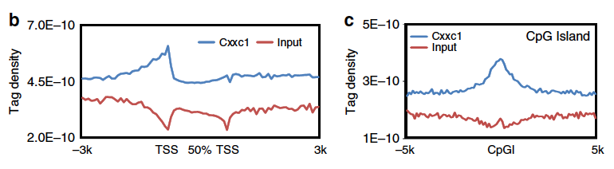

**Author(s)**: `r params$author`  
**Date**: `r Sys.Date()`  


# Academic Citation
If you use this code in your work or research, we kindly request that you cite our publication:

Xiaofan Lu, et al. (2025). FigureYa: A Standardized Visualization Framework for Enhancing Biomedical Data Interpretation and Research Efficiency. iMetaMed. https://doi.org/10.1002/imm3.70005


```{r setup, include=FALSE}
knitr::opts_chunk$set(echo = TRUE)
```

## 需求描述
## Requirement description

用R画出两个样品对比的profile。

Use R to draw a profile comparing the two samples.



图 3 | DP 胸腺细胞中 Cxxc1 结合和 H3K4me3 修饰的全基因组图谱。

(b) Cxxc1 结合峰在扩展基因体上的分布。计算了所有 RefSeq (mm9) 基因的基因体（转录起始位点（TSS）和转录终止位点（TTS）之间）、TSS 上游 3 kb 和 TTS 下游 3 kb 区域的 Cxxc1 结合标记密度。在启动子区域的 100-bp 窗口和 5%的基因体序列中汇总了独特的映射标签。所有窗口标签计数均按窗口中的碱基总数和给定样本的总读数进行归一化处理。

(c) CpG 岛（CpGI）上 Cxxc1 结合峰的富集。计算 CpG 岛和 5-kb 侧翼区域的 Cxxc1 结合标记密度。

出自<https://www.nature.com/articles/ncomms11687>

Figure 3 | Genome-wide maps of Cxxc1 binding and H3K4me3 modification in DP thymocytes.

(b) Distribution of Cxxc1-binding peaks across extended gene bodies. The tag density of Cxxc1 binding was calculated on gene bodies (between transcription start site, TSS and transcription termination site, TTS), as well as 3-kb upstream of TSS and 3-kb downstream of TTS regions of all RefSeq (mm9) genes. Uniquely, mapped tags were summarized in 100-bp windows for promoter regions and in 5% of gene body sequences. All window tag counts were normalized by the total number of bases in the windows and the total read number of the given sample.

(c) Enrichment of Cxxc1-binding peaks on CpG islands (CpGI). The tag density of Cxxc1 binding was calculated on CpG islands and 5-kb flanking regions.

from<https://www.nature.com/articles/ncomms11687>

## 应用场景
## Application scenario

对比不同的样品在某一区域的信号特征，不仅限于ChIP-seq、DNase-seq、ATAC-seq数据。

对比IP实验和input对照的信号强度，例如需求描述里的图：

(b) 把基因压缩到统一长度，观察转录起始位点（TSS）、转录终止位点（TTS）、gene body以及两侧的信号特征。

(c) 观察某一功能区域，例如CpGi、TSS、TTS、peak summits或enhancer区及其两侧的信号特征。

Compare the signal characteristics of different samples in a certain region, not limited to ChIP-seq, DNase-seq, ATAC-seq data.

Compare the signal intensity of IP experiments and input controls, e.g., the figure in the requirement description:

(b) Compress genes to a uniform length and observe the signal characteristics at the transcription start site (TSS), transcription termination site (TTS), gene body, and both sides.

(c) Observe a functional region, e.g., CpGi, TSS, TTS, peak summits, or enhancer regions, and signaling features on either side.

## b图
## Figure b

为了提取bw文件里的信号，需要用到2个函数`regionCapture`、`signal_caputer_around_gene`，保存在`corelib.R`文件里

In order to extract the signals in the bw file, 2 functions `regionCapture`, `signal_caputer_around_gene` are needed, saved in the `corelib.R` file

```{r}
source("install_dependencies.R")
#install.packages("rtracklayer")
source("corelib.R") #位于当前文件夹 it is located in the current folder
```

### 参数设置
### Parameter setting

在这里修改常见的需要调整的参数

Modify common parameters that need to be adjusted here

```{r}
outputName <- "geneBodyProfiler_example.pdf" #输出的pdf文件名 output pdf file name
bigWigFiles <- c("cxxc1.bw","control.bw") #bw文件，位于当前文件夹，可以>2个 bw file, located in the current folder, can be >2
labels <- c("Cxxc1","Input") #图例标签，跟bw数量一致 legend labels, consistent with bw numbers
colors <- c("navy","firebrick") #线的颜色，跟bw数量一致 color of line, same as bw quantity

normalization_constant <- 1 #均一化的系数，根据展示所需信号值刻度调整 normalization coefficient, adjusted according to the scale of the required signal value for display
genome <- "mm9" #跟bw文件一致的基因组版本 genome version consistent with bw file
resolution <- 100 #分辨率，数值越低，画出来的曲线越平滑，运行时间越长 resolution, the lower the value, the smoother the curve drawn and the longer the run time
span <- 3000 #上下游展示范围，需要是resolution的整数倍 upstream and downstream display ranges, need to be an integer multiple of resolution
geneBodySpan <- 2000 #gene body normalization length，需要是resolution的整数倍 gene body normalization length, needs to be an integer multiple of resolution
coreNumber <- detectCores() - 1 #留出一个核用来干别的事情 set aside a core for something else
```

### 输入文件
### Input file

cxxc1.bw和control.bw：ChIP-seq样品及其contorl的bw文件。在生成bw时做过normalization。

easy_input.txt：想要查看的基因的位置信息，至少包含4列：染色体、正负链、起始位点、终止位点。作者用的是refGene里所有经过验证的编码RNA（NM开头），此处考虑到运行时间，从中随机抽取5000个基因。

如果你要提取的基因已经保存成类似easy_input.txt的格式，就可以跳过这步，直接进入“信号提取”。

cxxc1.bw and control.bw: bw files for ChIP-seq samples and their contorl. Normalization is done when generating the bw.

easy_input.txt: location information of the gene you want to view, containing at least 4 columns: chromosome, positive and negative strand, start site, and end site. The author used all the verified coding RNAs (starting with NM) in refGene, from which 5000 genes were randomly extracted considering the runtime.

If the genes you want to extract have already been saved in a format similar to easy_input.txt, you can skip this step and go directly to “Signal extraction”.

```{r}
#提前下载好refGene.gz文件
#download the refGene.gz file in advance
#download.file(paste0("http://hgdownload.soe.ucsc.edu/goldenPath/",genome,"/database/refGene.txt.gz"),"refGene.gz")
refGene <- read.table(gzfile("refGene.gz"))

isNormalChrosome <- !grepl("_",refGene$V3)    # 去除异常染色体 remove abnormal chromosome
ismRNA <- grepl("^NM",refGene$V2)    # 只保留有效的mRNA only keep valid mRNAs
isEnoughtLength <- (refGene[,6] - refGene[,5]) > geneBodySpan / resolution

flag <- isNormalChrosome & ismRNA & isEnoughtLength
refGene <- refGene[flag,]

# 取样，去掉这些部分以获得最终数据
# sampling, remove these part for final figure
set.seed(6666)
idx <- sample(1:nrow(refGene), size = 5000)
myGene <- refGene[idx,]
str(myGene[1:6])
write.table(myGene[1:6], "easy_input.txt", quote = F, sep = "\t", row.names = F, col.names = F)
#delete_result <- file.remove("refGene.gz")
```

### 信号提取
### Signal extraction

提取的基因越多，运行的时间越长。

此处提取了5000个基因的信号，需要十分钟左右

The more genes extracted, the longer the run time.

Here the signals of 5000 genes are extracted, which takes about ten minutes

```r
myGene <- read.table("easy_input.txt", as.is = T)
head(myGene)
str(myGene)
average_signal <- c()

for(i in 1:length(bigWigFiles)){
  average_signal <- rbind(average_signal,
                          signal_caputer_around_gene(bigWigFiles[i], #要提取的bw文件 bw file to be extracted
                                   myGene, #如果提取全部基因的信号，就换成refGene if the signal of all genes is extracted, switch to refGene
                                   resolution = resolution,
                                   span = span,
                                   geneBodySpan = geneBodySpan,
                                   cores = as.integer(coreNumber)))
}
average_signal <- average_signal / normalization_constant #均一化的系数，根据测序深度调整 Normalized coefficient, adjust according to sequencing depth

#这步比较耗时，我们把抽取的信号保存到`gene_average_signal.csv`文件里。
#this step is more time-consuming, we save the extracted signals to the `gene_average_signal.csv` file.
write.table(average_signal,"gene_average_signal.txt",quote = F,row.names = F,col.names = F)
```

### 开始画图
### Start drawing

```{r, fig.width=6, fig.height=4}
average_signal <- read.table("gene_average_signal.txt", header = F, as.is = T)
minimum <- min(average_signal) - (max(average_signal) - min(average_signal)) * 0.1
maximum <- max(average_signal) + (max(average_signal) - min(average_signal)) * 0.2

datapoint1 <- span / resolution
datapoint2 <- geneBodySpan / resolution
total_length <- datapoint1 * 2 + datapoint2

#pdf(outputName,width = 6,height = 4)
plot(1:total_length, average_signal[1,], 
     type = "l", lwd = 3, tck = 0, #不显示刻度线 do not show scale lines
     mgp = c(2,0.5,0), #坐标轴标题、刻度和坐标轴线跟作图区域的距离 the coordinate axis title, scale, and the distance between the axis line and the plotting area
     col = colors[1],
     xaxt = "n", #不显示x轴刻度 no x-axis scale is displayed
     xlab = "", ylab = "Normalized signal",
     ylim = c(minimum ,maximum))
for(i in 2:length(bigWigFiles)){
    lines(1:total_length, average_signal[i,], col = colors[i], lwd = 3) #线的颜色、粗细 color and thickness of the line
}

#在TSS和TTS的位置画两条虚线
#draw two dotted lines at the location of TSS and TTS
#abline(v = c(datapoint1, datapoint1 + datapoint2) + 0.5, lty = 2)

legend("topright", col = colors, ncol = 2,
       legend = labels, lty = 1, lwd = 3,
       bty = "n")#不显示图例边框 legend border not shown

box(lwd = 2) #边框粗细 border thickness

axis(side = 1, tck = 0, #不显示刻度线 do not show scale lines
     mgp = c(2,0.5,0),
     at = c(0, datapoint1, datapoint1 + datapoint2/2, datapoint1 + datapoint2, total_length) + 0.5,
     labels = c(paste(-1*span/1000, "kb"), "TSS", "50%", "TTS", paste(span/1000, "kb")))
     
#dev.off()
```

## c图
## Figure c

同样需要`corelib.R`文件提取bw文件里的信号，用到2个函数：`regionCapture`、`signal_caputer_around_sites`

Also need `corelib.R` file to extract signals from bw file, use 2 functions: `regionCapture`, `signal_caputer_around_sites`.

```{r}
source("./corelib.R") #位于当前文件夹 it is located in the current folder
```

### 参数设置
### Parameter setting

在这里修改常见的需要调整的参数

Modify common parameters that need to be adjusted here

```{r}
outputName <- "sitepro_example.pdf"
bigWigFiles <- c("cxxc1.bw","control.bw") 
labels <- c("Cxxc1","Input")
colors <- c("navy","firebrick") 

bedFile <- "zv9_CpG_islands.bed" #要画的功能区域的bed文件 bed file of the functional area to be drawn
siteType <- "CpG island"
resolution <- 100
span <- 5000
normalization_constant <- 1
coreNumber <- detectCores() - 1
```

### 输入文件
### Input file

cxxc1.bw和control.bw：ChIP-seq样品及其contorl的bw文件，在生成bw时做过normalization。

zv9_CpG_islands.bed：想要查看的基因/功能区域的bed文件，此处是15000个CpGi。

cxxc1.bw and control.bw: bw file for ChIP-seq samples and their contorl, normalization was done when generating the bw.

zv9_CpG_islands.bed: bed file for the gene/functional region you want to view, here 15000 CpGi.

### 提取信号
### Extract signal

15000个CpGi，运行时间是上一个图的2-3倍。

With 15000 CpGi, the run time is 2-3 times longer than the previous figure.

```r
average_signal <- c()
for(i in 1:length(bigWigFiles)){
  average_signal <- rbind(average_signal,
                          signal_caputer_around_sites(bigWigFiles[i], #要提取信号的bw文件 bw file to be extracted
                                                      bedFile, #要提取的区域列表 list of areas to extract

                                                      resolution=resolution,
                                                      span=span,
                                                      cores=as.integer(coreNumber)))
}
average_signal <- average_signal / normalization_constant
#这步比较耗时，我们把抽取的信号保存到`site_average_signal.csv`文件里。
#this step is more time-consuming, we save the extracted signals to the `site_average_signal.csv` file
write.table(average_signal,"site_average_signal.txt",quote = F,row.names = F,col.names = F)
```

### 开始画图
### Start drawing

```{r, fig.width=6, fig.height=4}
average_signal <- read.table("site_average_signal.txt", header = F, as.is = T)
minimum <- min(average_signal) - (max(average_signal) - min(average_signal)) * 0.1
maximum <- max(average_signal) + (max(average_signal) - min(average_signal)) * 0.2

datapoints <- span / resolution

#pdf(outputName,width = 6,height = 4)
plot(1:(datapoints*2+1), average_signal[1,], 
     type="l", lwd = 3, tck = 0, #不显示刻度线 do not show scale lines
     mgp = c(2,0.5,0), #坐标轴标题、刻度和坐标轴线跟作图区域的距离 the coordinate axis title, scale, and the distance between the axis line and the plotting area
     col=colors[1],
     xaxt = "n", #不显示x轴刻度 no x-axis scale is displayed
     xlab="",ylab="Normalized signal",ylim=c(minimum,maximum))
for(i in 2:length(bigWigFiles)){
    lines(1:(datapoints*2+1), average_signal[i,], col = colors[i], lwd = 3) #线的颜色、粗细 color and thickness of the line
}

legend("topleft", col = colors, legend = labels, lty = 1, lwd = 3,
       bty = "n")#不显示图例边框 legend border not shown

box(lwd = 2) #边框粗细 border thickness

axis(side = 1, tck = 0,
     mgp = c(2,0.5,0),
     at = c(0, datapoints, datapoints*2) + 1,
     labels = c(paste(-1*span/1000, "kb"), siteType, paste(span/1000, "kb")))
#dev.off()
```

```{r}
sessionInfo()
```