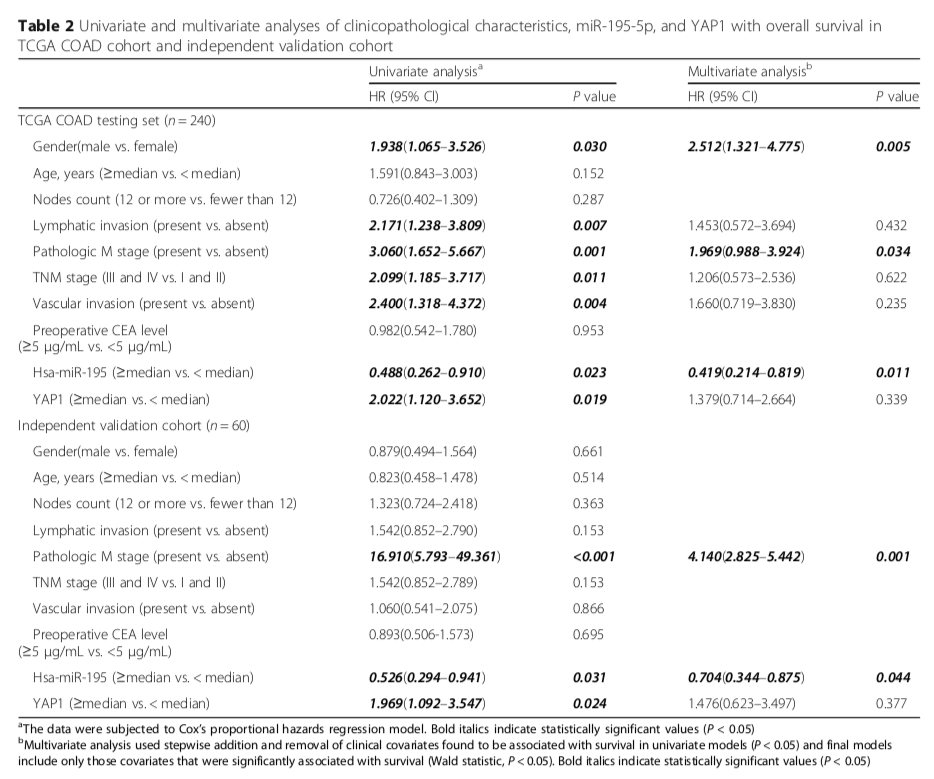

**Author(s)**: `r params$author`  
**Date**: `r Sys.Date()`  

# Academic Citation
If you use this code in your work or research, we kindly request that you cite our publication:

Xiaofan Lu, et al. (2025). FigureYa: A Standardized Visualization Framework for Enhancing Biomedical Data Interpretation and Research Efficiency. iMetaMed. https://doi.org/10.1002/imm3.70005

```{r setup, include=FALSE}
knitr::opts_chunk$set(echo = TRUE)
```

## 需求描述
## Requirement description

计算coxHR，单因素cox和多因素cox，输出为表格

Calculate coxHR, univariate cox and multivariate cox, output as table



出自<https://jhoonline.biomedcentral.com/articles/10.1186/s13045-017-0445-8>

from<https://jhoonline.biomedcentral.com/articles/10.1186/s13045-017-0445-8>

## 应用场景
## Application scenario

对比和展示临床相关因素和基因表达对疾病发病或预后的影响。

例如TCGA数据、大规模临床试验数据等等。

Compare and demonstrate the impact of clinical-related factors and gene expression on disease onset or prognosis.

For example, TCGA data, large-scale clinical trial data, etc.

# 环境设置
# Environment setting

```{r}
source("install_dependencies.R")
# 加载所需的R包
# Load required R packages
library(survival)    # 用于生存分析的包 # For survival analysis
library(caret)       # 用于机器学习和数据分割的包 # For machine learning and data partitioning
library(kableExtra)  # 用于增强表格输出的包 # For enhanced table outputs
library(officer)     # 用于生成和操作Office文档的包 # For creating and editing Office documents
Sys.setenv(LANGUAGE = "en") #显示英文报错信息 display English error messages
options(stringsAsFactors = FALSE) #禁止chr转成factor prohibit the conversion of chr to factor
```

## 输入数据
## Input data

包含示例表格中研究的相关因素，每个因素为一列，最后两列是两个基因的表达矩阵；每行是一个sample。

It contains the relevant factors studied in the example table, one column for each factor, and the last two columns are the expression matrices of the two genes; each row is a sample.

```{r}
clin_mRNA_miRNA <- read.csv("easy_input.csv", as.is = T)
head(clin_mRNA_miRNA)
```

**特别说明：**从TCGA数据库下载数据到整理成这个文件，经过了很多步骤。感兴趣的小伙伴可参考压缩包中的`How_to_get_easy_input.R`文件，里面是前期数据处理的代码。

- 原文未详细描述样品筛选的方法，我们采用公认的方法进行了样品筛选。

- 原文也未提供验证数据集，因此，从TCGA随机抽取60个样本作为验证。

因此，最后生成的表格中的数值与原文有出入。

下面开始进行数值计算和表格绘制：

**Special Note:** The process from downloading data from the TCGA database to organizing it into this file involved many steps. Interested users can refer to the `How_to_get_easy_input.R` file in the compressed package, which contains the code used for preliminary data processing.

- The original article did not describe the sample selection method in detail; we adopted a widely accepted method for sample selection.

- The original article also did not provide a validation dataset; therefore, 60 samples were randomly selected from TCGA for validation.

As a result, the values in the final generated table differ from those in the original article.

Now we begin numerical calculation and table plotting:

## 数值计算
## Numerical calculation

### 临床数据和表达量的预处理
### Preprocessing of clinical data and expression

```{r}
#性别
#gender
clin_mRNA_miRNA$gender<-factor(clin_mRNA_miRNA$gender, ordered = T)

#年龄
#age
clin_mRNA_miRNA$age<-ifelse(clin_mRNA_miRNA$age>median(clin_mRNA_miRNA$age),
                            '>=median','<median')
clin_mRNA_miRNA$age<-factor(clin_mRNA_miRNA$age, ordered = T)

#淋巴结数目
#number of lymph nodes
clin_mRNA_miRNA$lymph_node_examined_count<-ifelse(clin_mRNA_miRNA$lymph_node_examined_count<12,
                                                  '<12','>=12')
clin_mRNA_miRNA$lymph_node_examined_count<-factor(clin_mRNA_miRNA$lymph_node_examined_count, ordered = T)

#淋巴转移
#lymphatic metastasis
clin_mRNA_miRNA$lymphatic_invasion<-factor(clin_mRNA_miRNA$lymphatic_invasion, ordered = T)

#病理M期
#pathology M stage
clin_mRNA_miRNA$pathologic_M<-factor(clin_mRNA_miRNA$pathologic_M, ordered = T)

#肿瘤分期 stagei 代表1 和2期   stageiii 代表 3和4期  前期已预处理数据
#tumor stage, stagei represents stages 1 and 2, stageiii represents stages 3 and 4. The data has been preprocessed in the earlier stage.  
clin_mRNA_miRNA$tumor_stage<-factor(clin_mRNA_miRNA$tumor_stage, ordered = T)

#血管侵犯
#vascular invasion
clin_mRNA_miRNA$venous_invasion<-factor(clin_mRNA_miRNA$venous_invasion, ordered = T)

#CEA水平
#CEA level
clin_mRNA_miRNA$preoperative_pretreatment_cea_level<-ifelse(clin_mRNA_miRNA$preoperative_pretreatment_cea_level<5,
                                                            '<5','>=5')
clin_mRNA_miRNA$preoperative_pretreatment_cea_level<-factor(clin_mRNA_miRNA$preoperative_pretreatment_cea_level,
                                                             ordered = T)
#mir195中位数为界，分为高于中位数和低于中位数
#这里不建议改为mir-195，否则，后面cox单因素计算公式可能会出错
#mir195 median as the boundary, divided into above median and below median
#it is not recommended to change to mir-195 here, otherwise the cox univariate calculation formula may be wrong later
clin_mRNA_miRNA$mir195<-as.numeric(clin_mRNA_miRNA$mir195)
clin_mRNA_miRNA$mir195<-ifelse(clin_mRNA_miRNA$mir195<median(clin_mRNA_miRNA$mir195),
                                      '<median','>=median')
clin_mRNA_miRNA$mir195<-factor(clin_mRNA_miRNA$mir195,ordered = T)

#YAP1中位数为界，分为高于中位数和低于中位数
#YAP1 median as the boundary, divided into above median and below median
clin_mRNA_miRNA$YAP1<-as.numeric(clin_mRNA_miRNA$YAP1)
clin_mRNA_miRNA$YAP1<-ifelse(clin_mRNA_miRNA$YAP1<median(clin_mRNA_miRNA$YAP1),
                                      '<median','>=median')
clin_mRNA_miRNA$YAP1<-factor(clin_mRNA_miRNA$YAP1,ordered = T)
str(clin_mRNA_miRNA)
```

### 回归分析
### Regression analysis

```{r}
#单因素回归分析
#univariate regression analysis
sur<-Surv(time=clin_mRNA_miRNA$`OS`, event = clin_mRNA_miRNA$`EVENT`)

#批量多个单因素cox回归
#batch multiple univariate cox regressions
univarcox<- function(x){
  formu<-as.formula(paste0('sur~',x))
  unicox<-coxph(formu,data=clin_mRNA_miRNA)
  unisum<-summary(unicox)#汇总数据 summarize data
  HR<-round(unisum$coefficients[,2],3)# HR风险比 HR hazard rate
  Pvalue<-unisum$coefficients[,5]#p值 p-value
  CI95<-paste0(round(unisum$conf.int[,c(3,4)],3),collapse = '-') #95%置信区间 95% confidence interval
  univarcox<-data.frame('characteristics'=x,
                     'Hazard Ration'=HR,
                     'CI95'=CI95,
                     'pvalue'=ifelse(Pvalue < 0.001, "< 0.001", round(Pvalue,3)))
  return(univarcox)#返回数据框 return to dataframe
}

#选择需要进行单因素分析变量名称
#select variable names for univariate analysis
(variable_names<-colnames(clin_mRNA_miRNA)[c(2:9,12,13)])
univar<-lapply(variable_names,univarcox)
univartable<-do.call(rbind,lapply(univar,data.frame))
univartable$`HR(95%CI)`<-paste0(univartable$Hazard.Ration,'(',univartable$CI95,')')
univartable1<-dplyr::select(univartable,characteristics,`HR(95%CI)`,pvalue,-CI95,-Hazard.Ration)

#选取p值<0.05的因素
#select factors with p-value < 0.05
(names<-univartable1$characteristics[univartable1$pvalue<0.05])

##多因素cox回归
#整合多个因素 p<0.05的公式
##multivariate cox regression  
#formula of integrating multiple factors with p<0.05
(form<-as.formula(paste0('sur~',paste0(names,collapse = '+'))))
multicox<-coxph(formula = form,data = clin_mRNA_miRNA)
multisum<-summary(multicox)##汇总 summarize
muHR<-round(multisum$coefficients[,2],3)#
muPvalue<-multisum$coefficients[,5]#p值 p-value
muCIdown<-round(multisum$conf.int[,3],3)#下 down
muCIup<-round(multisum$conf.int[,4],3)#上 up
muCI<-paste0(muCIdown,'-',muCIup)##95%置信区间 95% confidence interval
multicox<-data.frame('characteristics'=names,
                     'muHazard Ration'=muHR,
                     'muCI95'=muCI,
                     'mupvalue'=ifelse(muPvalue < 0.001, "< 0.001", round(muPvalue,3)))
rownames(multicox)<-NULL
multicox$`HR(95%CI)`<-paste0(multicox$muHazard.Ration,'(',multicox$muCI95,')')
multicox<-dplyr::select(multicox,characteristics,`HR(95%CI)`,mupvalue,-muCI95,-muHazard.Ration)

#合并单因素多因素表格
#combine univariate and multivariate table
uni_multi<-dplyr::full_join(univartable1,multicox,by="characteristics")
uni_multi$characteristics <- as.character(uni_multi$characteristics)
```

### 验证
### Validation

由于文章没上传验证数据集数据，用`p = 0.7`参数从clin_mRNA_miRNA中 随机抽取取70%做训练集，其余为验证集

Since the article did not upload the validation dataset, 70% of the data was randomly selected from clin_mRNA_miRNA as the training set using the parameter `p = 0.7`, and the remaining data was used as the validation set.  

```{r,message=FALSE}
set.seed(121)
samdata<- createDataPartition(clin_mRNA_miRNA$`EVENT`, p=0.7, list=F)
valid<-clin_mRNA_miRNA[-samdata,]
summary(valid)

#单因素分析
#univariate analysis
sur2<-Surv(time=valid$`OS`,event = valid$`EVENT`)#数据集需要修改 dataset needs to be modified
#批量多个单因素cox回归
#batch multiple univariate cox regressions
univarcox<- function(x){
  formu<-as.formula(paste0('sur2~',x))
  unicox<-coxph(formu,data=valid)##数据集更改 dataset modification
  unisum<-summary(unicox)#汇总数据 summarize data
  HR<-round(unisum$coefficients[,2],3)# HR风险比 HR hazard rate
  Pvalue<-unisum$coefficients[,5]#p值 p-value
  CI95<-paste0(round(unisum$conf.int[,c(3,4)],3),collapse = '-') #95%置信区间 95% confidence interval
  univarcox<-data.frame('characteristics'=x,
                        'Hazard Ration'= HR,
                        'CI95'= CI95,
                        'pvalue'= ifelse(Pvalue < 0.001, "< 0.001", round(Pvalue,3)))
  return(univarcox)#返回数据表 return to dataframe
}

#选择需要进行单因素分析变量名称
#select variable names for univariate analysis
(variable_names<-colnames(valid)[c(2:9,12,13)])
univar<-lapply(variable_names,univarcox)
univartable<-do.call(rbind,lapply(univar,data.frame))
univartable$`HR(95%CI)`<-paste0(univartable$Hazard.Ration,'(',univartable$CI95,')')
univartable2<-dplyr::select(univartable,characteristics,`HR(95%CI)`,pvalue,-CI95,-Hazard.Ration)

#多因素分析
#选取p值<0.05的因素
#multivariate analysis
#select factors with p-value < 0.05
(names2<-as.character(univartable2$characteristics[univartable2$pvalue<0.05]))

##多因素cox回归
#整合多个因素 p<0.05的公式
##multivariate cox regression  
#formula of integrating multiple factors with p<0.05
(form<-as.formula(paste0('sur2~',paste0(names2,collapse = '+'))))
multicox<-coxph(formula = form,data = valid)#数据集需要更改 dataset needs to be modified
multisum<-summary(multicox)##汇总 summarize
muHR<-round(multisum$coefficients[,2],3)#风险比 hazard rate
muPvalue<-multisum$coefficients[,5]#p值 p-value
muCIdown<-round(multisum$conf.int[,3],3)#下 down
muCIup<-round(multisum$conf.int[,4],3)#上 up
muCI<-paste0(muCIdown,'-',muCIup)##95%置信区间 95% confidence interval
multicox2<-data.frame('characteristics'=names2,
                     'muHazard Ration'=muHR,
                     'muCI95'=muCI,
                     'mupvalue'=ifelse(muPvalue < 0.001, "< 0.001", round(muPvalue,3)))
rownames(multicox2)<-NULL
multicox2$`HR(95%CI)`<-paste0(multicox2$muHazard.Ration,'(',multicox2$muCI95,')')
multicox2<-dplyr::select(multicox2,characteristics,`HR(95%CI)`,mupvalue,-muCI95,-muHazard.Ration)

#合并验证集单因素多因素结果
#combine validation set of univariate and multivariate results
uni_multi2<-dplyr::full_join(univartable2,multicox2,by="characteristics")
uni_multi2$characteristics <- as.character(uni_multi2$characteristics)
```

## 输出html格式表格
## Output html format table

在Rstudio里点击Knit运行

Click on Knit in Rstudio to run it

```{r}
#合并TCGA与验证集单因素多因素表格
#combine TCGA and validation set univariate and multivariate tables
comtable<-rbind(uni_multi,uni_multi2,stringsAsFactors = F)
colnames(comtable)<-c("","Univariate analysis\nHR (95% CI)","\nP value","Multivariate analysis\nHR (95% CI)","\nP value")
#表格里面不打印NA
#do not print NA in the table
comtable[is.na(comtable)] <- ""

#生成html
#generate html

if (knitr:::is_html_output()) {
    cn = sub("\n", "<br>", colnames(comtable))
} else if (knitr:::is_latex_output()) {
    usepackage_latex('makecell')
    usepackage_latex('booktabs')
    cn = linebreak(colnames(comtable), align="c")
}   

comtable %>%
    kable(booktabs = T, escape = F, caption = "Table 2 Univariate and multivariate analyses of clinicopathological
characteristics, miR-195-5p, and YAP1 with overall survival in TCGA COAD
cohort and independent validation cohort",
        col.names = cn) %>%
    kable_styling(c("striped", "scale_down")) %>%
    group_rows("TCGA COAD testing set (n=200)", 1,nrow(uni_multi)) %>% 
    group_rows("Independent validation cohort (n=60)", nrow(uni_multi)+1,nrow(comtable)) %>% 
    footnote(general = "The data...",
             footnote_as_chunk = T)
```

## 生成csv格式的表格
## Generate a table in CSV format

```{r}
#合并TCGA与验证集单因素多因素表格
#combine TCGA and validation set univariate and multivariate tables
table_subtitle <- c(NA,"HR (95% CI)","P value","HR (95% CI)","P value")
TCGA <- c("TCGA COAD testing set (n=200)",rep("",4))
val<-c("Independent validation cohort (n = 60)",rep("",4))
comtable<-rbind(table_subtitle,TCGA, uni_multi,val,uni_multi2,stringsAsFactors = F)
colnames(comtable)<-c("","Univariate analysis","","Multivariate analysis","")
#表格里面不打印NA
#do not print NA in the table
comtable[is.na(comtable)] <- ""
str(comtable)
#保存到csv文件
#save to csv file
write.csv(comtable,"Table2.csv", quote = F, row.names = F)
```

## 生成word格式的表格
## Generate a table in word format

```{r}
#合并TCGA与验证集单因素多因素表格
#combine TCGA and validation set univariate and multivariate tables
table_subtitle <- c(NA,"HR (95% CI)","P value","HR (95% CI)","P value")
TCGA <- c("TCGA COAD testing set (n=200)",rep(NA,4))
val<-c("Independent validation cohort (n = 60)",rep(NA,4))
comtable<-rbind(table_subtitle,TCGA, uni_multi,val,uni_multi2,stringsAsFactors = F)
colnames(comtable)<-c(NA,"Univariate analysis",NA,"Multivariate analysis",NA)
#表格里面不打印NA
#do not print NA in the table
comtable[is.na(comtable)] <- ""

#保存到word文档
#save to word document
title_name<-'Table 2 Univariate and multivariate analyses of clinicopathological
characteristics, miR-195-5p, and YAP1 with overall survival in TCGA COAD
cohort and independent validation cohort'
table1<-comtable
mynote <- "Note: ..."

my_doc <- read_docx()  #初始化一个docx initialize a docx

my_doc %>%
  ##添加段落标题名称
  ##add paragraph heading name
  body_add_par(value = title_name, style = "table title") %>%
  
  #添加表格
  #add table
  body_add_table(value = table1, style = "Light List Accent 2" ) %>% 
  
  #添加Note
  #add Note
  body_add_par(value = mynote) %>% 
  
  #打印到word文档
  #print to word document
  print(target = "Table2.docx")

#查看表格相关参数
#view table related parameters
read_docx() %>% styles_info() %>% 
  subset( style_type %in% "table" )
#用这些参数，把表格设置成你想要的形式
#use these parameters to set the table to your desired format
```

```{r}
sessionInfo()
```