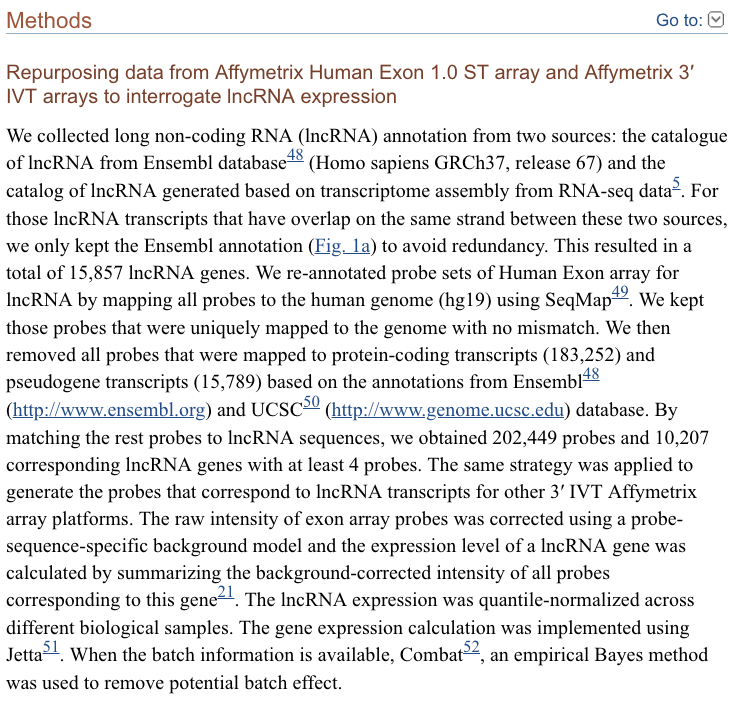
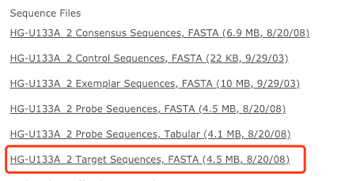
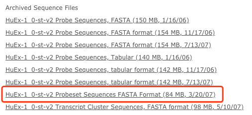

**Author(s)**: `r params$author`  
**Date**: `r Sys.Date()`  


# Academic Citation
If you use this code in your work or research, we kindly request that you cite our publication:

Xiaofan Lu, et al. (2025). FigureYa: A Standardized Visualization Framework for Enhancing Biomedical Data Interpretation and Research Efficiency. iMetaMed. https://doi.org/10.1002/imm3.70005

```{r setup, include=FALSE}
knitr::opts_chunk$set(echo = TRUE)
```

## 需求描述
## Requirement description

对GEO的芯片进行lncRNA的重新注释，提取芯片中lncRNA的表达量。

The microarray of GEO is re-annotated for lncRNA and the expression of lncRNA in the microarray is extracted.



出自：<https://www.nature.com/articles/nsmb.2591>

from: <https://www.nature.com/articles/nsmb.2591>

## 应用场景
## Application scenario

场景一：还没想好要研究哪个lncRNA，想像例文那样从诸多的芯片数据中找到靠谱的lncRNA。

场景二：我想看我研究的lncRNA的表达谱是怎样的，跟上下游基因的相关性如何。于是，找到一套我感兴趣的疾病的芯片数据，可惜芯片注释很古老，即使里面有lncRNA对应的探针，也无法直接拿到表达量。这时，就需要给芯片探针做重注释，标出芯片探针跟最新版本基因组注释之间的对应关系，进而拿到感兴趣的lncRNA的表达量。

同样适用于蛋白编码基因、miRNA芯片等。

如果你不想做重注释，而是要用官方的芯片注释提取lncRNA/miRNA/mRNA的表达矩阵，就用`FigureYa41GEO2lncRNA`

Scenario 1: I haven't figured out which lncRNA I want to study, and I want to find a reliable lncRNA from the many chip data like the example paper.

Scenario 2: I want to see what the expression profile of the lncRNA I'm studying is like and how it correlates with upstream and downstream genes. So, I find a set of chip data for the disease I am interested in, but unfortunately, the chip annotation is very old, and even though there are probes corresponding to the lncRNA in it, I can't get the expression amount directly. At this point, it is necessary to re-annotate the chip probes to indicate the correspondence between the chip probes and the latest version of the genome annotation, and then get the expression amount of the lncRNA of interest.

The same applies to protein coding genes, miRNA chip and so on.

If you don't want to do re-annotation, but want to use the official chip annotations to extract the lncRNA/miRNA/mRNA expression matrix, use `FigureYa41GEO2lncRNA`.

## 参数设置
## Parameter setting

```{r}
platformID <- "GPL15314" #要重注释的芯片平台 chip platforms to be reannotated
alignMethod <- "seqmap" #用seqmap作序列比对 sequence comparison with seqmap
#alignMethod <- "blast" #用blast作序列比对 sequence comparison with blast
np <- 4 #至少有4个探针的lncRNA lncRNAs with at least 4 probes
```

这里提供两种序列比对的方法，结果相近，根据硬件条件任选其一：

1. blast，经典，功能齐全而细腻，输出多种score，可以用score进一步筛选，

缺点：速度慢。用了2个核，只比对前100条探针序列，用掉10s。全部探针的序列比对，14核，< 30 min。

2. seqman，速度超级快。8G内存，芯片上全部60315条探针的序列比对，< 1 min。（只比对前100条所用的时间也差不多）

缺点：不输出各种score，只有一个num_mismatch。

Here we provide two methods of sequence comparison with similar results, choose either one according to the hardware conditions:

1. blast, classic, full-featured and delicate, outputs multiple scores, which can be further filtered using the scores.

Disadvantages: slow speed. 2 cores were used, and only the first 100 probe sequences were compared, and 10s was used. Sequence comparison of all probes, 14 cores, < 30 min.

2. seqman, super fast. 8G memory, the sequence comparison of all 60315 probes on the chip, < 1 min. (The time taken for comparing only the first 100 is about the same)

Disadvantages: All kinds of scores are not output, and there is only one num_mismatch.

## 环境设置
## Environment setting

**Windows系统：**见压缩包中的word文档。

**Linux和Mac：**

下载blast：<ftp://ftp.ncbi.nlm.nih.gov/blast/executables/blast+/LATEST/>

解压缩，把`makeblastdb`和`blastn`拷贝到当前文件夹

下载seqman：<http://www-personal.umich.edu/~jianghui/seqmap/>的全平台**source版本**：<http://www-personal.umich.edu/~jianghui/seqmap/download/seqmap-1.0.13-src.zip>

解压缩，然后在终端运行以下代码来编译，会生成一个seqman文件：

**Windows system: **See the word document in the compressed package.

**Linux和Mac：**

Download blast: <ftp://ftp.ncbi.nlm.nih.gov/blast/executables/blast+/LATEST/>

Unzip, copy `makeblastdb` and `blastn` to the current folder

Download seqman: <http://www-personal.umich.edu/~jianghui/seqmap/>'s full platform **source version**: <http://www-personal.umich.edu/~jianghui/seqmap/download/seqmap-1.0.13-src.zip>

Unzip, and then run the following code on the terminal to compile, and a seqman file will be generated:

```bash
cd seqmap-1.0.13-src
make
```

然后把`seqman`文件拷贝到当前文件夹

Then copy the `seqman` file to the current folder

```{r, message=FALSE}
source("install_dependencies.R")

library(tidyverse)
library(GEOquery)

Sys.setenv(LANGUAGE = "en") #显示英文报错信息 display English error messages
options(stringsAsFactors = FALSE) #禁止chr转成factor prohibit the conversion of chr to factor
```

## 芯片重注释
## Chip re-annotation

### 输入文件
### Input file

重注释需要最新转录本的DNA序列文件和芯片上探针的序列。

- 转录本DNA序列。以人为例，从gencode网站下载v29版本的转录本fasta文件：<ftp://ftp.ebi.ac.uk/pub/databases/gencode/Gencode_human/release_29/gencode.v29.transcripts.fa.gz>，解压缩到当前文件夹。已包含gene symbol、biotype等信息。

- 芯片探针的序列：

Re-annotation requires the DNA sequence file of the latest transcript and the sequence of the probe on the chip.

- Transcript DNA sequence.  Take people as an example, download the transcript fasta file for version v29 from the gencode website: <ftp://ftp.ebi.ac.uk/pub/databases/gencode/Gencode_human/release_29/gencode.v29.transcripts.fa.gz>, unzip to the current folder. It contains gene symbol, biotype and other information.

- Sequence of the chip probe:

```{r}
if(!file.exists("GPL15314.soft")){
  gpl <- getGEO(platformID, destdir=".") #保存到本地 save to local
}
gpl <- getGEO(filename = "GPL15314.soft") #读取保存在当前文件夹的平台文件 read the platform file saved in the current folder
gpl <- Table(gpl)
head(gpl)
```

像GPL15314平台，有SEQUENCE，就用下面这段：

Like the GPL15314 platform, with SEQUENCE, use the following paragraph:

```{r}
gpl <- gpl[,c(1,8)] #只保留探针ID和序列 only the probe ID and sequence are retained
gp <- dplyr::filter(gpl,!is.na(SEQUENCE))
length(unique(gp$SEQUENCE))

#保存为fasta格式文件
#save as fasta format file
gp <- paste0('>',gp$ID,'\n', gp$SEQUENCE)
#为了测试blast，只保存前100行
#to test blast, only the first 100 lines are saved
#write.table(gp[1:100],'GPL.fasta', quote = F, row.names = F, col.names = F)
#保存全部序列，运行下面这行：
#save the entire sequence and run the following line:
write.table(gp,'GPL.fasta', quote = F, row.names = F, col.names = F)
```
GPL没有提供Affymetrix芯片的SEQUENCE序列。如果你需要下载affy的芯片的fasta文件，大概率会在这个页面<http://www.affymetrix.com/support/technical/byproduct.affx?cat=arrays&Human#Human>，点击你的芯片名字，进去找文件名里带probeset或target字样的文件，免费注册，登录后下载。

- 例如GPL3921平台，直接到官网找到芯片平台页面：<http://www.affymetrix.com/support/technical/byproduct.affx?product=hgu133-20>，下载probeset的fasta文件：<http://www.affymetrix.com/Auth/analysis/downloads/data/HG-U133A_2.target.zip>

GPL does not provide the SEQUENCE sequence of Affymetrix chips. If you need to download the fasta file of Affymetrix chips, you will most likely find it on this page<http://www.affymetrix.com/support/technical/byproduct.affx?cat=arrays&Human#Human>, click on your chip name, go in and find the file with probeset or target in the filename, register for free, log in and download.

- For example, the GPL3921 platform, go directly to the official website to find the chip platform page: <http://www.affymetrix.com/support/technical/byproduct.affx?product=hgu133-20>, download the probeset fasta file: <http://www.affymetrix.com/Auth/analysis/downloads/data/HG-U133A_2.target.zip>



- 例文用到的GPL5188平台，官网芯片平台页面：<http://www.affymetrix.com/support/technical/byproduct.affx?product=huexon-st>，下载probeset的fasta文件：<http://www.affymetrix.com/Auth/analysis/downloads/data/HuEx-1_0-st-v2.hg18.probeset.fa.zip>

- GPL5188 platform used in the example, official website chip platform page: <http://www.affymetrix.com/support/technical/byproduct.affx?product=huexon-st>, download the probeset fasta file: <http://www.affymetrix.com/Auth/analysis/downloads/data/HuEx-1_0-st-v2.hg18.probeset.fa.zip>




### 序列比对
### Sequence comparison

例文要求：no mismatch

Example text requirements: no mismatch

```{r}
if (alignMethod == "blast"){
  #建立比对索引库，也可以自己通过ncbi官方的脚本下载索引库
  #create a comparison index library, or you can download the index library yourself using the official NCBI script
  system('./makeblastdb -in gencode.v29.transcripts.fa -dbtype nucl')
  
  #序列比对
  #sequence comparison
  system('./blastn -db gencode.v29.transcripts.fa -query GPL.fasta -out blast_gene.tmp -outfmt 6 -task blastn-short -num_threads 2 -num_alignments 1 -evalue 1e-10')
  #会生成gplTOgene.txt文件
  #The gplTOgene.txt file is generated
  
} else if (alignMethod == "seqmap") {
  #Windows的用法参考压缩包中的word文档
  #the usage of Windows refers to the word document in the compressed package
  #Linux or MAC
  system('./seqmap 0 GPL.fasta gencode.v29.transcripts.fa seqmap_gene.tmp /output_all_matches')
  
} else{
  stop("Unsupport mode")
}
```

**seqmap参数说明：**

- 0代表匹配探针错误个数0
- GPL.fasta 需要比对的探针序列
- 0 gencode.v29.transcripts.fa 转录本的fasta文件
- seqmap_gene.txt 输出文件
- //为输出全部匹配信息。

**顺序不可错误**

**注意：**在git bash中//代表/。

**seqmap parameter description:**

- 0 represents the number of matching probe errors 0
- GPL.fasta the probe sequence to be compared
- 0 gencode.v29.transcripts.fa the fasta file of transcript
- seqmap_gene.txt output file
- // to output all matching information

**Order must not be wrong**

**Note:**// represents / in git bash.

### 把探针ID跟基因、biotype对应起来
### Match the probe ID to the gene and biotype

用到上面生成的序列比对结果，格式：

- `blast_gene.tmp`：探针ID在第1列，gene symbol、biotype都储存在第2列

- `seqmap_gene.tmp`：探针ID在第4列，gene symbol、biotype都储存在第1列

Use the sequence comparison results generated above, format:

- `blast_gene.tmp`: probe ID is in the 1st column, gene symbol and biotype are both stored in the 2nd column

- `seqmap_gene.tmp`: probe ID is in the 4th column, gene symbol and biotype are both stored in the 1st column  

```{r}
if (alignMethod == "blast"){
  gplTOgene <- read_delim('blast_gene.tmp',delim = '\t',col_names = F)
  gplTOgene <- gplTOgene[,1:2]
  gplTOgene$gsym <- unlist(lapply(gplTOgene$X2,function(x) strsplit(as.character(x),"\\|")[[1]][6]))
  gplTOgene$biotype <- unlist(lapply(gplTOgene$X2,function(x) X = strsplit(as.character(x),"\\|")[[1]][8]))
  gplTOgene$gsym_biotype <- paste(gplTOgene$gsym,gplTOgene$biotype,sep = '|')
  
  #输出三列，探针ID、gene symbol、biotype
  #output three columns, probe ID, gene symbol, biotype
  gplTOgene <- gplTOgene[,c(1,3,4)]
  #输出两列，其中gene symbol和biotype合为一列
  #output two columns, where gene symbol and biotype are combined into one column
  #gplTOgene <- gplTOgene[,c(1,5)]
  colnames(gplTOgene)[1] <- 'ID'
  write_csv(gplTOgene,'gplTOgene.csv')
  
} else if (alignMethod == "seqmap") {
  gplTOgene <- read_delim('seqmap_gene.tmp',delim = '\t')
  gplTOgene <- gplTOgene[,c(1,4)]
  gplTOgene$gsym <- unlist(lapply(gplTOgene$trans_id,function(x) strsplit(as.character(x),"\\|")[[1]][6]))
  gplTOgene$biotype <- unlist(lapply(gplTOgene$trans_id,function(x) strsplit(as.character(x),"\\|")[[1]][8]))
  gplTOgene$gsym_biotype <- paste(gplTOgene$gsym,gplTOgene$biotype,sep = '|')
  #输出三列，探针ID、gene symbol、biotype
  #output three columns, probe ID, gene symbol, biotype
  gplTOgene <- gplTOgene[,c(2:4)]
  #输出两列，其中gene symbol和biotype合为一列
  #output two columns, where gene symbol and biotype are combined into one column
  #gplTOgene <- gplTOgene[,c(2,5)]

  gplTOgene <- distinct(gplTOgene)
  write_csv(gplTOgene,'gplTOgene.csv')
  
} else {
  stop("Unsupport mode")
}
```

### 提取lncRNA对应的探针
### Extract probes corresponding to lncRNA

对lncRNA的定义，可参考Vega的标准：
<http://vega.archive.ensembl.org/info/about/gene_and_transcript_types.html>

例文要求：

1. 删除所有映射到蛋白质编码转录本和伪基因转录本的探针

2. 至少有 4 个探针

For the definition of lncRNA, refer to the Vega standard: <http://vega.archive.ensembl.org/info/about/gene_and_transcript_types.html>

Example text requirements:

1. removed all probes that were mapped to protein-coding transcripts and pseudogene transcripts

2. with at least 4 probes

```{r}
gplTOgene <- read.csv("gplTOgene.csv")

#根据实际研究目的，调整定义为lncRNA的gene_biotype，此处根据Vega，定义如下8种biotype为lncRNA
#according to the actual research purpose, the gene_biotype defined as lncRNA is adjusted. Here, according to Vega, the following 8 biotypes are defined as lncRNA.
lncRNA <- paste("non_coding","3prime_overlapping_ncRNA","antisense","lincRNA","sense_intronic","sense_overlapping","macro_lncRNA","bidirectional_promoter_lncRNA",sep = "|")

#根据实际研究目的，调整定义为protein-coding transcripts and pseudogene transcripts的gene_biotype
#according to the actual research purpose, adjust the definition of gene_biotype of protein-coding transcripts and pseudogene transcripts
protein_pseudo <- paste("IG_C_pseudogene","IG_V_pseudogene","polymorphic_pseudogene","processed_pseudogene","protein_coding","pseudogene","TR_V_pseudogene","transcribed_processed_pseudogene","transcribed_unitary_pseudogene","transcribed_unprocessed_pseudogene", "translated_processed_pseudogene","unitary_pseudogene","unprocessed_pseudogene",sep = "|")

#提取lncRNA对应的探针
#extract probes corresponding to lncRNA
lncRNA.probe0 <- gplTOgene[grepl(lncRNA, gplTOgene$biotype),]
dim(lncRNA.probe0)

#提取protein-coding transcripts and pseudogene transcripts对应的探针
#extract probes corresponding to protein-coding transcripts and pseudogene transcripts
protein_pseudo.probe <- gplTOgene[grepl(protein_pseudo, gplTOgene$biotype),]
dim(protein_pseudo.probe)

#删除所有映射到蛋白质编码转录本和伪基因转录本的探针
#removed all probes that were mapped to protein-coding transcripts and pseudogene transcripts
lncRNA.probe1 <- lncRNA.probe0[!(lncRNA.probe0$probe_id %in% protein_pseudo.probe$probe_id),]
dim(lncRNA.probe1)

#只保留unique mapping到1个lncRNA的探针，不要那些mapping到多个lncRNA的探针
#only keep probes of unique mapping to 1 lncRNA, not those mapping to multiple lncRNAs
uni <- names(table(lncRNA.probe1$probe_id)[table(lncRNA.probe1$probe_id) == 1])
lncRNA.probe2 <- lncRNA.probe1[match(uni,lncRNA.probe1$probe_id),]
dim(lncRNA.probe2)

#至少有4个探针的lncRNA
#lncRNAs with at least 4 probes
nProbes <- names(table(lncRNA.probe2$gsym)[table(lncRNA.probe2$gsym) >= np])
lncRNA.probe3 <- lncRNA.probe2[lncRNA.probe2$gsym %in% nProbes,]
lncRNA.probe4 <- lncRNA.probe3[order(lncRNA.probe3$gsym),]
dim(lncRNA.probe4)

write.table(lncRNA.probe4,"lncRNA.probes.txt", quote = F,row.names = F, col.names = T)
```

## 提取lncRNA的表达量
## Extract lncRNA expression

输入文件：

- 'lncRNA.probes.txt'：lncRNA对应的探针。可用于提取同一平台芯片数据里的lncRNA表达量。

- 'easy_input.csv'：芯片探针的表达矩阵，第一列是探针ID，后面每列一个sample。从这里提取lncRNA的表达量。

Input file:

- 'lncRNA.probes.txt': probes corresponding to lncRNA. It can be used to extract the expression of lncRNA in the chip data of the same platform.

- 'easy_input.csv': expression matrix of the chip probes, the first column is the probe ID, followed by one sample in each column. The expression of lncRNA is extracted from here.

```{r, warning=FALSE}
expr <- read.csv("easy_input.csv", header = T)
head(expr)

lncRNA.probe4 <- read.table("lncRNA.probes.txt", header = T)
head(lncRNA.probe4)

lncRNA.probe.expr <- merge(lncRNA.probe4[,1:2], expr, by = "probe_id")
row.names(lncRNA.probe.expr) <- lncRNA.probe.expr$probe_id
lncRNA.probe.expr$probe_id <- NULL
head(lncRNA.probe.expr)

# 合并具有相同gene symbol的探针
# combine probe sets with same gene symbol
lncRNA.expr_uniq <- aggregate(.~gsym, lncRNA.probe.expr, median)
# 将gene symbol设为rowname
# set gene symbol as rowname
rownames(lncRNA.expr_uniq) <- lncRNA.expr_uniq$gsym
head(lncRNA.expr_uniq)
lncRNA.expr_uniq$gsym <- NULL
head(lncRNA.expr_uniq)

write.csv(lncRNA.probe.expr, "lncRNA_expr.csv", quote = F, row.names = F)
```

## 参考资料
## Reference

- Blast 命令参数大全，官方说明文档：<https://www.ncbi.nlm.nih.gov/books/NBK279690/pdf/Bookshelf_NBK279690.pdf>

- Blast 快速入门，参考：<https://www.jianshu.com/p/de28be1a3bea>，<http://www.bioinfo-scrounger.com/archives/77>，<https://www.plob.org/article/4326.html>

- seqmap（全平台）官方说明文档：<http://www-personal.umich.edu/~jianghui/seqmap/Docs.txt>，FAQ<http://www-personal.umich.edu/~jianghui/seqmap/FAQ.html>

此外，Dianmond（linux mac）等软件也可以完成序列比对。

- Blast command parameter collection, official instruction document: <https://www.ncbi.nlm.nih.gov/books/NBK279690/pdf/Bookshelf_NBK279690.pdf>

- Blast quick start, refer to <https://www.jianshu.com/p/de28be1a3bea>，<http://www.bioinfo-scrounger.com/archives/77>，<https://www.plob.org/article/4326.html>

- seqmap (all platforms) official description document: <http://www-personal.umich.edu/~jianghui/seqmap/Docs.txt>，FAQ<http://www-personal.umich.edu/~jianghui/seqmap/FAQ.html>

In addition, software such as Dianmond (linux mac) can also accomplish sequence comparison.

# Session Info

```{r}
sessionInfo()
```