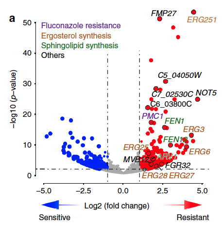

**Author(s)**: `r params$author`  
**Date**: `r Sys.Date()`  


# Academic Citation
If you use this code in your work or research, we kindly request that you cite our publication:

Xiaofan Lu, et al. (2025). FigureYa: A Standardized Visualization Framework for Enhancing Biomedical Data Interpretation and Research Efficiency. iMetaMed. https://doi.org/10.1002/imm3.70005

```{r setup, include=FALSE}
knitr::opts_chunk$set(echo = TRUE)
```

## 需求描述
## Requirement description

画出像paper里这样美的火山图。

Draw a beautiful volcano plot like this one in the paper.



出自<https://www.nature.com/articles/s41467-018-06944-1>

from<https://www.nature.com/articles/s41467-018-06944-1>

## 应用场景
## Application scenario

展示两组之间总体的基因表达变化趋势。

Demonstrate overall gene expression trends between the two groups.

## 环境设置
## Environment setting

```{r}
source("install_dependencies.R")

library(ggplot2)
library(ggrepel)
library(ggthemes)
library(gridExtra)

Sys.setenv(LANGUAGE = "en") #显示英文报错信息 display English error messages
options(stringsAsFactors = FALSE) #禁止chr转成factor prohibit the conversion of chr to factor
```

## 输入文件
## Input file

- easy_input_limma.csv，此处用limma结果，还可以用EdgeR、DESeq2等工具获得的差异分析结果作为输入。

至少包含三列：基因名、变化倍数（logFC）、P value(P.Value)或adjust Pvalue(adj.P.Val)。

- easy_input_selected.csv，有时希望突出显示几个基因，例如后文进行功能验证的基因。会在突出显示的基因外面画黑色圆圈，并标出基因名。

至少包含第一列：基因名。第二列是该基因所在的pathway，为可选项。

- easy_input_limma.csv, here using the limma results, differential analysis results obtained from tools such as EdgeR and DESeq2 can also be used as input.

It contains at least three columns: gene name, fold change (logFC), P value (P.Value) or adjust Pvalue (adj.P.Val).

- easy_input_selected.csv, sometimes it is desired to highlight several genes, such as genes that will undergo functional validation later. Black circles will be drawn around the highlighted genes, and the gene names will be labeled.

At least include the first column: gene name. The second column is the pathway of the gene, which is optional.

```{r}
# 全部基因差异表达分析结果
# differential Expression Analysis Results of All Genes
x <- read.csv("easy_input_limma.csv")
x$label<- x$X
head(x)

# 突出展示感兴趣的基因
# highlight genes of interest
selectedGeneID <- read.csv("easy_input_selected.csv")
head(selectedGeneID)

# 提取感兴趣的基因的差异分析结果
# extract the differential analysis results of the gene of interest
x$gsym <- x$label
selectgenes <- merge(selectedGeneID, x, by = "gsym")
head(selectgenes)
```

## 参数设置
## Parameter setting

点的颜色和虚线的位置都由下面的阈值决定，**根据具体需求调整**。

The color of the points and the position of the dashed line are determined by the thresholds below, **adjust according to specific needs**.

```{r}
#plot_mode <- "classic" #经典版 classic version
plot_mode <- "advanced" #酷炫版 cool version

logFCcut <- 1.5 #log2-foldchange
pvalCut <- 0.05 #P.value
adjPcut <- 0.05 #adj.P.value

#用于高级模式
#for advanced mode
logFCcut2 <- 2.5
logFCcut3 <- 5
pvalCut2 <- 0.0001
pvalCut3 <- 0.00001

#置x，y軸的最大最小位置
#set the maximum and minimum positions of the x and y axes
xmin <- (range(x$logFC)[1]- (range(x$logFC)[1]+ 10))
xmax <- (range(x$logFC)[1]+ (10-range(x$logFC)[1]))
ymin <- 0
ymax <- max(-log10(x$P.Value)) * 1.1

# 基因名的颜色，需大于等于pathway的数量，这里自定义了足够多的颜色
# the color of the gene name needs to be greater than or equal to the number of pathway, and here a sufficient number of colors have been customized
mycol <- c("darkgreen","chocolate4","blueviolet","#223D6C","#D20A13","#088247","#58CDD9","#7A142C","#5D90BA","#431A3D","#91612D","#6E568C","#E0367A","#D8D155","#64495D","#7CC767")
```

## 开始画图
## Start drawing

此处纵坐标用P.value，根据需要，可以把P.Value换成adj.P.Val

Here use P.value for the vertical coordinate, and replace P.Value with adj.P.Val as needed

```{r}
if (plot_mode == "classic"){
  # 簡單的setting for color
  # simple setting for color
  x$color_transparent <- ifelse((x$P.Value < pvalCut & x$logFC > logFCcut), "red", ifelse((x$P.Value < pvalCut & x$logFC < -logFCcut), "blue","grey"))
  # 簡單的setting for size
  # simple setting for size
  size <- ifelse((x$P.Value < pvalCut & abs(x$logFC) > logFCcut), 4, 2)
  
} else if (plot_mode == "advanced") {
  # 複雜的的setting for color
  # complex setting for Color
  n1 <- length(x[, 1])
  cols <- rep("grey", n1)
  names(cols)<- rownames(x)
  
  #不同阈值的点的颜色
  #color of points with different thresholds
  cols[x$P.Value < pvalCut & x$logFC >logFCcut]<- "#FB9A99"
  cols[x$P.Value < pvalCut2 & x$logFC > logFCcut2]<- "#ED4F4F"
  cols[x$P.Value < pvalCut & x$logFC < -logFCcut]<- "#B2DF8A"
  cols[x$P.Value < pvalCut2 & x$logFC < -logFCcut2]<- "#329E3F"
  color_transparent <- adjustcolor(cols, alpha.f = 0.5)
  x$color_transparent <- color_transparent
  
  # 複雜的的setting for size
  # complex setting for size
  n1 <- length(x[, 1])
  size <- rep(1, n1)
  
  #不同阈值的点的大小
  #size of points with different thresholds
  size[x$P.Value < pvalCut & x$logFC > logFCcut]<- 2
  size[x$P.Value < pvalCut2 & x$logFC > logFCcut2]<- 4
  size[x$P.Value < pvalCut3 & x$logFC > logFCcut3]<- 6
  size[x$P.Value < pvalCut & x$logFC < -logFCcut]<- 2
  size[x$P.Value < pvalCut2 & x$logFC < -logFCcut2]<- 4
  size[x$P.Value < pvalCut3 & x$logFC < -logFCcut3]<- 6
  
} else {
  stop("Unsupport mode")
}

# 构建绘图对象
# Construct the plot object
p1 <- ggplot(data=x, aes(logFC, -log10(P.Value), label = label, color = pathway)) +
  geom_point(alpha = 0.6, size = size, colour = x$color_transparent) +

  labs(x=bquote(~Log[2]~"(fold change)"), y=bquote(~-Log[10]~italic("P-value")), title="") + 
  ylim(c(ymin,ymax)) + 
  scale_x_continuous(
    breaks = c(-10, -5, -logFCcut, 0, logFCcut, 5, 10), #刻度线的位置 position of the scale line
    labels = c(-10, -5, -logFCcut, 0, logFCcut, 5, 10),
    limits = c(-11, 11) #x轴范围，两侧对称才好看 x-axis range, symmetry on both sides looks good
  ) +
  #或用下面这行：
  #or use the line below:
  #xlim(c(xmin, xmax)) + 

  #画阈值分界线
  #draw threshold boundary line
  geom_vline(xintercept = c(-logFCcut, logFCcut), color="grey40", 
             linetype="longdash", lwd = 0.5) + #虚线的形状和粗细 shape and thickness of the dashed line
  geom_hline(yintercept = -log10(pvalCut), color="grey40", 
             linetype="longdash", lwd = 0.5) +
  
  theme_bw(base_size = 12#, base_family = "Times" #修改字体 modify font
           ) +
  theme(panel.grid=element_blank())

if (plot_mode == "advanced") {
  p1 <- p1 + 
  geom_vline(xintercept = c(-logFCcut2, logFCcut2), color="grey40", 
             linetype="longdash", lwd = 0.5) +
  geom_hline(yintercept = -log10(pvalCut2), color="grey40", 
             linetype="longdash", lwd = 0.5)
}
p1

# 显示 logFC > n 的基因的基因名
# show gene names for genes with logFC > n
n = 9
p1 + geom_text_repel(aes(x = logFC, y = -log10(P.Value), 
                               label = ifelse(logFC > n, rownames(x),"")),
        colour="darkred", size = 5, box.padding = unit(0.35, "lines"), 
        point.padding = unit(0.3, "lines"))

# 突出显示候选基因
# highlight candidate genes
p2 <- p1 + 
  # 在感兴趣的基因外面画个黑色圈
  # draw a black circle around the gene of interest
  geom_point(data = selectgenes, alpha = 1, size = 4.6, shape = 1, 
             stroke = 1, #圈粗细 thickness of circle
             color = "black") +
  
  # 显示感兴趣的基因的基因名
  # display the gene name of the gene of interest
  scale_color_manual(values = mycol) + 
  geom_text_repel(data = selectgenes, 
                  show.legend = FALSE, #不显示图例 legend not displayed
                  size = 5, box.padding = unit(0.35, "lines"), 
        point.padding = unit(0.3, "lines")) +
  guides(color=guide_legend(title = NULL)) 

p2

# 显示pathway
# show pathway
np <- length(unique(selectgenes$pathway))
(labelsInfo <- data.frame(pathway = names(table(selectgenes$pathway)),
                         col = mycol[1:np]))
p2 + annotation_custom(tableGrob(labelsInfo$pathway, rows = c(rep("", np)), cols = "",
                                 theme = ttheme_minimal(base_colour = labelsInfo$col)),
                       ymin = ymax - 2, ymax = ymax, xmin = xmin - 1.5, xmax = xmin)

# 保存到PDF文件
# save to PDF file
if (plot_mode == "classic"){ggsave("volcano_classic.pdf", width=6,height=5)} else if (plot_mode == "advanced") {ggsave("Volcano_advanced.pdf",width=6,height=5)} else {stop("Unsupport mode")}
```

# Session Info

```{r}
sessionInfo()
```