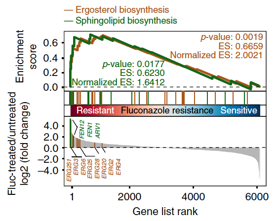

**Author(s)**: `r params$author`  
**Date**: `r Sys.Date()`  


# Academic Citation
If you use this code in your work or research, we kindly request that you cite our publication:

Xiaofan Lu, et al. (2025). FigureYa: A Standardized Visualization Framework for Enhancing Biomedical Data Interpretation and Research Efficiency. iMetaMed. https://doi.org/10.1002/imm3.70005

```{r setup, include=FALSE}
knitr::opts_chunk$set(echo = TRUE)
```

## 需求描述
## Requirement description

clusterProfiler的GSEA结果作为输入，画出像paper里这样美的GSEA结果图。

Use the GSEA results from clusterProfiler as input to draw a GSEA result plot as beautiful as those in paper.



出自<https://www.nature.com/articles/s41467-018-06944-1>

from<https://www.nature.com/articles/s41467-018-06944-1>

## 应用场景
## Application scenario

可用于在一张图上对比多个通路（上面的例图），以及同一通路多组间对比（下图）。

It can be used to compare multiple pathways on a single graph (example graph above), as well as to compare multiple groups of the same pathway (graph below).


clusterProfiler擅长做富集分析，可以用GO、KEGG、Diseaes、Reactome、DAVID、MSigDB、甚至自定义的注释库做富集分析。enrichplot丰富的画图函数几乎涵盖了所有富集分析结果的展示方式，<http://bioconductor.org/packages/devel/bioc/vignettes/enrichplot/inst/doc/enrichplot.html>。

适用于：用clusterProfiler做了富集分析，想自己DIY结果图的小伙伴。

如果想用Java版GSEA做富集分析，自己DIY结果图，请用FigureYa13GSEA_Java。

clusterProfiler is good at enrichment analysis, you can use GO, KEGG, Diseaes, Reactome, DAVID, MSigDB, and even custom annotation libraries to do enrichment analysis. enrichplot's rich drawing functions cover almost all the ways of presenting enrichment analysis results, <http://bioconductor.org/packages/devel/bioc/vignettes/enrichplot/inst/doc/enrichplot.html>.

Suitable for: those who have done enrichment analysis with clusterProfiler and want to DIY the result plot by themselves.

If you want to use Java version of GSEA to do enrichment analysis and DIY result plot by yourself, please use FigureYa13GSEA_Java.

## 环境设置
## Environment setting

```{r}
source("install_dependencies.R")

library(clusterProfiler)
library(enrichplot)
library(plyr)
library(ggrepel)
library(ggplot2)
library(RColorBrewer)
library(gridExtra)
library(cowplot) 

Sys.setenv(LANGUAGE = "en") #显示英文报错信息 display English error messages
options(stringsAsFactors = FALSE) #禁止chr转成factor prohibit the conversion of chr to factor
```

## 参数设置
## Parameter setting

此处我们选择“hsa03030”、“hsa03050”这两条通路，突出显示这两条通路里的几个基因。

Here we select the pathways “hsa03030” and “hsa03050” to highlight several genes in these pathways.

```{r}
# 要画的通路
# pathways to be drawn
geneSetID <- c("hsa03030", "hsa03050")

# 突出显示感兴趣的基因
# highlight genes of interest
selectedGeneID <- c("MCM5", "MCM2", "MCM6","MA7","PSMD3","PSMB9")

# 自定义足够多的颜色
# customize enough colors
mycol <- c("darkgreen","chocolate4","blueviolet","#223D6C","#D20A13","#088247","#58CDD9","#7A142C","#5D90BA","#431A3D","#91612D","#6E568C","#E0367A","#D8D155","#64495D","#7CC767")
```

## 输入文件的准备
## Input file preparation

下面这段代码仅仅为了获得clusterProfiler格式的GSEA结果。

The following code is just to get the GSEA results in clusterProfiler format.

### 把clusterProfiler的GSEA结果输出到文件
### Output the GSEA results of clusterProfiler to file

easy_input_rnk.txt：包含两列，基因名（SYMBOL）、变化倍数（logFC）

参考《[听说你有RNAseq数据却不知道怎么跑GSEA](http://mp.weixin.qq.com/s/aht5fQ10nH_07CYttKFH7Q)》

easy_input_rnk.txt: contains two columns, gene name (SYMBOL), fold change (logFC)

Refer to 《[I heard you have RNAseq data but don't know how to run GSEA](http://mp.weixin.qq.com/s/aht5fQ10nH_07CYttKFH7Q)》

```{r}
gsym.fc <- read.table("easy_input_rnk.txt", header = T)
dim(gsym.fc)
head(gsym.fc)

#把gene symbol转换为ENTREZ ID
#此处物种是人，其他物种的ID转换方法，请参考FigureYa52GOplot
#convert gene symbol to ENTREZ ID.
#the species here is human, for ID conversion methods of other species, please refer to FigureYa52GOplot
gsym.id <- bitr(gsym.fc$SYMBOL, fromType = "SYMBOL", toType = "ENTREZID", OrgDb = "org.Hs.eg.db")
#head(gsym.id)
#dim(gsym.id)

#让基因名、ENTREZID、foldchange对应起来
#make gene names, ENTREZID, foldchange correspond
gsym.fc.id <- merge(gsym.fc, gsym.id, by="SYMBOL", all=F)
#head(gsym.fc.id)

#按照foldchange排序
#sort by foldchange
gsym.fc.id.sorted <- gsym.fc.id[order(gsym.fc.id$logFC, decreasing = T),]
#head(gsym.fc.id.sorted)

#获得ENTREZID、foldchange列表，做为GSEA的输入
#get ENTREZID, foldchange list as input to GSEA
id.fc <- gsym.fc.id.sorted$logFC
names(id.fc) <- gsym.fc.id.sorted$ENTREZID
#head(id.fc)

#查看clusterProfiler用法
#view clusterProfiler usage
#browseVignettes("clusterProfiler")

#这一条语句就做完了KEGG的GSEA分析
#this single statement does the GSEA analysis of KEGG
kk <- gseKEGG(id.fc, organism = "hsa")
dim(kk)
#head(kk)

#把ENTREZ ID转为gene symbol，便于查看通路里的基因
#convert ENTREZ ID to gene symbol for easy viewing of genes in the pathway
kk.gsym <- setReadable(kk, 'org.Hs.eg.db', #物种 species
                    'ENTREZID')

#按照enrichment score从高到低排序，便于查看富集的通路
#sort by enrichment score from highest to lowest for easy viewing of enriched pathways
sortkk <- kk.gsym[order(kk.gsym$enrichmentScore, decreasing = T),]
#head(sortkk)
#tail(sortkk)

#把富集的通路列表输出到文件
#output the list of enriched pathways to a file
write.csv(sortkk,"gsea_output.csv", quote = F, row.names = F)

#把每条通路的running enrichment score保存到单独的文件
#“DIY同一通路多组对比”会用到
#save the running enrichment scores for each pathway to a separate file
#"DIY multiple comparisons of the same pathway" will be used
for (i in geneSetID) {
  gseaplot(kk, i)
  myGeneList <- enrichplot:::gsInfo(kk, i)
  row.names(myGeneList) <- gsym.fc$gsym
  myGeneList$id <- gsym.fc$ENTREZID 
  write.csv(myGeneList, paste0("gsea_genelist_", i, "_group1.csv"))
}
```

“gsea_output.csv”文件可作为文章的Supplementary File。

"gsea_output.csv" file can be used as the Supplementary File for the article.

## DIY多条通路
## DIY multiple pathways

提取包里的gseaplot2函数，压缩成小白能看懂的语句，加以注释，就可以按照自己的审美修改参数啦！

Extract the gseaplot2 function from the package, compress it into a statement understandable to a beginner, and comment it out so that you can modify the parameters according to your own aesthetics!

```{r, fig.width=5, fig.height=4}
x <- kk
geneList <- position <- NULL ## 满足codetool to satisfy codetool 

#合并多条通路的数据
#merge data from multiple pathways
gsdata <- do.call(rbind, lapply(geneSetID, enrichplot:::gsInfo, object = x))
gsdata$gsym <- rep(gsym.fc.id.sorted$SYMBOL,2)

# 画running score
# draw running score
p.res <- ggplot(gsdata, aes_(x = ~x)) + xlab(NULL) +
  geom_line(aes_(y = ~runningScore, color= ~Description), size=1) +
  scale_color_manual(values = mycol) +
  
  #scale_x_continuous(expand=c(0,0)) + #两侧不留空 leave no space on either side
  geom_hline(yintercept = 0, lty = "longdash", lwd = 0.2) + #在0的位置画虚线 draw the dashed line at position 0
  ylab("Enrichment\n Score") +
  
  theme_bw() +
  theme(panel.grid = element_blank()) + #不画网格 do not draw grid
  
  theme(legend.position = "top", legend.title = element_blank(),
        legend.background = element_rect(fill = "transparent")) +
  
  theme(axis.text.y=element_text(size = 12, face = "bold"),
        axis.text.x=element_blank(),
        axis.ticks.x=element_blank(),
        axis.line.x=element_blank(),
        plot.margin=margin(t=.2, r = .2, b=0, l=.2, unit="cm"))
#p.res


# 画rank
# draw rank
rel_heights <- c(1.5, .5, 1.5) # 上中下三个部分的比例 proportion of upper, middle and lower parts

i <- 0
for (term in unique(gsdata$Description)) {
  idx <- which(gsdata$ymin != 0 & gsdata$Description == term)
  gsdata[idx, "ymin"] <- i
  gsdata[idx, "ymax"] <- i + 1
  i <- i + 1
}
#head(gsdata)

p2 <- ggplot(gsdata, aes_(x = ~x)) +
  geom_linerange(aes_(ymin=~ymin, ymax=~ymax, color=~Description)) +
  xlab(NULL) + ylab(NULL) + 
  scale_color_manual(values = mycol) + #用自定义的颜色 use custom colors

  theme_bw() +
  theme(panel.grid = element_blank()) + #不画网格 do not draw grid

  theme(legend.position = "none",
        plot.margin = margin(t=-.1, b=0,unit="cm"),
        axis.ticks = element_blank(),
        axis.text = element_blank(),
        axis.line.x = element_blank()) +
  #scale_x_continuous(expand=c(0,0)) +
  scale_y_continuous(expand=c(0,0))
#p2


# 画变化倍数
# draw fold change
df2 <- p.res$data
df2$y <- p.res$data$geneList[df2$x]
df2$gsym <- p.res$data$gsym[df2$x]
#head(df2)

# 提取感兴趣的基因的变化倍数
# extract the fold change of the gene of interest
selectgenes <- data.frame(gsym = selectedGeneID)
selectgenes <- merge(selectgenes, df2, by = "gsym")
selectgenes <- selectgenes[selectgenes$position == 1,]
head(selectgenes)

p.pos <- ggplot(selectgenes, aes(x, y, fill = Description, color = Description, label = gsym)) + 
  geom_segment(data=df2, aes_(x=~x, xend=~x, y=~y, yend=0), 
               color = "grey") +
  geom_bar(position = "dodge", stat = "identity") +
  scale_fill_manual(values = mycol, guide=FALSE) + #用自定义的颜色 use custom colors
  scale_color_manual(values = mycol, guide=FALSE) + #用自定义的颜色 use custom colors

  #scale_x_continuous(expand=c(0,0)) +
  geom_hline(yintercept = 0, lty = 2, lwd = 0.2) + #在0的位置画虚线 draw the dashed line at position 0
  ylab("Ranked list\n metric") +
  xlab("Rank in ordered dataset") +
  
  theme_bw() +
  theme(axis.text.y=element_text(size = 12, face = "bold"),
        panel.grid = element_blank()) +

  # 显示感兴趣的基因的基因名
  # display the gene name of the gene of interest
  geom_text_repel(data = selectgenes, 
                  show.legend = FALSE, #不显示图例 legend not shown
                  direction = "x", #基因名横向排列在x轴方向 gene names are arranged horizontally in the x-axis direction
                  ylim = c(2, NA), #基因名画在-2下方 gene name is painted below -2
                  angle = 90, #基因名竖着写 gene names are written vertically
                  size = 2.5, box.padding = unit(0.35, "lines"), 
        point.padding = unit(0.3, "lines")) +
  theme(plot.margin=margin(t = -.1, r = .2, b=.2, l=.2, unit="cm"))
#p.pos


# 组图
# combine pictures
plotlist <- list(p.res, p2, p.pos)
n <- length(plotlist)
plotlist[[n]] <- plotlist[[n]] +
  theme(axis.line.x = element_line(),
        axis.ticks.x = element_line(),
        axis.text.x = element_text(size = 12, face = "bold"))

plot_grid(plotlist = plotlist, ncol = 1, align="v", rel_heights = rel_heights)

# 保存到PDF文件
# save to PDF file
ggsave("GSEA_multi_pathways.pdf", width=6, height=5)
```

## DIY同一通路多组对比
## DIY multiple comparisons of the same pathway

如果你有多组对比，例如A:B、C:D，想把A:B和C:D的同一通路的GSEA结果画到同一个图上，就分两次运行“输入文件的准备”，分别输入A:B的easy_input_rnk.txt和C:D的easy_input_rnk.txt文件，把A:B和C:D的GSEA结果中的hsa03050通路保存到以下两个文件中：

- A:B的running enrichment score，gsea_genelist_hsa03050_group1.csv
- C:D的running enrichment score，gsea_genelist_hsa03050_group2.csv。

If you have multiple comparison groups, such as A:B and C:D, and you want to plot the GSEA results of the same pathway of A:B and C:D on the same graph, run the "Input file preparation" twice, and input the files easy_input_rnk.txt of A:B and easy_input_rnk.txt of C:D separately, and save the hsa03050 pathway from the GSEA results of A:B and C:D into the following two files:

- A:B's running enrichment score，gsea_genelist_hsa03050_group1.csv
- C:D's running enrichment score，gsea_genelist_hsa03050_group2.csV.

### 输入文件
### Input file

一次读取当前文件夹下多个以gsea_genelist_hsa03050_group开头，以.csv结尾的文件

Read multiple files in the current folder at once that start with gsea_genelist_hsa03050_group and end with .csv

```{r}
fnames<-Sys.glob("gsea_genelist_hsa03050_group*.csv")
fdataset<-lapply(fnames,read.csv)
names(fdataset) <- fnames
gsdata <- ldply(fdataset, data.frame)
dim(gsdata)
head(gsdata)
```

### 开始画图
### Start drawing

```{r, fig.width=5, fig.height=3}
mycol <- mycol[4:(3 + length(geneSetID))] #取第4个以后的自定义颜色 take the custom color after the 4th one

# 画running score
# draw running score
p.res <- ggplot(gsdata, aes_(x = ~x, y = ~runningScore)) + xlab(NULL) +
  geom_line(aes_(color= ~.id), size=0.6) + #画线 draw the line
  geom_area(aes_(fill = ~.id), position = position_dodge(width = 0), alpha=0.1) + #填充线下面的区域 fill the area below the line
  scale_color_manual(values = mycol,
                    labels = c("A vs. B", "C vs. D")) + #图例标签 legend labels
  scale_fill_manual(values = mycol, guide = FALSE) +  

  scale_x_continuous(expand=c(0,0)) + #两侧不留空 leave no space on either side
  geom_hline(yintercept = 0, lty = 1, lwd = 1) + #在0的位置画实线 draw the solid line at position 0
  labs(x = "Rank", y = "ES", title = "This is the first pathway") +
  
  theme_bw() +
  #theme(panel.grid = element_blank()) + #不画网格 do not draw grid
  
  theme(axis.text = element_text(size = 12, face = "bold"), #坐标轴字号、加粗 axis font size, bold
        legend.position = c(1,1), legend.justification = c(1,1), #图例右上角对齐图的右上角 the upper right corner of the legend is aligned to the upper right corner of the figure
        legend.background = element_blank(), #移除整体边框 remove overall border
        legend.key = element_blank(), #移除每个图例项目周围的边框 remove the border around each legend item
        legend.title = element_blank()) + #移除图例标题 remove legend title

  theme(axis.ticks.x=element_blank(),
        plot.margin=margin(t=.2, r = .2, b=0, l=.2, unit="cm"))
p.res

# 画rank
# draw rank
i <- 0
for (term in unique(gsdata$Description)) {
  idx <- which(gsdata$ymin != 0 & gsdata$Description == term)
  gsdata[idx, "ymin"] <- i
  gsdata[idx, "ymax"] <- i + 1
  i <- i + 1
}

p2 <- ggplot(gsdata, aes_(x = ~x)) +
  geom_linerange(aes_(ymin=~ymin, ymax=~ymax, color=~Description)) +
  xlab(NULL) + ylab(NULL) + 
  scale_color_manual(values = mycol) + #用自定义的颜色 use custom colors

  theme_bw() +
  theme(panel.grid = element_blank()) + #不画网格 do not draw grid
  theme(panel.border = element_blank()) + #去除外层边框 remove outer border
  
  theme(legend.position = "none",
        plot.margin = margin(t=.1, b=0,unit="cm"),
        axis.ticks = element_blank(),
        axis.text = element_blank(),
        axis.line.x = element_blank()) +
  
  scale_x_continuous(expand=c(0,0)) +
  scale_y_continuous(expand=c(0,0))
#p2

# 组图
# combine pictures
plot_grid(p.res, p2, ncol = 1, align="v", rel_heights = c(1.5, .2))

# 保存到PDF文件
# save to PDF file
ggsave("GSEA_multi_groups.pdf",width=5,height=3)
```

# Session Info

```{r}
sessionInfo()
```