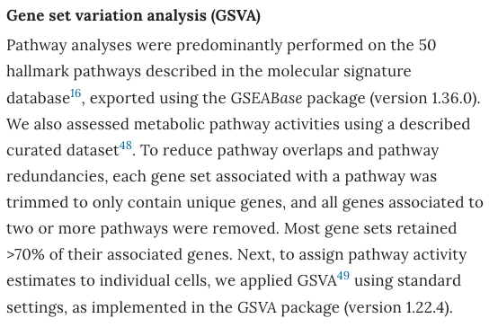

**Author(s)**: `r params$author`  
**Date**: `r Sys.Date()`  


# Academic Citation
If you use this code in your work or research, we kindly request that you cite our publication:

Xiaofan Lu, et al. (2025). FigureYa: A Standardized Visualization Framework for Enhancing Biomedical Data Interpretation and Research Efficiency. iMetaMed. https://doi.org/10.1002/imm3.70005

```{r setup, include=FALSE}
knitr::opts_chunk$set(echo = TRUE)
```

## 需求描述 / Requirement description

模仿paper里方法做GSVA，结果保存到文件，能作为FigureYa39bar的输入文件画出bar plot。

Simulate the method in the paper to create GSVA, save the results to a file, and use it as the input file for FigureYa39bar to draw a bar plot.



出自<https://www.nature.com/articles/s41591-018-0096-5/>

## 应用场景 / Application scenarios

关于GSVA分析，可以这样理解：如果说表达矩阵反映了样本和基因的关系，则GSVA将一个“样本×基因”的矩阵转化为“样本×通路”的矩阵，直接反映了样本和读者感兴趣的通路之间的联系。因此，如果用limma包做差异表达分析可以寻找样本间差异表达的基因，同样地，使用limma包对GSVA的结果（依然是一个矩阵）做同样的分析，则可以寻找样本间有显著差异的通路。这些“差异表达”的通路，相对于基因而言，更加具有生物学意义，更具有可解释性，是统计学与生物学成功结合后，对GSEA结果的一次升华，可以进一步用于肿瘤subtype的分型等等与生物学意义结合密切的探究。

示例文件easy_input_expr.csv跟FigureYa59volcano用的是同一套表达数据。

- FigureYa59volcano的输入文件easy_input_limma.csv是用**全体基因**做差异分析获得的。
- 此处gsva_limma.csv文件是用**通路**做差异分析获得的。

Regarding GSVA analysis, it can be understood as follows: if the expression matrix reflects the relationship between samples and genes, then GSVA transforms a “sample x gene” matrix into a “sample x pathway” matrix, directly reflecting the connection between samples and pathways of interest to readers. Therefore, if differential expression analysis is performed using the limma package, genes with differential expression between samples can be identified. Similarly, using the limma package to analyze the results of GSVA (still a matrix) in the same way can identify pathways with significant differences between samples. These “differentially expressed” pathways, compared to genes, have more biological significance and interpretability. They are a sublimation of GSEA results after the successful combination of statistics and biology, and can be further used for the classification of tumor subtypes and other closely related explorations with biological significance.

The example file easyinput-expr.csv uses the same set of expression data as FigureYa59volcano.

-The input file easy_input_imma. csv for FigureYa59volcano was obtained through differential analysis using ** all genes **. 
-The gsva_imma. csv file here was obtained through differential analysis using **pathway**.


## 环境设置 / Environment settings

```{r}
source("install_dependencies.R")
library(msigdbr)
library(dplyr)
library(data.table)
library(GSVA)
library(limma)
library(stringr)
library(ggplot2)

Sys.setenv(LANGUAGE = "en")
options(stringsAsFactors = FALSE)
# options(mc.cores = parallel::detectCores())
```

## 输入文件

GSVA需要两个输入文件：基因表达矩阵和通路里的基因列表。

- hallmark.gs.RData：“整理通路里的基因列表”这部分生成的，同一物种同一版本注释可重复使用。

- easy_input_expr.csv：基因表达矩阵，每行一个基因，每列一个sample。

Input file

GSVA requires two input files: a gene expression matrix and a list of genes in the pathway.

- Hallmark.gs.RData: This section generates a list of genes in the pathway, and annotations for the same species and version can be reused.
- Easyinput-expr.csv: Gene expression matrix, with one gene per row and one sample per column.

## 整理通路里的基因列表

下面这部分运行后，要保存好生成的hallmark.gs.RData文件，同一物种同一版本注释可重复使用。以后就可以跳过这步，直接进入“GSVA”。

**每次只需要更换表达矩阵，用同一物种同一版本gmt生成的"hallmark.gs.RData"可以一直用。**

为了减少冗余信息的干扰，paper中要求：

- 在每个geneset中，不应该出现重复的基因；
- 在两个或更多个pathway中出现的基因应该被彻底剔除。

在实际分析过程中，笔者留意到在单个的geneset中已经很少出现重复的基因，但在两个或更多个pathway中出现的基因则数目相对较多，读者可**酌情考虑，调整此处过滤的力度**。

## Organize the gene list in the pathway

After running the following section, it is necessary to save the generated hallmark.gs.RData file. Annotations of the same species and version can be reused. In the future, you can skip this step and directly enter “GSVA”.

Only the expression matrix needs to be changed each time, and the “hallmark. gs. RData” generated using the same species and version of gmt can be used continuously.

In order to reduce the interference of redundant information, the paper requires:

- In each gene set, there should be no duplicated genes; 
- Genes that appear in two or more pathways should be completely eliminated.

In the actual analysis process, the author noticed that duplicate genes rarely appear in a single gene set, but the number of genes appearing in two or more pathways is relatively large. Readers can consider adjusting the filtering intensity at their discretion.

```{r}
h <- msigdbr(species = "Homo sapiens", # 物种拉丁名
             category = "H") #此处以hallmark为例，你也可以选择MSigDB的其他注释

# 示例数据表达矩阵的基因名是gene symbol，这里就选gene_symbol。
# 如果你的表达矩阵以ENTREZ ID作为基因名，就把下面这段的gene_symbol换成entrez_gene
h <- select(h, gs_name, gene_symbol) %>% #或entrez_gene
  as.data.frame %>% 
  split(., .$gs_name) %>% 
  lapply(., function(x)(x$gene_symbol)) #或entrez_gene

# 在每个geneset里面去掉重复的基因
gs <- lapply(h, unique)

# 接下来去掉那些在两个或更多个pathways里出现过的genes
count <- table(unlist(gs))
keep <- names(which(table(unlist(gs)) < 2))
gs <- lapply(gs, function(x) intersect(keep, x))

# 过滤之后，很多pathway一个gene都不剩了，去掉这些
gs <- gs[lapply(gs, length) > 0]

# 预览过滤后的结果
head(gs)

# 保存到文件，方便以后重复使用
save(gs, file = "hallmark.gs.RData")
```

## GSVA

```{r}
# 读入前面生成的通路中的基因列表 / Load previously generated gene sets
load("hallmark.gs.RData") # 保存在当前文件夹 / Saved in current folder

# 读入基因表达矩阵 / Load gene expression matrix
gsym.expr <- read.csv("easy_input_expr.csv", row.names = 1)
head(gsym.expr)

# 确保输入数据格式正确
# 转换表达矩阵为数值矩阵
expr_matrix <- as.matrix(gsym.expr)
mode(expr_matrix) <- "numeric"  # 确保所有值为数值型

# 新版本 GSVA 需要明确指定参数名称 / New GSVA version requires explicit parameter names
gsva_es <- GSVA::gsva(
  expr = expr_matrix,              # 表达矩阵 / Expression matrix
  gset.idx.list = gs,              # 基因集列表 / Gene set list
  method = "gsva",                 # 明确指定方法 / Specify method explicitly
  verbose = FALSE,                 # 减少输出信息 / Reduce output information
  kcdf = "Gaussian",               # 明确指定核函数 / Specify kernel function
  parallel.sz = 1                  # 单线程运行 / Single thread
)

# 预览GSVA分析返回的矩阵 / Preview GSVA result matrix
head(gsva_es)

# 把通路的表达量保存到文件 / Save pathway expression to file
write.csv(gsva_es, "gsva_output.csv", quote = FALSE)
```

到这里，GSVA分析就结束了。

接下来，你可能要对这些通路进行进一步的分析，此处以差异表达分析为例。

This concludes the GSVA analysis.

Next, you may need to further analyze these pathways, using differential expression analysis as an example.

## 通路的差异表达分析 / Differential expression analysis of pathways

```{r}
# 分组
group_list <- data.frame(sample = colnames(gsva_es), group = c(rep("a", 3), rep("b", 3)))
head(group_list)

# 设置对比
design <- model.matrix(~ 0 + factor(group_list$group))
colnames(design) <- levels(factor(group_list$group))
rownames(design) <- colnames(gsva_es)
design

# 构建差异比较矩阵
contrast.matrix <- makeContrasts(b-a, levels = design)

# 差异分析，b vs. a
fit <- lmFit(gsva_es, design)
fit2 <- contrasts.fit(fit, contrast.matrix)
fit2 <- eBayes(fit2)
x <- topTable(fit2, coef = 1, n = Inf, adjust.method = "BH", sort.by = "P")
head(x)

#把通路的limma分析结果保存到文件
write.csv(x, "gsva_limma.csv", quote = F)

#输出t值，用做FigureYa39bar的输入数据
pathway <- str_replace(row.names(x), "HALLMARK_", "")
df <- data.frame(ID = pathway, score = x$t)
write.csv(df, "easy_input2_for39bar.csv", quote = F, row.names = F)
```

## 开始画图 / Start drawing

t为柱子的长度（图中横轴），行名为图中pathway的名称。

如果想做更多细节上的调整，可参考FigureYa39bar。

T is the length of the column (horizontal axis in the figure), and the row name is the name of the pathway in the figure.

If you want to make more detailed adjustments, you can refer to FigureYa39bar.

```{r, fig.width=6, fig.height=8}
df <- read.csv("easy_input2_for39bar.csv")
head(df)

#按照score的值分组
cutoff <- 1
df$group <- cut(df$score, breaks = c(-Inf, -cutoff, cutoff, Inf),labels = c(1,2,3))

#按照score排序
sortdf <- df[order(df$score),]
sortdf$ID <- factor(sortdf$ID, levels = sortdf$ID)
head(sortdf)

ggplot(sortdf, aes(ID, score, fill = group)) + geom_bar(stat = 'identity') + 
  coord_flip() + 
  scale_fill_manual(values = c('palegreen3', 'snow3', 'dodgerblue4'), guide = FALSE) + 

  #画2条虚线
  geom_hline(yintercept = c(-cutoff,cutoff), 
             color="white",
             linetype = 2, #画虚线
             size = 0.3) + #线的粗细
  
  #写label
  geom_text(data = subset(df, score < 0),
            aes(x=ID, y= 0, label= paste0(" ", ID), color = group),#bar跟坐标轴间留出间隙
            size = 3, #字的大小
            hjust = "inward" ) +  #字的对齐方式
  geom_text(data = subset(df, score > 0),
            aes(x=ID, y= -0.1, label=ID, color = group),
            size = 3, hjust = "outward") +  
  scale_colour_manual(values = c("black","snow3","black"), guide = FALSE) +
  
  xlab("") +ylab("t value of GSVA score, tumor \n versus non-malignant")+
  theme_bw() + #去除背景色
  theme(panel.grid =element_blank()) + #去除网格线
  theme(panel.border = element_rect(size = 0.6)) + #边框粗细
  theme(axis.line.y = element_blank(), axis.ticks.y = element_blank(), axis.text.y = element_blank()) #去除y轴

ggsave("gsva.pdf", width = 6, height = 8)
```

# Session Info

```{r}
sessionInfo()
```