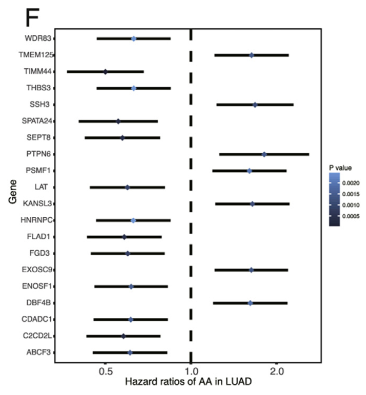

# Academic Citation
If you use this code in your work or research, we kindly request that you cite our publication:

Xiaofan Lu, et al. (2025). FigureYa: A Standardized Visualization Framework for Enhancing Biomedical Data Interpretation and Research Efficiency. iMetaMed. doi.org/10.1002/imm3.70005

To cite package 'ggstatsplot' in publications use:

Patil, I. (2021). Visualizations with statistical details: The 'ggstatsplot' approach. Journal of Open Source Software, 6(61), 3167, doi:10.21105/joss.03167

```{r setup, include=FALSE}
knitr::opts_chunk$set(
  echo = TRUE# 控制是否显示代码/Control whether to display code
  # include = FALSE 已在此chunk的头部设置，表示不包含此代码块的输出
  # include = FALSE is set in chunk header, means exclude this chunk's output
  )
```

## 需求描述

单基因cox分析，并画出像paper里的图。

计算HR，保存到文件，作为FigureYa6森林图的输入。

## Description of requirements

Single gene cox analysis and plot like in PAPER.

Calculate HR and save to file as input for FigureYa6 forest plot.



出自<https://www.sciencedirect.com/science/article/pii/S0304383517301258?via%3Dihub>

## 应用场景

cox比例风险回归模型，由英国统计学家D.R.Cox于1972年提出

主要用于肿瘤和其他慢性疾病的预后分析，也可用于队列研究的病因探索

单因素cox分析主要探索单个基因的独立预后影响

cox分析可用于转录组，甲基化，miRNA, LncRNA, 可变剪切等等

From <https://www.sciencedirect.com/science/article/pii/S0304383517301258?via%3Dihub>

## Application Scenarios

cox proportional risk regression model, proposed by British statistician D.R. Cox in 1972

Mainly used for prognostic analysis of tumors and other chronic diseases, but also used for etiological exploration in cohort studies

One-way cox analysis is used to explore the independent prognostic impact of individual genes.

Cox analysis can be used for transcriptome, methylation, miRNA, LncRNA, variable shear, etc.

## 环境设置

## Environment settings

```{r, message=FALSE}
source("install_dependencies.R")
source("ggscatterstats.R") # from ggstatsplot package https://github.com/IndrajeetPatil/ggstatsplot
source("theme-ggstatsplot.R") # from ggstatsplot package https://github.com/IndrajeetPatil/ggstatsplot

library(tidyverse)
library(ggplot2)
library(survival)
library(stringr)
library(viridis)
library(scales)
```

## 输入文件的准备

如果你的数据已经整理成easy_input_4cox.csv的格式，就可以跳过这步，直接进入“单因素cox分析”。

如果你的数据已经整理成cox_output.csv的格式，就可以跳过这步，直接进入“开始画图”。

此处以LUAD为例，从TCGA下载生存资料和表达矩阵，处理为cox分析需要的的easy_input.csv。

## Preparation of input files

If your data has been organized into easy_input_4coxv.csv format, you can skip this step and go directly to “One-way cox analysis”.

If your data has been organized into cox_output.csv format, you can skip this step and go directly to “Start Drawing”.

Here we take LUAD as an example, download the survival data and expression matrix from TCGA, and process them into easy_input.csv for cox analysis.

### 第一步：样本资料整理，提取LUAD样本名

数据来源：

- TCGA_phenotype_denseDataOnlyDownload.tsv，TCGA样本资料，下载地址：<https://pancanatlas.xenahubs.net/download/TCGA_phenotype_denseDataOnlyDownload.tsv.gz>
- samplepair.txt，TCGA跟GTEx的组织对应关系，参照GEPIA help的Differential analysis：<http://gepia.cancer-pku.cn/help.html>，整理成samplepair.txt文件
- Survival_SupplementalTable_S1_20171025_xena_sp，cell处理优化过的生存资料，下载地址：<https://pancanatlas.xenahubs.net/download/Survival_SupplementalTable_S1_20171025_xena_sp.gz>

Data Source:

- TCGA_phenotype_denseDataOnlyDownload.tsv, TCGA sample data, download at <https://pancanatlas.xenahubs.net/download/TCGA_phenotype_ denseDataOnlyDownload.tsv.gz>
- samplepair.txt, TCGA and GTEx organization correspondence, refer to the Differential analysis of GEPIA help: <http://gepia.cancer-pku.cn/help.html>, organized into samplepair.txt file
- Survival_SupplementalTable_S1_20171025_xena_sp, cell processing optimized survival information, download address: <https://pancanatlas.xenahubs.net/download/Survival_ SupplementalTable_S1_20171025_xena_sp.gz>

```{r}
# 建立疾病全称跟缩写的对应关系
# Create mapping between disease full names and abbreviations

# 读取样本配对文件（包含TCGA缩写和详细名称的对应关系）
# Read sample pair file (containing mapping between TCGA abbreviations and full names)
samplepair <- read.delim("samplepair.txt", as.is = TRUE)  # as.is=TRUE保持字符型不变/keep character strings as is

# 创建组织类型命名向量（TCGA缩写作为值，详细名称作为名称）
# Create tissue naming vector (TCGA codes as values, full names as names)
tissue <- samplepair$TCGA  # 提取TCGA缩写列/extract TCGA code column
names(tissue) <- samplepair$Detail  # 设置详细名称为向量名称/set full names as vector names


# 提取LUAD的样本资料
# Extract LUAD (Lung Adenocarcinoma) sample information

# 读取TCGA表型数据
# Read TCGA phenotype data
tcgacase <- read.delim(
  file = "TCGA_phenotype_denseDataOnlyDownload.tsv",
  header = TRUE,  # 第一行是列名/first row contains column names
  as.is = TRUE  # 保持字符型不变/keep character strings as is
)  

# 添加组织类型信息（使用前面创建的tissue向量进行映射）
# Add tissue type information (using previously created tissue vector for mapping)
tcgacase$tissue <- tissue[tcgacase$X_primary_disease]  # 通过疾病名称获取TCGA缩写/get TCGA code by disease name

# 创建样本类型标签（区分正常组织和肿瘤组织）
# Create sample type labels (distinguish normal and tumor tissues)
tcgacase$type <- ifelse(
  tcgacase$sample_type == 'Solid Tissue Normal',  # 判断是否为正常组织/check if normal tissue
  paste(tcgacase$tissue, "normal_TCGA", sep = "_"),  # 正常组织标签/normal tissue label
  paste(tcgacase$tissue, "tumor_TCGA", sep = "_")  # 肿瘤组织标签/tumor tissue label
)

# 创建简化的样本类型分类（仅normal/tumor）
# Create simplified sample type classification (only normal/tumor)
tcgacase$type2 <- ifelse(
  tcgacase$sample_type == 'Solid Tissue Normal',  # 判断是否为正常组织/check if normal tissue
  "normal",  # 正常/normal
  "tumor"  # 肿瘤/tumor
)

# 提取关键列（样本ID、组织类型、详细类型、简化类型）
# Extract key columns (sample ID, tissue type, detailed type, simplified type)
tcgatable <- tcgacase[, c(1, 5:7)]  # 选择第1列和第5-7列/select columns 1 and 5-7

# 查看前几行数据
# View first few rows of data
head(tcgatable)

# 筛选LUAD肿瘤样本
# Filter LUAD tumor samples
lung <- filter(tcgatable, tissue == "LUAD", type2 == "tumor")  # LUAD=肺腺癌/Lung Adenocarcinoma


# 找到LUAD病人的生存资料，并与RNA-Seq样本比对
# Find LUAD patient survival data and match with RNA-Seq samples

# 读取生存数据补充表
# Read survival supplemental table
survival <- read.delim("Survival_SupplementalTable_S1_20171025_xena_sp", as.is = TRUE)

# 查看列名（确认数据内容）
# View column names (verify data content)
colnames(survival)

# 筛选LUAD患者的生存数据
# Filter survival data for LUAD patients
LUADsur <- filter(survival, cancer.type.abbreviation == 'LUAD')

# 选择关键生存指标列
# Select key survival indicator columns
LUADsur <- LUADsur[, c(1, 2, 3, 4, 14, 26, 27)]  # 包含样本ID、生存时间、生存状态等/include sample ID, survival time, status etc.

# 设置行名为样本ID（便于后续操作）
# Set row names as sample IDs (for easier manipulation)
rownames(LUADsur) <- LUADsur$sample


# 取交集（匹配有表达数据和生存数据的样本）
# Find intersection (match samples with both expression and survival data)

# 找出同时存在于生存数据和表达数据的样本
# Find samples present in both survival and expression data
a <- intersect(LUADsur$sample, lung$sample)

# 筛选匹配的肿瘤样本并移除生存时间缺失的样本
# Filter matched tumor samples and remove those with missing survival time
luadsurvival_tumor <- LUADsur[a, ] %>%
  filter(!is.na(OS.time))  # 确保生存时间数据完整/ensure survival time data is complete

# 提取整理好的LUAD病人生存资料（仅保留关键列）
# Extract well-organized LUAD patient survival data (keep only key columns)
surdata <- luadsurvival_tumor[, c(1, 2, 6, 7)]  # 样本ID、生存状态、生存时间等/sample ID, survival status, time etc.

# 查看前5行数据的前4列
# View first 5 rows and first 4 columns of data
surdata[1:5, 1:4]
```

### 第二步：表达矩阵处理

这里直接读取LUAD基因的表达矩阵：easy_input_expr.csv

若要从pan-cancer提取处理好的某个癌症的RNA-seq数据，参考FigureYa55panCancer_violin或FigureYa56immune_inflitrationV2

### Step 2: Expression matrix processing

Here we read the expression matrix of LUAD gene directly: easy_input_expr.csv

To extract the processed RNA-seq data of a particular cancer from pan-cancer, refer to FigureYa55panCancer_violin or FigureYa56immune_inflitrationV2

```{r}
# 读取基因表达数据（TPM值）
# Read gene expression data (TPM values)
tcgadatatpm <- read.csv("easy_input_expr.csv", row.names = 1)  # 第一列作为行名/first column as row names

# 查看表达数据前5行和前5列
# View first 5 rows and 5 columns of expression data
tcgadatatpm[1:5, 1:5]

# 筛选具有生存信息的样本
# Filter samples with survival information
luadsample <- intersect(
  row.names(tcgadatatpm),  # 表达数据中的样本/samples in expression data
  luadsurvival_tumor$sample  # 生存数据中的样本/samples in survival data
)  # 取两者的交集/get intersection

# 确保生存数据行名与样本ID一致
# Ensure row names of survival data match sample IDs
row.names(luadsurvival_tumor) <- luadsurvival_tumor$sample

# 提取具有表达数据的生存信息
# Extract survival data for samples with expression data
luadsurvival_tumortime <- luadsurvival_tumor[luadsample, ]  # 通过样本ID筛选/filter by sample IDs

# 仅保留关键生存信息列（样本ID、总生存时间、生存状态）
# Keep only key survival columns (sample ID, OS time, OS status)
luadsurvival_tumortime <- luadsurvival_tumortime[, c(1, 6, 7)]  # 选择第1,6,7列/select columns 1,6,7

# 在表达数据中添加样本ID列（方便后续合并）
# Add sample ID column to expression data (for easier merging)
tcgadatatpm$sample <- row.names(tcgadatatpm)  # 将行名转为列/convert row names to column
```

### 第三步：整理为cox分析的输入格式

### Step 3: Organize into an input format for cox analysis

```{r}
# 合并生存数据和基因表达数据
# Merge survival data with gene expression data
realdata <- merge(
  luadsurvival_tumortime,  # 生存数据/survival data
  tcgadatatpm,             # 基因表达数据/gene expression data 
  by = "sample"            # 按样本ID合并/merge by sample ID
)

# 将合并后的数据的行名设置为样本ID
# Set row names of merged data as sample IDs
row.names(realdata) <- realdata$sample

# 移除第一列(sample列)，因为样本ID已作为行名
# Remove first column (sample column) since sample IDs are now row names
realdata <- realdata[, -1]

# (可选)将生存时间从天数转换为年数 - 当前被注释掉
# (Optional) Convert survival time from days to years - currently commented out
# realdata$OS.time <- realdata$OS.time/365  

# 查看合并数据的前5行和前5列
# View first 5 rows and 5 columns of merged data
realdata[1:5, 1:5]

# 将合并后的数据保存为CSV文件，供后续Cox分析使用
# Save merged data as CSV file for subsequent Cox analysis
write.csv(realdata, "easy_input_4cox.csv")
```

## 单因素cox分析

## One-way cox analysis

```{r}
# 读取准备好的Cox分析输入数据
# Read prepared data for Cox analysis
realdata <- read.csv("easy_input_4cox.csv", row.names = 1)  # 第一列作为行名/first column as row names

# 查看数据前3行和前6列
# View first 3 rows and 6 columns of data
realdata[1:3, 1:6]

# 初始化空数据框存储Cox分析结果
# Initialize empty data frame to store Cox results
Coxoutput <- data.frame()

# 对每个基因进行单变量Cox回归分析
# Perform univariate Cox regression for each gene
for(i in colnames(realdata[, 3:ncol(realdata)])) {  # 从第3列开始是基因表达数据/columns starting from 3 are gene expression
  
  # 构建Cox比例风险模型
  # Build Cox proportional hazards model
  cox <- coxph(
    Surv(OS.time, OS) ~ realdata[, i],  # 生存时间+状态 ~ 基因表达/survival time+status ~ gene expression
    data = realdata
  )
  
  # 获取模型摘要
  # Get model summary
  coxSummary <- summary(cox)
  
  # 提取关键统计量并存入结果数据框
  # Extract key statistics and store in results data frame
  Coxoutput <- rbind(Coxoutput, 
                    cbind(
                      gene = i,  # 基因名称/gene name
                      HR = coxSummary$coefficients[, "exp(coef)"],  # 风险比/hazard ratio
                      z = coxSummary$coefficients[, "z"],  # z统计量/z-score
                      pvalue = coxSummary$coefficients[, "Pr(>|z|)"],  # p值/p-value
                      lower = coxSummary$conf.int[, 3],  # 95%置信区间下限/95% CI lower bound
                      upper = coxSummary$conf.int[, 4]   # 95%置信区间上限/95% CI upper bound
                    ))
}

# 转换数值型列（从因子/字符转换为数值）
# Convert numeric columns (from factor/character to numeric)
for(i in c(2:6)) {
  Coxoutput[, i] <- as.numeric(as.vector(Coxoutput[, i]))
}

# 按p值排序并筛选显著结果(p<0.05)
# Sort by p-value and filter significant results (p<0.05)
Coxoutput <- arrange(Coxoutput, pvalue) %>% 
  filter(pvalue < 0.05) 

# 保存Cox分析结果到CSV文件
# Save Cox results to CSV file
write.csv(Coxoutput, 'cox_output.csv', row.names = FALSE)  # 不保存行名/exclude row names
```

此结果可与FigureYa6森林图衔接，画出不同形式的森林图

只需把FigureYa6输入文件的Point Estimate改为HR，Low改为lower，High改为upper，其余自行添加

This result can be linked to the FigureYa6 forest plot to draw a different form of forest plot.

Just change Point Estimate to HR, Low to lower, High to upper in the input file of FigureYa6, and add the rest by yourself.

## 开始画图

## Start drawing

```{r}
# 读取Cox回归分析结果
# Read Cox regression results
Coxoutput <- read.csv("cox_output.csv")
head(Coxoutput)  # 查看前几行数据/View first few rows

# 筛选HR值显著(≤0.92或≥1.15)的基因
# Filter genes with significant HR (≤0.92 or ≥1.15)
plotCoxoutput <- filter(Coxoutput, HR <= 0.92 | HR >= 1.15)  

# 绘图1：使用Nature风格配色（误差线黑色）
# Plot 1: Using Nature-style color scheme (black error bars)
ggplot(data = plotCoxoutput, aes(x = HR, y = gene, color = pvalue)) +
  # 添加水平误差线/Add horizontal error bars
  geom_errorbarh(aes(xmax = upper, xmin = lower), color = "black", height = 0, size = 1.2) +
  # 添加菱形点/Add diamond-shaped points
  geom_point(aes(x = HR, y = gene), size = 3.5, shape = 18) +  
  # 添加HR=1的参考线/Add reference line at HR=1
  geom_vline(xintercept = 1, linetype = 'dashed', size = 1.2) +
  # 设置x轴刻度/Set x-axis breaks
  scale_x_continuous(breaks = c(0.75, 1, 1.30)) +
  # 对x轴进行log2转换/log2 transformation for x-axis
  coord_trans(x = 'log2') + 
  # 设置坐标轴标签/Set axis labels
  ylab("Gene") +  
  xlab("Hazard ratios of AA in LUAD") + 
  # 设置图例和标题/Set legend and title
  labs(color = "P value", title = "Univariate Cox regression analysis") +
  # 使用viridis配色/Use viridis color scale
  scale_color_viridis() +  
  # 使用ggstatsplot主题/Use ggstatsplot theme
  theme_ggstatsplot() +  
  # 移除网格线/Remove grid lines
  theme(panel.grid = element_blank()) 
# 保存图形/Save plot
ggsave('plot1.pdf', width = 8, height = 9)

# 绘图2：误差线随p值变色
# Plot 2: Error bars colored by p-value
ggplot(data = plotCoxoutput, aes(x = HR, y = gene, color = pvalue)) +
  geom_errorbarh(aes(xmax = upper, xmin = lower, color = pvalue), height = 0, size = 1.2) +
  geom_point(aes(x = HR, y = gene), size = 3.5, shape = 18) +   
  geom_vline(xintercept = 1, linetype = 'dashed', size = 1.2) +
  scale_x_continuous(breaks = c(0.75, 1, 1.30)) +
  coord_trans(x = 'log2') + 
  ylab("Gene") +  
  xlab("Hazard ratios of AA in LUAD") + 
  labs(color = "P value", title = "") +
  scale_color_viridis() + 
  theme_ggstatsplot() +  
  theme(panel.grid = element_blank()) 
ggsave('plot2.pdf', width = 8, height = 9)

# 绘图3：自定义主题和配色（樱花粉配色）
# Plot 3: Custom theme and color scheme (cherry blossom color)
ggplot(data = plotCoxoutput, aes(x = HR, y = gene, color = pvalue)) +
  geom_errorbarh(aes(xmax = upper, xmin = lower), color = 'black', height = 0, size = 1.2) +
  geom_point(aes(x = HR, y = gene), size = 3.5, shape = 18) +   
  geom_vline(xintercept = 1, linetype = 'dashed', size = 1.2) +
  scale_x_continuous(breaks = c(0.75, 1, 1.30)) +
  coord_trans(x = 'log2') + 
  ylab("Gene") +  
  xlab("Hazard ratios of AA in LUAD") + 
  labs(color = "P value", title = "") +
  # 自定义渐变色：蓝-白-粉/Custom gradient: blue-white-pink
  scale_color_gradient2(low = muted("skyblue"), mid = "white", high = muted('pink'), midpoint = 0.025) + 
  # 使用黑白主题/Use bw theme
  theme_bw(base_size = 12) +   
  # 自定义主题元素/Custom theme elements
  theme(panel.grid = element_blank(),  
        axis.text.x = element_text(face = "bold", color = "black", size = 9),    
        axis.text.y = element_text(face = "bold", color = "black", size = 9),
        axis.title.x = element_text(face = "bold", color = "black", size = 11),
        axis.title.y = element_text(face = "bold", color = "black", size = 11),
        legend.text = element_text(face = "bold", color = "black", size = 9),
        legend.title = element_text(face = "bold", color = "black", size = 11),
        panel.border = element_rect(colour = 'black', size = 1.4))   
ggsave('plot3.pdf', width = 8, height = 9)
```

## 例文的原图复现

下载原文数据（Suptable2)，根据原文原始数据完全重复原文图片

原文有LUAD和LUSC，这里选择LUAD

## Original image reproduction of example text

Download the original data (Suptable2), and repeat the original picture exactly according to the original data of the original text

There are LUAD and LUSC in the original text, here we choose LUAD.

```{r}
# 读取补充表格数据（制表符分隔）
# Read supplementary table data (tab-delimited)
df <- read.csv("suptable2LUAD.csv", sep = '\t')

# 选择AA剪接类型的前20个基因用于可视化
# Select top 20 genes with AA splice type for visualization
AAtop20 <- filter(df, splice_type == 'AA')  # 筛选AA剪接类型/filter AA splice type
AAtop20 <- AAtop20[1:20, ]  # 取前20行/take first 20 rows

# 绘制森林图展示HR值和置信区间
# Draw forest plot showing HR values and confidence intervals
ggplot(data = AAtop20, aes(x = HR, y = symbol, color = pvalue)) +
  # 添加水平误差线（黑色）
  # Add horizontal error bars (black)
  geom_errorbarh(aes(xmax = upper, xmin = lower), 
                color = "black", 
                height = 0,  # 误差线高度/error bar height
                size = 1.2) +  # 误差线粗细/error bar thickness
  
  # 添加菱形点表示HR值
  # Add diamond points representing HR values
  geom_point(aes(x = HR, y = symbol), 
             size = 3.5,  # 点大小/point size
             shape = 18) +  # 18表示菱形/18 represents diamond shape
  
  # 添加HR=1的参考线（虚线）
  # Add reference line at HR=1 (dashed)
  geom_vline(xintercept = 1, 
             linetype = 'dashed', 
             size = 1.2) +
  
  # 设置x轴刻度
  # Set x-axis breaks
  scale_x_continuous(breaks = c(0.5, 1, 2)) +
  
  # 对x轴进行log2转换（使0.5-1和1-2距离对称）
  # Apply log2 transformation to x-axis (for symmetrical spacing)
  coord_trans(x = 'log2') +  
  
  # 设置坐标轴标签
  # Set axis labels
  ylab("Gene") +  # y轴标签/y-axis label
  xlab("Hazard ratios of AA in LUAD") +  # x轴标签/x-axis label
  
  # 设置图例标题
  # Set legend title
  labs(color = "P value", title = "") +
  
  # 使用ggstatsplot主题（美观的科研风格）
  # Use ggstatsplot theme (elegant scientific style)
  theme_ggstatsplot() +  
  
  # 自定义主题：移除网格线
  # Custom theme: remove grid lines
  theme(panel.grid = element_blank()) 

# 保存图形为PDF（8x9英寸）
# Save plot as PDF (8x9 inches)
ggsave('sameplot.pdf', width = 8, height = 9)
```

# Session Info

```{r}
sessionInfo()
```
