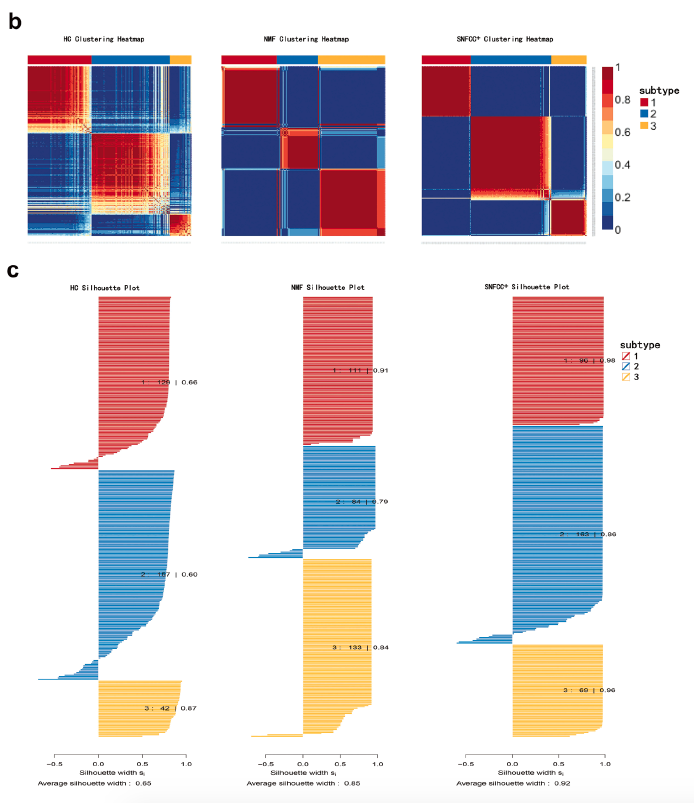

**Author(s)**: `r params$author`  
**Date**: `r Sys.Date()`  

欢迎关注“小Ying画图”公众号，同名知识星球等你加入

小Ying微信: epigenomics  E-mail: figureYing@126.com

作者：小高

小Ying编辑校验

# Academic Citation
If you use this code in your work or research, we kindly request that you cite our publication:

Xiaofan Lu, et al. (2025). FigureYa: A Standardized Visualization Framework for Enhancing Biomedical Data Interpretation and Research Efficiency. iMetaMed. https://doi.org/10.1002/imm3.70005


```{r setup, include=FALSE}
source("install_dependencies.R")
knitr::opts_chunk$set(echo = TRUE)
```

## 需求描述

从xena的pan-cancer文件中提取感兴趣的癌症的表达和生存数据



出自<https://link.springer.com/article/10.1007%2Fs00432-018-2684-7>

## 应用场景

从xena下载pan-cancer的RNA-seq数据和Cell处理优化过的生存数据，为FigureYa69CancerSubtypes准备好输入文件。

## 环境设置

```{r}
library(stringr)
library(data.table)
```

## 参数设置

```{r}
targetCancer <- "skin cutaneous melanoma" #感兴趣的癌症全称
```

## 数据下载

数据来源：

- Survival_SupplementalTable_S1_20171025_xena_sp，cell处理优化过的生存资料，下载地址：<https://pancanatlas.xenahubs.net/download/Survival_SupplementalTable_S1_20171025_xena_sp.gz>

- tcga_RSEM_gene_tpm，TOIL RSEM tpm (n=10,535) UCSC Toil RNAseq Recompute，下载TPM：<https://toil.xenahubs.net/download/tcga_RSEM_gene_tpm.gz>

- TCGA_phenotype_denseDataOnlyDownload.tsv，TCGA样本资料，下载地址：<https://pancanatlas.xenahubs.net/download/TCGA_phenotype_denseDataOnlyDownload.tsv.gz>

- Homo_sapiens.GRCh38.95.gtf，基因biotype，从ensembl获得：<https://asia.ensembl.org/info/data/ftp/index.html>，下载地址：<ftp://ftp.ensembl.org/pub/release-95/gtf/homo_sapiens/Homo_sapiens.GRCh38.95.gtf.gz>

```{r}
# 生存数据
clinical <- read.delim("Survival_SupplementalTable_S1_20171025_xena_sp", header = T,check.names = F)
head(clinical)

# 表达数据，4G多，直接读入内存，需要读入几分钟
# 如果内存不足，请参考FigureYa55panCancer_violin或FigureYa56immune_inflitrationV2的方式，用shell命令提取
headtcga <- read.delim("tcga_RSEM_gene_tpm",as.is=T,check.names = F)
headtcga[1:3, 1:3]

# 样品信息
tcgacase <- read.delim("TCGA_phenotype_denseDataOnlyDownload.tsv",header=T,as.is = T,check.names = F)
head(tcgacase)

# 基因biotype信息
gtf1 <- rtracklayer::import('Homo_sapiens.GRCh38.95.gtf')
gtf_df <- as.data.frame(gtf1)
geneid_df <- dplyr::select(gtf_df,c(gene_name,gene_id,gene_biotype))
id <- duplicated(geneid_df$gene_id)
geneid_df <-geneid_df[!id,]
head(geneid_df)
```

## 提取miRNA和蛋白质的表达数据

```{r}
# 提取感兴趣的癌症里的tumor的样品ID
targetCancerCase <- tcgacase[which(tcgacase$`_primary_disease`==targetCancer),]
targetCancerCase <- targetCancerCase[targetCancerCase$sample_type %like% "Tumor",]
targetCancerCase <- targetCancerCase$sample

# 提取感兴趣的癌症里的tumor的表达数据
targetCancerExp <- headtcga[,which(colnames(headtcga) %in% targetCancerCase)]
targetCancerExp <- cbind(data.frame(str_sub(headtcga$sample,1,15)),targetCancerExp)
colnames(targetCancerExp)[1] <- "gene_id"

targetCancerExp <- merge(geneid_df, targetCancerExp, by ="gene_id")
# 提取蛋白编码基因的表达量
protein_coding <- targetCancerExp[targetCancerExp$gene_biotype=="protein_coding",]
# 取平均值
protein_coding <- aggregate(protein_coding[, 4:ncol(protein_coding)],
                           by=list(gene_name=protein_coding$gene_name), FUN=mean)

protein_coding_subtype <- protein_coding[,-1]
row.names(protein_coding_subtype) <- protein_coding$gene_name

# 提取miRNA的表达量
miRNAExp <- targetCancerExp[targetCancerExp$gene_biotype=="miRNA",]
# 取平均值
miRNAExp <- aggregate(by=list(gene_name=miRNAExp$gene_name), miRNAExp[4:ncol(miRNAExp)],mean)
miRNAExp_subtype <- miRNAExp[, -1]
row.names(miRNAExp_subtype) <- miRNAExp$gene_name

levels(factor(targetCancerExp$gene_biotype))

write.csv(miRNAExp_subtype, "miRNAExp.csv")
write.csv(protein_coding_subtype, "protein_coding.csv")
```

## 提取有表达数据的样品对应的临床信息

```{r}
targetCancerCasetrans <- str_replace_all(colnames(targetCancerExp),"[.]","-")
targetCancerCli <- clinical[which(clinical$sample %in% targetCancerCasetrans),]
write.csv(targetCancerCli, "targetCancerCli.csv")
```