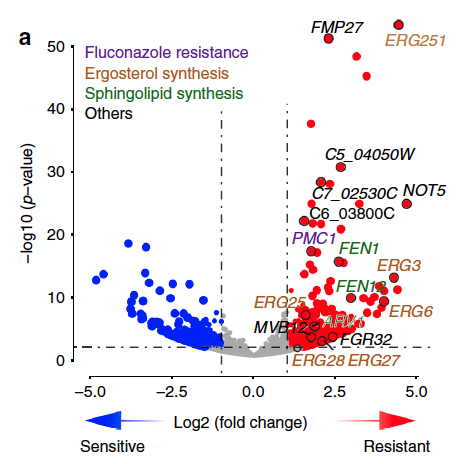
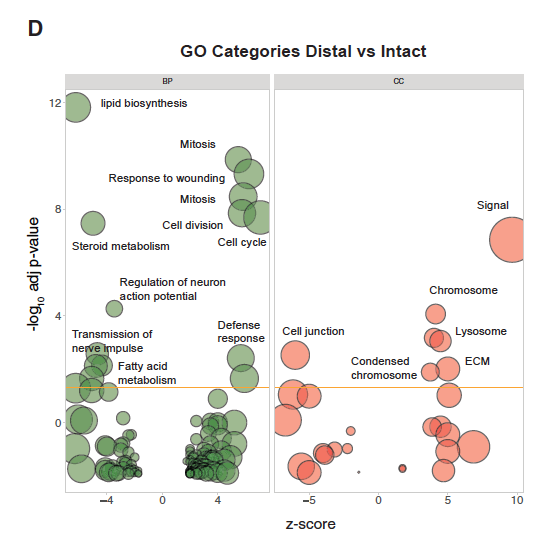

**Author(s)**: `r params$author`  
**Reviewer(s)**: `r params$reviewer`  
**Date**: `r Sys.Date()`  


```{r setup, include=FALSE}
knitr::opts_chunk$set(echo = TRUE)
# 设置knitr的全局代码块选项 / Set global chunk options for knitr
```

## 需求描述

用base plot画美美的火山图

## Requirement description

Create a beautiful volcano map using a base plot

## 应用场景

同时展示多个特征，同时展示P value、ajust P value、分组、size、score等。

例如基因的火山图

## Application scenarios

Display multiple features simultaneously, including P value, ajust P value, grouping, size, score, etc.

For example, a volcano map of genes



出自<https://www.nature.com/articles/s41467-018-06944-1>

from<https://www.nature.com/articles/s41467-018-06944-1>

或展示富集分析结果

Or display the enrichment analysis results



出自<http://dx.doi.org/10.1016/j.neuron.2017.09.008>

from<http://dx.doi.org/10.1016/j.neuron.2017.09.008>

想用ggplot2来画火山图，请参考FigureYa59Volcano。

If you want to use ggplot2 to draw a volcanic map, please refer to Figure Ya59Volcano.

## 环境设置

## Environment settings

```{r}
# 中文注释：设置R运行环境显示英文错误信息（便于国际交流或搜索解决方案）
# English Comment: Set R environment to display error messages in English (for international communication or troubleshooting)
Sys.setenv(LANGUAGE = "en") 

# 中文注释：全局设置字符串不自动转换为因子（避免旧版本R的默认行为导致问题）
# English Comment: Globally disable automatic conversion of strings to factors (prevent issues from legacy R default behavior)
options(stringsAsFactors = FALSE)
```

## 输入文件

第一列是gene名，后面包含列5列特征值。

可以换成其他值，例如富集分析结果。

## Input file

The first column is the gene name, followed by 5 columns of feature values.

It can be replaced with other values, such as enrichment analysis results.

```{R}
# 中文注释：读取CSV文件创建数据框，包含自定义参数设置
# English Comment: Read CSV file to create dataframe with custom parameters
dat <- read.csv("easy_input.csv",  # 中文注释：文件路径/文件名
                header = TRUE,     # 中文注释：首行作为列名（默认值可简写为T）
                row.names = 1,    # 中文注释：将第一列设为行名（注意：该列不再作为数据列）
                check.names = FALSE) # 中文注释：禁止自动修正特殊字符列名（如空格/括号）

# 中文注释：显示数据框前6行（默认6行，可通过n参数修改）
# English Comment: Display first 6 rows of dataframe (default, adjustable via n parameter)
head(dat) 

# 中文注释：显示数据框维度（行数 列数）
# English Comment: Show dataframe dimensions (rows columns)
dim(dat)
```

## 把各列数据整理成画图所需的格式

## Organize the columns of data into the format needed to draw the graphs

```{r, fig.width=3, fig.height=3}
### Score列 ###
### Score Column ###

# 中文注释：提取数据框中的score列作为fc向量
# English Comment: Extract the 'score' column as fc vector
fc <- dat$score

# 中文注释：将数据框的行名作为fc向量的名称
# English Comment: Assign row names as names of fc vector
names(fc) <- rownames(dat)

### -log10P列 ###
### -log10P Column ###

# 中文注释：提取数据框中的-log10P列作为p向量（注意反引号用于特殊列名）
# English Comment: Extract the '-log10P' column as p vector (backticks for special column names)
p <- dat$`-log10P`

# 中文注释：将数据框的行名作为p向量的名称
# English Comment: Assign row names as names of p vector
names(p) <- rownames(dat)

### group列 ###
### group Column ###

# 中文注释：为每个pathway组别分配颜色
# English Comment: Assign colors for each pathway group

# 中文注释：自定义颜色向量（16进制颜色代码）
# English Comment: Define custom color vector (hex color codes)
mycol <- c("#B2DF8A","#FB9A99","#33A02C","#E31A1C","#B15928","#6A3D9A",
           "#CAB2D6","#A6CEE3","#1F78B4","#FDBF6F","#999999","#FF7F00")

# 中文注释：获取数据中所有唯一的group类别
# English Comment: Get all unique group categories in the data
cols.names <- unique(dat$group)

# 中文注释：为每个group类别分配颜色（按顺序取mycol中的颜色）
# English Comment: Assign colors to each group (taking colors from mycol in order)
cols.code <- mycol[1:length(cols.names)]

# 中文注释：将group类别名称作为颜色向量的名称
# English Comment: Name the color vector with group categories
names(cols.code) <- cols.names

# 中文注释：为每条记录创建带透明度的颜色（"BB"表示约75%透明度）
# English Comment: Create colors with transparency for each record ("BB" means ~75% opacity)
col <- paste(cols.code[as.character(dat$group)],"BB", sep="")

# 中文注释：标记需要高亮的特定pathway（PathwayA, C, H, E）
# English Comment: Identify specific pathways to highlight (PathwayA, C, H, E)
i <- dat$group %in% c("PathwayA","PathwayC","PathwayH","PathwayE")

### size列 ###
### size Column ###

# 中文注释：提取数据框中的size列作为sizes向量
# English Comment: Extract the 'size' column as sizes vector
sizes <- dat$size

# 中文注释：将数据框的行名作为sizes向量的名称
# English Comment: Assign row names as names of sizes vector
names(sizes) <- rownames(dat)

### pval列 ###
### pval Column ###

# 中文注释：提取数据框中的pval列作为pp向量
# English Comment: Extract the 'pval' column as pp vector
pp <- dat$pval

# 中文注释：将数据框的行名作为pp向量的名称
# English Comment: Assign row names as names of pp vector
names(pp) <- rownames(dat)
```

## 开始画图

## Start drawing

```{r}
# 中文注释：创建PDF输出文件（宽度7英寸，高度6英寸）
# English Comment: Create PDF output file (7 inches wide, 6 inches tall)
pdf("base_volcano.pdf", 7, 6)

# 中文注释：设置图形参数
# English Comment: Set graphic parameters
par(xpd = F,  # 中文注释：禁止绘图超出绘图区域
               # English Comment: Prevent plotting outside plot region
    mar = par()$mar + c(0,0,0,6))  # 中文注释：右侧增加6行边距用于图例
                                   # English Comment: Add 6-line right margin for legends

# 中文注释：绘制基础火山图
# English Comment: Draw base volcano plot
plot(fc, p, log='y',  # 中文注释：y轴取对数
                      # English Comment: Logarithmic y-axis
     col=paste(cols.code[as.character(dat$group)], "BB", sep=""),  # 中文注释：带透明度的分组颜色
                                                                  # English Comment: Group colors with transparency
     pch=16,  # 中文注释：实心圆点
              # English Comment: Solid circles
     ylab=bquote(~-Log[10]~"P value"),  # 中文注释：y轴标签（数学表达式）
                                        # English Comment: y-axis label (math expression)
     xlab="Enrich score",  # 中文注释：x轴标签
                          # English Comment: x-axis label
     cex=ifelse(i, sizes, 1),  # 中文注释：高亮pathway使用指定大小，其他为1
                              # English Comment: Use specified size for highlighted pathways, 1 for others
     xlim=range(fc * 1.2))  # 中文注释：x轴范围扩大1.2倍
                            # English Comment: Expand x-axis range by 1.2x

# 中文注释：添加水平参考线
# English Comment: Add horizontal reference lines
abline(h=1/0.05, lty=2, lwd=1)  # 中文注释：p=0.05的虚线
                                  # English Comment: Dashed line for p=0.05
abline(h=1/max(pp[which(p.adjust(pp, "bonf") < 0.001)]), lty=3, lwd=1)  # 中文注释：Bonferroni校正阈值
                                                                        # English Comment: Bonferroni correction threshold

# 中文注释：添加垂直参考线
# English Comment: Add vertical reference lines
abline(v=-0.5, col="blue", lty=2, lwd=1)  # 中文注释：左侧阈值线
                                         # English Comment: Left threshold line
abline(v=0.5, col="red", lty=2, lwd=1)  # 中文注释：右侧阈值线
                                        # English Comment: Right threshold line

# 中文注释：标记显著pathway（Bonferroni校正p<0.001）
# English Comment: Highlight significant pathways (Bonferroni p<0.001)
w <- which(p.adjust(pp,"bonf") < 0.001)  # 中文注释：获取显著索引
                                        # English Comment: Get significant indices
points(fc[w], p[w], pch=1, cex=ifelse(i[w], dat[w,"size"],1))  # 中文注释：添加空心圆圈标记
                                                              # English Comment: Add hollow circle markers

# 中文注释：定义颜色透明度函数
# English Comment: Define color transparency function
add.alpha <- function(col, alpha=1){
  if(missing(col))
    stop("Please provide a vector of colours.")
  apply(sapply(col, col2rgb)/255, 2, 
        function(x) 
          rgb(x[1], x[2], x[3], alpha=alpha))  
}

# 中文注释：为显著pathway添加半透明文本标签
# English Comment: Add semi-transparent text labels for significant pathways
cols.alpha <- add.alpha(cols.code[dat[w,]$group], alpha=0.6)  # 中文注释：60%透明度
                                                              # English Comment: 60% transparency
text(fc[w], p[w], names(fc[w]), 
     pos=4,  # 中文注释：文本位于点右侧（1=下，2=左，3=上，4=右）
            # English Comment: Text position (1=below, 2=left, 3=above, 4=right)
     col=cols.alpha)  # 中文注释：使用半透明颜色
                     # English Comment: Use semi-transparent colors

# 中文注释：添加点大小图例
# English Comment: Add size legend
par(xpd = TRUE)  # 中文注释：允许绘图超出绘图区域
                # English Comment: Allow plotting outside plot region
f <- c(0.01,0.05,0.1,0.25)  # 中文注释：图例大小值
                            # English Comment: Legend size values
s <- sqrt(f*50)  # 中文注释：计算对应点大小
                # English Comment: Calculate corresponding point sizes
legend("topright",
       inset=c(-0.2,0),  # 中文注释：图例向右偏移20%
                        # English Comment: Legend offset 20% to right
       legend=f, pch=16, pt.cex=s, bty='n', col=paste("#88888888"))  # 中文注释：灰色半透明图例
                                                                     # English Comment: Grey semi-transparent legend

# 中文注释：添加分组颜色图例
# English Comment: Add group color legend
legend("bottomright", 
       inset=c(-0.25,0),  # 中文注释：图例向右偏移25%
                         # English Comment: Legend offset 25% to right
       pch=16, col=cols.code, legend=cols.names, bty="n")  # 中文注释：无边框图例
                                                          # English Comment: No-border legend

# 中文注释：关闭图形设备
# English Comment: Close graphic device
dev.off()
```


```{r}
sessionInfo()
```