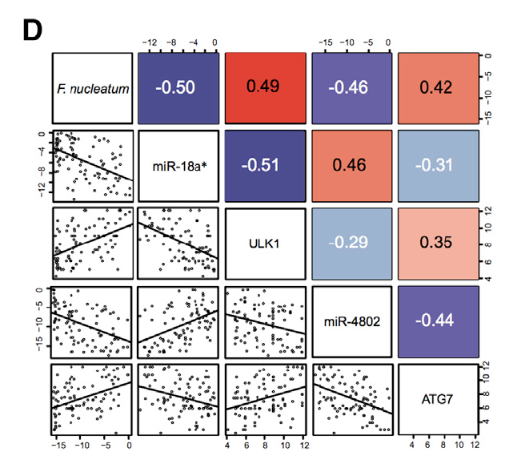

**Author(s)**: `r params$author`  
**Date**: `r Sys.Date()`  


```{r setup, include=FALSE}
knitr::opts_chunk$set(echo = TRUE)
# 设置knitr代码块的全局选项 / Set global options for knitr code chunks
```

## 需求描述

用R复现原图的形式。

## Requirement description

Reproduce the original image in R format.



出自<https://www.cell.com/cell/fulltext/S0092-8674(17)30815-2?_returnURL=https%3A%2F%2Flinkinghub.elsevier.com%2Fretrieve%2Fpii%2FS0092867417308152%3Fshowall%3Dtrue>

from<https://www.cell.com/cell/fulltext/S0092-8674(17)30815-2?_returnURL=https%3A%2F%2Flinkinghub.elsevier.com%2Fretrieve%2Fpii%2FS0092867417308152%3Fshowall%3Dtrue>

## 应用场景

同时展示相关系数和原始数据分布。

相关系数参考资料：<https://uc-r.github.io/correlations>。里面提到两个展示相关性的好用的画图工具：corrplot和corrgram。corrplot的用法可参考FigureYa70mutationEvents；corrgram基于pairs，包装进了几个现成的函数，这里借鉴了其中的panel.fill函数，corrgram的更多用法举例：<https://rawgit.com/kwstat/corrgram/master/vignettes/corrgram_examples.html>，<https://rstudio-pubs-static.s3.amazonaws.com/6382_886fbab74fd5499ba455f11360f78de7.html>，<http://www.datavis.ca/papers/corrgram.pdf>

## Application scenarios

Simultaneously display the correlation coefficient and the distribution of raw data.

Reference materials for correlation coefficient:< https://uc-r.github.io/correlations >It mentions two useful drawing tools for displaying correlations: corrplot and corrgram. The usage of corrplot can refer to FigureYa70mutationEvents; Corrgram is based on pairs and includes several ready-made functions. Here, we draw inspiration from the panel.fill function. For more examples of Corrgram usage:< https://rawgit.com/kwstat/corrgram/master/vignettes/corrgram_examples.html >，< https://rstudio-pubs-static.s3.amazonaws.com/6382_886fbab74fd5499ba455f11360f78de7.html >，< http://www.datavis.ca/papers/corrgram.pdf >

## 环境设置

## Environment settings

```{r}
# 中文注释: 设置R运行环境为英文(显示英文报错信息)
# English Comment: Set R environment to English (display error messages in English)
Sys.setenv(LANGUAGE = "en") 

# 中文注释: 设置全局选项，防止字符串自动转换为因子
# English Comment: Set global option to prevent automatic conversion of strings to factors
options(stringsAsFactors = FALSE)
```

## 输入文件

easy_input.csv，将计算并展示每两列之间的相关性。每列一个特征，每行一个sample。

## Input file

easy_input.csv， Calculate and display the correlation between every two columns. One feature per column, one sample per row.

```{r}
# 读取CSV文件并将第一列作为行名
# Read a CSV file and set the first column as row names
df <- read.csv("easy_input.csv", row.names = 1)

# 显示数据框的前几行，用于快速查看数据结构
# Display the first few rows of the dataframe for a quick data structure overview
head(df)
```

## 开始画图

这个包的关键是写好画小图的函数，然后用pairs组合成最终的效果。

## Start drawing

The key to this package is to write a function for drawing small images and then combine them into the final effect using pairs.

```{r, fig.width=6, fig.height=6}
# 设置绘图背景颜色为浅灰色（接近白色）
# Set the plotting background color to a light gray (near white)
par(bg = "#fdfdfd")

# 左下角面板函数：绘制散点图并添加线性拟合线
# Lower left panel function: Plot scatter points and add a linear regression line
panel.raters <- function (x, y, corr = NULL, ...) {
  if (!is.null(corr)) 
    return()
  plot.xy(xy.coords(x, y), type = "p", 
          pch = 20, # 点形状：实心圆 / Point shape: solid circle
          cex = .5, # 点大小：0.5倍默认大小 / Point size: 0.5x default
          ...)
  abline(lm(y ~ x), lwd = 2) # 添加线性回归拟合线，线宽为2 / Add linear regression line, line width 2
  box(col = "black", lwd = 2) # 添加黑色边框，线宽为2 / Add black border, line width 2
}

# 对角线面板函数：显示变量名称
# Diagonal panel function: Display variable names
textPanel <- function (x = 0.5, y = 0.5, txt, cex, font) {
  text(x, y, txt, cex = cex, font = font)
  box(col = "black", lwd = 2) # 添加黑色边框，线宽为2 / Add black border, line width 2
}

# 右上角面板函数：显示相关系数热图
# Upper right panel function: Display correlation coefficient heatmap
panel.fill.cor <- function (x, y, corr = NULL, ...) 
{
    # 计算Pearson相关系数并保留两位小数
    # Calculate Pearson correlation coefficient and round to two decimal places
    corr <- round(cor(x, y, use = "pairwise", method = "pearson"),2) # Can be changed to "kendall" or "spearman"
    
    # 自定义渐变色板：从深蓝色到白色再到深红色
    # Custom color palette: From dark blue to white to dark red
    ncol <- 14
    col.regions <- colorRampPalette(c('darkslateblue', 'navy', 'white', 'firebrick3', 'red'))
    pal <- col.regions(ncol)
    col.ind <- as.numeric(cut(corr, breaks = seq(from = -1, to = 1, length.out = ncol + 1), include.lowest = TRUE))
    
    # 绘制背景颜色块，颜色深浅表示相关强度
    # Draw background color block, intensity indicates correlation strength
    par(new=TRUE)
    plot(0, type='n', xlim=c(-1,1), ylim=c(-1,1), axes=FALSE, asp=1)
    usr <- par("usr")
    rect(usr[1], usr[3], usr[2], usr[4], col = pal[col.ind], 
        border = NA)
    
    # 在颜色块中央显示相关系数值
    # Display correlation coefficient value in the center of the color block
    text(0, 0, labels = corr, cex = 2.5, col = ifelse(corr > 0, "black", "white"))
    box(col = "black") # 添加黑色边框 / Add black border
}

# 创建PDF设备并保存相关矩阵图
# Create PDF device and save correlation matrix plot
pdf("corrgram.pdf",8,8)
pairs(df[1:5], 
      gap = .5, # 子图之间的间距 / Spacing between subplots
      text.panel = textPanel, # 对角线面板函数 / Diagonal panel function
      lower.panel = panel.raters, # 左下角面板函数 / Lower left panel function
      upper.panel = panel.fill.cor) # 右上角面板函数 / Upper right panel function

dev.off() # 关闭PDF设备 / Close PDF device
```


```{r}
sessionInfo()
```