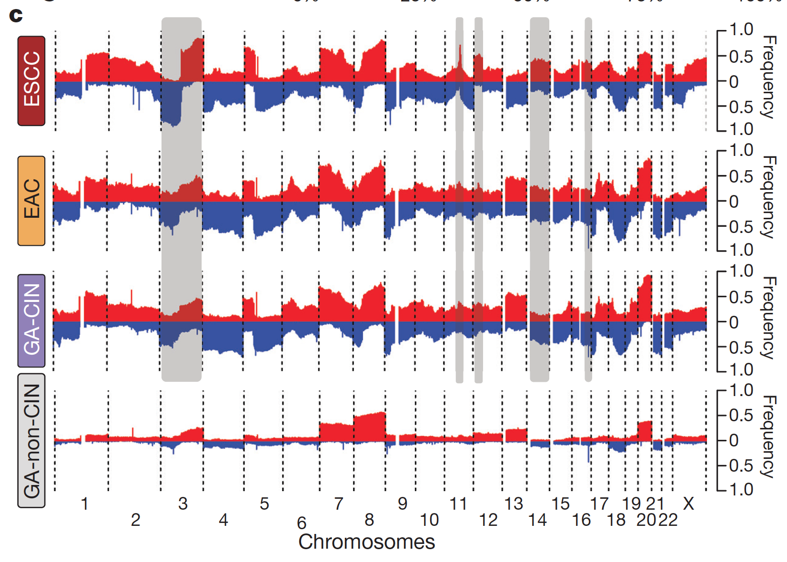
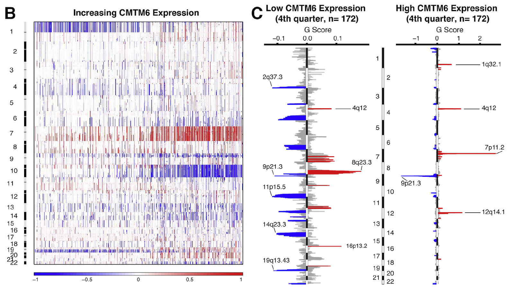

**Author(s)**: `r params$author`  
**Reviewer(s)**: `r params$reviewer`  
**Date**: `r Sys.Date()`  


```{r setup, include=FALSE}
knitr::opts_chunk$set(echo = TRUE)
# 设置knitr代码块的全局选项 / Set global options for knitr code chunks
```

## 需求描述

我要DIY出paper里的这种对比多个subtype的composite copy number profiles：

## Requirement description

I want to DIY composite copy number profiles for comparing multiple subtypes in the paper:



出自<https://www.nature.com/articles/nature20805>

from<https://www.nature.com/articles/nature20805>

GISTIC自带画图功能（见结尾“附二”），能画出类似于C这种图。从firehose能下载到TCGA各癌症的Segmented copy number profiles（类似于B）和Genomic positions of amplified regions（类似于C），但只有全部sample的图，我要对比不同subtype：

GISTIC comes with its own drawing function (see Appendix 2 at the end), which can draw images similar to C. I can download Segmented copy number profiles (similar to B) and Genomic positions of amplified regions (similar to C) for various cancers in TCGA from firehose, but only the images of all samples are available. I want to compare different subtypes:



出自<https://www.sciencedirect.com/science/article/pii/S2352396418302986?via%3Dihub>

From<https://www.sciencedirect.com/science/article/pii/S2352396418302986?via%3Dihub>

## 应用场景

此处提供的DIY画图方法更灵活，可以画gistic score，还可以画percentage/frequency。

可单独画一个sample，也可以对比多组subtypes。

## Application scenarios

The DIY drawing method provided here is more flexible, allowing you to draw Gistic scores and percentage/frequency.

You can draw a single sample or compare multiple subtypes.

## 环境设置

使用国内镜像安装包

## Environment settings

```{r}
source("install_dependencies.R")
# 加载人类基因组数据（hg19版本）
# Load the human genome data (hg19 version)
library(BSgenome.Hsapiens.UCSC.hg19)

# 设置环境变量，使R显示英文错误信息（便于查阅官方文档）
# Set environment variable to display English error messages for easier documentation lookup
Sys.setenv(LANGUAGE = "en") 

# 全局设置：禁止字符型数据自动转换为因子类型
# Global option: Prevent automatic conversion of character data to factors
options(stringsAsFactors = FALSE) 
```

## 输入文件的获得

画copy number profile需要gistic score和染色体信息，其中gistic score可以用GISTIC 2.0计算（输入segment file）。

如果你已经算出gistic scores，保存为“easy_input_*scores.gistic.txt”，就可以跳过这步，直接进入“准备染色体信息”。

## Obtaining input files

Drawing a copy number profile requires a Gistic score and chromosome information, where Gistic score can be calculated using GISTIC 2.0 (input segment file).

If you have already calculated the Gistic scores and saved them as' easy_input_ * scores. gitistic. txt ', you can skip this step and directly enter' Prepare Chromosome Information '.

### 获得subtype的gistic scores

下载全部样本的segment file，然后按subtype分开，用GISTIC 2.0计算gistic scores，然后用算出的gistic scores来画图。

### Obtain Gistic Scores for Subtypes

Download the segment files for all samples, then separate them by subtype, calculate the Gistic scores using GISTIC 2.0, and use the calculated Gistic scores to draw a graph.

#### 第一步，下载全部样本的segment file

focal_input.seg.txt：segment file。从[firehose](https://gdac.broadinstitute.org/)下载hg19版本的TCGA 数据，例文用 ESCA，压缩包链接：<http://gdac.broadinstitute.org/runs/analyses__2016_01_28/data/ESCA/20160128/gdac.broadinstitute.org_ESCA-TP.CopyNumber_Gistic2.Level_4.2016012800.0.0.tar.gz>。解压缩，点击nozzle.html，查看其他结果图表和Methods。需要里面的focal_input.seg.txt和scores.gistic（后面直接用它画全部样本的图）两个文件。

hg38版本（TCGA数据）segment的获取方法见“附一”。

#### Step one, download the segment files for all samples

focal_input.seg.txt：segment file。 From [firehose]（ https://gdac.broadinstitute.org/ ）Download the TCGA data of hg19 version, using ESCA as an example. The compressed file link is:< http://gdac.broadinstitute.org/runs/analyses__2016_01_28/data/ESCA/20160128/gdac.broadinstitute.org_ESCA-TP.CopyNumber_Gistic2.Level_4.2016012800.0.0.tar.gz >Extract the file, click on nozzle.exe to view other result charts and methods. We need two files inside, focal_input.seg.txt and scores.gitic (which can be used to draw the entire sample image later).

The method for obtaining segments in the hg38 version (TCGA data) is shown in Appendix 1.

```{r}
### segment information
# 读取CNV区段数据文件（分隔符为制表符，含表头，禁用字符串转因子）
# Read CNV segment data file (tab-separated, with header, disable string-to-factor conversion)
tumor.seg.cnv <- read.table("focal_input.seg.txt", sep="\t", header=T, stringsAsFactors=F)

# 从样本名称中移除批次相关后缀（例如：-01A-11D-...）
# Remove batch-related suffixes from sample names (e.g., -01A-11D-...)
tumor.seg.cnv$Sample <- gsub("-[0-9A-Z]*-[0-9A-Z]*-[0-9A-Z]*-01$", "", tumor.seg.cnv$Sample)
```

#### 第二步，拆分出subtype的segment file

从TCGA获得亚型的sample ID，然后把focal_input.seg.txt拆分成亚型的segment file

此处模仿例文，根据Histological.Type...Oesophagus和Gastric.classification分为四种subtype。实际操作时可根据每种癌症的具体情况选择合适的列来分亚型做对比。

#### Step 2, split the segment file of the subtype

Obtain the sample ID of the subtype from TCGA, and then split focal_input.seg.txt into segment files for the subtype

Here, imitating the example text, it is divided into four subtypes based on Histologically. Type... Oesophagus and Gastroc.classification. In practical operation, appropriate columns can be selected based on the specific situation of each cancer to classify subtypes for comparison.

```{r}
# 获取食管癌(ESCA)的分子亚型信息
# Retrieve molecular subtype information for esophageal cancer (ESCA)
library(TCGAbiolinks)  # 加载TCGAbiolinks包用于获取TCGA数据
# Load TCGAbiolinks package for accessing TCGA data
dataSub <- data.frame(TCGAquery_subtype(tumor = "ESCA"))  # 获取ESCA的亚型数据
# Fetch ESCA subtype data

# dataSub与补充表1内容一致，包含组织学类型和位置信息
# dataSub is identical to Supplementary Table 1, containing histological type and location information
table(dataSub$Histological.Type...Oesophagus)  # 统计不同组织学类型的样本数
# Count samples by histological type
table(dataSub$Tissue.level.Location)  # 统计不同组织位置的样本数
# Count samples by tissue location

# 提取不同分子亚型的患者ID
# Extract patient IDs for different molecular subtypes
EAC_id <- dataSub[dataSub$Histological.Type...Oesophagus=="EAC", "patient"]  # 食管腺癌患者ID
# Patient IDs for esophageal adenocarcinoma (EAC)
ESCC_id <- dataSub[dataSub$Histological.Type...Oesophagus=="ESCC", "patient"]  # 食管鳞癌患者ID
# Patient IDs for esophageal squamous cell carcinoma (ESCC)
GA <- dataSub[dataSub$Tissue.level.Location=="Gastric", ]  # 胃组织来源样本
# Samples from gastric tissue origin
table(GA$Gastric.classification)  # 统计胃组织样本的分类
# Count gastric tissue samples by classification
GA_CIN_id <- dataSub[dataSub$Gastric.classification=="CIN", "patient"]  # 胃CIN亚型患者ID
# Patient IDs for gastric CIN subtype
GA_nonCIN_id <- dataSub[dataSub$Gastric.classification!="CIN", "patient"]  # 胃非CIN亚型患者ID
# Patient IDs for gastric non-CIN subtype

# 获取不同分子亚型的CNV片段数据
# Retrieve CNV segment data for different molecular subtypes
EAC.seg.cnv <- tumor.seg.cnv[tumor.seg.cnv$Sample %in% EAC_id,]  # EAC患者的CNV片段
# CNV segments for EAC patients
ESCC.seg.cnv <- tumor.seg.cnv[tumor.seg.cnv$Sample %in% ESCC_id,]  # ESCC患者的CNV片段
# CNV segments for ESCC patients
GA_CIN.seg.cnv <- tumor.seg.cnv[tumor.seg.cnv$Sample %in% GA_CIN_id,]  # 胃CIN亚型患者的CNV片段
# CNV segments for gastric CIN subtype patients
GA_nonCIN.seg.cnv <- tumor.seg.cnv[tumor.seg.cnv$Sample %in% GA_nonCIN_id,]  # 胃非CIN亚型患者的CNV片段
# CNV segments for gastric non-CIN subtype patients

# 将不同亚型的CNV片段数据写入文本文件
# Write CNV segment data for different subtypes to text files
write.table(
  EAC.seg.cnv,                  # 要写入的数据 Data to write
  file="tumor.EAC.seg.txt",     # 输出文件名 Output file name
  sep="\t",                     # 分隔符 Tab separator
  row.names=F,                  # 不保留行名 Exclude row names
  quote = F                     # 不使用引号 Exclude quotes
)
write.table(ESCC.seg.cnv, file="tumor.ESCC.seg.txt", sep="\t", row.names=F, quote = F)  # ESCC亚型CNV数据
# ESCC subtype CNV data
write.table(GA_CIN.seg.cnv, file="tumor.GACIN.seg.txt", sep="\t", row.names=F, quote = F)  # 胃CIN亚型CNV数据
# Gastric CIN subtype CNV data
write.table(GA_nonCIN.seg.cnv, file="tumor.GAnonCIN.seg.txt", sep="\t", row.names=F, quote = F)  # 胃非CIN亚型CNV数据
# Gastric non-CIN subtype CNV data
```

#### 第三步，计算gistic score

**注：**segment file作为GISTIC 2.0的输入，用GISTIC 2.0计算gistic score的方法见“附二”。

计算将获得easy_input_*.scores.gistic.txt文件：

- easy_input_scores.gistic.txt：所有样品的gistic score，跟focal_input.seg.txt位于同一压缩包，原文件名为scores.gistic。
- easy_input_*.scores.gistic.txt：四种亚型的gistic score。

#### Step three, calculate the Gistic score

**Note: The segment file is used as input for GISTIC 2.0, and the method for calculating the GISTIC score using GISTIC 2.0 is shown in Appendix 2.

The calculation will obtain the easy_input_ *. scores.gistic.txt file:

-EasyInput_Scores.gistic.txt: The gistic scores of all samples are located in the same compressed file as focal_input.seg.txt, with the original file name being scores.gistic.
-Easy_input_ *. scores.gistic.txt: Gistic scores for four subtypes.

### 准备染色体信息

### Prepare chromosome information

```{r}
# 创建染色体参考对象的函数
# Function to create chromosome reference objects
chrom_extract <- function(BSgenome.hg  = NULL) {
  # 检查输入的基因组对象是否为空
  # Check if the input genome object is NULL
  if (is.null(BSgenome.hg )) stop("NULL object !", call. = FALSE)
  
  # 创建包含物种和基因组构建版本的列表
  # Create a list containing species and genome build information
  obj <- list(
    species = GenomeInfoDb::organism(BSgenome.hg),  # 物种信息
    # Species information
    genomebuild = BSgenome::providerVersion(BSgenome.hg)  # 基因组版本
    # Genome build version
  )
  
  # 创建染色体信息数据框
  # Create a dataframe with chromosome information
  df <- data.frame(
    chrom = BSgenome::seqnames(BSgenome.hg),  # 染色体名称
    # Chromosome names
    chrN = seq_along(BSgenome::seqnames(BSgenome.hg)),  # 染色体编号
    # Chromosome numbers
    chr.length = GenomeInfoDb::seqlengths(BSgenome.hg),  # 染色体长度
    # Chromosome lengths
    stringsAsFactors = FALSE
  )
  
  # 仅保留前24条染色体（1-22, X, Y）
  # Keep only the first 24 chromosomes (1-22, X, Y)
  df <- df[1:24,]
  
  # 计算染色体累积长度信息
  # Calculate cumulative chromosome lengths
  df$chr.length.sum <- cumsum(as.numeric(df$chr.length))  # 累积长度
  # Cumulative length
  df$chr.length.cumsum <- c(0, df$chr.length.sum[-nrow(df)])  # 前一个累积长度
  # Previous cumulative length
  
  # 计算染色体中点位置
  # Calculate midpoints of each chromosome
  df$middle.chr <- round(diff(c(0, df$chr.length.sum)) /2)  # 染色体内部中点
  # Midpoint within chromosome
  df$middle.chr.genome <- df$middle.chr + df$chr.length.cumsum  # 基因组中的中点位置
  # Midpoint position in the genome
  
  # 将染色体信息添加到对象中
  # Add chromosome information to the object
  obj$chromosomes <- df
  
  # 创建染色体名称与编号的映射关系
  # Create mappings between chromosome names and numbers
  obj$chrom2chr <- sapply(obj$chromosomes$chrom, function(k) { 
    obj$chromosomes$chrN[obj$chromosomes$chrom == k]
  }, simplify = FALSE)  # 染色体名称到编号的映射
  # Mapping from chromosome name to number
  
  obj$chr2chrom <- sapply(obj$chromosomes$chrN, function(k) { 
    obj$chromosomes$chrom[obj$chromosomes$chrN == k]
  }, simplify = FALSE)  # 染色体编号到名称的映射
  # Mapping from chromosome number to name
  
  # 设置映射的名称
  # Set names for the mappings
  names(obj$chr2chrom) <- obj$chromosomes$chrN
  
  # 计算基因组总长度
  # Calculate total genome length
  obj$genome.length <- sum(as.numeric(obj$chromosomes$chr.length), na.rm = TRUE)
  
  # 返回包含所有染色体信息的对象
  # Return the object containing all chromosome information
  return(obj)
}

# 提取染色体参考位点信息
# Extract chromosome reference loci information
BSgenome.hg = "BSgenome.Hsapiens.UCSC.hg19"  # 指定人类基因组hg19版本
# Specify human genome hg19 version
BSg.obj <- getExportedValue(BSgenome.hg, BSgenome.hg)  # 获取基因组对象
# Get the genome object
genome.version <- BSgenome::providerVersion(BSg.obj)  # 获取基因组版本信息
# Get genome version information
chrom <- chrom_extract(BSg.obj)  # 提取染色体信息
# Extract chromosome information
#str(chrom)  # 查看染色体信息结构（已注释掉）
# View the structure of chromosome information (commented out)
```

## 开始画图

分别画全部样本的gistic score和percentage/frequency，再画四个subtye对比的gistic score和percentage/frequency。

## Start drawing

Draw the Gistic score and percentage/frequency of all samples separately, and then draw the Gistic score and percentage/frequency of four subties for comparison.

### 画全部sample的gistic score

### Draw the Gistic Score for all samples

```{r, fig.width=8, fig.height=4}
#pdf("ESCA_copy_number_gistic_score.pdf",12,5)
# Import gistic2 results read gistic output file
scores <- read.table("easy_input_scores.gistic.txt", sep="\t",header=T,stringsAsFactors = F)
head(scores)
unique(scores$Chromosome)
#把染色体名从阿拉伯数字改为“chr1”、“chrX”的形式
scores[scores$Chromosome==23, "Chromosome"] <- "X"
scores[scores$Chromosome==24, "Chromosome"] <- "Y"
chrID <- unname(unlist(chrom$chrom2chr[as.character(paste0("chr",scores$Chromosome))]))

# Important step for accurate length to match back to continual chrom loci
scores$Start.geno <- scores$Start + chrom$chromosomes$chr.length.cumsum[chrID]
scores$End.geno <- scores$End + chrom$chromosomes$chr.length.cumsum[chrID]

# Prepare input data for ploting
scores.amp <- scores[scores$Type=="Amp",]
scores.amp$G.score <- scores.amp$G.score * 1
scores.del <- scores[scores$Type=="Del",]
scores.del$G.score <- scores.del$G.score * -1
scores <- rbind.data.frame(scores.amp,scores.del)

# seg.col = list(gain = "red", outscale.gain = "darkred", loss = "blue", outscale.red = "midnightblue")
ylim <- c(min(scores$G.score) - 0.1, max(scores$G.score) + 0.1)
title <- paste0("TCGA ESCA overall copy number gistic score", " ", "n=", length(dataSub$patient))

plot(scores.amp$Start.geno, scores.amp$G.score,
     pch = ".", type='h',cex = 2, xaxs = "i", yaxs = "i", 
     xlim = c(0,chrom$genome.length), ylim = ylim,
     main = title, cex.main = 2, ylab = "gistic score", xlab = NA,
     cex.lab = 2, col = adjustcolor("darkred", alpha.f = .8), xaxt = "n", lwd = 2, las=1) # las=1 rotating axis labels in R
lines(scores.del$Start.geno, scores.del$G.score, type='h', lwd = 2, col = adjustcolor("midnightblue", alpha.f = .8))
ink <- chrom$chromosomes$chrN %in% chrID
yrange = abs(diff(ylim))
m.pos <- c(ylim[1]+0.15,ylim[2]-0.15)
m.mod <- -(chrom$chromosomes$chrN[ink] %% 2) +2
try(text(x = chrom$chromosomes$middle.chr.geno[ink], y = m.pos[m.mod], labels = chrom$chromosomes$chrom[ink], cex = 1))
abline(h = 0.0, col = 1, lwd = 1, lty = 3)
abline(v = c(0,chrom$chromosomes$chr.length.sum), col = 1, lty = 3, lwd = 1)

col1 <- adjustcolor("darkred", alpha.f = .8)
col2 <- adjustcolor("midnightblue", alpha.f = .8)
# The position of the legend can be specified also using the following keywords : "bottomright", "bottom", "bottomleft", "left", "topleft", "top", "topright", "right" and "center".
legend("topleft", c("gain","loss"), cex=0.6, bty="n", fill=c(col1,col2))
#dev.off()
```

### 画全部样本的percentage/frequency

### Draw the percentage/frequency of all samples

```{r, fig.width=8, fig.height=4}
#pdf("ESCA_copy_number_gistic_score.pdf",12,5)  # 输出PDF（已注释）
# Output PDF (commented out)

# 导入GISTIC2结果数据
# Import GISTIC2 results data
scores <- read.table(
  "easy_input_scores.gistic.txt",  # GISTIC评分输入文件
  # Input file for GISTIC scores
  sep="\t",                        # 制表符分隔
  # Tab-separated
  header=T,                        # 包含表头
  # Include header
  stringsAsFactors = F             # 不将字符串转换为因子
  # Do not convert strings to factors
)
head(scores)  # 查看数据前几行
# View first few rows of data
unique(scores$Chromosome)  # 查看唯一的染色体值
# Check unique chromosome values

# 将染色体编号从阿拉伯数字转换为"chr1"、"chrX"格式
# Convert chromosome numbers to "chr1", "chrX" format
scores[scores$Chromosome==23, "Chromosome"] <- "X"  # 将23号染色体重命名为X
# Rename chromosome 23 to X
scores[scores$Chromosome==24, "Chromosome"] <- "Y"  # 将24号染色体重命名为Y
# Rename chromosome 24 to Y

# 将染色体名称映射为内部编号
# Map chromosome names to internal IDs
chrID <- unname(unlist(chrom$chrom2chr[as.character(paste0("chr", scores$Chromosome))]))

# 关键步骤：将坐标转换为基因组连续位置
# Important step: Convert coordinates to continuous genomic positions
scores$Start.geno <- scores$Start + chrom$chromosomes$chr.length.cumsum[chrID]  # 起始位置转换
# Convert start positions
scores$End.geno <- scores$End + chrom$chromosomes$chr.length.cumsum[chrID]      # 终止位置转换
# Convert end positions

# 准备绘图数据
# Prepare data for plotting
scores.amp <- scores[scores$Type=="Amp",]  # 提取扩增数据
# Extract amplification data
scores.amp$G.score <- scores.amp$G.score * 1  # 正向评分（保持正值）
# Positive scores (maintain positive values)
scores.del <- scores[scores$Type=="Del",]  # 提取缺失数据
# Extract deletion data
scores.del$G.score <- scores.del$G.score * -1  # 负向评分（转换为负值）
# Negative scores (convert to negative values)
scores <- rbind.data.frame(scores.amp, scores.del)  # 合并数据
# Combine data

# 设置颜色方案
# Set color scheme
# seg.col = list(gain = "red", outscale.gain = "darkred", loss = "blue", outscale.red = "midnightblue")

# 设置Y轴范围
# Set Y-axis range
ylim <- c(min(scores$G.score) - 0.1, max(scores$G.score) + 0.1)

# 设置标题
# Set plot title
title <- paste0("TCGA ESCA overall copy number gistic score", " ", "n=", length(dataSub$patient))

# 绘制扩增数据（红色垂线）
# Plot amplifications (red vertical lines)
plot(
  scores.amp$Start.geno,  # X轴：基因组起始位置
  # X-axis: Genomic start positions
  scores.amp$G.score,     # Y轴：GISTIC评分
  # Y-axis: GISTIC scores
  pch = ".",              # 点形状（像素点）
  # Point shape (pixel dot)
  type='h',               # 绘制垂线
  # Plot vertical lines
  cex = 2,                # 点大小
  # Point size
  xaxs = "i",             # X轴范围严格按照数据
  # X-axis range exactly matches data
  yaxs = "i",             # Y轴范围严格按照数据
  # Y-axis range exactly matches data
  xlim = c(0, chrom$genome.length),  # X轴范围：基因组全长
  # X-axis range: Full genome length
  ylim = ylim,            # Y轴范围
  # Y-axis range
  main = title,           # 标题
  # Plot title
  cex.main = 2,           # 标题大小
  # Title size
  ylab = "gistic score",  # Y轴标签
  # Y-axis label
  xlab = NA,              # 不显示X轴标签
  # No X-axis label
  cex.lab = 2,            # 标签大小
  # Label size
  col = adjustcolor("darkred", alpha.f = .8),  # 颜色（半透明深红色）
  # Color (semi-transparent dark red)
  xaxt = "n",             # 不显示X轴刻度
  # No X-axis tick marks
  lwd = 2,                # 线宽
  # Line width
  las=1                   # Y轴标签水平显示
  # Y-axis labels horizontal
)

# 添加缺失数据（蓝色垂线）
# Add deletions (blue vertical lines)
lines(
  scores.del$Start.geno,  # X轴：基因组起始位置
  # X-axis: Genomic start positions
  scores.del$G.score,     # Y轴：GISTIC评分（负值）
  # Y-axis: GISTIC scores (negative values)
  type='h',               # 绘制垂线
  # Plot vertical lines
  lwd = 2,                # 线宽
  # Line width
  col = adjustcolor("midnightblue", alpha.f = .8)  # 颜色（半透明深蓝色）
  # Color (semi-transparent midnight blue)
)

# 标记染色体位置
# Mark chromosome positions
ink <- chrom$chromosomes$chrN %in% chrID  # 检查染色体是否存在
# Check if chromosome exists
yrange = abs(diff(ylim))  # Y轴范围
# Y-axis range
m.pos <- c(ylim[1]+0.15, ylim[2]-0.15)  # 标记位置
# Label positions
m.mod <- -(chrom$chromosomes$chrN[ink] %% 2) +2  # 交替位置
# Alternating positions
try(text(
  x = chrom$chromosomes$middle.chr.geno[ink],  # X坐标：染色体中点
  # X-coordinates: Chromosome midpoints
  y = m.pos[m.mod],                             # Y坐标：交替位置
  # Y-coordinates: Alternating positions
  labels = chrom$chromosomes$chrom[ink],        # 标签：染色体名称
  # Labels: Chromosome names
  cex = 1                                       # 字体大小
  # Font size
))

# 添加参考线
# Add reference lines
abline(h = 0.0, col = 1, lwd = 1, lty = 3)  # 水平参考线（y=0）
# Horizontal reference line (y=0)
abline(v = c(0, chrom$chromosomes$chr.length.sum), col = 1, lty = 3, lwd = 1)  # 染色体边界垂直线
# Vertical lines at chromosome boundaries

# 设置颜色
# Set colors
col1 <- adjustcolor("darkred", alpha.f = .8)  # 扩增颜色
# Amplification color
col2 <- adjustcolor("midnightblue", alpha.f = .8)  # 缺失颜色
# Deletion color

# 添加图例
# Add legend
# 图例位置可以使用以下关键字指定："bottomright", "bottom", "bottomleft", "left", "topleft", "top", "topright", "right" and "center"
# Legend position can be specified using keywords: "bottomright", "bottom", "bottomleft", "left", "topleft", "top", "topright", "right", "center"
legend(
  "topleft",              # 图例位置：左上角
  # Legend position: Top-left
  c("gain", "loss"),      # 图例标签
  # Legend labels
  cex=0.6,                # 字体大小
  # Font size
  bty="n",                # 无边框
  # No border
  fill=c(col1, col2)      # 填充颜色
  # Fill colors
)

#dev.off()  # 关闭PDF设备（已注释）
# Close PDF device (commented out)
```

### 画四个subtype对比的gistic score

### Draw a Gistic Score Comparing Four Subtypes

```{r}
# 创建PDF文件，设置宽度15英寸、高度12英寸
# Create PDF file with specified width and height
pdf("cnv.scores.gistic.pdf", 15, 12)

# 设置绘图布局为4行1列，调整边距（上、右、下、左各增加3个单位）
# Set plot layout to 4 rows and 1 column, adjust margins (add 3 units to top, right, bottom, left)
par(mfrow=c(4,1), mar = par()$mar + c(3,0,0,3))


### ESCC亚型分析 ###
### ESCC subtype analysis ###

# 读取ESCC的GISTIC评分数据（制表符分隔，含表头）
# Read GISTIC score data for ESCC (tab-separated, with header)
scores <- read.table(
  "easy_input_ESCC.scores.gistic.txt",  # 输入文件路径
  # Input file path
  sep="\t",                             # 分隔符：制表符
  # Separator: tab
  header=T,                             # 包含表头
  # Include header row
  stringsAsFactors = F                  # 不将字符串转换为因子
  # Do not convert strings to factors
)

# 关键步骤：标准化染色体编号并映射到基因组坐标
# Important step: Standardize chromosome numbers and map to genomic coordinates
scores[scores$Chromosome==23, "Chromosome"] <- "X"  # 将23号染色体重命名为X
# Rename chromosome 23 to X
scores[scores$Chromosome==24, "Chromosome"] <- "Y"  # 将24号染色体重命名为Y
# Rename chromosome 24 to Y
chrID <- unname(unlist(chrom$chrom2chr[as.character(paste0("chr", scores$Chromosome))]))  # 获取染色体内部索引
# Get internal chromosome indices
scores$Start.geno <- scores$Start + chrom$chromosomes$chr.length.cumsum[chrID]  # 转换起始位置为全基因组坐标
# Convert start positions to genome-wide coordinates
scores$End.geno <- scores$End + chrom$chromosomes$chr.length.cumsum[chrID]      # 转换终止位置为全基因组坐标
# Convert end positions to genome-wide coordinates

# 准备绘图数据：分离扩增和缺失数据，设置正负评分方向
# Prepare plotting data: Separate amplifications and deletions, set positive/negative directions
scores.amp <- scores[scores$Type=="Amp", ]  # 提取扩增数据
# Extract amplification data
scores.amp$G.score <- scores.amp$G.score * 1  # 保持正向评分
# Maintain positive scores
scores.del <- scores[scores$Type=="Del", ]  # 提取缺失数据
# Extract deletion data
scores.del$G.score <- scores.del$G.score * -1  # 转换为负向评分
# Convert to negative scores
scores <- rbind.data.frame(scores.amp, scores.del)  # 合并数据
# Combine data

# 设置Y轴范围（扩展上下限0.1以避免数据贴近边界）
# Set Y-axis range (extend 0.1 from min/max to avoid data clipping)
ylim <- c(min(scores$G.score) - 0.1, max(scores$G.score) + 0.1)
# 生成标题（包含样本数）
# Generate title (including sample count)
title <- paste0("ESCC copy number gistic score", " ", "n=", length(ESCC_id))

# 绘制ESCC拷贝数变异图（红色为扩增，蓝色为缺失）
# Plot ESCC copy number variations (red for amplification, blue for deletion)
plot(
  scores.amp$Start.geno,       # X轴：基因组起始位置
  # X-axis: Genomic start positions
  scores.amp$G.score,          # Y轴：GISTIC评分（正值）
  # Y-axis: GISTIC scores (positive values)
  pch = ".",                   # 点形状：像素点
  # Point shape: pixel
  type='h',                    # 绘图类型：垂直线
  # Plot type: vertical lines
  cex = 2,                     # 点大小
  # Point size
  xaxs = "i",                  # X轴范围：严格匹配数据
  # X-axis range: strictly match data
  yaxs = "i",                  # Y轴范围：严格匹配数据
  # Y-axis range: strictly match data
  xlim = c(0, chrom$genome.length),  # X轴范围：全基因组长度
  # X-axis range: full genome length
  ylim = ylim,                 # Y轴范围
  # Y-axis range
  main = title,                # 主标题
  # Main title
  cex.main = 2,                # 标题字体大小
  # Title font size
  ylab = "gistic score",       # Y轴标签
  # Y-axis label
  xlab = NA,                   # 不显示X轴标签
  # No X-axis label
  cex.lab = 2,                 # 标签字体大小
  # Label font size
  col = adjustcolor("darkred", alpha.f = .8),  # 颜色：半透明深红色
  # Color: semi-transparent dark red
  xaxt = "n",                  # 不显示X轴刻度
  # No X-axis ticks
  lwd = 2,                     # 线宽
  # Line width
  las=1                        # Y轴标签水平显示
  # Y-axis labels horizontal
)
# 添加缺失数据（蓝色垂线）
# Add deletions (blue vertical lines)
lines(
  scores.del$Start.geno,       # X轴：缺失起始位置
  # X-axis: deletion start positions
  scores.del$G.score,          # Y轴：GISTIC评分（负值）
  # Y-axis: GISTIC scores (negative values)
  type='h',                    # 绘图类型：垂直线
  # Plot type: vertical lines
  lwd = 2,                     # 线宽
  # Line width
  col = adjustcolor("midnightblue", alpha.f = .8)  # 颜色：半透明深蓝色
  # Color: semi-transparent midnight blue
)

# 标记染色体位置（在染色体中点显示名称）
# Mark chromosome positions (display names at chromosome midpoints)
ink <- chrom$chromosomes$chrN %in% chrID  # 筛选存在的染色体
# Filter existing chromosomes
yrange <- abs(diff(ylim))  # Y轴范围差值
# Y-axis range difference
m.pos <- c(ylim[1] + 0.05, ylim[2] - 0.05)  # 标签Y坐标（上下交替）
# Label Y-coordinates (alternating top and bottom)
m.mod <- -(chrom$chromosomes$chrN[ink] %% 2) + 2  # 计算交替位置索引
# Calculate alternating position index
try(text(
  x = chrom$chromosomes$middle.chr.geno[ink],  # X坐标：染色体中点基因组位置
  # X-coordinates: chromosome midpoint genomic positions
  y = m.pos[m.mod],                            # Y坐标：交替位置
  # Y-coordinates: alternating positions
  labels = chrom$chromosomes$chrom[ink],       # 标签：染色体名称
  # Labels: chromosome names
  cex = 1                                      # 字体大小
  # Font size
))

# 添加参考线（水平中线和染色体边界）
# Add reference lines (horizontal midline and chromosome boundaries)
abline(h = 0.0, col = 1, lwd = 1, lty = 3)  # 水平参考线（y=0）
# Horizontal reference line (y=0)
abline(v = c(0, chrom$chromosomes$chr.length.sum), col = 1, lty = 3, lwd = 1)  # 染色体边界垂直线
# Vertical lines at chromosome boundaries

# 添加图例（左上角，无背景框）
# Add legend (top-left corner, no background box)
col1 <- adjustcolor("darkred", alpha.f = .8)  # 扩增颜色
# Amplification color
col2 <- adjustcolor("midnightblue", alpha.f = .8)  # 缺失颜色
# Deletion color
legend(
  "topleft",              # 图例位置：左上角
  # Legend position: top-left
  c("gain", "loss"),      # 图例标签
  # Legend labels
  cex=0.6,                # 字体大小
  # Font size
  bty="n",                # 无边框
  # No border
  fill=c(col1, col2)      # 填充颜色
  # Fill colors
)


### EAC亚型分析（与ESCC类似，注意评分缩放100倍）###
### EAC subtype analysis (similar to ESCC, note score scaling by 100) ###

scores <- read.table("easy_input_EAC.scores.gistic.txt", sep="\t", header=T, stringsAsFactors = F)
# 读取EAC的GISTIC评分数据
# Read GISTIC score data for EAC

# 染色体编号转换和基因组坐标映射（同上）
# Chromosome number conversion and genomic coordinate mapping (same as above)
scores[scores$Chromosome==23, "Chromosome"] <- "X"
scores[scores$Chromosome==24, "Chromosome"] <- "Y"
chrID <- unname(unlist(chrom$chrom2chr[as.character(paste0("chr", scores$Chromosome))]))
scores$Start.geno <- scores$Start + chrom$chromosomes$chr.length.cumsum[chrID]
scores$End.geno <- scores$End + chrom$chromosomes$chr.length.cumsum[chrID]

# 数据准备（评分缩放100倍，Y轴标签改为"Frequency"）
# Data preparation (scores scaled by 100, Y-axis label changed to "Frequency")
scores.amp <- scores[scores$Type=="Amp", ]
scores.amp$G.score <- scores.amp$G.score * 100  # 扩增评分×100
# Amplification scores ×100
scores.del <- scores[scores$Type=="Del", ]
scores.del$G.score <- scores.del$G.score * -100  # 缺失评分×-100
# Deletion scores ×-100
scores <- rbind.data.frame(scores.amp, scores.del)

ylim <- c(min(scores$G.score) - 0.1, max(scores$G.score) + 0.1)
title <- paste0("EAC copy number gistic score", " ", "n=", length(EAC_id))

plot(
  scores.amp$Start.geno, 
  scores.amp$G.score,
  pch = ".", type='h', cex = 2, xaxs = "i", yaxs = "i", 
  xlim = c(0, chrom$genome.length), ylim = ylim,
  main = title, cex.main = 2, ylab = "Frequency", xlab = NA,  # Y轴标签改为"频率"
  # Y-axis label changed to "Frequency"
  cex.lab = 2, col = adjustcolor("darkred", alpha.f = .8), xaxt = "n", lwd = 2, las=1
)
lines(scores.del$Start.geno, scores.del$G.score, type='h', lwd = 2, col = adjustcolor("midnightblue", alpha.f = .8))

# 染色体标记和参考线（同上）
# Chromosome marking and reference lines (same as above)
ink <- chrom$chromosomes$chrN %in% chrID
yrange = abs(diff(ylim))
m.pos <- c(ylim[1] + 10, ylim[2] - 10)  # 调整标签位置适应缩放后的评分
# Adjust label positions for scaled scores
m.mod <- -(chrom$chromosomes$chrN[ink] %% 2) + 2
try(text(x = chrom$chromosomes$middle.chr.geno[ink], y = m.pos[m.mod], labels = chrom$chromosomes$chrom[ink], cex = 1))
abline(h = 0.0, col = 1, lwd = 1, lty = 3)
abline(v = c(0, chrom$chromosomes$chr.length.sum), col = 1, lty = 3, lwd = 1)

# 图例（同上）
# Legend (same as above)
col1 <- adjustcolor("darkred", alpha.f = .8)
col2 <- adjustcolor("midnightblue", alpha.f = .8)
legend("topleft", c("gain", "loss"), cex=0.6, bty="n", fill=c(col1, col2))


### GA_CIN亚型分析 ###
### GA_CIN subtype analysis ###

scores <- read.table("easy_input_GA_CIN.scores.gistic.txt", sep="\t", header=T, stringsAsFactors = F)
# 读取GA_CIN的GISTIC评分数据
# Read GISTIC score data for GA_CIN

# 染色体编号转换和基因组坐标映射（同上）
# Chromosome number conversion and genomic coordinate mapping (same as above)
scores[scores$Chromosome==23, "Chromosome"] <- "X"
scores[scores$Chromosome==24, "Chromosome"] <- "Y"
chrID <- unname(unlist(chrom$chrom2chr[as.character(paste0("chr", scores$Chromosome))]))
scores$Start.geno <- scores$Start + chrom$chromosomes$chr.length.cumsum[chrID]
scores$End.geno <- scores$End + chrom$chromosomes$chr.length.cumsum[chrID]

# 数据准备（同ESCC）
# Data preparation (same as ESCC)
scores.amp <- scores[scores$Type=="Amp", ]
scores.amp$G.score <- scores.amp$G.score * 1
scores.del <- scores[scores$Type=="Del", ]
scores.del$G.score <- scores.del$G.score * -1
scores <- rbind.data.frame(scores.amp, scores.del)

ylim <- c(min(scores$G.score) - 0.1, max(scores$G.score) + 0.1)
title <- paste0("GA_CIN copy number gistic score", " ", "n=", length(GA_CIN_id))

plot(
  scores.amp$Start.geno, 
  scores.amp$G.score,
  pch = ".", type='h', cex = 2, xaxs = "i", yaxs = "i", 
  xlim = c(0, chrom$genome.length), ylim = ylim,
  main = title, cex.main = 2, ylab = "gistic score", xlab = NA,
  cex.lab = 2, col = adjustcolor("darkred", alpha.f = .8), xaxt = "n", lwd = 2, las=1
)
lines(scores.del$Start.geno, scores.del$G.score, type='h', lwd = 2, col = adjustcolor("midnightblue", alpha.f = .8))

# 染色体标记和参考线（同上）
# Chromosome marking and reference lines (same as above)
ink <- chrom$chromosomes$chrN %in% chrID
yrange = abs(diff(ylim))
m.pos <- c(ylim[1] + 0.05, ylim[2] - 0.05)
m.mod <- -(chrom$chromosomes$chrN[ink] %% 2) + 2
try(text(x = chrom$chromosomes$middle.chr.geno[ink], y = m.pos[m.mod], labels = chrom$chromosomes$chrom[ink], cex = 1))
abline(h = 0.0, col = 1, lwd = 1, lty = 3)
abline(v = c(0, chrom$chromosomes$chr.length.sum), col = 1, lty = 3, lwd = 1)

# 图例（同上）
# Legend (same as above)
col1 <- adjustcolor("darkred", alpha.f = .8)
col2 <- adjustcolor("midnightblue", alpha.f = .8)
legend("topleft", c("gain", "loss"), cex=0.6, bty="n", fill=c(col1, col2))


### GA_nonCIN亚型分析 ###
### GA_nonCIN subtype analysis ###

scores <- read.table("easy_input_GA_nonCIN.scores.gistic.txt", sep="\t", header=T, stringsAsFactors = F)
# 读取GA_nonCIN的GISTIC评分数据
# Read GISTIC score data for GA_nonCIN

# 染色体编号转换和基因组坐标映射（同上）
# Chromosome number conversion and genomic coordinate mapping (same as above)
scores[scores$Chromosome==23, "Chromosome"] <- "X"
scores[scores$Chromosome==24, "Chromosome"] <- "Y"
chrID <- unname(unlist(chrom$chrom2chr[as.character(paste0("chr", scores$Chromosome))]))
scores$Start.geno <- scores$Start + chrom$chromosomes$chr.length.cumsum[chrID]
scores$End.geno <- scores$End + chrom$chromosomes$chr.length.cumsum[chrID]

# 准备绘图数据
# Prepare data for plotting
scores.amp <- scores[scores$Type=="Amp",]  # 筛选扩增区域数据
# Filter amplification regions
scores.amp$G.score <- scores.amp$G.score * 1  # 扩增评分保持正值（乘以1）
# Keep amplification scores positive
scores.del <- scores[scores$Type=="Del",]  # 筛选缺失区域数据
# Filter deletion regions
scores.del$G.score <- scores.del$G.score * -1  # 缺失评分转为负值
# Convert deletion scores to negative values
scores <- rbind.data.frame(scores.amp,scores.del)  # 合并扩增和缺失数据
# Combine amplification and deletion data

# 设置颜色方案（未使用的代码，但定义了颜色映射）
# Color scheme definition (commented out, not used in current code)
# seg.col = list(gain = "red", outscale.gain = "darkred", loss = "blue", outscale.red = "midnightblue")

# 设置Y轴范围（在最小值和最大值基础上各扩展0.1）
# Set Y-axis limits with a small buffer
ylim <- c(min(scores$G.score)-0.1,max(scores$G.score)+0.1)
# 生成图表标题，包含样本类型和数量
# Generate plot title with sample type and count
title=paste0("GA_nonCIN copy number gistic score"," ","n=",length(GA_nonCIN_id))

# 绘制扩增区域的GISTIC评分
# Plot GISTIC scores for amplifications
plot(scores.amp$Start.geno, scores.amp$G.score,
     pch = ".", type='h', cex = 2, xaxs = "i", yaxs = "i",  # 设置点形状、绘图类型和坐标轴范围
     # Set point character, plot type, and axis ranges
     xlim = c(0,chrom$genome.length), ylim = ylim,  # X轴为全基因组范围，Y轴为评分范围
     # X-axis spans the entire genome, Y-axis based on score range
     main = title, cex.main = 2,  # 设置主标题及字体大小
     # Set main title and font size
     ylab = "gistic score", xlab = NA,  # Y轴标签为GISTIC评分，不显示X轴标签
     # Y-axis label is GISTIC score, hide X-axis label
     cex.lab = 2,  # 设置标签字体大小
     # Set label font size
     col = adjustcolor("darkred", alpha.f = .8),  # 扩增区域用半透明深红色表示
     # Use semi-transparent dark red for amplifications
     xaxt = "n",  # 不显示默认X轴刻度
     # Suppress default X-axis ticks
     lwd = 2,  # 设置线宽
     # Set line width
     las=1  # Y轴标签水平显示
     # Make Y-axis labels horizontal
)
# 添加缺失区域的GISTIC评分（负值）
# Add GISTIC scores for deletions (negative values)
lines(scores.del$Start.geno, scores.del$G.score, 
      type='h', lwd = 2, col = adjustcolor("midnightblue", alpha.f = .8))  # 缺失区域用半透明深蓝色表示
      # Use semi-transparent midnight blue for deletions

# 在染色体中部添加染色体标签
# Add chromosome labels at the midpoint of each chromosome
ink <- chrom$chromosomes$chrN %in% chrID  # 筛选存在数据的染色体
# Filter chromosomes with data
yrange = abs(diff(ylim))  # 计算Y轴范围
# Calculate Y-axis range
m.pos <- c(ylim[1]+0.05,ylim[2]-0.05)  # 设置标签Y坐标位置（上下交替）
# Set label positions (alternating top and bottom)
m.mod <- -(chrom$chromosomes$chrN[ink] %% 2) +2  # 计算染色体标签位置的索引
# Calculate indices for alternating label positions
try(text(x = chrom$chromosomes$middle.chr.geno[ink],  # X坐标为染色体中部位置
         # X-coordinates at chromosome midpoints
         y = m.pos[m.mod],  # Y坐标为上方或下方（交替）
         # Y-coordinates alternating between top and bottom
         labels = chrom$chromosomes$chrom[ink],  # 标签为染色体名称
         # Labels are chromosome names
         cex = 1))  # 设置字体大小

# 添加参考线
# Add reference lines
abline(h = 0.0, col = 1, lwd = 1, lty = 3)  # 添加y=0的水平参考线（虚线）
# Add horizontal reference line at y=0 (dashed line)
abline(v = c(0,chrom$chromosomes$chr.length.sum), col = 1, lty = 3, lwd = 1)  # 添加染色体边界垂直线
# Add vertical lines at chromosome boundaries

# 设置图例颜色
# Set legend colors
col1 <- adjustcolor("darkred", alpha.f = .8)  # 扩增颜色
# Color for amplifications
col2 <- adjustcolor("midnightblue", alpha.f = .8)  # 缺失颜色
# Color for deletions

# 图例位置可以使用以下关键字指定："bottomright", "bottom", "bottomleft", "left", "topleft", "top", "topright", "right" and "center"
# Legend position can be specified using keywords: "bottomright", "bottom", "bottomleft", "left", "topleft", "top", "topright", "right", "center"

# 添加图例（左上角，无边框，显示扩增和缺失的颜色）
# Add legend (top-left corner, no border, showing colors for gains and losses)
legend("topleft", c("gain","loss"), cex=0.6, bty="n", fill=c(col1,col2))

# 关闭图形设备，完成PDF绘制
# Close the graphics device to finalize the PDF
dev.off()
```


### 四种subtype的percentage/frequence

### Percentage/frequency of four subtypes

```{r}
# 创建PDF文件，设置宽度15英寸、高度12英寸
# Create PDF file with specified width and height
pdf("cnv.frequence.pdf", 15, 12)

# 设置绘图布局为4行1列，调整边距
# Set plot layout to 4 rows and 1 column, adjust margins
par(mfrow=c(4,1), mar = par()$mar + c(3,0,0,3))


### ESCC亚型分析 ###
### ESCC subtype analysis ###

# 读取ESCC的GISTIC评分数据
# Read GISTIC score data for ESCC
scores <- read.table(
  "easy_input_ESCC.scores.gistic.txt",  # 输入文件路径
  # Input file path
  sep="\t",                             # 分隔符为制表符
  # Tab separator
  header=T,                             # 包含表头
  # Include header row
  stringsAsFactors = F                  # 不将字符串转换为因子
  # Do not convert strings to factors
)

# 关键步骤：转换染色体编号为标准格式并映射到基因组坐标
# Important step: Convert chromosome numbers to standard format and map to genomic coordinates
scores[scores$Chromosome==23, "Chromosome"] <- "X"  # 将23号染色体重命名为X
# Rename chromosome 23 to X
scores[scores$Chromosome==24, "Chromosome"] <- "Y"  # 将24号染色体重命名为Y
# Rename chromosome 24 to Y
chrID <- unname(unlist(chrom$chrom2chr[as.character(paste0("chr", scores$Chromosome))]))  # 获取染色体内部编号
# Get internal chromosome IDs
scores$Start.geno <- scores$Start + chrom$chromosomes$chr.length.cumsum[chrID]  # 转换起始位置为基因组坐标
# Convert start positions to genomic coordinates
scores$End.geno <- scores$End + chrom$chromosomes$chr.length.cumsum[chrID]      # 转换终止位置为基因组坐标
# Convert end positions to genomic coordinates

# 准备绘图数据：分离扩增和缺失数据，并将频率转换为百分比
# Prepare plotting data: Separate amplification and deletion data, convert frequency to percentage
scores.amp <- scores[scores$Type=="Amp", ]  # 提取扩增数据
# Extract amplification data
scores.amp$frequency <- scores.amp$frequency * 100  # 扩增频率转换为百分比（正值）
# Convert amplification frequency to percentage (positive values)
scores.del <- scores[scores$Type=="Del", ]  # 提取缺失数据
# Extract deletion data
scores.del$frequency <- scores.del$frequency * -100  # 缺失频率转换为负百分比
# Convert deletion frequency to negative percentage
scores <- rbind.data.frame(scores.amp, scores.del)  # 合并数据
# Combine data

# 设置Y轴范围和标题
# Set Y-axis range and plot title
ylim <- c(min(scores$frequency) - 0.1, max(scores$frequency) + 0.1)  # 扩展Y轴范围
# Expand Y-axis range
title <- paste0("ESCC, n=", length(ESCC_id))  # 标题包含样本数
# Title including sample count

# 绘制ESCC拷贝数变异频率图
# Plot ESCC copy number variation frequency
plot(
  scores.amp$Start.geno,       # X轴：基因组起始位置
  # X-axis: Genomic start positions
  scores.amp$frequency,        # Y轴：扩增频率百分比
  # Y-axis: Amplification frequency percentage
  pch = ".",                   # 点形状为像素点
  # Point shape as pixel
  type='h',                    # 绘制垂直线
  # Plot vertical lines
  cex = 2,                     # 点大小
  # Point size
  xaxs = "i",                  # X轴范围严格匹配数据
  # X-axis range strictly match data
  yaxs = "i",                  # Y轴范围严格匹配数据
  # Y-axis range strictly match data
  xlim = c(0, chrom$genome.length),  # X轴范围：整个基因组长度
  # X-axis range: Full genome length
  ylim = ylim,                 # Y轴范围
  # Y-axis range
  main = title,                # 主标题
  # Main title
  cex.main = 2,                # 标题字体大小
  # Title font size
  ylab = "Frequency",          # Y轴标签：频率
  # Y-axis label: Frequency
  xlab = NA,                   # 不显示X轴标签
  # No X-axis label
  cex.lab = 2,                 # 标签字体大小
  # Label font size
  col = adjustcolor("darkred", alpha.f = .8),  # 颜色：半透明深红色（扩增）
  # Color: Semi-transparent dark red (amplification)
  xaxt = "n",                  # 不显示X轴刻度
  # No X-axis ticks
  lwd = 2,                     # 线宽
  # Line width
  las=1                        # Y轴标签水平显示
  # Y-axis labels horizontal
)
lines(
  scores.del$Start.geno,       # X轴：缺失数据起始位置
  # X-axis: Deletion start positions
  scores.del$frequency,        # Y轴：缺失频率百分比（负值）
  # Y-axis: Deletion frequency percentage (negative values)
  type='h',                    # 绘制垂直线
  # Plot vertical lines
  lwd = 2,                     # 线宽
  # Line width
  col = adjustcolor("midnightblue", alpha.f = .8)  # 颜色：半透明深蓝色（缺失）
  # Color: Semi-transparent midnight blue (deletion)
)

# 标记染色体位置
# Mark chromosome positions
ink <- chrom$chromosomes$chrN %in% chrID  # 筛选存在的染色体
# Filter existing chromosomes
yrange <- abs(diff(ylim))  # Y轴范围差值
# Y-axis range difference
m.pos <- c(ylim[1] + 10, ylim[2] - 10)  # 标签Y坐标（上下交替）
# Label Y-coordinates (alternating top and bottom)
m.mod <- -(chrom$chromosomes$chrN[ink] %% 2) + 2  # 计算交替位置索引
# Calculate alternating position index
try(text(
  x = chrom$chromosomes$middle.chr.geno[ink],  # X坐标：染色体中点基因组位置
  # X-coordinates: Chromosome midpoint genomic positions
  y = m.pos[m.mod],                            # Y坐标：交替位置
  # Y-coordinates: Alternating positions
  labels = chrom$chromosomes$chrom[ink],       # 标签：染色体名称
  # Labels: Chromosome names
  cex = 1                                      # 字体大小
  # Font size
))

# 添加参考线
# Add reference lines
abline(h = 0.0, col = 1, lwd = 1, lty = 3)  # 水平参考线（y=0）
# Horizontal reference line (y=0)
abline(v = c(0, chrom$chromosomes$chr.length.sum), col = 1, lty = 3, lwd = 1)  # 染色体边界垂直线
# Vertical lines at chromosome boundaries

# 添加图例
# Add legend
col1 <- adjustcolor("darkred", alpha.f = .8)  # 扩增颜色
# Amplification color
col2 <- adjustcolor("midnightblue", alpha.f = .8)  # 缺失颜色
# Deletion color
legend(
  "topleft",              # 图例位置：左上角
  # Legend position: Top-left
  c("gain", "loss"),      # 图例标签
  # Legend labels
  cex=0.6,                # 字体大小
  # Font size
  bty="n",                # 无边框
  # No border
  fill=c(col1, col2)      # 填充颜色
  # Fill colors
)


### EAC亚型分析 ###
### EAC subtype analysis ###

# 读取EAC的GISTIC评分数据（后续步骤与ESCC类似）
# Read GISTIC score data for EAC (subsequent steps similar to ESCC)
scores <- read.table("easy_input_EAC.scores.gistic.txt", sep="\t", header=T, stringsAsFactors = F)

# 染色体编号转换和基因组坐标映射
# Chromosome number conversion and genomic coordinate mapping
scores[scores$Chromosome==23, "Chromosome"] <- "X"
scores[scores$Chromosome==24, "Chromosome"] <- "Y"
chrID <- unname(unlist(chrom$chrom2chr[as.character(paste0("chr", scores$Chromosome))]))
scores$Start.geno <- scores$Start + chrom$chromosomes$chr.length.cumsum[chrID]
scores$End.geno <- scores$End + chrom$chromosomes$chr.length.cumsum[chrID]

# 数据准备：频率转换为百分比
# Data preparation: Convert frequency to percentage
scores.amp <- scores[scores$Type=="Amp", ]
scores.amp$frequency <- scores.amp$frequency * 100
scores.del <- scores[scores$Type=="Del", ]
scores.del$frequency <- scores.del$frequency * -100
scores <- rbind.data.frame(scores.amp, scores.del)

# 设置Y轴范围和标题
# Set Y-axis range and title
ylim <- c(min(scores$frequency) - 0.1, max(scores$frequency) + 0.1)
title <- paste0("EAC, n=", length(EAC_id))

# 绘制EAC拷贝数变异频率图
# Plot EAC copy number variation frequency
plot(
  scores.amp$Start.geno, 
  scores.amp$frequency,
  pch = ".", type='h', cex = 2, xaxs = "i", yaxs = "i", 
  xlim = c(0, chrom$genome.length), ylim = ylim,
  main = title, cex.main = 2, ylab = "Frequency", xlab = NA,
  cex.lab = 2, col = adjustcolor("darkred", alpha.f = .8), xaxt = "n", lwd = 2, las=1
)
lines(scores.del$Start.geno, scores.del$frequency, type='h', lwd = 2, col = adjustcolor("midnightblue", alpha.f = .8))

# 标记染色体位置和添加参考线
# Mark chromosome positions and add reference lines
ink <- chrom$chromosomes$chrN %in% chrID
yrange = abs(diff(ylim))
m.pos <- c(ylim[1] + 10, ylim[2] - 10)
m.mod <- -(chrom$chromosomes$chrN[ink] %% 2) + 2
try(text(x = chrom$chromosomes$middle.chr.geno[ink], y = m.pos[m.mod], labels = chrom$chromosomes$chrom[ink], cex = 1))
abline(h = 0.0, col = 1, lwd = 1, lty = 3)
abline(v = c(0, chrom$chromosomes$chr.length.sum), col = 1, lty = 3, lwd = 1)

# 添加图例
# Add legend
col1 <- adjustcolor("darkred", alpha.f = .8)
col2 <- adjustcolor("midnightblue", alpha.f = .8)
legend("topleft", c("gain", "loss"), cex=0.6, bty="n", fill=c(col1, col2))


### GA_CIN亚型分析 ###
### GA_CIN subtype analysis ###

# 读取GA_CIN的GISTIC评分数据（后续步骤与ESCC类似）
# Read GISTIC score data for GA_CIN (subsequent steps similar to ESCC)
scores <- read.table("easy_input_GA_CIN.scores.gistic.txt", sep="\t", header=T, stringsAsFactors = F)

# 染色体编号转换和基因组坐标映射
# Chromosome number conversion and genomic coordinate mapping
scores[scores$Chromosome==23, "Chromosome"] <- "X"
scores[scores$Chromosome==24, "Chromosome"] <- "Y"
chrID <- unname(unlist(chrom$chrom2chr[as.character(paste0("chr", scores$Chromosome))]))
scores$Start.geno <- scores$Start + chrom$chromosomes$chr.length.cumsum[chrID]
scores$End.geno <- scores$End + chrom$chromosomes$chr.length.cumsum[chrID]

# 数据准备：频率转换为百分比
# Data preparation: Convert frequency to percentage
scores.amp <- scores[scores$Type=="Amp", ]
scores.amp$frequency <- scores.amp$frequency * 100
scores.del <- scores[scores$Type=="Del", ]
scores.del$frequency <- scores.del$frequency * -100
scores <- rbind.data.frame(scores.amp, scores.del)

# 设置Y轴范围和标题
# Set Y-axis range and title
ylim <- c(min(scores$frequency) - 0.1, max(scores$frequency) + 0.1)
title <- paste0("GA_CIN, n=", length(GA_CIN_id))

# 绘制GA_CIN拷贝数变异频率图
# Plot GA_CIN copy number variation frequency
plot(
  scores.amp$Start.geno, 
  scores.amp$frequency,
  pch = ".", type='h', cex = 2, xaxs = "i", yaxs = "i", 
  xlim = c(0, chrom$genome.length), ylim = ylim,
  main = title, cex.main = 2, ylab = "Frequency", xlab = NA,
  cex.lab = 2, col = adjustcolor("darkred", alpha.f = .8), xaxt = "n", lwd = 2, las=1
)
lines(scores.del$Start.geno, scores.del$frequency, type='h', lwd = 2, col = adjustcolor("midnightblue", alpha.f = .8))

# 标记染色体位置和添加参考线
# Mark chromosome positions and add reference lines
ink <- chrom$chromosomes$chrN %in% chrID
yrange = abs(diff(ylim))
m.pos <- c(ylim[1] + 10, ylim[2] - 10)
m.mod <- -(chrom$chromosomes$chrN[ink] %% 2) + 2
try(text(x = chrom$chromosomes$middle.chr.geno[ink], y = m.pos[m.mod], labels = chrom$chromosomes$chrom[ink], cex = 1))
abline(h = 0.0, col = 1, lwd = 1, lty = 3)
abline(v = c(0, chrom$chromosomes$chr.length.sum), col = 1, lty = 3, lwd = 1)

# 添加图例
# Add legend
col1 <- adjustcolor("darkred", alpha.f = .8)
col2 <- adjustcolor("midnightblue", alpha.f = .8)
legend("topleft", c("gain", "loss"), cex=0.6, bty="n", fill=c(col1, col2))


### GA_nonCIN亚型分析 ###
### GA_nonCIN subtype analysis ###

# 读取GA_nonCIN的GISTIC评分数据（后续步骤与ESCC类似）
# Read GISTIC score data for GA_nonCIN (subsequent steps similar to ESCC)
scores <- read.table("easy_input_GA_nonCIN.scores.gistic.txt", sep="\t", header=T, stringsAsFactors = F)

# 染色体编号转换和基因组坐标映射
# Chromosome number conversion and genomic coordinate mapping
scores[scores$Chromosome==23, "Chromosome"] <- "X"
scores[scores$Chromosome==24, "Chromosome"] <- "Y"
chrID <- unname(unlist(chrom$chrom2chr[as.character(paste0("chr", scores$Chromosome))]))
scores$Start.geno <- scores$Start + chrom$chromosomes$chr.length.cumsum[chrID]
scores$End.geno <- scores$End + chrom$chromosomes$chr.length.cumsum[chrID]

# 数据准备：频率转换为百分比
# Data preparation: Convert frequency to percentage
scores.amp <- scores[scores$Type=="Amp", ]
scores.amp$frequency <- scores.amp$frequency * 100
scores.del <- scores[scores$Type=="Del", ]
scores.del$frequency <- scores.del$frequency * -100
scores <- rbind.data.frame(scores.amp, scores.del)

# 设置Y轴范围和标题
# Set Y-axis range and title
ylim <- c(min(scores$frequency) - 0.1, max(scores$frequency) + 0.1)
title <- paste0("GA_nonCIN, n=", length(GA_nonCIN_id))

# 绘制GA_nonCIN拷贝数变异频率图
# Plot GA_nonCIN copy number variation frequency
plot(
  scores.amp$Start.geno, 
  scores.amp$frequency,
  pch = ".", type='h', cex = 2, xaxs = "i", yaxs = "i", 
  xlim = c(0, chrom$genome.length), ylim = ylim,
  main = title, cex.main = 2, ylab = "Frequency", xlab = NA,
  cex.lab = 2, col = adjustcolor("darkred", alpha.f = .8), xaxt = "n", lwd = 2, las=1
)
lines(scores.del$Start.geno, scores.del$frequency, type='h', lwd = 2, col = adjustcolor("midnightblue", alpha.f = .8))

# 标记染色体位置和添加参考线
# Mark chromosome positions and add reference lines
ink <- chrom$chromosomes$chrN %in% chrID
yrange = abs(diff(ylim))
m.pos <- c(ylim[1] + 10, ylim[2] - 10)
m.mod <- -(chrom$chromosomes$chrN[ink] %% 2) + 2
try(text(x = chrom$chromosomes$middle.chr.geno[ink], y = m.pos[m.mod], labels = chrom$chromosomes$chrom[ink], cex = 1))
abline(h = 0.0, col = 1, lwd = 1, lty = 3)
abline(v = c(0, chrom$chromosomes$chr.length.sum), col = 1, lty = 3, lwd = 1)

# 添加图例
# Add legend
col1 <- adjustcolor("darkred", alpha.f = .8)
col2 <- adjustcolor("midnightblue", alpha.f = .8)
legend("topleft", c("gain", "loss"), cex=0.6, bty="n", fill=c(col1, col2))

# 关闭PDF设备，完成绘图
# Close PDF device to finalize plotting
dev.off()
```


## 附一：hg38版本的CNV segment，可通过TCGAbiolinks下载

##Attachment 1: The CNV segment of hg38 version can be downloaded through TCGAbiolinks

```r
library(TCGAbiolinks)
query <- GDCquery(project = "TCGA-ESCA", 
				  data.category = "Copy Number Variation",
                  data.type = "Copy Number Segment",
                  sample.type = c("Primary solid Tumor","Solid Tissue Normal"))
GDCdownload(query,method = "api")
tumor.cnv <- GDCprepare(query = query, save = TRUE, save.filename = "tumorCNV.rda")
```


## 附二：GISTIC 2.0用法

##Attachment 2: Usage of GISTIC 2.0

To generate discrete copy number data file you may need to run GISTIC 2.0. GISTIC 2.0 can be [installed]<http://www.broadinstitute.org/cgi-bin/cancer/publications/pub_paper.cgi?mode=view&paper_id=216&p=t> or run online using the GISTIC 2.0 module on [GenePattern]<https://cloud.genepattern.org/>. Running GISTIC 2.0 requires two input files:

- A segmentation file, which contains the segmented data
- A marker file, which identifies the marker names and positions of the markers in the original dataset (before segmentation).

出自：<https://cbioportal.readthedocs.io/en/latest/Data-Loading-Tips-and-Best-Practices.html>

### GISTIC2.0在线版根据说明点鼠标即可

###GISTIC2.0 online version can be clicked with the mouse according to the instructions

### In linux system run GISTIC2

```bash
source /etc/profile
source /etc/profile.d/modules.sh

module add impi/5.1.3
module add intel/16.0.3
module add java/1.8.0_91

#mpirun -np 48 /share/apps/vasp/5.4.1/intel/16.0.2/bin/vasp_std

echo --- creating output directory --- 
basedir=`pwd`/esca.basal.seg #esca.luma.seg 
mkdir -p $basedir
echo --- running GISTIC ---

## input file definitions

segfile=`pwd`/esca.basal.seg.cnv.txt #esca.luma.seg.cnv.txt
refgenefile=`pwd`/refgenefiles/hg19.UCSC.add_miR.140312.refgene.mat

## call script that sets MCR environment and calls GISTIC executable

./gistic2 -b $basedir -seg $segfile -refgene $refgenefile -genegistic 1 -smallmem 1 -broad 1 -brlen 0.5 -conf 0.95 -armpeel 1 -savegene 1 -gcm extreme
```

# Session Info

```{r}
sessionInfo()
```
