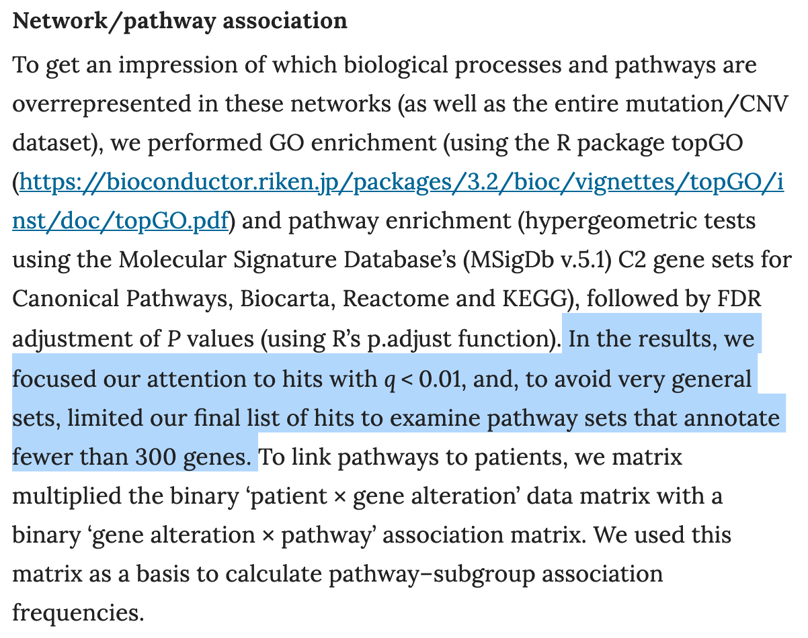

**Author(s)**: `r params$author`  
**Date**: `r Sys.Date()`  


# Academic Citation
If you use this code in your work or research, we kindly request that you cite our publication:

Xiaofan Lu, et al. (2025). FigureYa: A Standardized Visualization Framework for Enhancing Biomedical Data Interpretation and Research Efficiency. iMetaMed. https://doi.org/10.1002/imm3.70005

```{r setup, include=FALSE}
knitr::opts_chunk$set(echo = TRUE)
# 设置knitr代码块的全局选项 / Set global options for knitr code chunks
```

## 需求描述

富集分析得到太多GO term，其中好多还是相似的，怎样合理的合并？clusterProfiler有一个simplify函数，能给富集分析结果瘦身by removing redundancy of enriched GO terms，但有时瘦的不够多。这篇例文列出了富集的 term，同时在旁边给出一个短语来概括性的描述这几个相似的term：

## Requirement description

Enrichment analysis yields too many GO terms, many of which are still similar. How to merge them reasonably? ClusterProfiler has a simplify function that can thin down enriched GO terms by removing redundancy of enriched GO terms, but sometimes not enough weight is lost. This article lists enriched terms and provides a phrase next to them to summarize these similar terms:


出自<https://www.nature.com/articles/nature22973>

from<https://www.nature.com/articles/nature22973>

**方法探讨：**

**Method exploration:**

Extended Data Figure 5 | Candidate driver genes and pathways in MB subgroups. c, GO and pathway summary of recurrently mutated genes in MB. GO and pathway categories are **grouped according to functional theme** and the proportion of cases affected by individual pathway alterations are plotted per subgroup and across the series.

例文中关于这些相似term如何合并的描述只说grouped according to functional theme。因此，我用Guangchuang Yu的GOSemSim计算GO term之间的相似性，然后借助ggtree实现例文中相似GO germ的标注效果。

The description in the example text about how these similar terms are merged only states that they are grouped according to the functional theme. Therefore, I used Y's GOSemSim to calculate the similarity between GO terms, and then used ggtree to achieve the annotation effect of similar GO terms in the example text.



## 应用场景

多组GO富集分析结果放在一起对比；

富集分析得到太多相似的GO term，需要合并相似的，再结合背景知识概括出合适的pathway。

## Application scenarios

Compare multiple sets of GO enrichment analysis results together;

Enrichment analysis yields too many similar GO terms, which need to be merged and combined with background knowledge to summarize appropriate pathways.

## 环境设置

## Environment settings

```{r}
source("install_dependencies.R")
# 加载plyr包，用于数据处理和操作
# Load the plyr package for data manipulation and processing
library(plyr)

# 加载stringr包，用于字符串处理和操作
# Load the stringr package for string manipulation and processing
library(stringr)

# 加载ape包，用于系统发生学和进化分析
# Load the ape package for phylogenetic and evolutionary analysis
library(ape)

# 加载GOSemSim包，用于基因本体语义相似性分析
# Load the GOSemSim package for Gene Ontology semantic similarity analysis
library(GOSemSim)

# 加载ggplot2包，用于创建精美的统计图形
# Load the ggplot2 package for creating elegant statistical graphics
library(ggplot2)

# 加载ggtree包，用于可视化系统发生树
# Load the ggtree package for phylogenetic tree visualization
library(ggtree)

# 加载scales包，用于图形的坐标轴和图例缩放
# Load the scales package for axis and legend scaling in graphics
library(scales)

# 加载cowplot包，用于组合和排列多个ggplot图形
# Load the cowplot package for combining and arranging multiple ggplot figures
library(cowplot)

# 设置环境变量使R显示英文报错信息
# Set environment variable to display error messages in English
Sys.setenv(LANGUAGE = "en") 

# 设置选项禁止将字符串自动转换为因子类型
# Set option to prevent automatic conversion of strings to factors
options(stringsAsFactors = FALSE) 
```

## 输入文件

富集分析结果至少包含GO term ID（格式为GO:0046777）和一列统计量（例如pvalue、p.ajdust、FDR等等）。

此处用clusterProfier的enrichGO函数做的富集分析结果为例(FigureYa52GOplot的输出文件enrichGO_output.csv)，其中有一列BgRatio，斜线左侧是全基因组范围内该term里基因的数量。例文以300为阈值，去掉了基因数量超过300的term。如果你的数据没有这一列，也可以不做这一步筛选。

## Input file

The enrichment analysis results should include at least GO term ID (in the format GO: 0046777) and a list of statistical measures (such as p-value, p-ajdust, FDR, etc.).

Taking the enrichGO function of clusterProfier as an example (the output file enrichGO_output. csv of FigureYa52GOplot), there is a column called BgRatio, and the left side of the diagonal line represents the number of genes in this term across the entire genome. The example uses 300 as the threshold and removes terms with a gene count exceeding 300. If your data does not have this column, you can also skip this filtering step.

```{r}
# 获取当前目录下所有以"enrichGO"开头、".csv"结尾的文件名，用于批量处理多组富集分析结果
# Retrieve filenames of all CSV files starting with "enrichGO" in the current directory for batch processing of multiple enrichment analysis results
fnames <- Sys.glob("enrichGO*.csv")

# 显示获取到的文件名列表，便于确认文件匹配情况
# Display the list of retrieved filenames for verification
fnames

# 循环读取所有文件，仅保留ID、Description、BgRatio、p.adjust四列数据
#           ID: 功能类别标识符，Description: 功能描述，BgRatio: 背景比例，p.adjust: 校正p值
# Read all files in a loop, retaining only columns ID, Description, BgRatio, and p.adjust
# ID: Functional category identifier, Description: Functional description, BgRatio: Background ratio, p.adjust: Adjusted p-value
fdataset <- lapply(fnames, function(x){read.csv(x)[,c(2,3,5,7)]})

# 为数据列表添加文件名作为标识，便于后续区分不同富集分析结果
# Assign filenames as names for the data list to distinguish different enrichment analysis results
names(fdataset) <- fnames
```

## 纵向合并多组富集结果，用于给GO term分类

## Vertically merge multiple sets of enrichment results for GO term classification

```{r}
# 将多个富集分析结果合并为一个数据框，保留来源文件名信息
# Combine multiple enrichment analysis results into a single data frame while retaining source filename information
ego.all <- ldply(fdataset, data.frame)

# 从文件名中提取分组信息（去除.csv后缀），添加为新的分组变量
# Extract group information from filenames (remove .csv suffix) and add as a new grouping variable
ego.all$group <- unlist(strsplit(ego.all$.id, split = ".csv"))

# 查看数据前几行和维度，确认数据结构
# View the first few rows and dimensions of the data to confirm structure
head(ego.all)
dim(ego.all)

# 筛选校正p值小于0.001的显著富集结果，提高分析可靠性
# Filter significantly enriched results with adjusted p-value < 0.001 to improve analysis reliability
ego.all <- ego.all[ego.all$p.adjust < 0.001,] 
dim(ego.all)

# 提取唯一的GO term集合（保留ID、Description、BgRatio三列）
# Extract unique GO terms (retain ID, Description, BgRatio columns)
ego.ID <- unique(ego.all[,c(2:4)])
head(ego.ID)
dim(ego.ID)

## GO term筛选
# 提取每个GO term包含的基因数量（从BgRatio中解析）
# Extract the number of genes in each GO term (parsed from BgRatio)
ego.ID$Bg <- as.numeric(str_split_fixed(ego.ID$BgRatio, "/",2)[,1]) 

# 删除包含基因数超过300的GO term（去除过大的功能类别）
# Remove GO terms with more than 300 genes (filter out overly broad functional categories)
ego.ID <- ego.ID[ego.ID$Bg < 300,] 
dim(ego.ID)

# 删除包含基因数少于100的GO term（去除过小的功能类别）
# Remove GO terms with fewer than 100 genes (filter out overly specific functional categories)
ego.ID <- ego.ID[ego.ID$Bg > 100,] 
dim(ego.ID)

# 查看筛选后的GO term集合
# View the filtered GO term collection
head(ego.ID)
```

## 横向合并多组富集结果，用于画热图

MyMerge函数出自：<https://stackoverflow.com/questions/16666643/merging-more-than-2-dataframes-in-r-by-rownames>

## Horizontally merge multiple sets of enrichment results for drawing heat maps

The MyMerge function comes from:< https://stackoverflow.com/questions/16666643/merging-more-than-2-dataframes-in-r-by-rownames >

```{r}
# 自定义函数用于合并多个富集分析结果，按GO term ID进行外连接
# Custom function to merge multiple enrichment analysis results by GO term ID using outer join
MyMerge <- function(x, y){
  df <- merge(x, y, by= "ID", all.x= TRUE, all.y= TRUE)
  return(df)
}

# 递归合并所有富集结果数据框，生成包含所有GO term和各组信息的完整表格
# Recursively merge all enrichment result data frames to create a comprehensive table with all GO terms and group information
ego.m <- Reduce(MyMerge, fdataset)
head(ego.m)

# 仅保留GO term ID和各组的p.adjust列（此处假设为三组，需根据实际组数调整）
# Retain only GO term ID and p.adjust columns for each group (adjust based on actual number of groups)
ego.m <- ego.m[,c(1,4,7,10)] # Modify this line if there are more than three groups

# 筛选出之前过滤得到的高质量GO term集合
# Filter the merged results to include only high-quality GO terms from previous filtering
ego.m <- merge(ego.ID[,1:2], ego.m, by= "ID", all.x= TRUE)

# 设置行名为GO term描述信息，便于后续可视化
# Set row names to GO term descriptions for easier visualization
rownames(ego.m) <- ego.m$Description
ego.m$ID <- NULL
ego.m$Description <- NULL

# 将列名重命名为简洁的组标识（G1, G2, G3...）
# Rename column names to concise group identifiers (G1, G2, G3...)
colnames(ego.m) <- paste0("G", seq(1:length(fnames)))

# 提示多组合并后可能存在缺失值的处理建议
#           不推荐直接填充为1，建议采用自定义富集分析方法
# Note on handling missing values after merging multiple groups
#                  Directly filling with 1 is not recommended; consider custom enrichment analysis instead
# ego.m[is.na(ego.m)] <- 1 
head(ego.m)
```

## 按GO term的相似性聚类

## Cluster based on GO term similarity

```{r, fig.width=6, fig.height=8}
# 人
# 加载人类基因本体数据库（生物学过程），仅作示例注释（已被注释掉）
# Load human Gene Ontology database (Biological Process), for demonstration only (commented out)
#hgGO <- godata('org.Hs.eg.db', ont="BP")
#save(hgGO, file="hgGO.rdata")
#(load("hgGO.rdata"))

# 小鼠
# 加载小鼠基因本体数据库（生物学过程），需运行约1分钟
#           建议保存结果到文件以便重复使用（已保存为mmGO.rdata）
# Load mouse Gene Ontology database (Biological Process), takes ~1 minute to run
#                  Recommended to save results to file for reuse (already saved as mmGO.rdata)
#mmGO <- godata('org.Mm.eg.db', ont="BP") ## or MF or CC, must match enrichment analysis parameters
#save(mmGO, file="mmGO.rdata")
(load("mmGO.rdata")) # Import previously saved file

# 计算GO term之间的语义相似性（使用Wang方法）
#           该方法基于GO图结构计算相似性，结果为对称矩阵
# Calculate semantic similarity between GO terms using Wang method
#                  This method computes similarity based on GO graph structure, resulting in a symmetric matrix
ego.sim <- mgoSim(ego.ID$ID, ego.ID$ID, semData=mmGO, measure="Wang", combine=NULL)
ego.sim[1:3, 1:3]

# 设置行名和列名为GO term描述，便于结果查看和可视化
# Set row and column names to GO term descriptions for easier result interpretation and visualization
rownames(ego.sim) <- ego.ID$Description
colnames(ego.sim) <- ego.ID$Description
ego.sim[1:3, 1:3]

# 基于GO相似性矩阵构建系统发生树（使用邻接法）
#           1-ego.sim将相似性转换为距离（相似性越高，距离越近）
# Construct phylogenetic tree using neighbor-joining method based on GO similarity matrix
#                  1-ego.sim converts similarity to distance (higher similarity = shorter distance)
tree <- nj(as.dist(1-ego.sim))

# 使用ggtree包可视化GO term分类树
#           添加叶节点标签（GO描述）、内部节点编号和适当的坐标范围
# Visualize GO term classification tree using ggtree package
#                  Add tip labels (GO descriptions), internal node numbers, and appropriate coordinate limits
p <- ggtree(tree) + geom_tiplab() + # Add GO term labels
  geom_text2(aes(subset=!isTip, label=node), hjust=-.3) + # Add node numbers
  coord_cartesian(xlim=c(-.1,1.3)) # Adjust horizontal spacing
p
```

## 开始画图

**注：**根据实际情况，调整offset的值

## Start drawing

**Note: * * Adjust the offset value according to the actual situation

```{r, fig.width=12, fig.height=8}
# 根据系统发生树结构和生物学知识，手动定义4个主要分类节点
# 这些节点编号对应之前树形图中的内部节点
node <- c(22, 21, 27, 25)

# 基于指定节点将GO term划分为不同的进化分支组
# 使用正确的参数名称 '.node' 而不是 'node'
gtree <- groupClade(tree, .node = node)

# 使用ggtree绘制分组后的树形图，不同分支组用不同颜色区分
pbase <- ggtree(gtree, aes(color = as.factor(group))) + # 将group转换为因子
  scale_color_manual(values = hue_pal()(length(node) + 1)[-1]) # 手动设置颜色

# 设置注释文本大小和位置参数
fontsize <- 4
offset <- 0.9

# 构建完整的树形图，添加分类标签和GO term名称
pnode <- pbase + 
  geom_tiplab(size = 4, align = TRUE) +
  
  # 为每个分类组添加描述性标签
  geom_cladelabel(node = node[1], align = TRUE, 
                  color = hue_pal()(length(node) + 1)[2], 
                  fontsize = fontsize, offset = offset, label = "pathway1") +
  geom_cladelabel(node = node[2], align = TRUE, 
                  color = hue_pal()(length(node) + 1)[3], 
                  fontsize = fontsize, offset = offset, label = "pathway2") +
  geom_cladelabel(node = node[3], align = TRUE, 
                  color = hue_pal()(length(node) + 1)[4], 
                  fontsize = fontsize, offset = offset, label = "pathway3") +
  geom_cladelabel(node = node[4], align = TRUE, 
                  color = hue_pal()(length(node) + 1)[5], 
                  fontsize = fontsize, offset = offset, label = "pathway4") +
  
  coord_cartesian(xlim = c(-0.1, 1.5)) +
  theme(legend.position = "none") # 移除图例

# 确保热图数据格式正确
# ego.m 应该是一个数据框，行名与树的tip标签匹配
if (!is.data.frame(ego.m)) {
  ego.m <- as.data.frame(ego.m)
}

# 在树形图右侧添加热图
p_final <- gheatmap(pnode, ego.m, 
         offset = 0.7,
         width = 0.3,
         colnames_angle = 90, 
         colnames_position = "top",
         hjust = 0,
         low = "red", 
         high = "white") +
  scale_fill_gradient(low = "red", high = "white", name = "p.adjust")

# 保存结果
ggsave("GOclustering.pdf", p_final, width = 12, height = 8)
```

最后生成的pdf文件是矢量图，可以在Illustrator或Inkscape中打开、编辑。

可以参考例文的布局，手动删掉树形结构或调整各部分的位置。

The final generated PDF file is a vector image that can be opened and edited in Illustrator or Inkscape.

You can refer to the layout of the example text and manually delete the tree structure or adjust the position of each part.

# Session Info

```{r}
sessionInfo()
```