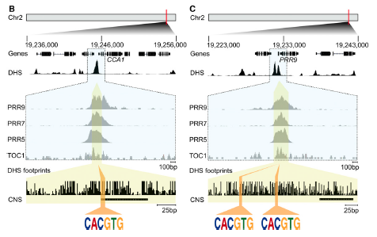
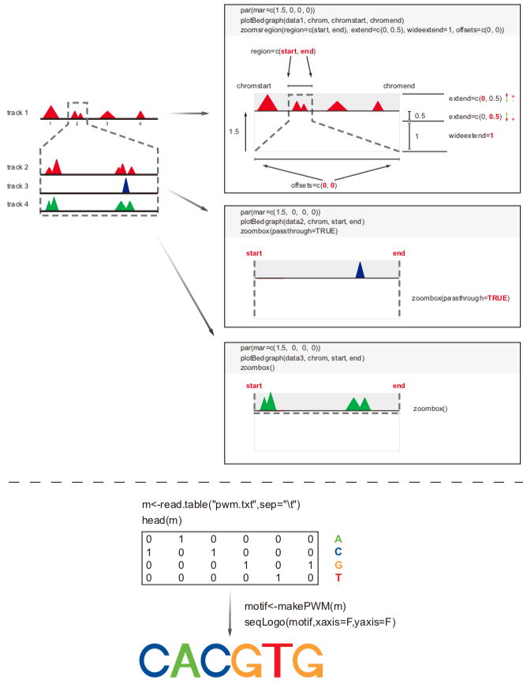
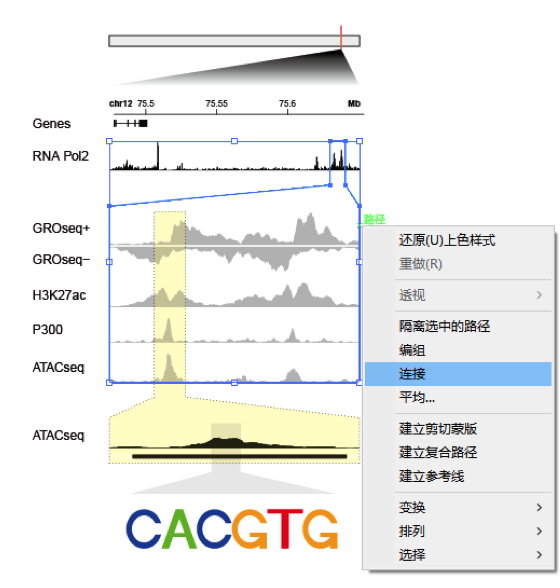
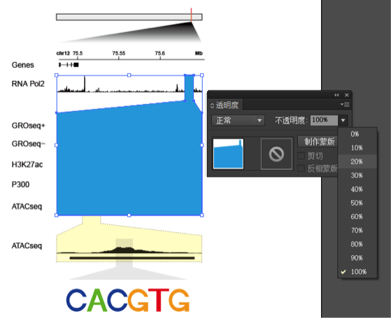
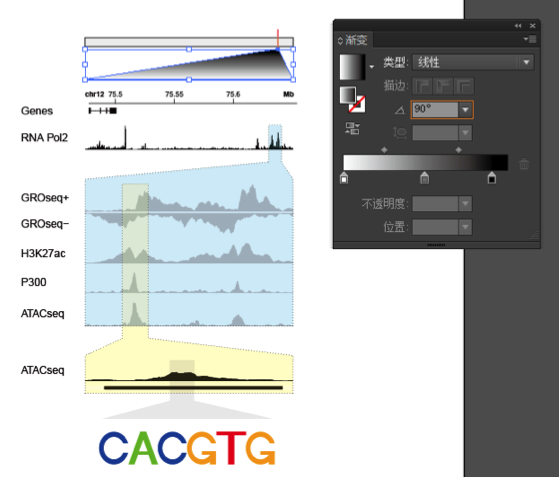

**Author(s)**: `r params$author`  
**Reviewer(s)**: `r params$reviewer`  
**Date**: `r Sys.Date()`  


```{r setup, include=FALSE}
knitr::opts_chunk$set(echo = TRUE)
```

# Academic Citation
If you use this code in your work or research, we kindly request that you cite our publication:

Xiaofan Lu, et al. (2025). FigureYa: A Standardized Visualization Framework for Enhancing Biomedical Data Interpretation and Research Efficiency. iMetaMed. https://doi.org/10.1002/imm3.70005


## 需求描述

通过在线工具找到了哪个转录因子调控我的基因，不想截屏，想DIY矢量图。用R来画这种类似IGV zoom in效果的信号分布图。

## Requirement description

I found which transcription factor regulates my genes through online tools. I don't want to take screenshots, I want to DIY vector graphics. Use R to draw a signal distribution diagram similar to the IGV zoom in effect.



出自<http://www.plantphysiol.org/content/170/1/528.long>

From<http://www.plantphysiol.org/content/170/1/528.long>

## 应用场景

同时展示某一区域内的ChIP-seq、ATAC-seq、DNase-seq、RNA-seq、GRO-seq等信号。

Sushi包的优点：不限物种，不依赖于任何基因组文件，速度快。

**题外话：**Sushi包非常好用，还可以用来展示ChIA-PET、Hi-C等3D基因组数据，以及GWAS结果画Manhattan图。可参考Sushi文档的5 Appendix举例：<https://www.bioconductor.org/packages/3.8/bioc/vignettes/Sushi/inst/doc/Sushi.pdf>

## Application scenarios

Simultaneously display ChIP seq, ATAC seq, DNase seq, RNA seq, GRO seq and other signals within a certain region.

The advantages of Sushi package: unlimited species, not dependent on any genome files, fast speed.

**Off topic: The Sushi package is very useful and can also be used to display 3D genomic data such as ChIA PET, Hi-C, as well as GWAS results in a Manhattan plot. For example, please refer to Appendix 5 of the Sushi document:<https://www.bioconductor.org/packages/3.8/bioc/vignettes/Sushi/inst/doc/Sushi.pdf>

## 环境设置

## Environment settings

```{r}
source("install_dependencies.R")

# 加载Sushi包，用于基因组数据可视化
# Load the Sushi package for genomic data visualization
library(Sushi)

# 设置环境变量使R显示英文报错信息，便于查找对应解决方案
# Set environment variable to display error messages in English for easier troubleshooting
Sys.setenv(LANGUAGE = "en") 

# 禁止read.csv等函数自动将字符型向量转换为因子类型
# Prevent automatic conversion of character vectors to factors when reading data
options(stringsAsFactors = FALSE) 
```

## 参数设置

## Parameter settings

```{r}
# 定义要分析的染色体
# Define the chromosome to be analyzed
chrom <- "chr12"

# 全局基因组区域的起始位置（碱基对）
# Start position (bp) of the global genomic region
chromstart <- 75477413 

# 全局基因组区域的结束位置（碱基对）
# End position (bp) of the global genomic region
chromend <- 75653942 

# 例图中第一次放大的区域范围（三次zoom in中的第一次）
# Coordinates for the first zoom-in region (first level of magnification)
region <- c(75633289,75644072) 

# 例图中第二次放大的区域范围（基于第一次放大的进一步聚焦）
# Coordinates for the second zoom-in region (second level of magnification)
region2 <- c(75635224,75636574) 

# 例图中第三次放大的区域范围（最高精度的聚焦区域）
# Coordinates for the third zoom-in region (third level of magnification)
region3 <- c(75635776,75635931) 
```

## 输入文件

Sushi接受输入bedgragh（.bdg）、bedpe、bed、interaction matrix文件。

此处需要bedgragh和bed文件。如果你的数据类型不符，可以用以下方法做转换：

- bam文件，可以用bedtools转成bedgragh、bedpe或bed文件
- gff文件，可以用bedtools转成bed文件
- bw文件，可以到<http://hgdownload.soe.ucsc.edu/admin/exe/linux.x86_64/>下载“bigWigToBedGraph”，转换为.bdg文件；或者用FigureYa3genomeView来画。

ChIP-seq、ATAC-seq、DNase-seq、RNA-seq、GRO-seq的信号用bedgragh文件。

基因结构、peak或motif所在的位置用bed文件。

此处展示了多种测序数据类型，实际操作中根据你需要的类型截取相应的代码来画。

## Input file

Sushi accepts input files such as bedgrain (. bdg), bedpe, bed, and interaction matrix.

Bedgragh and bed files are required here. If your data type does not match, you can use the following methods for conversion:

- BAM file, can be converted to bedgragh, bedpe, or bed file using bedtools
- The gff file can be converted to a bed file using bedtools
- BW file, can be accessed from <http://hgdownload.soe.ucsc.edu/admin/exe/linux.x86_64/> Download 'bigWigToBedGraph' and convert it to a .bdg file; Or use FigureYa3genomeView to draw.

The signals of ChIP seq, ATAC seq, DNase seq, RNA seq, and GRO seq are recorded in bedgragh files.

Use a bed file to locate the gene structure, peak, or motif.

Multiple sequencing data types are displayed here, and in practical operation, the corresponding code is extracted according to the type you need to draw.

```{r}
# 读取基因外显子注释文件（BED格式），含表头，制表符分隔
# Read gene exon annotation file (BED format) with header, tab-separated
a <- read.table("gene_exon.bed",header=TRUE,sep="\t")
# 查看数据前几行，确认数据结构
# View first few rows to check data structure
head(a)

# 读取ATAC-seq信号文件（bedGraph格式），不含表头，制表符分隔
# Read ATAC-seq signal file (bedGraph format) without header, tab-separated
b <- read.table("ATACseq.bdg",header=FALSE,sep="\t")
head(b)

# 读取H3K27ac组蛋白修饰信号文件
# Read H3K27ac histone modification signal file
c <- read.table("H3K27ac.bdg",header=FALSE,sep="\t")
# 读取RNA聚合酶II结合信号文件
# Read RNA Polymerase II binding signal file
d <- read.table("RNA_Pol2.bdg",header=FALSE,sep="\t")
# 读取正向GRO-seq转录活性信号文件
# Read sense strand GRO-seq transcriptional activity file
e <- read.table("GROseq+.bdg",header=FALSE,sep="\t")
# 读取负向GRO-seq转录活性信号文件
# Read antisense strand GRO-seq transcriptional activity file
f <- read.table("GROseq-.bdg",header=FALSE,sep="\t")
# 读取P300转录共激活因子结合信号文件
# Read P300 transcriptional coactivator binding signal file
g <- read.table("P300.bdg",header=FALSE,sep="\t")

# 读取ATAC-seq峰文件（BED格式），用于标识开放染色质区域
# Read ATAC-seq peak file (BED format) for identifying open chromatin regions
h <- read.table("ATACseq_peaks.bed",header=FALSE,sep="\t")
head(h)
```

## 画图原理

## Principles of Drawing



## 开始画图

大家画图时，请根据实际情况耐心调节layout和每个图的par部分。

## Start drawing

When drawing, please patiently adjust the layout and par section of each image according to the actual situation.

```{r}
# 创建PDF设备并设置输出尺寸
# Create PDF device and set output dimensions
pdf("Sushiplot.pdf", width=8.5, height=5)  # width: 输出宽度(英寸) / Output width (inches)
                                            # height: 输出高度(英寸) / Output height (inches)

# 使用layout函数设置9行1列的图形布局，为每个track分配适当空间
# Use layout function to arrange 9 rows in 1 column, allocate space for each track
layout(matrix(1:9, 9, 1), heights=c(1, 2, 1, 1, 1, 1, 2, 1, 1))  # heights: 各行高度比例 / Row height ratios
par(mgp=c(3, .3, 0))  # 设置轴标签、轴标题与轴线的距离 / Set margin for axis labels and titles

# 1. 绘制基因结构
# 1. Plot gene structure
par(mar=c(0, 20, 1.5, 20))  # mar: 边距设置(下,左,上,右) / Margin settings (bottom, left, top, right)
plotGenes(a, chrom, chromstart, chromend,  # a: 基因注释数据 / Gene annotation data
          labeltext=FALSE,  # 是否显示基因名称 / Whether to show gene names
          bentline=FALSE, bheight=.1, col="black",  # bentline: 是否绘制弯曲连接线 / Draw bent lines
                                                       # bheight: 基因框高度 / Height of gene boxes
                                                       # col: 颜色 / Color
          plotgenetype="box",  # 基因绘制类型 / Gene plot type
          maxrows=1)  # 最大显示行数 / Maximum rows to display

# 绘制基因组标尺
# Add genomic coordinate scale
labelgenome(chrom, chromstart, chromend,  # chrom: 染色体名称 / Chromosome name
            side=3,  # 标尺位置(1=下,3=上) / Scale position (1=bottom, 3=top)
            n=3,  # 刻度线数量 / Number of ticks
            scale="Mb",  # 刻度单位 / Scale unit
            line=0,  # 标签偏移量 / Label offset
            chromcex=0.7, chromadjust=-0.02, scalecex=0.7)  # 字体大小和位置调整 / Font size and position adjustment

# 添加Y轴标签
# Add Y-axis label
mtext("Genes", side=2, line=7.5, cex=1, font=1, las=2, adj=0, col="black")  # side: 标签位置(2=左) / Label position
                                                                                  # line: 与轴线距离 / Distance from axis
                                                                                  # cex: 字体大小 / Font size
                                                                                  # las: 标签方向(2=垂直) / Label orientation

# 2. 绘制RNA Pol2的ChIP-seq数据
# 2. Plot RNA Pol2 ChIP-seq data
par(mar=c(4, 20, 0, 20))  # 设置边距 / Set margins
plotBedgraph(d, chrom, chromstart, chromend,  # d: BedGraph数据文件 / BedGraph data file
             color="black")  # 填充颜色 / Fill color

# 添加Y轴标签
# Add Y-axis label
mtext("RNA Pol2", side=2, line=7.5, cex=1, font=1, las=2, adj=0, col="black")

# 绘制第一次zoom in区域的虚线框
# Draw dashed box for first zoom-in region
zoomsregion(region=region, extend=c(0, 0.5), wideextend=0.7, offsets=c(0, 0), lty=3)  # region: 区域坐标 / Region coordinates
                                                                                            # extend: 上下延伸比例 / Vertical extension
                                                                                            # wideextend: 左右延伸比例 / Horizontal extension
                                                                                            # lty: 线类型(3=虚线) / Line type

# 第一次zoom in区域
# First zoom-in region

# 3. 绘制GRO-seq正链数据
# 3. Plot GRO-seq plus strand data
par(mar=c(0.2, 20, 0, 20))  # 设置边距 / Set margins
plotBedgraph(e, chrom, region[1], region[2],  # e: BedGraph数据文件 / BedGraph data file
             color="grey")  # 填充颜色 / Fill color

# 添加Y轴标签
# Add Y-axis label
mtext("GROseq+", side=2, line=7.5, cex=1, font=1, las=2, adj=0, col="black")

# 绘制zoom box和下一级zoom区域
# Draw zoom box and next-level zoom region
zoombox(passthrough=TRUE, lty=3)  # passthrough: 是否穿透到下一层 / Pass through to next layer
zoomsregion(region2, extend=c(0, 1), wideextend=0, lty=3)  # region2: 下一级区域坐标 / Next-level region coordinates

# 4. 绘制GRO-seq负链数据
# 4. Plot GRO-seq minus strand data
par(mar=c(1, 20, 0, 20))  # 设置边距 / Set margins
plotBedgraph(f, chrom, region[1], region[2],  # f: BedGraph数据文件 / BedGraph data file
             flip=TRUE, color="grey")  # flip: 是否翻转Y轴(用于负链数据) / Flip Y-axis for minus strand

# 添加Y轴标签
# Add Y-axis label
mtext("GROseq-", side=2, line=7.5, cex=1, font=1, las=2, adj=0, col="black")

# 绘制zoom box和下一级zoom区域
# Draw zoom box and next-level zoom region
zoombox(passthrough=TRUE, lty=3)
zoomsregion(region2, extend=c(1, 1), wideextend=0, lty=3)

# 5. 绘制H3K27ac的ChIP-seq数据
# 5. Plot H3K27ac ChIP-seq data
par(mar=c(1, 20, 0, 20))  # 设置边距 / Set margins
plotBedgraph(c, chrom, region[1], region[2],  # c: BedGraph数据文件 / BedGraph data file
             color="grey")  # 填充颜色 / Fill color

# 添加Y轴标签
# Add Y-axis label
mtext("H3K27ac", side=2, line=7.5, cex=1, font=1, las=2, adj=0, col="black")

# 绘制zoom box和下一级zoom区域
# Draw zoom box and next-level zoom region
zoombox(passthrough=TRUE, lty=3)
zoomsregion(region2, extend=c(1, 1), wideextend=0, lty=3)

# 6. 绘制P300的ChIP-seq数据
# 6. Plot P300 ChIP-seq data
par(mar=c(1, 20, 0, 20))  # 设置边距 / Set margins
plotBedgraph(g, chrom, region[1], region[2],  # g: BedGraph数据文件 / BedGraph data file
             color="grey")  # 填充颜色 / Fill color

# 添加Y轴标签
# Add Y-axis label
mtext("P300", side=2, line=7.5, cex=1, font=1, las=2, adj=0, col="black")

# 绘制zoom box和下一级zoom区域
# Draw zoom box and next-level zoom region
zoombox(passthrough=TRUE, lty=3)
zoomsregion(region2, extend=c(1, 1), wideextend=0, lty=3)

# 7. 绘制ATAC-seq数据
# 7. Plot ATAC-seq data
par(mar=c(4, 20, 0, 20))  # 设置边距 / Set margins
plotBedgraph(b, chrom, region[1], region[2],  # b: BedGraph数据文件 / BedGraph data file
             color="grey")  # 填充颜色 / Fill color

# 添加Y轴标签
# Add Y-axis label
mtext("ATACseq", side=2, line=7.5, cex=1, font=1, las=2, adj=0, col="black")

# 绘制zoom box和下一级zoom区域
# Draw zoom box and next-level zoom region
zoombox(lty=3)
zoomsregion(region2, extend=c(1, 0.5), wideextend=0.7, offsets=c(0, 0), lty=3)

# 第二次zoom in区域
# Second zoom-in region

# 8. 绘制ATAC-seq数据(高分辨率)
# 8. Plot ATAC-seq data (high resolution)
par(mar=c(1, 20, 0, 20))  # 设置边距 / Set margins
plotBedgraph(b, chrom, region2[1], region2[2],  # region2: 第二次zoom区域坐标 / Second zoom region coordinates
             range=c(0, 0.5), color="black")  # range: Y轴范围 / Y-axis range

# 添加Y轴标签
# Add Y-axis label
mtext("ATACseq", side=2, line=7.5, cex=1, font=1, las=2, adj=0, col="black")

# 绘制zoom box和下一级zoom区域
# Draw zoom box and next-level zoom region
zoombox(passthrough=TRUE, lty=3, topextend = 1)  # topextend: 向上延伸距离 / Extend upwards
zoomsregion(region3, extend=c(0, 1), wideextend=0, lty=1,  # region3: 第三次zoom区域坐标 / Third zoom region coordinates
            zoomborder=rgb(0,0,0,20,maxColorValue=255),  # zoomborder: 边框颜色(带透明度) / Border color with transparency
            col=rgb(0,0,0,20,maxColorValue=255))  # col: 填充颜色(带透明度) / Fill color with transparency

# 9. 绘制ATAC-seq峰(已注释掉，新版本可能不支持)
# 9. Plot ATAC-seq peaks (commented out, may not be supported in newer versions)
# par(mar=c(3,20,0,20))
# plotBed(beddata=h,chrom=chrom,region2[1],region2[2],row=1,color="black")
# mtext("",side=2,line=7.5,cex=1,font=1,las=2,adj=0,col="black")
# zoombox(lty=3)

# 绘制第三次zoom in区域的框
# Draw box for third zoom-in region
zoomsregion(region3, extend=c(1, 2), wideextend=4, offsets=c(0, 0), lty=3,  # 更大范围的第三次zoom框 / Larger third zoom box
            zoomborder=rgb(0,0,0,20,maxColorValue=255), 
            col=rgb(0,0,0,20,maxColorValue=255))

# 后续可使用AI软件添加motif信息
# Motif information can be added later using AI software
dev.off()  # 关闭PDF设备 / Close PDF device
```


## 附：后期加工

输出的pdf文件是矢量图，可以用Illustrator等软件编辑。例如加入染色体全局图和motif logo等等。

## Attachment: Post processing

The output PDF file is a vector image that can be edited using software such as Illustrator. For example, adding chromosome global maps and motif logos, etc.

### AI中添加底色的方法

1. 先用“直线段工具”描边，然后右键选连接。

### The method of adding background color in AI

1. First use the "Line Segment Tool" to stroke, then right-click and select "Connect".



2. 为连接好的框填充颜色，边框颜色选无，将不透明度调至适当值，如20%。然后可以对这个“底色”右键选择放到底层。

2. Fill the connected boxes with colors, select none for the border color, and adjust the opacity to an appropriate value, such as 20%. Then you can right-click on this' base color 'and select to place it at the bottom layer.



3. 用“矩形工具”画出染色体并调整边框和填充颜色；用“直线段工具”在染色体对应位置竖直画一条红线；从该红线出发用“直线段工具”画一个三角形，三角形端点与track左右端点对齐，连接三角形填充黑色，最后选择渐变功能调整渐变角度为90°后就愉快地拖动渐变条吧！

3. Use the "Rectangle Tool" to draw chromosomes and adjust the borders and fill colors; Use the "Straight Line Segment Tool" to draw a vertical red line at the corresponding position on the chromosome; Starting from the red line, use the "Line Segment Tool" to draw a triangle. Align the endpoints of the triangle with the left and right endpoints of the track, connect the triangles and fill them with black. Finally, select the gradient function to adjust the gradient angle to 90 °, and then happily drag the gradient bar!



### 根据矩阵生成motif logo的方法见SeqLogo文件夹

### The method of generating motif logos based on matrices can be found in the SeqLogo folder

### 编辑后的效果：

### The edited effect:


# Session Info

```{r}
sessionInfo()
```
