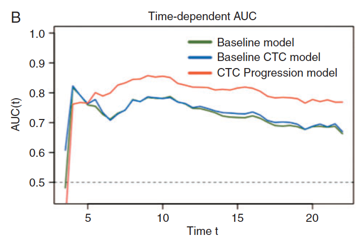

**Author(s)**: `r params$author`  
**Reviewer(s)**: `r params$reviewer`  
**Date**: `r Sys.Date()`  


# Academic Citation
If you use this code in your work or research, we kindly request that you cite our publication:

Xiaofan Lu, et al. (2025). FigureYa: A Standardized Visualization Framework for Enhancing Biomedical Data Interpretation and Research Efficiency. iMetaMed. https://doi.org/10.1002/imm3.70005

```{r setup, include=FALSE}
knitr::opts_chunk$set(echo = TRUE)
# 设置knitr的全局代码块选项 / Set global chunk options for knitr
```

## 需求描述

绘制不同拟合模型的time-dependent AUC。

## Requirement description

Draw time-dependent AUC for different fitting models.



出自<https://academic.oup.com/annonc/article/29/7/1554/4993948>

from<https://academic.oup.com/annonc/article/29/7/1554/4993948>

## 应用场景

绘制不同拟合模型的timeROC曲线。

## Application scenarios

Draw timeROC curves for different fitting models.

## 环境设置

## Environment settings

```{r}
source("install_dependencies.R")
# 加载timeROC包，用于时间依赖型ROC曲线分析 - Load the timeROC package for time-dependent ROC curve analysis
library(timeROC)
# 加载survival包，用于生存分析 - Load the survival package for survival analysis
library(survival)

# 设置环境语言为英文，以便显示英文错误信息 - Set the environment language to English to display error messages in English
Sys.setenv(LANGUAGE = "en") 

# 禁止字符串自动转换为因子，避免数据类型意外转换 - Disable automatic conversion of strings to factors to avoid unexpected data type conversions
options(stringsAsFactors = FALSE) 
```

## 输入文件

比普通的ROC的输入多了一列时间变量time

## Input file

An additional time variable, time, is added to the input of a regular ROC

```{r}
# 从CSV文件读取数据并设置第一列为行名 - Read data from a CSV file and set the first column as row names
tr <- read.csv("easy_input.csv", row.names = 1)
```

## 开始计算

根据需要拟合不同的模型，此处的三个拟合模型分别为：

- 指标a、age、sex构建的模型1
- 指标b、age、sex构建的模型2
- 以及指标c、 age、sex构建的模型3

以ROC.a为例，使用的函数为timeROC。

- T，数据集中的时间变量
- delta，数据集中的结局变量（该函数要求删失数据的赋值一定设置为0）
- marker为主要研究变量
- other_markers为其他校正的协变量
- cause为结局事件对应的赋值
- weighting为计算权重的方式，可以设置为marginal（采用KM方法），也可以设置为cox（采用Cox方法）
- times为计算AUC的时间点，根据实际需求设置
- iid的默认设置为FALSE，如果后续需要使用AUC的置信区间，则设置为TRUE，如果不需要的话，则可不进行设置。本例中可以不进行设置。

## Start calculating

Fit different models as needed, and the three fitting models here are:

-Model 1 constructed based on indicators a, age, and sex
-Model 2 constructed based on indicators b, age, and sex
-Model 3 constructed with indicators c, age, and sex

Taking ROC. a as an example, the function used is timeROC.

- T， Time variables in the dataset
- delta， The outcome variables in the dataset (this function requires the assignment of deleted data to be set to 0)
-Marker is the main research variable
-Other_markers are covariates for other corrections
-Because is the assignment corresponding to the ending event
-Weighting is the method of calculating weights, which can be set to marginal (using KM method) or Cox (using Cox method)
-Times is the time point for calculating AUC, set according to actual needs
-The default setting for iid is False. If the confidence interval for AUC needs to be used later, it is set to True. If not needed, it can be left blank. In this example, no settings can be made.

```{r}
# 计算标记变量a的时间依赖型ROC曲线 - Calculate time-dependent ROC curve for marker a
# T: 生存时间 - Survival time
# delta: 事件状态（0= censored, 1= event） - Event status (0=censored, 1=event)
# marker: 预测标记变量 - Predictor marker
# other_markers: 调整的协变量矩阵 - Covariates matrix for adjustment
# cause: 关注的事件类型（竞争风险分析） - Event type of interest (for competing risks)
# weighting: 权重方法 - Weighting method
# times: 计算ROC的时间点 - Time points to calculate ROC
# iid: 是否返回个体水平估计 - Whether to return individual-level estimates
ROC.a <- timeROC(T=tr$time, 
                 delta=tr$status, marker=tr$a,
                 other_markers=as.matrix(tr[,c("age","sex")]),
                 cause=1,
                 weighting="marginal",
                 times=c(0,50,100,150,200,250,300,350,400),
                 iid=TRUE)

# ROC.b与其他两个的设置相比，marker设置不同，可以看到tr$b前后多一个负号("-")
# The marker setting for ROC.b is different from the others, with a negative sign before tr$b
# 原因在于该变量和结局事件的关系是该变量数值增大，结局事件发生率反而降低。
# This is because this variable has an inverse relationship with the outcome event (higher values indicate lower risk)

# 计算标记变量b的时间依赖型ROC曲线（取负值以反映负相关关系）
# Calculate time-dependent ROC curve for marker b (negated to reflect inverse relationship)
ROC.b <- timeROC(T= tr$time, delta= tr$status, marker=-tr$b,
               other_markers=as.matrix(tr[,c("age","sex")]),
               cause=1,weighting="marginal",
               times=c(0,50,100,150,200,250,300,350,400),
               iid=TRUE)

# 计算标记变量c的时间依赖型ROC曲线 - Calculate time-dependent ROC curve for marker c
ROC.c <- timeROC(T=tr$time, delta=tr$status,marker=tr$c,
               other_markers=as.matrix(tr[,c("age","sex")]),
               cause=1,weighting="marginal",
               times=c(0,50,100,150,200,250,300,350,400),
               iid=TRUE)
```

## 开始画图

分别绘制三个模型对应的timeROC曲线，采用的函数为plotAUCcurve。

- 该函数的第一部分为前面模型输出的结果；
- 第二部分conf.int指图中是否绘制置信区间，若为FALSE，则不添加置信区间，若为TRUE，则绘制相应置信区间线；
- 第三部分为线条的颜色设置，除第一条曲线外，后面的都需添加add=TRUE，以保证全部的曲线绘制在一张图上。

## Start drawing

Draw timeROC curves for each of the three models using the function plotAUCcurve.

-The first part of this function is the output of the previous model;
-The second part refers to whether a confidence interval is drawn in the graph. If it is False, no confidence interval is added. If it is True, the corresponding confidence interval line is drawn;
-The third part is the color setting of the lines. Except for the first curve, add=TRUE needs to be added to all subsequent curves to ensure that all curves are drawn on one graph.

```{r}
# 创建PDF文件用于保存ROC曲线图 - Create a PDF file to save the ROC curve plot
pdf("timeROC.pdf", 6, 5)  # 设置图形宽度为6英寸，高度为5英寸 - Set plot width to 6 inches and height to 5 inches

# 绘制标记变量a的时间依赖型AUC曲线 - Plot time-dependent AUC curve for marker a
plotAUCcurve(ROC.a, conf.int=FALSE, col="red")  # 不显示置信区间，曲线颜色为红色 - No confidence interval, curve color: red

# 在同一图上叠加绘制标记变量b的时间依赖型AUC曲线 - Add AUC curve for marker b to the same plot
plotAUCcurve(ROC.b, conf.int=FALSE, col="darkblue", add=TRUE)  # 曲线颜色为深蓝色 - Curve color: darkblue

# 在同一图上叠加绘制标记变量c的时间依赖型AUC曲线 - Add AUC curve for marker c to the same plot
plotAUCcurve(ROC.c, conf.int=FALSE, col="darkgreen", add=TRUE)  # 曲线颜色为深绿色 - Curve color: darkgreen

# 设置图例 - Add legend to the plot
legend("topright",  # 图例位置：右上角 - Legend position: top-right
       c("A model","B model","C model"),  # 图例标签 - Legend labels
       col=c("red","darkblue","darkgreen"),  # 对应曲线颜色 - Corresponding curve colors
       bty='n',  # 无边框 - No border
       lty=1,  # 线条类型为实线 - Line type: solid
       lwd=2,  # 线条宽度 - Line width
       cex=0.8)  # 字体大小 - Font size

dev.off()  # 关闭图形设备，保存PDF文件 - Close the graphics device and save the PDF
```


## 题外话

发现一个写的不错的帖子，可以用来画示例文章里的Figure 3A，作者：第二军医大学统计学教研室陈琪

## Off topic remarks

I found a well written post that can be used to draw Figure 3A in the example article. The author is Chen Qi from the Statistics Teaching and Research Office of the Second Military Medical University

<https://www.wowodx.com/weishengjiandu/7180143d4c3b48228e7d04e97e2ac3c1.html>

# Session Info

```{r}
sessionInfo()
```