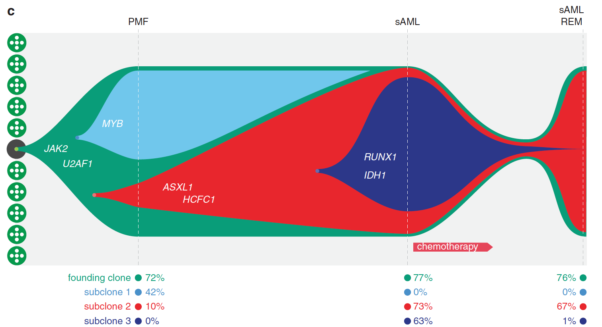

**Author(s)**: `r params$author`  
**Reviewer(s)**: `r params$reviewer`  
**Date**: `r Sys.Date()`  


# Academic Citation
If you use this code in your work or research, we kindly request that you cite our publication:

Xiaofan Lu, et al. (2025). FigureYa: A Standardized Visualization Framework for Enhancing Biomedical Data Interpretation and Research Efficiency. iMetaMed. https://doi.org/10.1002/imm3.70005

```{r setup, include=FALSE}
knitr::opts_chunk$set(echo = TRUE)
# 设置knitr的全局代码块选项 / Set global chunk options for knitr
```

## 需求描述

用R画文章里的这种肿瘤克隆进化的图。

## Requirement description

Draw a graph of the evolution of tumor clones in the article using R.



出自<https://www.nature.com/articles/leu2014289>

from<https://www.nature.com/articles/leu2014289>

## 应用场景

## Application scenarios

Create timecourse "fish plots" that show changes in the clonal architecture of tumors, <https://github.com/chrisamiller/fishplot>

展示肿瘤细胞克隆进化的时间、比例等信息。

像例文那样，在三维时间节点上共鉴定到4个克隆群，我们可以看到其中founding clone 在三个时间点上占比都非常高，70%左右，除去这个主克隆外，还有三个亚克隆，在三个时间点上变化比较大，其中主要是subclone 1 的逐渐消失，subclone2 的逐渐扩增以及subclone 3的从无到有。

**题外话：**还有一个R包timescape，画clonal evolution这种鱼图也很美，<https://bioconductor.org/packages/release/bioc/vignettes/timescape/inst/doc/timescape_vignette.html>。

克隆进化图有点像sankey，我拿来FigureYa25sankey对比着看，理解更透彻。

Display information such as the time and proportion of tumor cell clone evolution.

As shown in the example text, a total of four clone groups were identified at three-dimensional time points. We can see that the proportion of founding clones was very high at three time points, about 70%. In addition to the main clone, there were three subclones with significant changes at the three time points, mainly the gradual disappearance of subclone 1, the gradual expansion of subclone 2, and the emergence of subclone 3 from scratch.

**Off topic: * * There is also an R package called timescape, which is also very beautiful for drawing fish images like clonal evolution< https://bioconductor.org/packages/release/bioc/vignettes/timescape/inst/doc/timescape_vignette.html >.

The clone evolution diagram is a bit like a sankey. I compared it with FigureYa25sankey for a more thorough understanding.

## 环境设置
## Environment settings

```{r}
source("install_dependencies.R")

# 加载fishplot包，用于生成白血病克隆演化的鱼群图
# Load the fishplot package for generating fish plots of leukemia clonal evolution
library(fishplot)

# 设置环境变量使R显示英文错误信息，便于查找解决方案
# Set environment variable to display error messages in English for easier troubleshooting
Sys.setenv(LANGUAGE = "en") 

# 全局设置禁止将字符型数据自动转换为因子类型，避免意外的数据转换
# Globally disable automatic conversion of character strings to factors to prevent unexpected data transformation
options(stringsAsFactors = FALSE) 
```

## 输入数据

需要三种输入：

- easy_input.txt，每行表示每个克隆群在不同时间节点的VAF/CCF 占比，每列表示每个时间节点中各个克隆簇的情况。

- timepoints，用来定义easy_input.txt的四列对应的4个时间节点。其中therapyTime列是化疗后休复期推断出的克隆群整体状况。

- parents，与时间节点相对应的各个克隆群进化关系。例图中，“0”表示主克隆，“1, 1”表示在主克隆之后有两个平行发展的亚克隆簇，“3”表示在这个克隆簇发生时，已经有两次克隆事件。进一步根据各个时间节点，各个克隆簇占比情况，脚本便可实现。为便于理解parents的写法，结尾附上了几个例子。

## Input data

Three types of inputs are required:

- easy_input.txt， Each row represents the VAF/CCF ratio of each clone group at different time points, and each column represents the situation of each clone cluster at each time point.

- timepoints， Used to define the four time nodes corresponding to the four columns of easy_input.txt. The treatyTime column represents the overall status of the clone population inferred during the recovery period after chemotherapy.

- parents， The evolutionary relationship of each clone group corresponding to the time node. In the example diagram, "0" represents the main clone, "1, 1" represents two parallel sub clone clusters after the main clone, and "3" represents that there have been two cloning events occurring in this clone cluster. Further, based on the proportion of each clone cluster at each time node, the script can be implemented. For the convenience of understanding the writing of 'parents', several examples are attached at the end.

```{r}
# 从easy_input.txt文件读取数据，指定表头和制表符分隔符，并将第一列设为行名
# Read data from easy_input.txt with headers, tab-separated, using first column as row names
frac <- read.table("easy_input.txt", header=T, sep='\t', row.names=1)

# 显示读取的数据内容（可选调试步骤）
# Display the loaded data (optional for debugging)
frac

# 将数据框转换为矩阵格式，便于后续计算
# Convert data frame to matrix format for numerical calculations
frac.table <- as.matrix(frac)

# 定义时间点向量，控制鱼群图中各克隆的时间进程长度比例
# Define time points vector to control the proportional lengths of fish head, body, and tail
timepoints <- c(0, 75, 110, 120) 

# 定义克隆谱系关系，每个元素表示对应克隆的父克隆ID（0表示无父克隆）
# Define clonal lineage relationships (each value is the parent clone ID, 0 for root)
parents <- c(0, 1, 1, 3)
```

**题外话：**除了用上述方法构建输入以外，还可以用CloneEvol输出的结果作为输入，fisherplot可以跟ClonEvol（擅长画树枝图）无缝对接，详见：<https://github.com/chrisamiller/fishplot>里的“clonevol integration”

**Off topic: In addition to using the above methods to construct inputs, you can also use the results output by CloneEvol as inputs. Fisherplot can seamlessly integrate with ClonEvol (which is good at drawing tree branches), as shown in:< https://github.com/chrisamiller/fishplot >The 'clonevol integration' in

## 开始画图

## Start drawing

```{r,fig.width=10, fig.height=6}
# 创建fishplot对象，输入数据为克隆频率矩阵、谱系关系和时间点
# Create fishplot object with clone frequency matrix, lineage relationships and timepoints
fish <- createFishObject(frac.table, parents, timepoints)

# 设置每个克隆的显示颜色（支持HTML颜色代码）
# Set colors for each clone using HTML color codes
fish <- setCol(fish, c("#099D79", "#70C7EC", "#E8262D", "#2C3789"))

# 自动计算克隆的布局结构，确定各克隆在图中的位置关系
# Automatically calculate clone layout and positional relationships
fish <- layoutClones(fish)

# 取消注释此行可将图形输出为PDF文件
# Uncomment to export plot as PDF file
#pdf('fish.pdf', width=10, height=6)

# 调整图形边距，在底部留出空间用于放置图例
# Adjust plot margins to make space for legends at the bottom
par(mar = par()$mar + c(0,0,3,0))

# 绘制鱼群图展示克隆演化过程
# Generate fishplot to visualize clonal evolution
fishPlot(fish, shape = "spline",         # 曲线类型：spline(平滑曲线)或polygon(折线) / Curve type: spline or polygon
         #title.btm = "Clonal architecture of tumors",  # 左下角标题(已注释) / Bottom-left title (commented)
         cex.title = 1.2,               # 标题字号大小 / Title font size
         pad.left = 0.25,               # 鱼头部分的倾斜角度参数 / Left padding for fish head angle
         
         vlines = timepoints[c(1:2,4)],  # 在指定时间点绘制垂直参考线 / Vertical lines at specified timepoints
         col.vline = "white",           # 参考线颜色 / Color of vertical lines
         vlab = c("PMF", "sAML", "sAML\nREM"),  # 垂直参考线对应的标签 / Labels for vertical lines
         
         bg.col = c("#F1F2F2","#F1F2F2","#F1F2F2"),  # 背景颜色设置 / Background colors
         border = 0.1                   # 克隆轮廓线宽度 / Clone border width
         )

# 如果需要将垂直参考线显示为虚线，取消此行注释
# Uncomment to show vertical lines as dashed
#abline(v=timepoints[c(1:2,4)], col="white", lty=2, lwd=1)

# 添加图例：显示每个克隆在PMF阶段的比例
# Add legend for PMF stage percentages
par(xpd = T)  # 允许图形元素绘制在绘图区域外 / Allow elements outside plot area
legend("bottomright", 
       inset=c(.7,-.3),  # 控制图例位置(调整以适应图形) / Legend position (adjust to fit)
       pch=16, bty="n",  # 点形状和无边框 / Point shape and no border
       col=fish@col, text.col = fish@col,  # 使用克隆对应颜色 / Use clone colors
       legend = paste0(row.names(frac)," ",frac$PMF,"%"))  # 图例内容 / Legend content

# 添加图例：显示每个克隆在sAML阶段的比例
# Add legend for sAML stage percentages
legend("bottomright", 
       inset=c(.3,-.3),  # 调整位置 / Adjust position
       pch=16, bty="n", 
       col=fish@col, text.col = fish@col,
       legend = paste0(frac$sAML,"%"))

# 添加图例：显示每个克隆在sAML_REM阶段的比例
# Add legend for sAML_REM stage percentages
legend("bottomright", 
       inset=c(.0,-.3),  # 调整位置 / Adjust position
       pch=16, bty="n", 
       col=fish@col, text.col = fish@col,
       legend = paste0(frac$Saml_REM,"%"))

# 取消注释此行以关闭PDF图形设备
# Uncomment to finalize PDF output
#dev.off()
```

## 后期加工处理

前面输出的fish.pdf文件是矢量图，可以用illustrator等工具编辑，例如添加例文中的点、基因名，移动文字位置等等。

或者用[export包](https://mp.weixin.qq.com/s/QziYUmpag1MQRkN_xfvZJQ)导出矢量图，用ppt就能编辑。

## Post processing processing

The fish. pdf file output earlier is a vector image that can be edited using tools such as Illustrator, such as adding points and gene names from example texts, moving text positions, and so on.

Or use the [export package]（ https://mp.weixin.qq.com/s/QziYUmpag1MQRkN_xfvZJQ ）Export vector graphics and edit them using PowerPoint.

## 附

如果有更多克隆，要怎样设置parents，能再举个例子吗？

## Attached

If there are more clones, how can parents be set? Can you give another example?

```{r}
# 从easy_input2.txt读取克隆频率数据，设置表头和制表符分隔符，第一列作为行名
# Read clone frequency data from easy_input2.txt with headers, tab-separated, first column as row names
frac.table <- read.table("easy_input2.txt", header=T, sep='\t', row.names=1)

# 显示读取的数据内容（调试用）
# Display loaded data (for debugging)
frac.table

# 将数据框转换为矩阵格式，适应fishplot包的输入要求
# Convert data frame to matrix format for fishplot input
frac.table <- as.matrix(frac.table)

# 定义时间点向量，控制鱼群图中各阶段的时间轴比例
# Define time points to control temporal scale of the fishplot
timepoints <- c(0, 30, 75, 150) 

# 定义克隆演化关系（父克隆ID）：
# 0表示无父克隆（初始克隆），其他数字表示对应行的父克隆
# Define clonal lineage relationships (parent clone IDs):
# 0 indicates no parent (root clone), others reference row indices
parents <- c(0, 1, 2, 0, 4, 5)

# 取消注释此行将图形输出为PDF文件
# Uncomment to save plot as PDF
#pdf('fish2.pdf', width=8, height=5)

# 创建鱼群图对象，整合克隆频率、演化关系和时间信息
# Create fishplot object with clone frequencies, lineage, and timepoints
fish <- createFishObject(frac.table, parents, timepoints)

# 自动计算克隆的空间布局，优化视觉展示效果
# Calculate optimal spatial layout for clones
fish <- layoutClones(fish)

# 绘制鱼群图，使用平滑曲线连接各时间点的克隆丰度
# Generate fishplot with spline curves connecting clone abundances
fishPlot(fish, shape="spline")

# 取消注释此行关闭图形设备
# Uncomment to finalize PDF output
#dev <- dev.off()
```

再进一步，互相对比着看fishplot自带的三条鱼<https://github.com/chrisamiller/fishplot>对应的代码：<https://github.com/chrisamiller/fishplot/blob/master/tests/test.R>，就能掌握写parents的规律。

Furthermore, compare the three fish included in the fishplot with each other< https://github.com/chrisamiller/fishplot >Corresponding code:< https://github.com/chrisamiller/fishplot/blob/master/tests/test.R >You can master the rules of writing parents.

# Session Info

```{r}
sessionInfo()
```