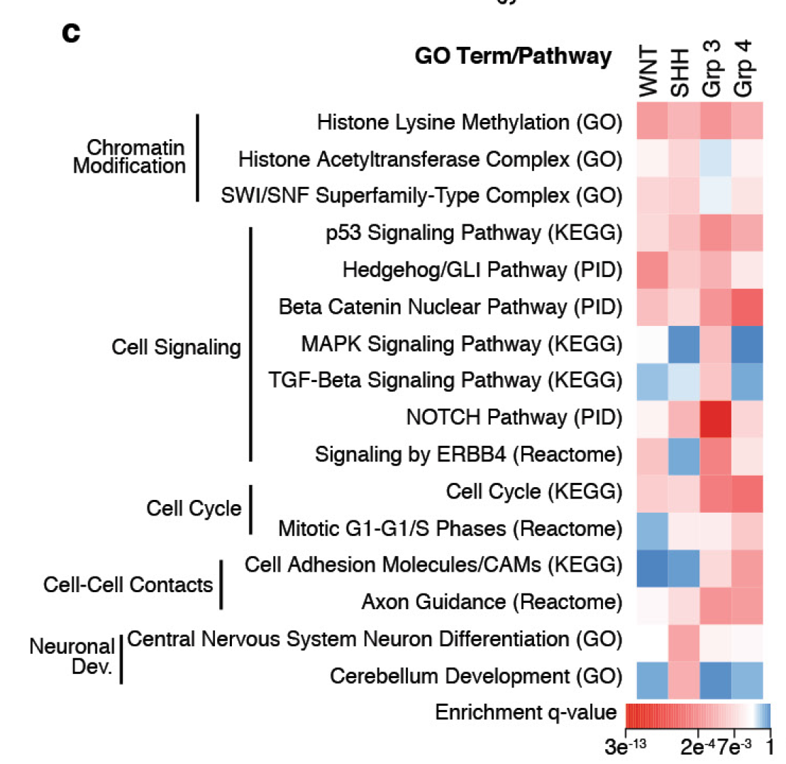

**Author(s)**: `r params$author`  
**Date**: `r Sys.Date()`  


# Academic Citation
If you use this code in your work or research, we kindly request that you cite our publication:

Xiaofan Lu, et al. (2025). FigureYa: A Standardized Visualization Framework for Enhancing Biomedical Data Interpretation and Research Efficiency. iMetaMed. https://doi.org/10.1002/imm3.70005

```{r setup, include=FALSE}
knitr::opts_chunk$set(echo = TRUE)
# 设置knitr的全局代码块选项 / Set global chunk options for knitr
```

## 需求描述

富集分析得到太多term，其中好多还是相似的，怎样合理的合并？clusterProfiler有一个simplify函数，能给富集分析结果瘦身by removing redundancy of enriched GO terms，但有时瘦的不够多。

FigureYa80GOclustering用GOSemSim计算GO term之间的相似性，但是只能合并GO注释，对其他来源的注释无能为力。

想要合并来源于不同数据库的term，参考DAVID的方法。

## Requirement description

Enrichment analysis yields too many terms, many of which are still similar. How to merge them reasonably? ClusterProfiler has a simplify function that can thin down enriched GO terms by removing redundancy of enriched GO terms, but sometimes not enough weight is lost.

FigureYa80GOclustering uses GOSemSim to calculate the similarity between GO terms, but can only merge GO annotations and cannot handle annotations from other sources.

To merge terms from different databases, refer to DAVID's method.



出自<https://www.nature.com/articles/nature22973>

from<https://www.nature.com/articles/nature22973>

**方法探讨：**

DAVID给gene或annotation做分类的原理：<https://david.ncifcrf.gov/helps/functional_classification.html>，包括kappa的计算和heuristic fuzzy partition algorithm。

H Ma等写了R代码来计算Kappa value：[Use of DAVID algorithms for clustering custom annotated gene lists in a non-model organism, rainbow trout](https://bmcresnotes.biomedcentral.com/articles/10.1186/s13104-018-3154-7)。作者在补充材料里提供了R代码：[Additional file 1. R_script for clustering.](https://www.ncbi.nlm.nih.gov/pmc/articles/PMC5781295/bin/13104_2018_3154_MOESM1_ESM.txt)，包含两部分，第一部分：计算Kappa value，第二部分：设置kappa的cutoff筛选。

基于这篇文章提供的代码里的第一部分来计算Kappa value。然后借助ggtree展示各个term之间的关系，并实现例文中相似term的标注效果。

**Method exploration:**

The principle of DAVID classifying genes or annotations:< https://david.ncifcrf.gov/helps/functional_classification.html >Including kappa calculations and heuristic fuzzy partition algorithms.

H Ma and others wrote R code to calculate Kappa value：[Use of DAVID algorithms for clustering custom annotated gene lists in a non-model organism, rainbow trout]( https://bmcresnotes.biomedcentral.com/articles/10.1186/s13104-018-3154-7 ）The author provided R code in the supplementary materials: [Additional file 1. R_script for clustering.]（ https://www.ncbi.nlm.nih.gov/pmc/articles/PMC5781295/bin/13104_2018_3154_MOESM1_ESM.txt ）It consists of two parts, the first part is to calculate the Kappa value, and the second part is to set the cutoff filter for Kappa.

Calculate Kappa value based on the first part of the code provided in this article. Then use ggtree to display the relationships between various terms and achieve the annotation effect of similar terms in the example text.

## 应用场景

基于term里的基因间overlap来衡量term之间的相似性。

计算Kappa value，可用于找相似的注释、给相似的注释归类。

原理见：<https://david.ncifcrf.gov/helps/linear_search.html#kappa>

## Application scenarios

Measure the similarity between terms based on the overlap between genes in the term.

Calculate Kappa value, which can be used to find similar annotations and classify them.

The principle is as follows:< https://david.ncifcrf.gov/helps/linear_search.html#kappa >

## 环境设置

## Environment settings

```{r}
source("install_dependencies.R")

# 加载ape包，用于系统发育树分析和比较基因组学
# Load the ape package for phylogenetic tree analysis and comparative genomics
library(ape)

# 加载ggtree包，用于可视化和注释系统发育树
# Load the ggtree package for visualizing and annotating phylogenetic trees
library(ggtree)

# 加载scales包，用于ggplot2中的坐标轴缩放和格式化
# Load the scales package for axis scaling and formatting in ggplot2
library(scales)

# 加载ggplot2包，用于创建优雅的数据可视化
# Load the ggplot2 package for creating elegant data visualizations
library(ggplot2)

# 拼图
# Combing
library(patchwork)
library(ggplotify)

# 设置环境变量，使R显示英文错误信息
# Set environment variable to display error messages in English
Sys.setenv(LANGUAGE = "en")

# 禁止R自动将字符向量转换为因子类型
# Prevent R from automatically converting character vectors to factors
options(stringsAsFactors = FALSE)
```

## 输入文件

easy_input.csv，注释信息跟Gene ID的对应关系。至少包含两列：

- 第一列：GO、KEGG等无所谓什么来源的注释term；
- 第二列：Gene ID，此处是ENTREZ ID，也可以是gene symbol等无所谓什么来源的基因ID。
- 后面画热图时需要的logFC、Pvalue、zscore等信息也放在这里。如果要多组富集分析结果做对比，也都放到这里。多组合并的方法可参考FigureYa80GOclustering。

## Input file

easy_input.csv， The correspondence between annotation information and Gene ID. Include at least two columns:

-First column: Annotation terms such as GO, KEGG, etc. that do not matter what source they come from;
-Second column: Gene ID, here is ENTREZ ID, which can also be gene symbols or other gene IDs of no particular origin.
-The logFC, Pvalue, zscore and other information required for drawing heat maps later are also included here. If multiple sets of enrichment analysis results need to be compared, they should also be placed here. The method of merging multiple groups can refer to FigureYa80GOclustering.

```{r}
# 从CSV文件中读取数据并存储到数据框D中
# Read data from a CSV file and store it in data frame D
D <- read.csv("easy_input.csv")

# 显示数据框D的前几行，便于快速查看数据结构
# Display the first few rows of data frame D for a quick structure overview
head(D)
```

## 计算Kappa value，用它来衡量注释之间的相似性

## Calculate Kappa value to measure the similarity between annotations

```{r}
# 按基因标识符对数据框进行升序排序
# Sort the data frame by gene identifier in ascending order
D <- D[order(D$Gene_identifier),]

# 获取数据框的总行数（总条目数）
# Get the total number of rows (entries) in the data frame
Total_N <- nrow(D)

# 提取唯一的基因标识符记录，避免重复计算
# Extract unique gene identifiers to avoid duplicate calculations
D_unique <- D[!duplicated(D$Gene_identifier),]

# 获取唯一基因的数量
# Get the number of unique genes
N <- nrow(D_unique)

# 提取唯一的注释信息记录
# Extract unique annotation information records
Cat_unique <- D[!duplicated(D$Annotation_information),]

# 获取唯一注释信息的数量
# Get the number of unique annotation categories
M <- nrow(Cat_unique)

# 输出输入文件的总行数信息
# Print the total number of rows in the input file
paste("Total number of rows in your input file:", Total_N)

# 输出唯一基因标识符的总数
# Print the total number of unique gene identifiers
paste("Total number of unique gene identifiers:", N)

# 输出唯一基因注释信息的总数
# Print the total number of unique gene annotation categories
paste("Total number of unique gene annotation information:", M)

# 创建用于存储Kappa值的矩阵，维度为(M+1)×(M+1)
# Create a matrix to store Kappa values with dimensions (M+1)×(M+1)
Kappa_matrix <- matrix(0, M+1, M+1)

# 初始化Kappa矩阵的行和列名称为注释类别
# Initialize row and column names of the Kappa matrix with annotation categories
for (i in 1:M){
  Kappa_matrix[i+1,1] = Cat_unique[i,1]  # 第一列存储注释类别名称 / The first column stores annotation category names
  Kappa_matrix[1,i+1] = Cat_unique[i,1]  # 第一行存储注释类别名称 / The first row stores annotation category names
}

# 创建基因-注释矩阵，行为注释，列为基因
# Create a gene-annotation matrix with annotations as rows and genes as columns
Gene_Cat_matrix <- matrix(0, M+1, N+1)

# 设置基因-注释矩阵的第一列（注释类别名称）
# Set the first column of the gene-annotation matrix (annotation category names)
for (i in 1:M){
  Gene_Cat_matrix[i+1,1] = Kappa_matrix[i+1,1]
}

# 设置基因-注释矩阵的第一行（基因名称）
# Set the first row of the gene-annotation matrix (gene names)
for (j in 1:N){
  Gene_Cat_matrix[1,j+1] = D_unique[j,2]
}

# 移除临时数据框，释放内存
# Remove temporary data frames to free memory
rm(D_unique, Cat_unique)

# 生成基因-注释关联的双向表
# Generate a two-way table of gene-annotation associations
for (i in 1:M){
  # 筛选出属于当前注释类别的所有记录
  D1 <- subset(D, Annotation_information == Gene_Cat_matrix[i+1,1])
  N1 <- nrow(D1)
  
  # 遍历所有基因，标记哪些基因属于当前注释类别
  for (j in 1:N){
    for (k in 1:N1){
      # 如果当前基因与当前注释匹配，则在矩阵中标记为1
      if (Gene_Cat_matrix[i+1,1] == D1[k,1] && Gene_Cat_matrix[1,j+1] == D1[k,2]){
        Gene_Cat_matrix[i+1,j+1] = 1
      }
    }
  }
}

# 移除临时数据框，释放内存
# Remove temporary data frame to free memory
rm(D1)

# 计算所有注释类别对之间的Kappa值（一致性度量）
# Calculate Kappa values (a measure of agreement) between all pairs of annotation categories
for(i in 2:(M+1)){
  for (j in 2:(M+1)){
    if (i == j){
      # 同一注释类别的Kappa值为1
      # Kappa value for the same category is 1
      Kappa_matrix[i,j] = 1
    }
    if(i < j){
      # 初始化四格表的四个单元格计数
      # Initialize cells of the contingency table
      a <- 0; b <- 0; c <- 0; d <- 0
      
      # 计算每个注释类别下的基因数量
      # Calculate number of genes in each category
      sum1 <- sum(as.numeric(Gene_Cat_matrix[i,2:(N+1)]))
      sum2 <- sum(as.numeric(Gene_Cat_matrix[j,2:(N+1)]))
      
      # 计算四格表的四个单元格值
      # Compute contingency table cells
      for (k in 2:(N+1)){
        if (Gene_Cat_matrix[i,k] == 1 && Gene_Cat_matrix[j,k] == 1){
          a <- a + 1  # 两个注释类别都有的基因数量 / Genes in both categories
        }
      }
      
      # 计算其他三个单元格的值
      # Compute remaining cells
      b <- sum1 - a  # 只在第一个注释类别中的基因数量 / Genes only in category 1
      c <- sum2 - a  # 只在第二个注释类别中的基因数量 / Genes only in category 2
      d <- N + a - sum1 - sum2  # 两个注释类别都没有的基因数量 / Genes in neither category
      
      # 使用四格表数据计算Kappa值（Cohen's Kappa）
      # Calculate Cohen's Kappa using contingency table
      Kappa_matrix[i,j] <- ((a+d)*N - (a+b)*(a+c) - (c+d)*(b+d)) / 
                          (N^2 - (a+b)*(a+c) - (c+d)*(b+d))
      
      # Kappa矩阵是对称的，因此i,j和j,i的值相同
      # Kappa matrix is symmetric, so copy value to symmetric position
      Kappa_matrix[j,i] = Kappa_matrix[i,j]
    }
  }
}
# 将Kappa矩阵写入文本文件，使用制表符分隔，不使用引号，不包含行名和列名
# Write the Kappa matrix to a text file with tab-separation, no quotes, and no row/column names
write.table(Kappa_matrix, "kappa_matrix.txt", sep="\t", quote = F, col.names = F, row.names = F)
```

## 开始画图

下面的画图代码跟FigureYa80GOclustering相似。

## Start drawing

The following drawing code is similar to FigureYa80GOclustering.

```{r, fig.width=6, fig.height=8}
# 从制表符分隔的文本文件中读取Kappa相似性矩阵
# 假设文件包含表头，且第一列作为行名
# Read the Kappa similarity matrix from a tab-separated text file
# Assume the file has a header and the first column contains row names
ego.sim <- read.table("kappa_matrix.txt", sep="\t", header = T, row.names = 1)

# 将相似性矩阵转换为距离矩阵(1-相似度)，并使用邻接法构建系统发育树
# Convert the similarity matrix to a distance matrix (1-similarity) 
# and construct a phylogenetic tree using the Neighbor-Joining method
tree <- nj(as.dist(1-ego.sim))

# 使用ggtree包可视化系统发育树
# Visualize the phylogenetic tree using the ggtree package
p <- ggtree(tree) + 
  geom_tiplab() +                 # 在树的末端添加标签(注释术语) / Add tip labels (annotated terms) at tree ends
  geom_text2(aes(subset=!isTip, label=node), hjust=-.3) +  # 在内部节点添加节点编号 / Add node numbers to internal nodes
  coord_cartesian(xlim=c(-.1,1.3))  # 设置X轴坐标范围，为树的左右两侧留出适当空间 / Set X-axis range to leave space on both sides
# 显示生成的系统发育树
# Display the generated phylogenetic tree
p
```

```{r, fig.width=12, fig.height=8}
# 根据树的结构和背景知识，将注释术语分为4类
# 记录每一类的节点编号，用于后续的分组着色
# Group the annotation terms into 4 categories based on tree structure and prior knowledge
# Record node IDs for each category to enable grouped coloring
node <- c(41, 39, 46, 40)

# 使用groupClade函数将树的特定节点及其所有后代标记为一个组
# 这有助于后续按组对树进行可视化
# Use groupClade to mark specific nodes and their descendants as groups
# This facilitates visualizing different clades with distinct colors
gtree <- groupClade(tree, .node = node)

# 定义4个明确的颜色（避免使用hue_pal()）
# Define 4 distinct colors (avoid using hue_pal())
category_colors <- c("#1f77b4", "#ff7f0e", "#2ca02c", "#d62728")  # 蓝色, 橙色, 绿色, 红色

# 使用ggtree绘制系统发育树，根据之前定义的组对树枝进行着色
# 不同颜色的树枝将直观展示我们之前定义的4个类别
# Visualize the phylogenetic tree with branches colored by predefined groups
# Each color represents one of the 4 predefined categories
pbase <- ggtree(gtree, aes(color = factor(group))) +
  scale_color_manual(values = category_colors)

# 为4类术语分别创建总结短语作为分类名，并标注在树的旁边
# Create summary phrases for 4 term categories as class names and annotate beside the tree

# 定义字体大小和标签偏移量
# Define font size and offset for category labels
fontsize <- 4  # 字体大小 / Font size
offset <- 0.8   # 标签向右偏移量，控制标签位置 / Right offset for labels to control positioning

# 在基础树图上添加分类标签和调整显示范围
# Add category labels to the tree and adjust the display range
pnode <- pbase + 
  # 显示叶节点标签并对齐
  # Display and align tip labels
  geom_tiplab(size = 4, align = TRUE) +
  
  # 为每个分类组添加标签，使用预定义的颜色
  # Add labels for each category group with predefined colors
  geom_cladelabel(node = node[1], align = TRUE, 
                  color = category_colors[1], 
                  fontsize = fontsize, offset = offset, label = "pathway1") +
  geom_cladelabel(node = node[2], align = TRUE, 
                  color = category_colors[2], 
                  fontsize = fontsize, offset = offset, label = "pathway2") +
  geom_cladelabel(node = node[3], align = TRUE, 
                  color = category_colors[3], 
                  fontsize = fontsize, offset = offset, label = "pathway3") +
  geom_cladelabel(node = node[4], align = TRUE, 
                  color = category_colors[4], 
                  fontsize = fontsize, offset = offset, label = "pathway4") +
  
  # 调整X轴范围，确保图形有足够空间展示
  # Adjust X-axis range to ensure adequate display space
  coord_cartesian(xlim = c(-0.1, 1.5)) +
  
  # 移除图例（可选）
  # Remove legend (optional)
  theme(legend.position = "none")

# 准备热图数据：提取唯一的注释信息及其统计值(adj_pval和zscore)
# Prepare heatmap data: extract unique annotations and their statistics (adj_pval and zscore)
ego.m <- unique(D[, c(1, 4:5)])
rownames(ego.m) <- ego.m$Annotation_information
ego.m$Annotation_information <- NULL

# 确保热图数据与树形图的标签顺序一致
# Ensure heatmap data matches the order of tree labels
if (!is.null(tree$tip.label)) {
  ego.m <- ego.m[tree$tip.label, ]
}

# 在添加热图之前，先检查并修复可能的S7对象问题
# Check and fix potential S7 object issues before adding heatmap

# 方法1：尝试使用不同的方式添加热图
tryCatch({
  # 在树形图右侧添加热图，展示每个注释类别的统计数据
  # Add a heatmap to the right of the tree to show statistical data for each annotation
  final_plot <- gheatmap(pnode, ego.m, 
           offset = 0.7,        # 热图向右偏移量 / Heatmap horizontal offset
           width = 0.12,       # 热图宽度 / Heatmap width
           colnames_angle = 90, 
           colnames_offset_y = 0.1,  # 列名垂直偏移
           hjust = 0,          # 水平对齐方式
           low = "red",        # 低值颜色
           high = "white",     # 高值颜色
           color = "grey50") + # 格子边框颜色
    theme(legend.position = "right")
  
  # 显示图形
  print(final_plot)
  
  # 将最终可视化结果保存为PDF文件
  # Save the final visualization as a PDF file
  ggsave("DAVIDkappa.pdf", plot = final_plot, width = 12, height = 8)
  
}, error = function(e) {
  
  # 如果方法1失败，尝试替代方法
  cat("方法1失败，尝试替代方法...\n")
  cat("错误信息:", e$message, "\n")
  
  # 方法2：分别绘制树和热图，然后组合
  
  # 绘制树图
  tree_plot <- pnode
  
  # 绘制热图
  heatmap_data <- as.data.frame(ego.m)
  heatmap_data$term <- rownames(heatmap_data)
  heatmap_data_long <- reshape2::melt(heatmap_data, id.vars = "term")
  
  heatmap_plot <- ggplot(heatmap_data_long, aes(x = variable, y = term, fill = value)) +
    geom_tile() +
    scale_fill_gradient(low = "red", high = "white") +
    theme_minimal() +
    theme(axis.text.x = element_text(angle = 90, hjust = 1),
          axis.text.y = element_blank(),
          axis.title = element_blank())
  
  # 组合图形
  combined_plot <- tree_plot + heatmap_plot + 
    plot_layout(widths = c(3, 1))
  
  print(combined_plot)
  ggsave("DAVIDkappa_alternative.pdf", plot = combined_plot, width = 12, height = 8)
})
```

# Session Info

```{r}
sessionInfo()
```