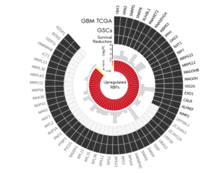

**Author(s)**: `r params$author`  
**Reviewer(s)**: `r params$reviewer`  
**Date**: `r Sys.Date()`  

# Academic Citation
If you use this code in your work or research, we kindly request that you cite our publication:

Xiaofan Lu, et al. (2025). FigureYa: A Standardized Visualization Framework for Enhancing Biomedical Data Interpretation and Research Efficiency. iMetaMed. https://doi.org/10.1002/imm3.70005

```{r setup, include=FALSE}
knitr::opts_chunk$set(echo = TRUE)
```

## 需求描述

用R画出paper里的这种圆圈图。

## Requirement description

Draw the circle diagram in the paper using R.



出自<https://genomebiology.biomedcentral.com/articles/10.1186/s13059-016-0990-4>

from<https://genomebiology.biomedcentral.com/articles/10.1186/s13059-016-0990-4>

Fig. 2 Candidates’ selection and characterization. a. Circos plot shows **58 upregulated RNA-binding proteins (RBPs)** in glioblastoma (GBM) samples from The Cancer Genome Atlas (TCGA) and glioma stem cell (GSC) lines. **Fold-changes and corrected p-values** were extracted from the RNA-Seq analysis (GBM TCGA). Twenty-one RBPs were also associated with survival reduction and were further investigated.

## 应用场景

圆圈图上用热图、柱形图、热图展示多组数据、pvalue和log2FC，可灵活换成其他特征值。

## Application scenarios

Use heatmaps, bar charts, and heatmaps on the circle chart to display multiple sets of data, p-values, and log2FC, which can be flexibly replaced with other feature values.

## 环境设置
## Environment settings

```{r}
source("install_dependencies.R")

# 加载数据处理和可视化所需的包
# Load packages required for data processing and visualization
library(readxl)      # 用于读取Excel文件 / For reading Excel files
library(magrittr)    # 提供管道操作符 %>% / Provides pipe operator %>%
library(dplyr)       # 数据处理工具集 / Data manipulation toolkit
library(tibble)      # 增强型数据框 / Enhanced data frames
library(ggplot2)     # 用于数据可视化 / For data visualization

# 设置环境选项
# Set environment options
Sys.setenv(LANGUAGE = "en")  # 设置英文错误信息，便于查找解决方案 / Set English error messages for easier troubleshooting
options(stringsAsFactors = FALSE)  # 禁止自动将字符串转换为因子类型，避免数据类型意外转换 / Prevent automatic conversion of strings to factors
```

## 输入数据的整理

如果你的数据已经整理成easy_input.csv的格式，就可以跳过这步，直接进入“输入文件”。

从文献中看，需要读取`TableS2.TCGA_GBM_DiffExpRBPs`和`TableS3.GSCs_DiffExpRBPs`两个sheet。

另外，图中基因是按照Survival Reduction排列的，根据图反推survival Reduction，保存在survival.csv文件里。

## Organizing input data

If your data has already been organized into easy_input.csv format, you can skip this step and directly enter "Input File".

According to the literature, it is necessary to read two sheets, 'TableS2. TCGA-GBM-DiffExpRBPs' and' TableS3. GSCs_DiffExpRBPs'.

In addition, the genes in the figure are arranged according to the Survival Reduction. Based on the figure, the Survival Reduction is deduced and saved in the Survival.csv file.

```{r}
## 读取第2个工作表
# Read the second worksheet
# 从Excel文件中读取指定范围数据，设置表头并限制数据探测行数
sheet1 <- read_excel(path = "13059_2016_990_MOESM1_ESM.xls", sheet = 2, range = cell_cols("B:D"), col_names = TRUE, guess_max = 5) 

## 读取第3个工作表
# Read the third worksheet
# 从Excel文件中读取指定范围数据，移除第二列后存储
sheet2 <- read_excel(path = "13059_2016_990_MOESM1_ESM.xls", sheet = 3, range = cell_cols("B:E"), col_names = TRUE, guess_max = 5) %>% .[,-2]

# 首先重命名变量，原来的变量名太长了
# Rename columns for clarity
colnames(sheet1) <- c("Gene", "log2FC", "P_value")  # 重命名工作表1的列名 / Rename columns of sheet1
colnames(sheet2) <- c("Gene", "log2FC", "P_value")  # 重命名工作表2的列名 / Rename columns of sheet2

# Circos plot shows 58 upregulated RNA-binding proteins (RBPs) in glioblastoma (GBM) samples from The Cancer Genome Atlas (TCGA) and glioma stem cell (GSC) lines. 
# 根据文献中的要求，首先筛选log2FC大于0的基因
# Filter genes with log2 fold change >= 0 as required by the literature
sheet1 %<>% filter(log2FC >= 0)  # 筛选工作表1中log2FC非负的基因 / Filter upregulated genes in sheet1
sheet2 %<>% filter(log2FC >= 0) %>% select(Gene)  # 筛选工作表2中log2FC非负的基因并仅保留基因列 / Filter and select genes in sheet2

# Fold-changes and corrected p-values were extracted from the RNA-Seq analysis (GBM TCGA)
# 根据Gene取交集，保留GBM的Fold-changes和corrected p-values
# Merge datasets by gene intersection, retaining GBM fold changes and p-values
sheet_bind <- inner_join(sheet1, sheet2, by = "Gene") %>% 
  distinct(Gene, .keep_all = TRUE)  #去重 / Remove duplicate entries
sheet_bind$GBM <- rep(1, nrow(sheet_bind))  # 添加GBM标识列 / Add GBM indicator column
sheet_bind$GSC <- rep(1, nrow(sheet_bind))  # 添加GSC标识列 / Add GSC indicator column

# 跟Survival Reduction合并
# Merge with survival reduction data
surInfo <- read.csv("survival.csv")  # 读取生存分析数据 / Read survival data
head(surInfo)  # 查看数据结构 / View data structure
#先按基因名降序排列基因名
# Sort genes by name in descending order
surInfo <- arrange(surInfo, desc(Gene))
#合并后按survival降序排列
# Merge datasets and sort by survival in descending order
data_bind <- left_join(surInfo, sheet_bind, by = "Gene") %>% arrange(desc(survival)) 
head(data_bind)  # 查看合并结果 / View merged data

# 导出分析结果为CSV文件
# Export analysis results to CSV
write.csv(data_bind, "easy_input.csv", quote = F, row.names = F)
```

## 输入文件

至少包含基因、log2FC、P_value，给出一列或多列的01用于画最外面的圈。

此处把GBM、GSC、survival画到最外面的三个圈上，有就是1（最后显示为黑色），无就是0（最后显示为浅灰色）。

用柱形图展示log2FC，用热图展示P value。

## Input file

At least including genes log2FC、P_value， Give one or more columns of 01 to draw the outermost circle.

Draw GBM, GSC, and Survival on the outermost three circles here, where '1' represents' 1 '(displayed in black) and' 0 'represents' 0' (displayed in light gray).

Display log2FC using a bar chart and P value using a heatmap.

```{r}
# 读取之前导出的CSV文件，指定各列数据类型
# Read the previously exported CSV file, specifying data types for each column
data_bind <- read.csv("easy_input.csv", 
                      colClasses=c('character',  # Gene列作为字符型 / Gene column as character
                                  'numeric',   # survival列作为数值型 / survival column as numeric
                                  'numeric',   # GBM_log2FC列作为数值型 / GBM_log2FC column as numeric
                                  'numeric',   # GBM_P_value列作为数值型 / GBM_P_value column as numeric
                                  'numeric',   # GSC列作为数值型 / GSC column as numeric
                                  'numeric'))  # GBM列作为数值型 / GBM column as numeric

# 查看数据的基本结构和前几行
# View the basic structure and first few rows of the data
head(data_bind)
```

## 开始画图

### 首先画外面的3个环  

环形文字的写法：<https://www.r-graph-gallery.com/296-add-labels-to-circular-barplot/>

## Start drawing

### First, draw the three outer rings

The writing style of circular text:< https://www.r-graph-gallery.com/296-add-labels-to-circular-barplot/ >

```{r}
# 三个环的坐标设置：稍高于log2FC的最大值，确保数据点不重叠
# Coordinates for the three outer rings: Slightly higher than the maximum log2FC value to avoid overlap
h <- max(data_bind$log2FC) + 0.2

# 创建环形图坐标数据框
# Create coordinate dataframe for circular plot
tile_coord <- data.frame(
  Gene = data_bind$Gene, 
  x = 1:nrow(data_bind),          # x是中间x坐标 / Middle x-coordinate for each gene
  y1 = h, y2 = h + 2, y3 = h + 4, # 最外围三个圈的y坐标 / y-coordinates for the three outer rings
  stringsAsFactors = FALSE
)

# 设置基因名称显示参数
# Set parameters for gene name display
Angle_space <- 8    # 设置角度空隙大小 / Angular spacing between genes
Angle_just <- 90    # 角度偏移量 / Angular offset for text alignment

# 计算每个基因的角度位置
# Calculate angular positions for each gene
unit_angle <- 360 / (nrow(tile_coord) + Angle_space + 0.5)  # 单位角度 / Angular unit per gene
text_angle <- Angle_just - cumsum(rep(unit_angle, nrow(tile_coord)))  # 文本角度 / Text rotation angle

# 根据角度调整文本对齐方式，避免文字倒置
# Adjust text alignment to prevent upside-down labels
tile_coord$hjust <- ifelse(text_angle < -90, 1, 0)  # 水平对齐方式 / Horizontal alignment
tile_coord$text_angle <- ifelse(text_angle < -90, text_angle + 180, text_angle)  # 修正极端角度 / Correct extreme angles

# 合并坐标数据与原始数据
# Merge coordinate data with original dataset
data_result <- left_join(data_bind, tile_coord, by = "Gene")
head(data_result)

# 使用ggplot2创建环形图
# Create circular plot using ggplot2
p1 <- ggplot(data_result) + 
  # 第一圈：生存状态(Survival)
  # First ring: Survival status
  geom_tile(data = filter(data_result, survival == 1),
            aes(x = x, y = y1, width = 1, height = 2), 
            fill = "grey20", color = "lightgrey", size = .3) +  # 生存组 / Survival group
  geom_tile(data = filter(data_result, survival == 0),
            aes(x = x, y = y1, width = 1, height = 2),
            fill = "grey96", color = "lightgrey", size = .3) +  # 非生存组 / Non-survival group
  
  # 第二圈：GSC状态
  # Second ring: GSC status
  geom_tile(data = filter(data_result, GSC == 1),
            aes(x = x, y = y2, width = 1, height = 2), 
            fill = "grey20", color = "lightgrey", size = .3) +  # GSC阳性 / GSC positive
  # 如果有0值，取消下面三行注释
  # Uncomment below if there are GSC negative values
  # geom_tile(data = filter(data_result, GSC == 0),
  #          aes(x = x, y = y2, width = 1, height = 2),
  #          fill = "grey96", color = "lightgrey", size = .3) + 
  
  # 第三圈：GBM状态
  # Third ring: GBM status
  geom_tile(data = filter(data_result, GBM == 1),
            aes(x = x, y = y3, width = 1, height = 2), 
            fill = "grey20", color = "lightgrey", size = .3) +  # GBM阳性 / GBM positive
  # 如果有0值，取消下面三行注释
  # Uncomment below if there are GBM negative values
  # geom_tile(data = filter(data_result, GBM == 0),
  #          aes(x = x, y = y3, width = 1, height = 2),
  #          fill = "grey96", color = "lightgrey", size = .3) + 
  # 如果需要更多圈，可以继续添加
  
  # 添加基因名称标签：survival为1的基因名为黑色，否则为浅灰色
  # Add gene names: Black for survival=1, grey for survival=0
  geom_text(data = filter(data_result, survival == 1),
            aes(x = x, y = y3 + 1.6, label = Gene,
                angle = text_angle, hjust = hjust), color = "black", size = 2) + 
  geom_text(data = filter(data_result, survival == 0),
            aes(x = x, y = y3 + 1.6, label = Gene,
                angle = text_angle, hjust = hjust), color = "grey43", size = 2) + 
  
  # 转换为极坐标系统
  # Convert to polar coordinates
  coord_polar(theta = "x", start = 0, direction = 1) + 
  ylim(-5,13) +  # 设置y轴范围 / Set y-axis limits
  xlim(0, nrow(data_bind) + Angle_space) +  # 设置x轴范围 / Set x-axis limits
  theme_void()  # 使用空白主题 / Apply minimal theme
p1  # 显示图形 / Display plot
```

### 画`log2FC`

log2FC的y坐标从1开始，因此画图时要“y = log2FC - 1”

### Draw 'log2FC'`

The y-coordinate of log2FC starts from 1, so when drawing, it should be "y=log2FC -1"
```{r}
# 在原有图形(p1)基础上叠加柱状图层，展示log2FC数据
# Add bar chart layer to the original plot (p1) to show log2FC values
p2 <- p1 + 
  geom_col(
    aes(x = x, y = log2FC - 1),  
    fill = "grey85",             
    color = "grey80"             
  )

p2  
```


### 添加log2FC的坐标轴及刻度文字

### Add coordinate axis and scale text for log2FC

```{r}
# 在原有图形(p2)基础上添加坐标轴标记和参考线
# Add axis markers and reference lines to the existing plot (p2)
p3 <- p2 + 
  # 添加垂直参考线（从原点到y=3）
  # Add vertical reference line from origin to y=3
  geom_segment(
    x = 0, y = 0, xend = 0, yend = 3,  
    color = "black", size = .3         
  ) + 
  
  # 添加y轴刻度标签（1-4）
  # Add y-axis tick labels (1-4)
  geom_text(x = -.5, y = 0, label = "1_", vjust = -.3, size = 1, color = "black") +  
  geom_text(x = -.5, y = 1, label = "2_", vjust = -.3, size = 1, color = "black") +  
  geom_text(x = -.5, y = 2, label = "3_", vjust = -.3, size = 1, color = "black") +  
  geom_text(x = -.5, y = 3, label = "4_", vjust = -.3, size = 1, color = "black")    

p3  
```

### 画`P_value`热图

### Draw a 'P_value' heatmap

```{r}
# 在原有图形(p3)基础上添加P值热图层
# Add P-value heatmap layer to the existing plot (p3)
p4 <- p3 + 
  # 添加P值热图：位于y=-1.2位置，每个基因对应一个矩形
  # Add P-value heatmap: Positioned at y=-1.2, each gene is represented by a rectangle
  geom_tile(
    aes(x = x, y = -1.2, width = 1, height = 2, fill = P_value),  
    color = "white" 
  ) + 
  
  # 设置填充颜色渐变：P值越小颜色越深（firebrick3），越大颜色越浅（yellow）
  # Set color gradient: Smaller P-values are darker (firebrick3), larger values are lighter (yellow)
  scale_fill_gradient(
    low = "firebrick3",  
    high = "yellow"      
  ) 

p4  
```


### 插入文本

### Insert Text

```{r}
# 在原有图形(p4)基础上添加各数据层的文本标签
# Add text labels for each data layer to the existing plot (p4)

# First, ensure 'h' is properly defined (this should be defined earlier in your code)
# If not, you'll need to calculate or define an appropriate value for h
# h <- [appropriate value based on your data]

p5 <- p4 + 
  # 添加GBM TCGA层标签
  # Label for GBM TCGA layer
  geom_text(aes(x = -2.1, y = h + 4.5, label = "GBM TCGA"), 
            size = 3, color = "black", inherit.aes = FALSE) + 
  
  # 添加GSCs层标签
  # Label for GSCs layer
  geom_text(aes(x = -1.1, y = h + 2.5, label = "GSCs"), 
            size = 3, color = "black", inherit.aes = FALSE) + 
  
  # 添加Survival Reduction层标签（支持换行）
  # Label for Survival Reduction layer (with line break)
  geom_text(aes(x = -1.8, y = h + 0.5, label = "Survival\nReduction"), 
            size = 2.5, color = "black", inherit.aes = FALSE) + 
  
  # 添加Log2FC坐标轴标签（旋转90度）
  # Label for Log2FC axis (rotated 90 degrees)
  geom_text(aes(x = -2.1, y = h - 2.4, label = "Log[2]~FC"), 
            angle = 90, size = 2.2, color = "black", parse = TRUE, inherit.aes = FALSE) + 
  
  # 添加p-value热图层标签（旋转90度）
  # Label for p-value heatmap (rotated 90 degrees)
  geom_text(aes(x = -3.3, y = h - 5, label = "p-value"), 
            angle = 90, size = 1.5, color = "black", inherit.aes = FALSE) + 
  
  # 添加中心标题（支持换行）
  # Add center title (with line break)
  geom_text(aes(x = 0, y = -5, label = "Upregulated\nRBPs"), 
            size = 2.5, color = "black", inherit.aes = FALSE)

p5
```

### 画P value的图例 

将图例调整到panel内部，并且调节文本的相对大小和相对位置。   


### Draw a legend for P value

Adjust the legend inside the panel and adjust the relative size and position of the text.

```{r}
# 在原有图形(p5)基础上添加p值参考刻度和图例
# Add p-value reference scale and legend to the existing plot (p5)
p6 <- p5 +
  # 添加p值=0的参考标记
  # Add reference mark for p-value=0
  geom_text(x = -.5, y = -0.2, label = 0, size = 1, color = "black") + 
  
  # 添加p值=0.05的参考标记（对应热图中黄色区域）
  # Add reference mark for p-value=0.05 (corresponding to yellow area in heatmap)
  geom_text(x = -1.8, y = -2, label = 0.05, size = 1, color = "black") + 
  
  # 自定义颜色渐变图例
  # Customize color gradient legend
  guides(fill = guide_colorbar(
    title = "",                
    reverse = TRUE,            
    label = FALSE,             
    barwidth = 0.1,            
    barheight = 1.1            
  )) + 
  
  # 设置图例位置和样式
  # Set legend position and style
  theme(
    legend.position = c(0.5, 0.585),  
    legend.title = element_blank()    
  )

p6  # 显示最终图形

# 保存图形为PDF文件
# Save the plot as a PDF file
ggsave("ggplotCircos.pdf")
```

## 后期加工

前面的代码通过x和y的值一点一点调整好文字和图例的位置。

更容易的做法是：用矢量图编辑软件打开pdf文件，用鼠标调整。

## Post processing

The previous code adjusted the position of the text and legend bit by bit based on the values of x and y.

An easier approach is to open the PDF file with vector graphics editing software and adjust it with the mouse.

# Session Info

```{r}
sessionInfo()
```