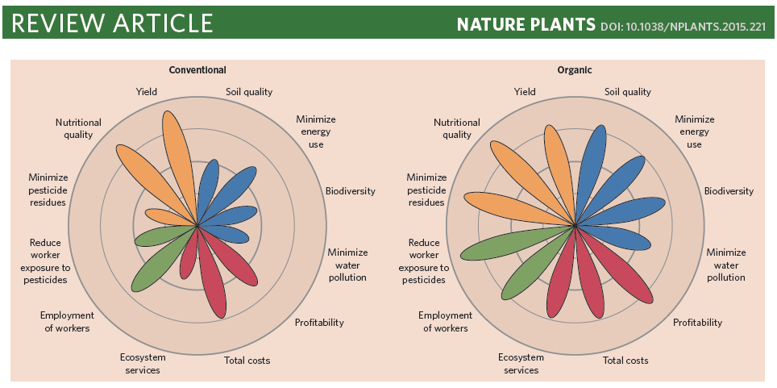
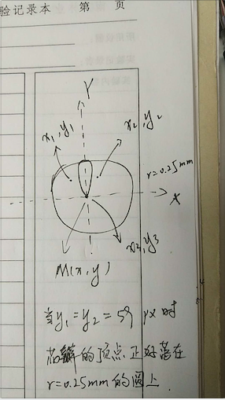

**Author(s)**: `r params$author`  
**Date**: `r Sys.Date()`  


# Academic Citation
If you use this code in your work or research, we kindly request that you cite our publication:

Xiaofan Lu, et al. (2025). FigureYa: A Standardized Visualization Framework for Enhancing Biomedical Data Interpretation and Research Efficiency. iMetaMed. https://doi.org/10.1002/imm3.70005

```{r setup, include=FALSE}
knitr::opts_chunk$set(echo = TRUE)
```

## 需求描述
## Requirement description

用R代码画出paper里的图

Draw the figure in paper with R code



出自<https://www.nature.com/articles/nplants2015221>

from<https://www.nature.com/articles/nplants2015221>

## 使用场景
## Usage scenario

场景一：评估一个总体的不同组分的比例变化

场景二：评价同一衡量体系下的各项不同指标

Scenario 1: Evaluate the proportional changes of different components of a whole

Scenario 2: Evaluate different indicators under the same measurement system

## 环境设置
## Environment setting

```{r}
source("install_dependencies.R")

Sys.setenv(LANGUAGE = "en") #显示英文报错信息 display English error messages
options(stringsAsFactors = FALSE) #禁止chr转成factor prohibit the conversion of chr to factor
```

## 输入数据
## Input data

包含Name、ratio、fill、text_size、text_color的文件，用tab间隔

不用修改任何代码，直接准备好输入文件就ok了

输入文件的txt文本中，第一行即各列的名称，不能修改

File containing name, ratio, fill, text_size, text_color, separated by tabs

You don't have to change any code, just prepare the input file directly and it's fine.

In the txt text of the input file, the first line is the name of each column, which cannot be modified.

```{r}
mydata <- read.table("easy_input.txt", sep = "\t", header = T, stringsAsFactors = F, colClasses = c("character", "numeric", "character", "integer", "character"))
head(mydata)
```

## 开始画图
## Start drawing

画布将设置为21cm * 29.7cm（宽高）的A4纸

1cm = 35.43307px

The canvas will be set to 21cm * 29.7cm (width and height) A4 paper

1cm = 35.43307px

### 准备svg语句
### Prepare the svg statement

#### 1.画4个圆
#### 1.Draw 4 circles

svg圆语句格式为\<circle cx cy r style="stroke:#006600;fill:#00cc00"/\>，其中参数cx、cy定义原点坐标，r定义圆半径，style定义线颜色宽度类型填充等（其中，stroke定义线的颜色，stroke-width定义线的宽度，stroke-dasharray定义虚线，fill定义圆的填充颜色）

The SVG circle statement format is \<circle cx cy r style="stroke:#006600;fill:#00cc00"/\>, where the parameters cx and cy define the coordinates of the origin, r defines the radius of the circle, and style specifies the line color, width, type, fill, etc. (where stroke specifies the line color, stroke-width specifies the line width, stroke-dasharray specifies the dashed line, and fill specifies the fill color of the circle).

```{r}
#定义圆的原点，及最外圆的图形半径
#define the origin of the circle, and the radius of the graph of the outermost circle
rx<-10.5 * 35.43307
ry<-7.5 * 35.43307
rr<-5.00 * 35.43307
#将svg语句写入circos
#write svg statement to circos
circos <- data.frame(paste("<circle cx=\"", rx, "\" cy=\"", ry, "\" r=\"", .25 * rr, "\" style=\"stroke:#b7b7b7; stroke-width:1; stroke-dasharray: 10 5; fill:none\"/>", sep = ""),
                     paste("<circle cx=\"", rx, "\" cy=\"", ry, "\" r=\"", .50 * rr, "\" style=\"stroke:#6c6b6b; stroke-width:2; fill:none\"/>", sep = ""),
                     paste("<circle cx=\"", rx, "\" cy=\"", ry, "\" r=\"", .75 * rr, "\" style=\"stroke:#b7b7b7; stroke-width:1; stroke-dasharray: 10 5; fill:none\"/>", sep = ""),
                     paste("<circle cx=\"", rx, "\" cy=\"", ry, "\" r=\"", 1.00*rr, "\" style=\"stroke:#6c6b6b; stroke-width:2; fill:none\"/>", sep = "")
)
```

#### 2.通过路径（path）画花瓣
#### 2.Draw flower petals through a path

原理图

schematic diagram



绘图者：Zhaodong Hao

花瓣的语句格式为\<path d="Mx,y Cx1,y1 x2,y2 x3,y3" style="stroke: #006666; fill:none;"/\> ，其中的参数M表示“移动到”，M后的x,y表示路径起点坐标,C表示“三次贝塞尔曲线到”，C后的x1,y1 x2,y2 x3,y3分别表示贝塞尔曲线2个控制点和终点坐标

Drawn by Zhaodong Hao

Petal statement format is \<path d="Mx,y Cx1,y1 x2,y2 x3,y3" style="stroke: #006666; fill:none;"/\> , where the parameter M means “move to”, x,y after M means the coordinates of the starting point of the path, C means “three times Bézier curve to”, C after the x1,y1 x2,y2 x3,y3 represent the Bézier curve two control points and end point coordinates respectively.

```{r}
#根据输入文件中确定每个花瓣旋转角度
#determine the angle of rotation of each petal from the input file
angle_base <- 360/nrow(mydata)

for (i in 1: nrow(mydata)) {
  mydata[i, 6] <- angle_base * (i-1)
}
names(mydata)[6] <- "angle"

#贝塞尔曲线控制点坐标设置
#Bézier curve control point coordinate setting
cx1<-rx - 35/(nrow(mydata)/6) - 20 * mydata$ratio #35是经测试获得的花瓣不重叠时控制点坐标相对原点X轴最佳位移,35/(nrow(mydata)/6)即根据用户自定义的花瓣个数计算最佳位移,减去20 * mydata$ratio是为了根据ratio大小调整花瓣宽度 35 is the optimal displacement of the control point coordinates relative to the X-axis of the origin when the petals do not overlap, 35/(narrow(mydata)/6) is the optimal displacement calculated according to the user-defined number of petals, minus 20 * mydata$ratio to adjust the width of the petals according to the size of the ratio.
cy1<-ry - mydata$ratio * 59 / 0.25 #经测试,花瓣曲线控制点的y轴位移为59px时获得的花瓣的长度是0.25倍的最外圆半径 After testing, the length of the petal obtained when the y-axis displacement of the petal curve control point is 59px is 0.25 times the radius of the outermost circle.
cx2<-rx + 35/(nrow(mydata)/6) + 20 * mydata$ratio
cy2<-cy1

#将花瓣语句写入mydata
#write petal statements to mydata
mydata$bezier <- paste("<path d=\"M",rx,",",ry," C", cx1, ",", cy1, ",", cx2, ",", cy2, ",",rx,",",ry,"\" transform=\"rotate(", mydata$angle, " ",rx," ",ry,")\"", " fill=\"#", mydata$fill, "\" stroke = \"black\" stroke-width = \"0.5px\" />", sep = "")
```

#### 3.文本语句
#### 3.Text statements

svg文本格式为\<text x y font-size fill >words\</text\>，x，y是文本左下角的坐标

The svg text is formatted as \<text x y font-size fill >words\</text\>, x, y are the coordinates of the lower left corner of the text

```{r}
#设置文本坐标
#set text coordinates
tx<-rx - nchar(mydata$Name) * 3#根据文字长度设置X轴位移 set the X-axis displacement according to the text length
ty<-ry - rr - 6
#将文本语句写入mydata，rotate函数参数包括旋转角度及旋转中心点坐标
#write the text statement to mydata, the parameters of the rotate function include the rotation angle and the coordinates of the center of rotation.
mydata$text <- paste("<text x=\"", tx, "\" y=\"", ty, "\" font-size=\"", mydata$text_size, "\" transform=\"rotate(", mydata$angle, " ",rx," ",ry,")\"", " fill=\"#", mydata$text_color, "\" >", mydata$Name, "</text>", sep = "")
```

### 将准备好的svg语句写入.svg文件
### Write prepared svg statements to .svg file

首先写入XML声明、svg dtd、svg代码开始标签\</svg>

First write the XML declaration, svg dtd, svg code start tag \</svg>

```{r}
first_line <- data.frame("<?xml version=\"1.0\" standalone=\"no\"?>",
                         "<!DOCTYPE svg PUBLIC \"-//W3C//DTD SVG 1.1//EN\"",
                         "\"http://www.w3.org/Graphics/SVG/1.1/DTD/svg11.dtd\">",
                         "",
                         paste("<svg id=\"svg\" width=\"744.0945\" height=\"1052.362\">", "\t")#画布设置为21cm * 29.7cm（宽高）的A4纸 set the canvas to A4 paper with dimensions of 21cm by 29.7cm (width and height).
)
write.table(first_line[1, 1], "radar.svg", col.names = FALSE, row.names = FALSE, quote = FALSE)
write.table(first_line[1, 2], "radar.svg", col.names = FALSE, row.names = FALSE, quote = FALSE, append = TRUE)
write.table(first_line[1, 3], "radar.svg", col.names = FALSE, row.names = FALSE, quote = FALSE, append = TRUE)
write.table(first_line[1, 4], "radar.svg", col.names = FALSE, row.names = FALSE, quote = FALSE, append = TRUE)
write.table(first_line[1, 5], "radar.svg", col.names = FALSE, row.names = FALSE, quote = FALSE, append = TRUE)
```

### 写入准备好的画圆、花瓣、文本语句
### Write the prepared drawing circles, petals, and text

```{r}
write.table(circos[1, 1], "radar.svg", col.names = FALSE, row.names = FALSE, quote = FALSE, append = TRUE)
write.table(circos[1, 2], "radar.svg", col.names = FALSE, row.names = FALSE, quote = FALSE, append = TRUE)
write.table(circos[1, 3], "radar.svg", col.names = FALSE, row.names = FALSE, quote = FALSE, append = TRUE)
write.table(circos[1, 4], "radar.svg", col.names = FALSE, row.names = FALSE, quote = FALSE, append = TRUE)
write.table(mydata$bezier, "radar.svg", col.names = FALSE, row.names = FALSE, quote = FALSE, append = TRUE)
write.table(mydata$text, "radar.svg", col.names = FALSE, row.names = FALSE, quote = FALSE, append = TRUE)

#最后一行写入svg代码结束标签</svg>
#write svg code end tag on last line</svg>
last_line <- data.frame(paste("</svg>"))
write.table(last_line[1, 1], "radar.svg", col.names = FALSE, row.names = FALSE, quote = FALSE, append = TRUE)
```

## 输出文件
## Output file

*.svg文件，矢量图，可以用illustrator、Inkscape等工具打开

还可以转成pdf文件。

*.svg files, vector graphics, can be opened with illustrator, Inkscape and other tools

It can also be converted to a pdf file.

```{r}
library(rsvg)
rsvg_pdf("radar.svg", file = "radar.pdf")
```


# Session Info

```{r}
sessionInfo()
```