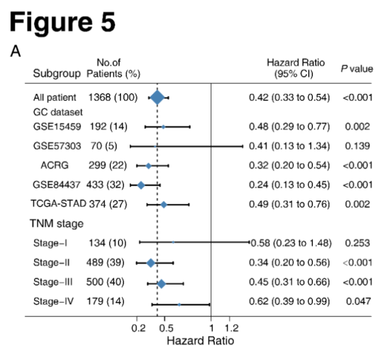

**Author(s)**: `r params$author`  
**Reviewer(s)**: `r params$reviewer`  
**Date**: `r Sys.Date()`  

# Academic Citation
If you use this code in your work or research, we kindly request that you cite our publication:

Xiaofan Lu, et al. (2025). FigureYa: A Standardized Visualization Framework for Enhancing Biomedical Data Interpretation and Research Efficiency. iMetaMed. https://doi.org/10.1002/imm3.70005

```{r setup, include=FALSE}
knitr::opts_chunk$set(echo = TRUE)
```

## 需求描述

计算HR和P value，画出森林图。

## Requirement description

Calculate HR and P values and draw a forest map.



出自<http://cancerimmunolres.aacrjournals.org/content/early/2019/03/06/2326-6066.CIR-18-0436>

from<http://cancerimmunolres.aacrjournals.org/content/early/2019/03/06/2326-6066.CIR-18-0436>

## 应用场景

临床亚组分析。

## Application scenarios

Clinical subgroup analysis.

## 环境设置

## Environment settings

```{r}
source("install_dependencies.R")
# 加载tidyverse包，提供数据处理和可视化工具
# Load the tidyverse package, which provides data processing and visualization tools
library(tidyverse)

# 加载生存分析包，用于生存数据的统计分析
# Load the survival package for statistical analysis of survival data
library(survival)

# 加载森林图包，用于创建森林图可视化结果
# Load the forestplot package to create forest plot visualizations
library(forestplot)

# 设置环境语言为英文，确保报错信息以英文显示
# Set the environment language to English to display error messages in English
Sys.setenv(LANGUAGE = "en") 

# 禁止字符串自动转换为因子类型，避免数据类型意外转换
# Prevent automatic conversion of strings to factors to avoid unexpected data type conversions
options(stringsAsFactors = FALSE) 
```

## 输入文件

easy_input.csv，score（连续变量）和score_binary（二分类变量）至少包含其中一列，后面分别提供两种计算方式。

如果你的数据已经整理成subgroup.csv的格式，就可以跳过这步，直接进入“开始画图”。

## Input file

EasyInput. csv, Score (continuous variable) and Score_binary (binary variable) should contain at least one column, with two calculation methods provided later.

If your data has already been organized into subgroup.csv format, you can skip this step and directly enter "Start Drawing".

```{r}
# 读取CSV格式的输入数据文件，设置header=T表示第一行作为列名
# Read the input data from a CSV file, setting header=T to use the first row as column names
input <- read.csv("easy_input.csv", header = T)

# 查看数据集行数和列数
# View the number of rows and columns in the dataset
head(input)
dim(input)

# 数据过滤操作：
# 1. 保留OS_time_months（总生存期月数）大于0的记录
# 2. 剔除OS_status（生存状态）字段存在缺失值的记录
# 3. 剔除AJCC_stage（肿瘤分期）字段存在缺失值的记录
# Data filtering operations:
# 1. Keep records where OS_time_months (overall survival time in months) is greater than 0
# 2. Remove records with missing values in the OS_status (survival status) field
# 3. Remove records with missing values in the AJCC_stage (tumor stage) field
input <- input %>%
  filter(OS_time_months > 0) %>%
  filter(!is.na(OS_status)) %>%
  filter(!is.na(AJCC_stage))

# 查看过滤后的数据集行数和列数
# View the number of rows and columns in the filtered dataset
head(input)
dim(input)
```

## 计算HR和P value

## Calculate HR and P values

```{r}
#' @明确亚组的信息
#' @Clarify subgroup information
summary(as.factor(input$AJCC_stage))  # 查看AJCC肿瘤分期的分布情况
                                      # Check distribution of AJCC tumor stages
summary(input$ProjectID)              # 查看项目ID的分布情况
                                      # Check distribution of project IDs

#' @加载function
#' @Load functions
source("function_subgroup_survival_analysis.R")  # 加载自定义生存分析函数库
                                                  # Load custom survival analysis functions

#' @功能解读
#' @Function Interpretation
#' @pdata: 输入的数据框-需包含生存数据、亚组数据和目标变量
#' @pdata: Input dataframe - must contain survival data, subgroup data, and target variables
#' @time: 生存时间(连续性变量)
#' @time: Survival time (continuous variable)
#' @status: 事件发生与否(0或1)
#' @status: Event occurrence (0 or 1)
#' @variable: 亚组信息对应的列；必须为因子变量；可同时输入多个变量
#' @variable: Column(s) corresponding to subgroup information; must be factor variables; multiple variables can be input
#' @object: 目标变量；可以是连续变量或二分类变量
#' @object: Target variable; can be continuous or binary

#' @分类变量分析 - 如果发现HR方向相反，只需反转分类：如高变低；0变1
#' @Categorical variable analysis - Reverse categories if HR direction is opposite (e.g., high to low; 0 to 1)
data1 <- Subgroup_survival_analysis(
  pdata = input,                     # 输入数据
                                   # Input dataset
  time = "OS_time_months",           # 总生存时间（月）
                                   # Overall survival time in months
  status = "OS_status",              # 生存状态
                                   # Survival status (0/1)
  variable = c("ProjectID", "AJCC_stage"),  # 亚组变量
                                   # Subgroup variables
  object = "score_binary"            # 二分类目标变量
                                   # Binary target variable
)
data1

#' @附：连续性变量的计算方法
#' @Appendix: Analysis for continuous variables
data2 <- Subgroup_survival_analysis(
  pdata = input,                     # 输入数据
                                   # Input dataset
  time = "OS_time_months",           # 生存时间
                                   # Survival time
  status = "OS_status",              # 生存状态
                                   # Survival status
  variable = c("ProjectID", "AJCC_stage"),  # 亚组变量
                                   # Subgroup variables
  object = "score"                   # 连续型目标变量
                                   # Continuous target variable
)
data2
## 如果数据为连续变量，将后续代码中的data1替换为data2
## Replace data1 with data2 in subsequent code if using continuous variables

# 计算各亚组样本量和百分比
# Calculate sample size and percentage for each subgroup
data.count <- rbind(
  as.data.frame(table(input$ProjectID)),  # 按项目ID统计
                                          # Count by ProjectID
  as.data.frame(table(input$AJCC_stage))   # 按肿瘤分期统计
                                          # Count by AJCC stage
)
data1$count <- data.count$Freq              # 添加样本量列
                                          # Add sample size column
data1$percentage <- round(100 * data.count$Freq/nrow(input))  # 添加百分比列
                                          # Add percentage column
data1

#' @总体生存分析
#' @Overall survival analysis
data3 <- getHRandCIfromCoxph(
  coxphData = coxph(
    Surv(
      time = input[,"OS_time_months"],  # 生存时间
                                      # Survival time
      event = input[,"OS_status"]       # 事件状态
                                      # Event status
    ) ~ score_binary,                   # 二分类变量作为预测因子
                                      # Binary variable as predictor
    data = input
  )
)
data3 <- data.frame(data3)
data3$count <- nrow(input)               # 总样本量
                                      # Total sample size
data3$percentage <- "100"                # 总体百分比
                                      # Overall percentage
data3

#' @合并数据用于森林图绘制
#' @Combine data for forest plot
forestplot_input <- rbind(data3, data1)  # 合并总体和亚组数据
                                      # Combine overall and subgroup data
forestplot_input$mean <- (forestplot_input$CI_low_0.95 + forestplot_input$CI_up_0.95)/2  # 计算置信区间中点
                                      # Calculate midpoint of confidence interval

# 以下步骤可通过代码实现或导出到Excel手动处理
# The following steps can be done via code or manually in Excel

# 修改首行行名
# Modify first row name
row.names(forestplot_input)[1] <- "All patient"

# 在数据集前插入"Dataset"分隔行
# Insert "Dataset" separator row
Dataset <- data.frame(matrix("", 1, 7))
row.names(Dataset) <- "Dataset"
colnames(Dataset) <- colnames(forestplot_input)

# 在分期前插入"AJCC Stage"分隔行
# Insert "AJCC Stage" separator row
AJCC.Stage <- data.frame(matrix("", 1, 7))
row.names(AJCC.Stage) <- "AJCC Stage"
colnames(AJCC.Stage) <- colnames(forestplot_input)

# 根据数据结构插入分隔行
# Insert separator rows based on data structure
forestplot_input <- rbind(
  forestplot_input[1:1, ],       # 保留第一行(总体数据)
                              # Keep first row (overall data)
  Dataset,                      # 插入数据集分隔行
                              # Insert dataset separator
  forestplot_input[2:6, ],      # 保留项目ID亚组数据
                              # Keep ProjectID subgroups
  AJCC.Stage,                   # 插入分期分隔行
                              # Insert AJCC stage separator
  forestplot_input[7:nrow(forestplot_input), ]  # 保留分期亚组数据
                              # Keep AJCC stage subgroups
)

# 保存结果到CSV文件
# Save results to CSV file
write.csv(forestplot_input, "subgroup.csv", quote = F)
```

## 开始画图

从“FigureYa6森林图”改写而来。

重点修改`hrzl_lines`参数里的第三行，画最下面一条黑线，""中数字为nrow(data)+5，此处是12行 + 5 = 17

## Start drawing

Rewrite from "FigureYa6 Forest Map".

Focus on modifying the third line of the 'hrzlylines' parameter, draw the bottom black line, where the number in' 'is nrow (data)+5, and here it is line 12+5=17

```{r}
# 读取输入文件，输入数据一般包括分类、样本数、风险比及置信区间（上限及下限）等
# 需要注意的是输入文件的布局(包括文字缩进)将展示在最后结果中，所见即所得
# Read the input file, which typically includes categories, sample sizes, hazard ratios, and confidence intervals (upper and lower limits)
# Note that the layout of the input file (including text indentation) will be reflected in the final result (what you see is what you get)
data <- read.csv("subgroup.csv")
head(data)
dim(data)[1] + 5 # 把这个数字写入hrzl_lines参数的第三行
# Write this number into the third line of the hrzl_lines parameter

# 创建包含样本量和百分比的字符串向量
# Create a string vector containing sample size and percentage
np <- ifelse(!is.na(data$count), paste(data$count," (",data$percentage,")", sep=""), NA)
head(np)

# 构建森林图的文本标签矩阵
# Construct the text label matrix for the forest plot
tabletext <- cbind(
  c("\nSubgroup", NA, NA, data$X, NA),
  c("No. of\nPatients (%)", NA, NA, np, NA),
  c("Hazard Ratio\n(95% CI)", NA, NA, ifelse(!is.na(data$count), paste(round(data$mean, 2), " (", round(data$CI_low_0.95, 2), " to ", round(data$CI_up_0.95, 2),")", sep=""), NA), NA),
  c("P-value", NA, NA, ifelse(data$P < 0.001, "<0.001", round(data$P,3)), NA)
)
tabletext

# 使用默认参数绘制森林图
# Draw a forest plot with default parameters
forestplot(
  labeltext = tabletext,
  mean = c(NA, NA, 1, data$mean, NA),
  lower = c(NA, NA, 1, data$CI_low_0.95, NA),
  upper = c(NA, NA, 1, data$CI_up_0.95, NA)
)

# 默认参数不够美观，通过调整参数可绘制符合论文要求的图表
# The default parameters are not aesthetically pleasing. Adjust parameters to create publication-quality figures
pdf("subgroup.pdf", width = 12, height = 7) # 创建PDF文件，准备写入图形
# Create a PDF file to write the graph

forestplot(
  labeltext = tabletext,           # 图中的文本标签（表格内容）
                                 # Text labels in the plot (table content)
  mean = c(NA, NA, 1, data$mean, NA),  # HR值（中间值）
                                 # HR values (median)
  lower = c(NA, NA, 1, data$CI_low_0.95, NA),  # 95%置信区间下限
                                 # Lower bound of 95% confidence interval
  upper = c(NA, NA, 1, data$CI_up_0.95, NA),  # 95%置信区间上限
                                 # Upper bound of 95% confidence interval
  # title = "Hazard Ratio",
  graph.pos = 3,             # 图形在表格中的列位置（第3列）
                                 # Column position of the graph in the table (3rd column)
  graphwidth = unit(.4, "npc"),  # 图形在表格中的宽度比例（占0.4个标准化单位）
                                 # Width proportion of the graph in the table (0.4 normalized units)
  fn.ci_norm = "fpDrawDiamondCI",  # 置信区间标记类型选择钻石形状
                                 # Confidence interval marker type: diamond shape
  col = fpColors(box = "steelblue", lines = "black", zero = "black"),  # 图形元素颜色设置
                                 # Color settings for graph elements
  boxsize = c(NA, NA, NA, data$percentage, NA)/75,  # 框大小根据样本量百分比设置
                                 # Box size set by sample size percentage
  lwd.ci = 2, ci.vertices.height = 0.1, ci.vertices = TRUE,  # 置信区间线条宽度、端点高度和样式
                                 # CI line width, vertex height, and style
  zero = 1,                # 参考线（无效线）的横坐标（HR=1）
                                 # X-coordinate of reference line (HR=1)
  lwd.zero = 2,            # 参考线宽度
                                 # Reference line width
  grid = structure(c(data[1,]$mean), gp = gpar(col = "black", lty = 2, lwd = 2)),  # 网格线设置
                                 # Grid line settings
  # xticks = c(round(min(data$mean),1), 1,round((max(data$mean)-min(data$mean)/2),1), round(max(data$mean),1)),  # 自定义X轴刻度
  lwd.xaxis = 2,           # X轴线宽
                                 # X-axis line width
  xlab = "Hazard Ratio",   # X轴标题
                                 # X-axis title
  hrzl_lines = list(       # 水平分隔线设置
    "3" = gpar(lwd = 2, col = "black"),  # 第三行顶部加黑线
                                 # Black line at the top of the 3rd row
    #"4" = gpar(lwd = 60, lineend = "butt", columns = c(1:4), col = "#99999922"),  # 添加阴影（不推荐）
    "17" = gpar(lwd = 2, col = "black")  # 最后一行底部加黑线（数字为nrow(data)+5）
                                 # Black line at the bottom of the last row (number is nrow(data)+5)
  ),
  txt_gp = fpTxtGp(        # 各种文本元素的字体大小设置
                                 # Font size settings for various text elements
    label = gpar(cex = 1.25),
    ticks = gpar(cex = 1.25),
    xlab = gpar(cex = 1.25),
    title = gpar(cex = 1.25)
  ),
  # is.summary = c(T, rep(F, 27)),  # 首行字体类型设置
  lineheight = unit(.75, "cm"),  # 固定行高（0.75厘米）
                                 # Fixed row height (0.75 cm)
  # align = c("l", "c", "c"),  # 每列文字的对齐方式
  # cex = 10,
  colgap = unit(0, "cm"),  # 列间隙（0厘米）
                                 # Column gap (0 cm)
  mar = unit(rep(1.25, times = 4), "cm"),  # 图形页边距（上下左右各1.25厘米）
                                 # Plot margins (1.25 cm on all sides)
  new_page = F             # 是否在新页面绘制（否）
                                 # Whether to draw on a new page (No)
)

dev.off()  # 关闭PDF设备
           # Close PDF device
```


# Session Info

```{r}
sessionInfo()
```