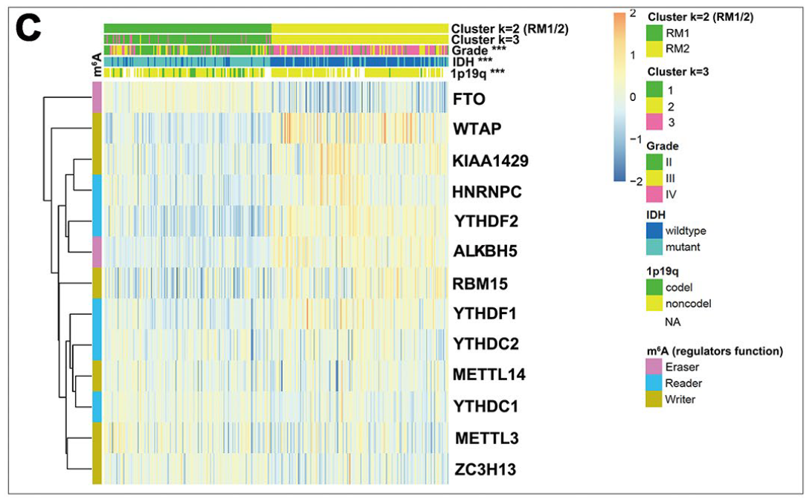

**Author(s)**: `r params$author`  
**Reviewer(s)**: `r params$reviewer`  
**Date**: `r Sys.Date()`  


# Academic Citation
If you use this code in your work or research, we kindly request that you cite our publication:

Xiaofan Lu, et al. (2025). FigureYa: A Standardized Visualization Framework for Enhancing Biomedical Data Interpretation and Research Efficiency. iMetaMed. https://doi.org/10.1002/imm3.70005

```{r setup, include=FALSE}
knitr::opts_chunk$set(echo = TRUE)
# 设置knitr的全局代码块选项 / Set global chunk options for knitr
```

## 需求描述

1. 把cluster画到heatmap的顶部，相当于用颜色代替分类的树形结构。

2. 导出聚类后的样本顺序。

3. 让热图中的样本按照文件中的顺序排序。

## Requirement description

1. Draw the cluster to the top of the heatmap, which is equivalent to using colors instead of a hierarchical structure for classification.

2. Export the clustered sample order.

3. Sort the samples in the heatmap according to the order in the file.



出自<https://www.aging-us.com/article/101829/text>

from<https://www.aging-us.com/article/101829/text>

## 应用场景

1. 为基因表达量、量化的免疫浸润等指标做聚类，突出展示分成2类、3类（也可以更多类）的效果。

2. 导出聚类后的样本顺序，用于后续分析，例如在cluster之间做生存分析。

3. 让热图中的样本按照文件中的顺序排序，例如让样本按照亚型、表型排序。

## Application scenarios

1. Cluster indicators such as gene expression levels and quantified immune infiltration, highlighting the effects of dividing into 2 or 3 categories (or more categories).

2. Export the clustered sample order for subsequent analysis, such as conducting survival analysis between clusters.

3. Sort the samples in the heatmap in the order specified in the file, such as by subtype or phenotype.

## 环境设置

## Environment settings

```{r}
source("install_dependencies.R")
# 加载用于外部聚类分析的R包
# Load the R package for external clustering analysis
library(ClassDiscovery) 

# 加载用于绘制热图的R包
# Load the R package for plotting heatmaps
library(pheatmap) 

# 加载用于增强热图颜色功能的R包
# Load the R package to enhance heatmap color functionality
library(gplots) 

# 设置环境变量，使报错信息以英文显示
# Set environment variable to display error messages in English
Sys.setenv(LANGUAGE = "en") 

# 禁止字符串自动转换为因子类型
# Disable automatic conversion of strings to factors
options(stringsAsFactors = FALSE) 
```

## 输入文件

## Input file

```{r}
# 从CSV文件读取表达矩阵数据，设置第一列为行名，禁用列名检查和字符串转因子
# Read expression matrix data from a CSV file, set the first column as row names, disable column name checking and string-to-factor conversion
mat <- read.csv("easy_input_expr.csv", row.names = 1, check.names = F, stringsAsFactors = F)

# 查看表达矩阵前3行3列的数据，用于快速检查数据结构
# View the first 3 rows and 3 columns of the expression matrix for quick data structure verification
mat[1:3, 1:3]

# 从CSV文件读取样本注释信息，设置第一列为行名，禁用列名检查和字符串转因子
# Read sample annotation information from a CSV file, set the first column as row names, disable column name checking and string-to-factor conversion
annCol <- read.csv("easy_input_annotation.csv", row.names = 1, check.names = F, stringsAsFactors = F)

# 查看注释信息前几行，确认数据格式正确
# View the first few rows of annotation data to confirm correct format
head(annCol)

# 数据预处理：填补注释信息中的缺失值（NA或空字符串）为"N/A"
# Data preprocessing: Replace missing values (NA or empty strings) in annotation data with "N/A"
annCol[is.na(annCol) | annCol == ""] <- "N/A"
```

## 开始画图

配置注释的颜色列表

## Start drawing

Configure the color list for annotations

```{r}
# 创建一个空列表用于存储注释列的配色方案，这些配色将显示在热图上方
# Create an empty list to store color schemes for annotation columns, which will be displayed above the heatmap
annColors <- list()

# 为性别(gender)注释列设置配色方案
# Set color scheme for the gender annotation column
annColors[["gender"]] <- c("MALE"="blue", "FEMALE"="red", "N/A"="white")

# 为生存状态(vital_status)注释列设置配色方案
# Set color scheme for the vital_status annotation column
annColors[["vital_status"]] <- c("Alive"="yellow", "Dead"="black", "N/A"="white")

# 为结肠息肉存在情况(colon_polyps_present)注释列设置配色方案
# Set color scheme for the colon_polyps_present annotation column
annColors[["colon_polyps_present"]] <- c("YES"="red", "NO"="black", "N/A"="white")

# 查看已设置的所有注释列配色方案
# View all configured color schemes for annotation columns
annColors
```

这里列举几种情况，根据你想要的效果自行选择，也可以都画出来，对比效果。

Here are several situations to choose from based on the desired effect, or you can draw them all and compare the effects.

### 1. pheatmap自带聚类生成热图

直接用pheatmap聚类并画图，从顶端的树形结构观察样本的分类。

### 1. Pheatmap comes with clustering to generate heatmaps

Cluster and plot directly using pheatmap, and observe the classification of samples from the top tree structure.

```{r}
# 绘制基因表达矩阵的热图，使用行标准化处理
# Plot a heatmap of the gene expression matrix with row-wise scaling
pheatmap(mat,
         scale = "row",                  # 对每行数据进行标准化处理
                                 # Standardize data for each row
         color = bluered(64),            # 使用64级蓝红渐变色系
                                 # Use a 64-level blue-red gradient color scheme
         annotation_col = annCol,        # 添加样本注释信息(列注释)
                                 # Add sample annotation information (column annotations)
         annotation_colors = annColors,  # 设置注释分类的显示颜色
                                 # Set display colors for annotation categories
         show_rownames = T,              # 显示行名(基因名)
                                 # Show row names (gene names)
         show_colnames = F,              # 隐藏列名(样本名)
                                 # Hide column names (sample names)
         filename = "raw_heatmap.pdf")   # 保存为PDF格式的热图文件
                                 # Save as a PDF format heatmap file
```


### 2. 外部聚类产生树，显示树

先用hclust聚类，用cutree切为2类，把分类信息写到annotation里，再用pheatmap画图。

### 2. External clustering generates trees, displaying trees

First, cluster using HCLUST, cut into 2 classes using Cutree, write the classification information into annotations, and then draw a graph using Pheatmap.

```{r}
# 对样本进行层次聚类：计算表达矩阵行之间的Pearson相关性距离，使用Ward方法构建聚类树
# Hierarchical clustering of samples: Calculate Pearson correlation distance between rows of the expression matrix and use Ward's method for clustering
hcs <- hclust(distanceMatrix(as.matrix(mat), "pearson"), "ward.D") 

# 对基因进行层次聚类：先转置矩阵使基因作为列，计算Pearson相关性距离，使用Ward方法构建聚类树
# Hierarchical clustering of genes: Transpose the matrix to treat genes as columns, calculate Pearson correlation distance, and use Ward's method
hcg <- hclust(distanceMatrix(t(as.matrix(mat)), "pearson"), "ward.D") 

# 将样本聚类树切割为2个簇，用于后续分组分析
# Cut the sample clustering tree into 2 clusters for subsequent group analysis
group <- cutree(hcs, k=2)

# 在注释数据中添加聚类结果列，并为新聚类设置颜色映射
# Add clustering results to the annotation data and set color mapping for the new clusters
annCol$Clust2 <- paste0("C", group[rownames(annCol)])
annColors[["Clust2"]] <- c("C1"="red", "C2"="green")

# 查看添加聚类结果后的注释数据前几行
# View the first few rows of annotation data after adding clustering results
head(annCol)

# 绘制带样本聚类和基因聚类的热图，使用之前计算的聚类树和注释信息
# Plot a heatmap with sample and gene clustering using previously computed clustering trees and annotation information
pheatmap(mat,
         scale = "row",                  # 对每行数据进行标准化
                                 # Standardize each row of the data matrix
         color = bluered(64),            # 使用64级蓝红渐变色
                                 # Use a 64-color blue-red gradient palette
         cluster_rows = hcg,             # 使用预计算的基因聚类结果
                                 # Use precomputed gene clustering results
         cluster_cols = hcs,             # 使用预计算的样本聚类结果
                                 # Use precomputed sample clustering results
         annotation_col = annCol,        # 添加样本注释信息
                                 # Add column annotations (sample metadata)
         annotation_colors = annColors,  # 设置注释分类的显示颜色
                                 # Define colors for annotation categories
         show_rownames = T,              # 显示行名(基因名)
                                 # Show row names (gene names)
         show_colnames = F,              # 隐藏列名(样本名)
                                 # Hide column names (sample IDs)
         filename = "heatmap_with_outside_Cluster.pdf") # 保存热图为PDF文件
                                 # Save heatmap as PDF with external clustering

# 将聚类后的样本顺序和分组信息保存到CSV文件
# Save the clustered sample order and group information to a CSV file
sample_order <- data.frame(
  row.names = seq(1:length(hcs$labels)),  # 创建行索引，范围从1到样本数量
                                          # Create row indices from 1 to the number of samples
  sample = hcs$labels,                    # 样本名称，来自预计算的样本聚类结果
                                          # Sample names from precomputed sample clustering results
  group = group                           # 所属聚类组，使用已有的分组信息
                                          # Cluster group assignments using existing grouping information
)

# 按聚类结果排序样本，并保存原始顺序信息
# Sort samples by clustering results and preserve original order information
sample_order <- sample_order[hcs$order, ]  # 按聚类后的顺序排列
                                           # Reorder samples according to hierarchical clustering
sample_order$ori.order <- row.names(sample_order)  # 保存原始顺序
                                                    # Preserve original order for reference

# 将样本顺序信息导出为CSV文件，不使用引号，不保留行名
# Export sample order information to CSV without quotes or row names
write.csv(sample_order, "sample_order.csv", quote = F, row.names = F)
```


### 3. 外部聚类产生树，热图中不显示树结构

跟上一个图的差异：增加了一行`treeheight_col = 0`参数，不显示树结构。

### 3. External clustering generates trees, but the tree structure is not displayed in the heatmap

The difference from the previous image is the addition of a line with the parameter 'treeheight col=0', which does not display the tree structure.

```{r}
# 绘制带样本聚类和基因聚类的热图，但不显示样本聚类树状图
# Plot a heatmap with sample and gene clustering, but hide the sample dendrogram
pheatmap(mat,
         scale = "row",                  # 对每行数据进行标准化处理
                                         # Standardize each row of the data matrix
         color = bluered(64),            # 使用64级蓝红渐变色系
                                         # Use a 64-color blue-red gradient palette
         cluster_rows = hcg,             # 使用预计算的基因聚类结果
                                         # Apply precomputed gene clustering results
         cluster_cols = hcs,             # 使用预计算的样本聚类结果
                                         # Apply precomputed sample clustering results
         treeheight_col = 0,             # 设置列方向(样本)树状图高度为0，隐藏样本聚类树
                                         # Hide column (sample) dendrogram by setting height to 0
         annotation_col = annCol,        # 添加样本注释信息
                                         # Add column annotations (sample metadata)
         annotation_colors = annColors,  # 设置注释分类的显示颜色
                                         # Define colors for annotation categories
         show_rownames = T,              # 显示行名(基因名)
                                         # Display row names (gene names)
         show_colnames = F,              # 隐藏列名(样本名)
                                         # Hide column names (sample IDs)
         filename = "heatmap_with_outside_Cluster_noTree.pdf") # 保存热图为PDF文件
                                         # Save heatmap as PDF with external clustering and no column dendrogram
```


### 4. 外部聚类产生树，提取样本顺序

丢弃树结构, 和上面noTree的图是一致的

### 4. External clustering generates trees and extracts sample order

Discard the tree structure, which is consistent with the noTree diagram above

```{r}
# 获取层次聚类结果的样本顺序索引（从左到右）
# Get the sample order index (left to right) from hierarchical clustering results
index <- order.dendrogram(as.dendrogram(hcs))
# 按照聚类结果对样本重新排序
# Reorder samples according to clustering results
sam_order <- colnames(mat)[index] 

# 绘制热图，使用聚类结果排序但不显示聚类树
# Plot heatmap using clustering order but without showing the dendrogram
pheatmap(mat[,sam_order],            # 按聚类顺序调整表达矩阵的样本列
                                         # Reorder sample columns in the expression matrix by clustering order
         scale = "row",               # 对每行数据进行标准化处理
                                         # Standardize data by row
         color = bluered(64),         # 使用64级蓝红渐变色系
                                         # Use a 64-color blue-red gradient palette
         cluster_cols = F,            # 禁用列方向(样本)的聚类，使用指定顺序
                                         # Disable column clustering, use predefined sample order
         cluster_rows = hcg,          # 使用预计算的基因聚类结果
                                         # Apply precomputed gene clustering results
         #treeheight_col = 0,          # 此行被注释，因禁用聚类后树高设置无效
                                         # Commented out:无效 when clustering is disabled
         annotation_col = annCol[sam_order,], # 按相同顺序调整注释信息
                                         # Reorder column annotations to match sample order
         annotation_colors = annColors, # 设置注释分类的显示颜色
                                         # Define colors for annotation categories
         show_rownames = T,           # 显示行名(基因名)
                                         # Display row names (gene names)
         show_colnames = F,           # 隐藏列名(样本名)
                                         # Hide column names (sample IDs)
         filename = "heatmap_with_outside_Cluster_discardTree.pdf") # 保存热图为PDF文件
                                         # Save heatmap as PDF with external clustering and no column dendrogram # 保存为使用聚类顺序但无聚类树的热图
```

### 5. 外部聚类产生树，分2类和3类

重现图中Clust2和Clust3的结构，同样提取样本顺序，抛弃树结构。

### 5. External clustering generates trees, divided into 2 and 3 categories

Reproduce the structures of Clust2 and Clust3 in the image, extract the sample order, and discard the tree structure.

```{r}
# 将样本聚类树切割为3个簇（仍使用之前的层次聚类结果hcs）
# Cut the sample clustering tree into 3 clusters (still using the previous hierarchical clustering result hcs)
group <- cutree(hcs, k=3) 

# 在注释数据中添加新的3类聚类结果列，并设置对应颜色
# Add a new column for 3-cluster results to the annotation data and set corresponding colors
annCol$Clust3 <- paste0("C", group[rownames(annCol)])
annColors[["Clust3"]] <- c("C1"="red", "C2"="green", "C3"="blue")

# 查看添加新聚类结果后的注释数据
# View annotation data after adding new clustering results
head(annCol)

# 绘制热图，使用之前确定的样本顺序（sam_order），但显示新的3类聚类结果
# Plot heatmap using previously determined sample order (sam_order) but showing new 3-cluster results
pheatmap(mat[, sam_order],            # 使用按聚类顺序排列的表达矩阵
                                         # Use expression matrix ordered by precomputed clustering
         scale = "row",               # 对每行数据进行标准化处理
                                         # Standardize each row (gene)
         color = bluered(64),         # 使用64级蓝红渐变色系
                                         # 64-color blue-red gradient palette
         cluster_cols = F,            # 禁用列方向(样本)的聚类，使用指定顺序
                                         # Disable column clustering, use predefined order
         cluster_rows = hcg,          # 使用预计算的基因聚类结果
                                         # Apply precomputed gene clustering
         annotation_col = annCol[sam_order, ],  # 按相同顺序调整注释信息
                                         # Reorder column annotations to match sample order
         annotation_colors = annColors, # 设置注释分类的显示颜色
                                         # Define colors for annotation categories
         show_rownames = T,           # 显示行名(基因名)
                                         # Show row names (gene names)
         show_colnames = F,           # 隐藏列名(样本名)
                                         # Hide column names (sample IDs)
         filename = "heatmap_with_outside_Cluster_discardTree_twoClusters.pdf") # 保存热图为PDF文件
                                         # Save heatmap with external clustering (two clusters) and no column dendrogram
```


### 6. 外部聚类产生树，换个方法分成3类

有时，你可能想展示两种方法，并做对比。

此处用euclidean，分成3类（这时样本顺序跟前面的不一样了），并跟前面的分类做对比。

### 6. External clustering generates trees, which can be divided into three categories using a different method

Sometimes, you may want to showcase two methods and compare them.

Here we use euclidean and divide it into three categories (the sample order is different from the previous ones), and compare it with the previous classification.

```{r}
# 使用欧氏距离和Ward法对样本进行层次聚类（替换原有的Pearson相关系数距离）
# Hierarchical clustering of samples using Euclidean distance and Ward's method (replacing original Pearson correlation distance)
hcs2 <- hclust(distanceMatrix(as.matrix(mat), "euclidean"), "ward.D") 

# 将新聚类树切割为3个簇
# Cut the new clustering tree into 3 clusters
group <- cutree(hcs2, k=3) 

# 获取新聚类树的样本顺序索引（从左到右）
# Get the sample order index (left to right) from the new clustering tree
index <- order.dendrogram(as.dendrogram(hcs2)) 
# 按新聚类结果重新排列样本顺序
# Reorder samples according to the new clustering results
sam_order <- colnames(mat)[index] 

# 将新聚类方法产生的样本顺序保存为CSV文件（仅包含样本名称）
# Save the sample order from the new clustering method to a CSV file (contains only sample names)
write.csv(sam_order, "sample_order_euclidean.csv", quote = F)

# 在注释数据中添加新聚类方法的3类结果列，并设置对应颜色
# Add a new column for 3-cluster results from the new clustering method to the annotation data and set colors
annCol$Clust3.2 <- paste0("C", group[rownames(annCol)])
annColors[["Clust3.2"]] <- c("C1"="red", "C2"="green", "C3"="blue")

# 查看添加新聚类注释后的前几行数据
# View the first few rows of annotation data after adding new clustering results
head(annCol)

# 绘制热图，使用新聚类的样本顺序和注释信息，禁用样本聚类（仅展示顺序）
# Plot heatmap using the sample order and annotation from the new clustering, disable sample clustering (only show order)
pheatmap(mat[, sam_order],            # 按新聚类顺序调整表达矩阵的样本列
                                         # Reorder sample columns by predefined clustering order
         scale = "row",               # 对每行数据进行标准化处理（Z-score变换）
                                         # Standardize each row (Z-score transformation)
         color = bluered(64),         # 使用64级蓝红渐变色系（低表达→高表达）
                                         # 64-color blue-red gradient palette (low→high expression)
         cluster_cols = F,            # 禁用列方向(样本)的聚类，强制使用指定顺序
                                         # Disable column clustering, use predefined sample order
         cluster_rows = hcg,          # 使用预计算的基因聚类结果（层次聚类树）
                                         # Apply precomputed gene clustering (hierarchical tree)
         annotation_col = annCol[sam_order, ],  # 按相同顺序调整注释数据
                                         # Reorder column annotations to match sample order
         annotation_colors = annColors, # 设置注释分类的显示颜色
                                         # Define colors for annotation categories
         show_rownames = T,           # 显示行名(基因名)
                                         # Display row names (gene names)
         show_colnames = F,           # 隐藏列名(样本名)
                                         # Hide column names (sample IDs)
         filename = "heatmap_with_outside_Cluster_discardTree_twoClusters2.pdf") # 保存热图
                                         # Save heatmap with external clustering, no column dendrogram, and two clusters
```


### 7. 从文件导入样本顺序

有时你会想让样本按照自己的想法排序，那么就把样本顺序写到文件里。

此处以sample_order.csv文件为例，热图中的样本会根据文件里的顺序排序。

### 7. Import sample order from file

Sometimes you want the samples to be sorted according to your own ideas, so write the order of the samples into a file.

Taking the sample_order.sv file as an example, the samples in the heatmap will be sorted according to the order in the file.

```{r}
# 从CSV文件读取预定义的样本顺序（包含sample列和group列）
# Read predefined sample order from CSV file (contains 'sample' and 'group' columns)
sam_order <- read.csv("sample_order.csv", header = T)
# 提取样本名称列作为顺序索引
# Extract sample names as the order index
sam_order <- sam_order$sample

# 查看当前注释数据结构（包含之前添加的所有聚类结果）
# View current annotation data structure (includes all previously added clustering results)
head(annCol)
# 所有添加的注释列都会显示在热图中
# All annotation columns will be displayed in the heatmap
# 如果需要移除特定注释列（例如Clust2），取消下面代码的注释
# If you need to remove a specific annotation column (e.g., Clust2), uncomment the following line
# annCol$Clust2 <- NULL

# 绘制热图，使用从文件读取的样本顺序，禁用样本聚类
# Plot heatmap using sample order read from file, disable column clustering
pheatmap(mat[, sam_order],            # 使用文件指定的样本顺序调整表达矩阵
                                         # Reorder samples by external file-defined order
         scale = "row",               # 对每行数据进行标准化处理（Z-score变换）
                                         # Standardize each row (genes) by Z-score
         color = bluered(64),         # 使用64级蓝红渐变色系
                                         # 64-color blue-red gradient palette
         cluster_cols = F,            # 禁用列方向(样本)的聚类，强制使用指定顺序
                                         # Disable column clustering, use predefined order
         cluster_rows = hcg,          # 使用预计算的基因聚类结果
                                         # Apply precomputed gene clustering
         # treeheight_col = 0,        # 已禁用聚类，此参数无效（已注释掉）
                                         # Commented out:无效 when clustering is disabled
         annotation_col = annCol[sam_order, ],  # 同步调整注释数据的顺序
                                         # Reorder annotations to match sample order
         annotation_colors = annColors, # 设置注释分类的显示颜色
                                         # Define colors for annotation categories
         show_rownames = T,           # 显示行名(基因名)
                                         # Show row names (gene names)
         show_colnames = F,           # 隐藏列名(样本名)
                                         # Hide column names (sample IDs)
         filename = "heatmap_with_file.pdf") # 保存热图，文件名强调使用外部文件定义顺序
                                         # Save heatmap with order defined by external file
```


# Session Info

```{r}
sessionInfo()
```