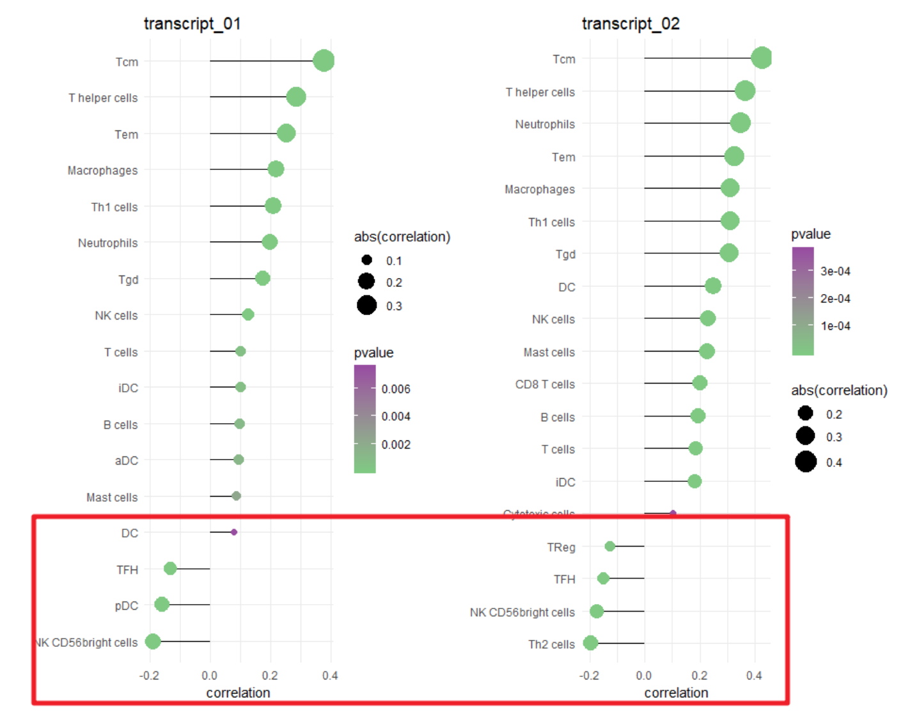
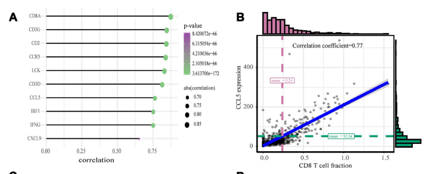
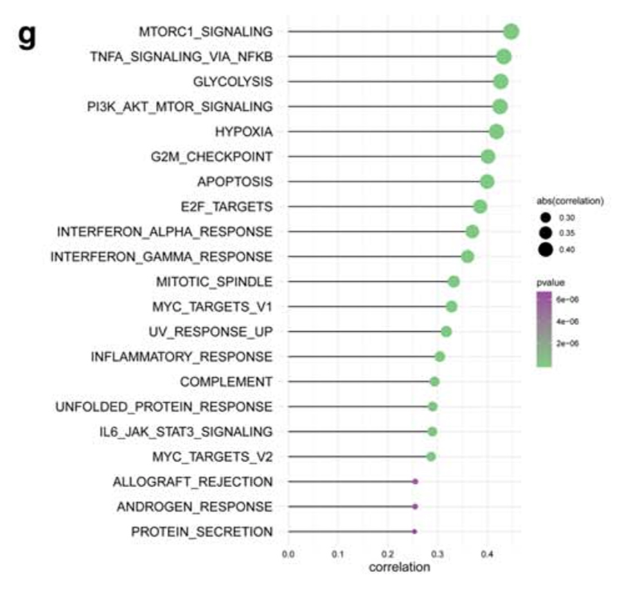

**Author(s)**: `r params$author`  
**Reviewer(s)**: `r params$reviewer`  
**Date**: `r Sys.Date()`  


# Academic Citation
If you use this code in your work or research, we kindly request that you cite our publication:

Xiaofan Lu, et al. (2025). FigureYa: A Standardized Visualization Framework for Enhancing Biomedical Data Interpretation and Research Efficiency. iMetaMed. https://doi.org/10.1002/imm3.70005

To cite package 'ggstatsplot' in publications use:

Patil, I. (2021). Visualizations with statistical details: The 'ggstatsplot' approach. Journal of Open Source Software, 6(61), 3167, doi:10.21105/joss.03167

```{r setup, include=FALSE}
knitr::opts_chunk$set(echo = TRUE)
# 设置knitr的全局代码块选项 / Set global chunk options for knitr
```

# 需求描述

计算免疫浸润跟基因的相关性，画图。

# Requirement description

Calculate the correlation between immune infiltration and genes and draw a graph.



出自<https://mp.weixin.qq.com/s/tWJkLVDt1mx5COduw7H35w>

当初是因为果子的idea，用这种方式展示两个转录本和免疫浸润的关系，发布在果子学生信公众号上<https://mp.weixin.qq.com/s/tWJkLVDt1mx5COduw7H35w>。小伙伴看到了也想画，我们就实现了。后来有小伙伴用这个图发表了文章，供参考：

From< https://mp.weixin.qq.com/s/tWJkLVDt1mx5COduw7H35w >

The original idea was due to the idea of Guozi, which showed the relationship between the two transcripts and immune infiltration in this way, and was published on the official account of Guozi Student Letter< https://mp.weixin.qq.com/s/tWJkLVDt1mx5COduw7H35w >The friends also wanted to draw when they saw it, so we crowdsourced. Later, a friend published an article using this image for reference:



出自<https://s3-us-west-1.amazonaws.com/paperchase-aging/pdf/GpDPdC6dMaFhzrxao.pdf>

from<https://s3-us-west-1.amazonaws.com/paperchase-aging/pdf/GpDPdC6dMaFhzrxao.pdf>

Figure  5.  Validation  of  hub  genes  and  PPI  map  construction.  (A)  Relationship  between  10  hub  genes  expression  and  CD8+  T  cell  infiltration  level;  P  <  0.05  is  considered  statistically  significant.  (B)  Scatter  plot  of  CCL5 expression  and  CD8+ T  cell  infiltration  level.  



出自<https://link.springer.com/article/10.1007/s00109-020-01908-9>

from<https://link.springer.com/article/10.1007/s00109-020-01908-9>

Fig. 3 Construction of a prognostic immune-related gene signature. g ssGSEA revealed the most significant hallmarks correlated with the immune-related signature.

# 应用场景

评价基因对免疫浸润的影响，甚至可以写成循环，批量筛选出影响免疫浸润的候选基因。

不仅限于基因跟免疫浸润之间的关系，还可以把免疫细胞矩阵替换为基因表达矩阵，计算基因跟基因之间的关系，找出并可视化共表达基因；或者把基因表达矩阵替换为转录本或临床信息，用于分析不同转录本、甚至临床指标跟免疫浸润的关系。

# Application scenarios

Evaluate the impact of genes on immune infiltration, and even write it as a cycle to batch screen candidate genes that affect immune infiltration.

Not limited to the relationship between genes and immune infiltration, the immune cell matrix can also be replaced with a gene expression matrix to calculate the relationship between genes and identify and visualize co expressed genes; Alternatively, the gene expression matrix can be replaced with transcripts or clinical information to analyze the relationship between different transcripts, even clinical indicators, and immune infiltration.

# 环境设置
# Environment settings

```{r}
source("install_dependencies.R")
source("ggscatterstats.R") # from ggstatsplot package https://github.com/IndrajeetPatil/ggstatsplot

# Package for extended statistical visualization based on ggplot2  
library(data.table)   # 高性能数据处理  
# Package for high-performance data processing  
library(dplyr)        # 数据操作工具  
# Package for data manipulation operations  
library(tidyr)        # 数据整理工具  
# Package for data tidying and reshaping  
library(ggplot2)      # 强大的绘图系统  
# Powerful plotting system  


# 环境设置  
# Environment settings  
Sys.setenv(LANGUAGE = "en")  # 设置英文报错信息，便于问题排查  
# Set error messages to English for easier troubleshooting  
options(stringsAsFactors = FALSE)  # 禁止字符串自动转换为因子，避免意外的数据类型转换  
# Disable automatic conversion of strings to factors to avoid unexpected data type conversion  
```

# 输入文件

要求两个文件的样本名一致

- ssGSEA_output.csv，免疫细胞矩阵，列是免疫细胞，行是样本，由FigureYa71ssGSEA产生。在FigureYa71ssGSEA读取文件的命令行里添加`check.names = F`，避免行名TCGA id的“-”变成“.”。列也可以是基因，即基因表达矩阵。
- easy_input_expr.txt，基因表达矩阵，列是样本，行是基因。行也可以是转录本，甚至是临床信息。另外，作者还提供了从TCGA表达矩阵（例如not_easy_input_expr.txt）提取某一基因表达谱的代码，见pick1gene.R文件。

# Input file

Request that the sample names of the two files be consistent

- ssGSEA_output.csv， Immune cell matrix, with columns representing immune cells and rows representing samples, generated by FigureYa71ssGSEA. Add 'check. games=F' to the command line for reading files in FigureYa71ssGSEA, to avoid the TCGA id line name changing from '-' to '.'. Columns can also be genes, i.e. gene expression matrices.
- easy_input_expr.txt， Gene expression matrix, with columns representing samples and rows representing genes. It can also be a transcript or even clinical information. In addition, the author also provided the code to extract the expression profile of a certain gene from the TCGA expression matrix (such as not_ easy_input-expr. txt), as shown in the pick1gene. R file.

```{r}
# 清除环境中所有对象（释放内存并避免变量干扰）
# Clear all objects in the environment (free memory and avoid variable interference)
rm(list = ls())

# ---------------------- 免疫细胞矩阵处理 ---------------------- #
# ---------------------- Immune cell matrix processing ---------------------- #
# 读取免疫细胞ssGSEA分析结果矩阵（行名为样本ID，列为免疫细胞类型）
# Read the ssGSEA analysis results matrix of immune cells (rows are sample IDs, columns are immune cell types)
tcga_gsva <- read.csv("ssGSEA_output.csv", row.names = 1)
# 查看矩阵前3行3列数据（检查数据结构和读取是否正确）
# View the first 3 rows and 3 columns of the matrix (check data structure and reading correctness)
tcga_gsva[1:3, 1:3]

# 行名处理：将样本ID中的点号（.）批量替换为短横线（-）
# 说明：若免疫矩阵行名与基因表达矩阵不一致，需统一格式以确保后续关联
# Row name processing: batch-replace dots (.) with hyphens (-) in sample IDs
# Note: If the row names of the immune matrix are inconsistent with the gene expression matrix, unify the format for subsequent association
rownames(tcga_gsva) <- gsub("\\.", "-", rownames(tcga_gsva))
# 再次查看前3行3列数据（验证替换结果）
# View the first 3 rows and 3 columns again (verify the replacement result)
tcga_gsva[1:3, 1:3]

# ---------------------- 基因表达矩阵处理 ---------------------- #
# ---------------------- Gene expression matrix processing ---------------------- #
# 读取基因表达矩阵（行名为基因ID，列名为样本ID，保留原始列名）
# Read the gene expression matrix (rows are gene IDs, columns are sample IDs, preserve original column names)
tcga_expr <- read.table("easy_input_expr.txt", row.names = 1, header = T, check.names = F)
# 查看矩阵前3列数据（检查样本ID格式是否与免疫矩阵兼容）
# View the first 3 columns of the matrix (check if sample ID format is compatible with the immune matrix)
tcga_expr[, 1:3]

# ---------------------- 样本顺序对齐 ---------------------- #
# ---------------------- Sample order alignment ---------------------- #
# 用基因表达矩阵的样本名称调整免疫矩阵的样本顺序
# 目的：确保后续相关性计算时样本一一对应（非必需步骤，视数据情况而定）
# Adjust the sample order of the immune matrix using the sample names from the gene expression matrix
# Purpose: Ensure one-to-one correspondence of samples in subsequent correlation calculations (non-essential step, subject to data conditions)
tcga_gsva <- tcga_gsva[colnames(tcga_expr), ]

# ---------------------- 数据预处理 ---------------------- #
# ---------------------- Data preprocessing ---------------------- #
# 提取基因表达矩阵的行名（基因ID）
# Extract row names (gene IDs) from the gene expression matrix
index <- rownames(tcga_expr) 
# 将基因表达量转换为数值型向量（若存在非数值数据会触发警告）
# Convert gene expression values to a numeric vector (warnings will be triggered if non-numeric data exists)
y <- as.numeric(tcga_expr)
# 查看前6个元素（检查数据类型转换是否成功）
# View the first 6 elements (check if data type conversion is successful)
head(y)
```

# 基因跟免疫细胞的相关性

进行spearman相关性分析，返回相关性系数和p值

# The correlation between genes and immune cells

Perform Spearman correlation analysis, return correlation coefficient and p-value

```{r}
# 提取免疫细胞矩阵的列名（即免疫细胞类型或通路名称）
# Extract column names from the immune cell matrix (i.e., immune cell types or pathway names)
colnames <- colnames(tcga_gsva)

# 创建空数据框，用于存储相关性分析结果
# Create an empty dataframe to store correlation analysis results
data <- data.frame(colnames)

# 循环计算每个免疫细胞与所有基因的 Spearman 相关性
# Loop to calculate Spearman correlation between each immune cell and all genes
for (i in 1:length(colnames)) {
  # 对第i个免疫细胞的富集度向量与基因表达向量进行相关性检验
  # Perform correlation test between the enrichment vector of the i-th immune cell and the gene expression vector
  test <- cor.test(as.numeric(tcga_gsva[, i]), y, method = "spearman")
  
  # 提取相关系数（存储至数据框第2列）
  # Extract correlation coefficient (stored in the 2nd column of the dataframe)
  data[i, 2] <- test$estimate                                            
  
  # 提取P值（存储至数据框第3列）
  # Extract p-value (stored in the 3rd column of the dataframe)
  data[i, 3] <- test$p.value
}

# 重命名数据框列名（便于后续分析和识别）
# Rename dataframe columns (for easier downstream analysis and identification)
names(data) <- c("symbol", "correlation", "pvalue")

# 查看结果前6行（检查输出格式和数据完整性）
# View the first 6 rows of the results (check output format and data integrity)
head(data)

# ---------------------- 结果输出 ---------------------- #
# ---------------------- Result output ---------------------- #
# 将相关性结果写入文本文件（制表符分隔，无行名，不转义字符）
# Write correlation results to a text file (tab-separated, no row names, no escaped characters)
write.table(data, "output_cor.txt", sep = "\t", quote = F, row.names = F)
```

## 开始画图

## Start drawing

```{r,message=FALSE, warning=FALSE}
# 读取预先计算好的相关性结果文件（需确保文件格式与output_cor.txt一致）
# Read the precomputed correlation results file (ensure the format matches output_cor.txt)
data <- read.table("output_cor.txt", sep = "\t", header = T)
# 查看数据前6行（检查数据读取是否正确）
# View the first 6 rows of the data (check if the data is read correctly)
head(data)

# 使用ggplot2绘制棒棒糖图（展示基因与免疫细胞的相关性）
# Use ggplot2 to create a lollipop plot (show the correlation between genes and immune cells)
data %>% 
  # 筛选显著性结果（如需隐藏非显著数据，取消此行注释）
  # Filter significant results (uncomment this line to hide non-significant data)
  #filter(pvalue < 0.05) %>% 
  ggplot(aes(correlation, forcats::fct_reorder(symbol, correlation))) +  # 设定x轴为相关性值，y轴按相关性排序免疫细胞名称
  geom_segment(aes(xend = 0, yend = symbol)) +  # 绘制从x=0到相关性值的水平线段（棒棒糖的"杆"）
  geom_point(aes(col = pvalue, size = abs(correlation))) +  # 绘制点，颜色映射p值，大小映射相关性绝对值
  scale_colour_gradientn(colours = c("#7fc97f", "#984ea3")) +  # 自定义颜色渐变（绿色到紫色）
  #scale_color_viridis_c(begin = 0.5, end = 1) +  # 可选：使用viridis颜色渐变（需安装viridis包）
  scale_size_continuous(range = c(2, 8)) +  # 设置点的大小范围
  theme_minimal() +  # 使用极简主题
  ylab(NULL)  # 隐藏y轴标签

# 保存图形为PDF格式（分辨率默认300dpi，可通过dpi参数调整）
# Save the plot as a PDF file (default resolution is 300dpi, which can be adjusted via the dpi parameter)
ggsave("gene_Xcell.pdf")
```

# 基因跟1种免疫细胞的相关性

从上面的图可以看出基因跟不同免疫细胞的相关性有差异，可以进一步挑一个相关性最强的免疫细胞，例如TReg，画出基因表达跟免疫细胞浸润在每个样本里的分布。

# The correlation between genes and one type of immune cell

From the above graph, it can be seen that there are differences in the correlation between genes and different immune cells. Therefore, we can further select the immune cell with the strongest correlation, such as TReg, and draw the distribution of gene expression and immune cell infiltration in each sample.

```{r}
# 指定要分析的免疫细胞类型（此处为调节性T细胞，可替换为其他免疫细胞名称）
# Specify the immune cell type to analyze (here: Regulatory T cells, can be replaced with other immune cell names)
imucell <- "TReg"

# ---------------------- 数据合并 ---------------------- #
# ---------------------- Data merging ---------------------- #
# 创建绘图数据框：将基因表达量向量(y)与指定免疫细胞的富集度数据合并
# Create a dataframe for plotting: combine gene expression vector (y) with enrichment data of the specified immune cell
plot_df <- data.frame(gene = y, imucell = tcga_gsva[, imucell])

# 查看数据框前6行（验证数据结构和合并结果）
# View the first 6 rows of the dataframe (verify data structure and merging results)
head(plot_df)
```

## 用ggscatterstats画图

图好看，但是速度很慢。

## Drawing with ggscatterstats function

The picture looks good, but the speed is very slow.

```{r}
# 取消注释此行可将图形保存为PDF文件（需确保有写入权限）
# Uncomment this line to save the plot as a PDF file (ensure write permissions)
#pdf("gene_1cell_ggscatterstats.pdf")

# 使用ggscatterstats绘制基因表达与免疫细胞相关性散点图（含统计信息）
# Plot a scatter plot with statistical information between gene expression and immune cell enrichment
ggscatterstats(
  data = plot_df,
  x = gene,
  y = imucell,
  marginal = TRUE,
  xsidehistogram.args = list(fill = "#CC79A7", color = "black"),
  ysidehistogram.args = list(fill = "#009E73", color = "black"),
  smooth.line.args = list(
    method = "lm",
    formula = y ~ x,
    color = "blue",
    linewidth = 1.5
  )
)
#dev.off
```

## 用ggplot2画图

先定义一个函数，返回计算的结果，最终会作为标题放在图上方，他接受两个参数，就是作图文件的两列，分别是免疫数据和表达量数据。

## Draw with ggplot2

First, define a function that returns the calculated result, which will be placed as a title above the graph. It takes two parameters, namely the two columns of the graph file, which are immune data and expression level data.

```{r}
# ---------------------- 定义相关性方程生成函数 ---------------------- #
# ---------------------- Define correlation equation generation function ---------------------- #
# Function: Calculate Spearman correlation and generate a text string 
# containing sample size, correlation coefficient, and p-value
# 功能：计算Spearman相关性并生成包含样本量、相关系数和P值的文本字符串
# Parameters:
#   x, y - Numeric vectors to be analyzed
#   digits - Number of decimal places for results (default: 2)
# 参数：
#   x, y - 待分析的数值型向量
#   digits - 结果保留的小数位数（默认2位）
# Returns: Formatted descriptive string of correlation results
# Returns: 格式化后的相关性描述字符串
corr_eqn <- function(x, y, digits = 2) {
  test <- cor.test(x, y, method = "spearman")  # Perform Spearman correlation test
  # 执行Spearman相关性检验
  paste(
    paste0("n = ", length(x)),  # Sample size
    # 样本量
    paste0("r = ", round(test$estimate, digits), "(Spearman)"),  # Rounded correlation coefficient
    # 四舍五入后的相关系数
    paste0("p.value = ", round(test$p.value, digits)),  # Rounded p-value
    # 四舍五入后的P值
    sep = ", "  # Separate parts with comma and space
    # 各部分用逗号+空格分隔
  )
}

# ---------------------- 测试函数功能 ---------------------- #
# ---------------------- Test function functionality ---------------------- #
# Call the function to calculate correlation for current data and print results
# 调用函数计算当前数据的相关性并打印结果
# Test the function with the current dataset
corr_eqn(plot_df$gene, plot_df$imucell)

# ---------------------- 绘制定制化散点图 ---------------------- #
# ---------------------- Draw customized scatter plot ---------------------- #
plot_df %>%  # Operate based on the plotting data frame
  # 基于绘图数据框进行操作
  ggplot(aes(gene, imucell)) +  # Set x-axis as gene expression, y-axis as immune cell enrichment
  # 设定x轴为基因表达量，y轴为免疫细胞富集度
  geom_point(col = "#984ea3") +  # Plot scatter points with purple color
  # 绘制散点，颜色设为紫色
  geom_smooth(
    method = lm,           # Add linear regression line (least squares method)
    # 添加线性回归拟合线（最小二乘法）
    se = T,                # Show confidence interval
    # 显示置信区间
    na.rm = T,             # Remove missing values
    # 移除缺失值
    fullrange = T,         # Extend fitting line to full data range
    # 将拟合线延伸至数据范围全距
    size = 2,              # Line thickness
    # 线条粗细
    col = "#fdc086"        # Line color: light orange
    # 线条颜色设为浅橙色
  ) +
  geom_rug(col = "#7fc97f") +  # Add data distribution markers (rug plot) on axis edges, green color
  # 在坐标轴边缘添加数据分布标记（地毯图），颜色设为绿色
  theme_minimal() +  # Use minimal theme
  # 使用极简主题
  xlab(paste0(index, " (TPM)")) +  # Set x-axis label (gene name + expression unit)
  # 设置x轴标签（基因名+表达量单位）
  ylab(paste0(imucell, " (immune infiltration)")) +  # Set y-axis label (immune cell type + infiltration description)
  # 设置y轴标签（免疫细胞类型+浸润程度说明）
  labs(title = paste0(corr_eqn(plot_df$gene, plot_df$imucell))) +  # Display correlation results in title
  # 在标题中显示相关性统计结果
  theme(plot.title = element_text(hjust = 0.5))  # Center-align the title
  # 居中对齐标题

# Save the plot as a PDF file (default resolution: 300 dpi)
# 保存图形为PDF文件（默认分辨率300dpi）
ggsave("gene_1cell_ggplot2.pdf")
```

# Session Info

```{r}
sessionInfo()
```