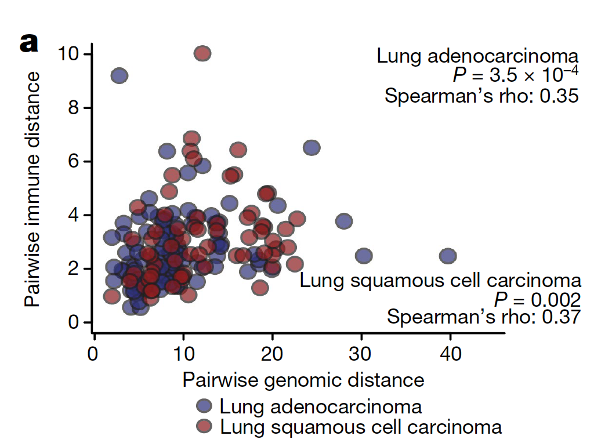

**Author(s)**: `r params$author`  
**Reviewer(s)**: `r params$reviewer`  
**Date**: `r Sys.Date()`  


# Academic Citation
If you use this code in your work or research, we kindly request that you cite our publication:

Xiaofan Lu, et al. (2025). FigureYa: A Standardized Visualization Framework for Enhancing Biomedical Data Interpretation and Research Efficiency. iMetaMed. https://doi.org/10.1002/imm3.70005

```{r setup, include=FALSE}
knitr::opts_chunk$set(echo = TRUE)
# 设置knitr的全局代码块选项 / Set global chunk options for knitr
```

## 需求描述

用TCGA的表达谱和体细胞突变作为输入，把体细胞突变MAF文件转为二元突变矩阵，用表达谱计算免疫细胞浸润得分；计算样本相似性并绘制相关性散点图。

（实质：对距离矩阵或相似性矩阵作相关性分析）

## Requirement Description

Use TCGA expression profiles and somatic mutations as inputs, convert somatic mutation MAF files to binary mutation matrices, use expression profiles to calculate immune cell infiltration scores; calculate sample similarity and plot correlation scatter plots.

(Substance: correlation analysis of distance matrix or similarity matrix)



出自<https://www.nature.com/articles/s41586-019-1032-7>

from<https://www.nature.com/articles/s41586-019-1032-7>

## 应用场景

多维度相关性研究，例如：推断体细胞突变和免疫浸润在影响肿瘤异质性上的相关程度。

## Application Scenarios

Multidimensional correlation studies, e.g., to infer the extent to which somatic mutations and immune infiltration are relevant in influencing tumor heterogeneity.

## 环境设置

## Environment settings

```{r}
source("install_dependencies.R")
# 加载GSVA包，用于基因集变异分析 (Load the GSVA package for gene set variation analysis)
library(GSVA)
# 加载ClassDiscovery包，用于外部聚类分析 (Load the ClassDiscovery package for external clustering analysis)
library(ClassDiscovery) 
# 加载vegan包，用于生态与二元变量的距离计算 (Load the vegan package for ecological and binary variable distance calculations)
library(vegan) 

# 设置环境语言为英文，以便显示英文报错信息 (Set environment language to English for English error messages)
Sys.setenv(LANGUAGE = "en") 
# 禁止字符串自动转换为因子类型，避免数据处理中的意外转换 (Disable automatic conversion of strings to factors)
options(stringsAsFactors = FALSE) 
```

## 输入数据预处理

需要三种文件：

- easy_input_expr1.csv，easy_input_expr2.csv，TCGA的表达数据。数据下载可参考FigureYa34count2FPKMv2。
- easy_input_maf1.txt，easy_input_maf2.txt，TCGA的突变数据。数据下载可参考FigureYa18oncoplot。
- immunitygene.csv，免疫细胞marker基因，这里用GSVA。还可以用MCPcounter，可参考FigureYa56immune_inflitration，或FigureYa71ssGSEA。

## Input data preprocessing

Three files are needed:

- easy_input_expr1.csv, easy_input_expr2.csv, TCGA expression data. For data download, please refer to FigureYa34count2FPKMv2.
- easy_input_maf1.txt, easy_input_maf2.txt, TCGA mutation data. For data download, please refer to FigureYa18oncoplot.
- immunitygene.csv, immunity cell marker gene, here we use GSVA, we can also use MCPcounter, please refer to FigureYa56immune_inflitration, or FigureYa71ssGSEA.

```{r}
# 读取LUAD(肺腺癌)表达矩阵数据，check.names=F避免列名被自动修改，row.names=1指定第一列为行名
# Read LUAD (lung adenocarcinoma) expression matrix data. check.names=F prevents automatic modification of column names, row.names=1 sets the first column as row names
tcga_expr_luad <- read.csv("easy_input_expr1.csv", check.names = F, row.names = 1)
# 查看数据前3行3列的基本结构
# View the basic structure of the first 3 rows and 3 columns of the data
tcga_expr_luad[1:3,1:3]

# 读取LUSC(肺鳞癌)表达矩阵数据，参数设置同上
# Read LUSC (lung squamous cell carcinoma) expression matrix data with the same parameter settings
tcga_expr_lusc <- read.csv("easy_input_expr2.csv", check.names = F, row.names = 1)
# 查看数据前3行3列的基本结构
# View the basic structure of the first 3 rows and 3 columns of the data
tcga_expr_lusc[1:3,1:3]

# 读取LUAD的MAF格式突变数据，使用制表符分隔，不设置行名
# Read LUAD MAF format mutation data, tab-separated, without setting row names
tcga_maf_luad <- read.delim("easy_input_maf1.txt",sep = "\t",row.names = NULL,check.names = F,stringsAsFactors = F,header = T)
# 查看数据前两行结构
# View the structure of the first two rows of the data
tcga_maf_luad[1:2,]

# 读取LUSC的MAF格式突变数据，参数设置同上
# Read LUSC MAF format mutation data with the same parameter settings
tcga_maf_lusc <- read.delim("easy_input_maf2.txt",sep = "\t",row.names = NULL,check.names = F,stringsAsFactors = F,header = T)

# 读取免疫相关基因集数据，用于后续免疫特征分析
# Read immune-related gene set data for subsequent immune signature analysis
immune.signature <- read.csv("immunitygene.csv",check.names = F,stringsAsFactors = F,header = T,row.names = NULL)
# 查看基因集数据前几行
# View the first few rows of the gene set data
head(immune.signature)
```

### 将详细突变的MAF文件转化为二元突变矩阵

先自定义个函数

### Convert a MAF file of detailed mutations into a binary mutation matrix

Let's customize a function.

```{r}
# 将MAF格式突变数据转换为二元突变矩阵
# 参数:
#   maf: MAF格式数据框，包含突变信息
#   rmType: 需要移除的突变类型向量(如沉默突变)，可为NULL
#   selSam: 需要选择的样本ID向量，可为NULL表示选择所有样本
# 返回值: 行为基因、列为样本的二元突变矩阵(0=未突变,1=突变)

# Convert MAF format mutation data into a binary mutation matrix
# Parameters:
#   maf: Data frame in MAF format containing mutation information
#   rmType: Vector of mutation types to be removed (e.g., silent mutations), can be NULL
#   selSam: Vector of sample IDs to be selected, can be NULL to select all samples
# Returns: Binary mutation matrix with genes as rows and samples as columns (0=unmutated, 1=mutated)
maf2binary <- function(maf = NULL, rmType = NULL, selSam = NULL) {
  
  # 如果指定了样本筛选，则仅保留选中样本的突变记录
  # If sample selection is specified, retain only mutation records of selected samples
  if(!is.null(selSam)) {
    tmp <- as.data.frame(maf[which(maf$Tumor_Sample_Barcode %in% selSam),c("Variant_Classification","Tumor_Sample_Barcode","Hugo_Symbol")])
  } else {
    # 否则使用全部样本的突变记录
    # Otherwise, use mutation records of all samples
    tmp <- as.data.frame(maf[,c("Variant_Classification","Tumor_Sample_Barcode","Hugo_Symbol")])
  }
  
  # 初始化二元突变矩阵，行是唯一基因，列是唯一样本
  # Initialize binary mutation matrix with unique genes as rows and unique samples as columns
  mut.binary <- matrix(0,
                      nrow = length(unique(tmp$Hugo_Symbol)),
                      ncol = length(unique(tmp$Tumor_Sample_Barcode)),
                      dimnames = list(c(unique(tmp$Hugo_Symbol)),
                                      unique(tmp$Tumor_Sample_Barcode)))
  
  # 这里我只想到了循环，喜欢提高运算速度的朋友可以改进。
  # 遍历每个样本构建二元矩阵(注：循环实现效率较低，大数据集建议优化)
  # Loop through each sample to construct binary matrix (Note: Loop implementation is inefficient, optimization recommended for large datasets)
  for (i in colnames(mut.binary)) {
    # 提取当前样本的所有突变记录
    # Extract all mutation records for the current sample
    tmp1 <- tmp[which(tmp$Tumor_Sample_Barcode == i),]
    
    # 如果指定了要移除的突变类型，则进行过滤
    # If mutation types to be removed are specified, perform filtering
    if(!is.null(rmType)) {
      if(is.element(rmType,tmp$Variant_Classification)) { # 确保有这种突变类型，避免负索引错误
        # Ensure the mutation type exists to avoid negative indexing errors
        tmp1 <- tmp1[-which(tmp1$Variant_Classification %in% rmType),] # 移除不想要的突变类型
        # Remove unwanted mutation types
      }
    }
    
    # 将该样本发生突变的基因在矩阵中对应位置设为1
    # Set corresponding positions in the matrix to 1 for mutated genes in this sample
    for (j in tmp1$Hugo_Symbol)
      mut.binary[j,i] <- 1
  }
  
  # 转换为数据框并将基因名转为大写
  # Convert to data frame and convert gene names to uppercase
  mut.binary <- as.data.frame(mut.binary); rownames(mut.binary) <- toupper(rownames(mut.binary))
  return(mut.binary)
}
```

用上面的函数，将详细突变的MAF文件转化为二元突变矩阵（移除沉默突变）

Using the function above, convert the MAF file of detailed mutations into a binary mutation matrix (removing silent mutations)

```{r}
# 将LUAD队列的MAF格式突变数据转换为二元突变矩阵，并移除沉默突变
# Convert LUAD cohort MAF format mutation data to binary mutation matrix, excluding silent mutations
tcga_mut_luad <- maf2binary(maf=tcga_maf_luad,rmType = "Silent") 
# 将LUSC队列的MAF格式突变数据转换为二元突变矩阵，并移除沉默突变
# Convert LUSC cohort MAF format mutation data to binary mutation matrix, excluding silent mutations
tcga_mut_lusc <- maf2binary(maf=tcga_maf_lusc,rmType = "Silent") 

# 将二元突变矩阵保存为制表符分隔的文本文件
# Save binary mutation matrix as tab-separated text file
write.table(tcga_mut_luad,"easy_input_mut1.txt",sep = "\t",row.names = T,col.names = NA,quote = F)
write.table(tcga_mut_lusc,"easy_input_mut2.txt",sep = "\t",row.names = T,col.names = NA,quote = F)

### 筛选突变频率超过5%的基因 ###
### Filter genes with mutation frequency >5% ###

# 计算每个基因在LUAD队列中的突变频率，保留突变频率>5%的基因索引
# Calculate mutation frequency of each gene in LUAD cohort, retain indices of genes with frequency >5%
index_luad <- which(rowSums(tcga_mut_luad)/ncol(tcga_mut_luad) > 0.05)
# 计算每个基因在LUSC队列中的突变频率，保留突变频率>5%的基因索引
# Calculate mutation frequency of each gene in LUSC cohort, retain indices of genes with frequency >5%
index_lusc <- which(rowSums(tcga_mut_lusc)/ncol(tcga_mut_lusc) > 0.05)
```

### 计算免疫浸润

### Calculating immune infiltration

```{r}
# 从免疫基因集中提取唯一的细胞类型
# Extract unique cell types from the immune gene set
cell.type <- unique(immune.signature$CellType)

# 初始化一个空列表，用于存储按细胞类型分组的免疫相关基因集
# Initialize an empty list to store immune-related gene sets grouped by cell type
immune.sig <- list()

# 按细胞类型构建免疫基因集列表
# Construct a list of immune gene sets by cell type
for (i in cell.type) {
  # 提取特定细胞类型对应的基因符号，并转换为大写
  # Extract gene symbols corresponding to a specific cell type and convert to uppercase
  immune.sig[[i]] <- toupper(immune.signature[which(immune.signature$CellType == i),"Symbol"])
}

# 对LUAD表达矩阵进行GSVA分析，计算免疫细胞类型富集分数
# Perform GSVA analysis on LUAD expression matrix to calculate immune cell type enrichment scores
gsva_params <- ssgseaParam(exprData = as.matrix(tcga_expr_luad),
                       geneSets = immune.sig)

tcga_gsva_luad <- gsva(gsva_params)

# 对LUSC表达矩阵进行GSVA分析，计算免疫细胞类型富集分数
# Perform GSVA analysis on LUSC expression matrix to calculate immune cell type enrichment scores
gsva_params <- ssgseaParam(exprData = as.matrix(tcga_expr_lusc),
                       geneSets = immune.sig)

tcga_gsva_lusc <- gsva(gsva_params)

```

## 样本聚类提取距离

## Sample clustering extraction distance

```{r}
# 确保表达矩阵和突变矩阵的样本顺序一致，取交集获取共同样本
# Ensure sample order consistency between expression and mutation matrices by intersecting common samples
sam_luad <- intersect(colnames(tcga_expr_luad),colnames(tcga_mut_luad))
sam_lusc <- intersect(colnames(tcga_expr_lusc),colnames(tcga_mut_lusc))

# 计算LUAD队列免疫特征的欧氏距离矩阵
# Calculate Euclidean distance matrix for LUAD immune features
dist.gsva.luad <- as.matrix(distanceMatrix(as.matrix(tcga_gsva_luad[,sam_luad]), "euclidean"))
# 查看距离矩阵的基本结构
# View basic structure of the distance matrix
dist.gsva.luad[1:3,1:3]

# 计算LUSC队列免疫特征的欧氏距离矩阵
# Calculate Euclidean distance matrix for LUSC immune features
dist.gsva.lusc <- as.matrix(distanceMatrix(as.matrix(tcga_gsva_lusc[,sam_lusc]), "euclidean"))
# 查看距离矩阵的基本结构
# View basic structure of the distance matrix
dist.gsva.lusc[1:3,1:3]

# 个人认为由于突变是二元变量，使用jaccard index比欧氏距离更好。
# 计算LUAD队列突变特征的Jaccard距离矩阵（更适合二元数据）
# Calculate Jaccard distance matrix for LUAD mutation features (more suitable for binary data)
dist.mut.luad <- as.matrix(vegdist(t(as.matrix(tcga_mut_luad[index_luad,sam_luad])), method = "jaccard")) 
# 查看距离矩阵的基本结构
# View basic structure of the distance matrix
dist.mut.luad[1:3,1:3]

# 计算LUSC队列突变特征的Jaccard距离矩阵
# Calculate Jaccard distance matrix for LUSC mutation features
dist.mut.lusc <- as.matrix(vegdist(t(as.matrix(tcga_mut_lusc[index_lusc,sam_lusc])), method = "jaccard"))
# 查看距离矩阵的基本结构
# View basic structure of the distance matrix
dist.mut.lusc[1:3,1:3]

### 构建散点图的横轴纵轴（看需求描述）
### Build scatter plot axes (see requirements description)

# 将配对距离矩阵转换为散点图坐标数据框
# 参数:
#   dist1: 第一个距离矩阵(如免疫特征距离)
#   dist2: 第二个距离矩阵(如突变特征距离)
#   sam: 样本名称向量
# 返回值: 包含x轴(dist1)和y轴(dist2)坐标的数据框

# Convert paired distance matrices to scatter plot coordinate data frame
# Parameters:
#   dist1: First distance matrix (e.g., immune feature distance)
#   dist2: Second distance matrix (e.g., mutation feature distance)
#   sam: Vector of sample names
# Returns: Data frame containing x-axis (dist1) and y-axis (dist2) coordinates
dist2xy <- function(dist1=NULL,dist2=NULL,sam=NULL) {
  # 这里我只想到了循环，喜欢提高运算速度的朋友可以改进。
  # Initialize empty data frame to store scatter plot coordinates
  scat.mat <- NULL
  
  # 遍历所有样本对，构建散点图数据
  # Iterate through all sample pairs to construct scatter plot data
  for (i in 1:(length(sam) - 1)) {
    cat("Index: ",i,"\n")  
    for (j in (i + 1):length(sam)) {
      # 创建包含一对样本在两个距离矩阵中距离的数据框
      # Create data frame containing distances of a sample pair from both distance matrices
      tmp <- data.frame(x=dist1[i,j],y=dist2[i,j],stringsAsFactors = F)
      scat.mat <- rbind.data.frame(scat.mat,tmp)  
    }
  }
  
  # 验证组合数是否正确
  # Validate if the number of combinations is correct
  if(!dim(scat.mat)[1] == length(sam)*(length(sam)-1)/2) {
    stop("Error!\n")  # 确保组合数符合n*(n-1)/2
  } else {
    return(scat.mat)  # 返回散点图坐标数据框
  }
}

# 计算LUAD队列的散点图坐标数据
# Calculate scatter plot coordinates for LUAD cohort
scat.luad <- dist2xy(dist1 = dist.gsva.luad, dist2 = dist.mut.luad,sam = sam_luad)
# 查看数据基本结构
# View basic structure of the data
scat.luad[1:3,1:2]

# 计算LUSC队列的散点图坐标数据
# Calculate scatter plot coordinates for LUSC cohort
scat.lusc <- dist2xy(dist1 = dist.gsva.lusc, dist2 = dist.mut.lusc,sam = sam_lusc)
# 查看数据基本结构
# View basic structure of the data
scat.lusc[1:3,1:2]
```

## 开始画图

画相关性散点图，这里只简单使用baseplot画scatter plot，可换用ggplot、ggpubr。

多组情况也可参考FigureYa62twoAxis，把突变和免疫浸润分别画在左右两个y轴上

如果嫌点太多，可以通过取bin来缩减点的数量。

## Start plotting

Draw correlation scatter plot, here only simply use baseplot to draw scatter plot, can be replaced with ggplot, ggpubr.

You can also refer to FigureYa62twoAxis for more than one group, and draw the mutation and immune infiltration on the left and right y-axis respectively.

If there are too many points, you can reduce the number of points by taking bin.

```{r}
# 定义绘图颜色
# Define plot colors
violet <- "#89439B"  
pink  <- "#f2d7ee"   

# 计算LUAD队列免疫距离与基因突变距离的Pearson相关性
# Calculate Pearson correlation between immune and mutation distances for LUAD cohort
r.luad <- cor.test(scat.luad$x,scat.luad$y,method = "pearson",conf.level = .95) 
# 计算LUSC队列免疫距离与基因突变距离的Pearson相关性
# Calculate Pearson correlation between immune and mutation distances for LUSC cohort
r.lusc <- cor.test(scat.lusc$x,scat.lusc$y,method = "pearson",conf.level = .95)

# 打开PDF图形设备准备保存图表
# Open PDF graphics device to save the plot
pdf("correlation plot between two distance factors.pdf", width = 5, height = 4.5)

# 设置图形参数
# Set plot parameters
par(xpd=NA, bty="l", mgp = c(2.3,.4,0), 
    las=1, tcl=-.25, font.main=3, 
    mar = par()$mar + c(3,0,0,3))  

# 绘制LUAD队列的散点图（免疫距离 vs 基因突变距离）
# Plot scatter plot for LUAD cohort (immune distance vs mutation distance)
plot(scat.luad$x, scat.luad$y, 
     main = "", xlab = "Pairwise immunologic distance", ylab = "Pairwise genomic distanse",
     pch = 19,  # 使用实心圆点
     # 由于样本对数量多，点会很密集，使用alpha值使点半透明
     # Use alpha to make points semi-transparent due to high density
     col=ggplot2::alpha(violet,0.5)) 

# 添加LUSC队列的散点图
# Add scatter plot points for LUSC cohort
points(scat.lusc$x, scat.lusc$y, 
       pch = 19, 
       col=ggplot2::alpha(pink,0.5))

# 在图的右上角添加LUAD队列的相关系数和p值
# Add correlation coefficient and p-value for LUAD in the upper right corner
text(max(scat.luad$x,scat.lusc$x), max(scat.luad$y,scat.lusc$y) - 0.02, 
     paste("Lung adenocarcinoma\nP ",
     ifelse(r.luad$p.value < 0.001,"< 0.001",paste0("= ",round(r.luad$p.value,3))), 
     "\nPearson's rho = ", round(r.luad$estimate,3), sep = ''), pos = 2, cex = .8)

# 在图的右下角添加LUSC队列的相关系数和p值
# Add correlation coefficient and p-value for LUSC in the lower right corner
text(max(scat.luad$x,scat.lusc$x), min(scat.luad$y,scat.lusc$y) + 0.02, 
     paste("Lung squamous cell carcinoma\nP ",
     ifelse(r.lusc$p.value < 0.001,"< 0.001",paste0("= ",round(r.lusc$p.value,3))), 
     "\nPearson's rho = ", round(r.lusc$estimate,3), sep = ''), pos = 2, cex = .8) 

# 添加图例（位于图形外部底部）
# Add legend (positioned outside the plot at the bottom)
legend("bottom", 
       inset=c(0, -0.6),  
       pch=19, cex = .8,
       col=c(violet, pink), 
       legend=c("Lung adenocarcinoma", "Lung squamous cell carcinoma"), 
       bty="n")  

# 关闭PDF设备
# Close PDF device
invisible(dev.off())
```


# Session Info

```{r}
sessionInfo()
```
