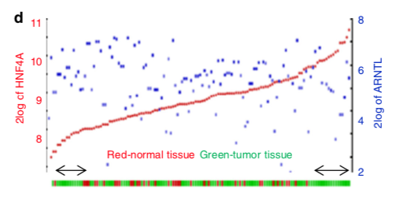

**Author(s)**: `r params$author`  
**Reviewer(s)**: `r params$reviewer`  
**Date**: `r Sys.Date()`  


# Academic Citation
If you use this code in your work or research, we kindly request that you cite our publication:

Xiaofan Lu, et al. (2025). FigureYa: A Standardized Visualization Framework for Enhancing Biomedical Data Interpretation and Research Efficiency. iMetaMed. https://doi.org/10.1002/imm3.70005

```{r setup, include=FALSE}
knitr::opts_chunk$set(echo = TRUE)
# 设置knitr的全局代码块选项 / Set global chunk options for knitr
```

## 需求描述

FigureYa92immune_gene只是1个基因跟免疫浸润的关系。我想要展示两个基因表达跟免疫浸润高/低的关系。

左右两侧纵坐标分别展示两个基因的表达量；横坐标按其中一个基因排序，两种颜色展示高/低免疫浸润，可以用FigureYa71ssGSEA热图中对高/低免疫浸润的结果作为输入。

## Requirement Description

FigureYa92immune_gene is just 1 gene in relation to immune infiltration. I want to show the relationship between the expression of two genes and the high/low immune infiltration.

The left and right vertical coordinates show the expression of the two genes; the horizontal coordinates are sorted by one of the genes, and the two colors show the high/low immune infiltration, which can be used as inputs with the results of the FigureYa71ssGSEA heatmap for high/low immune infiltration.



出自<https://www.nature.com/articles/s41467-018-06648-6>

from<https://www.nature.com/articles/s41467-018-06648-6>

## 应用场景

评价基因对免疫浸润的影响；

批量筛选出影响免疫浸润的候选基因；

同样适用于展示转录因子和靶基因表达调控的关系。

## Application Scenarios

Evaluate the effect of genes on immune infiltration;

Batch screening of candidate genes affecting immune infiltration;

It is also applicable to show the relationship between transcription factors and target gene expression regulation.

## 输入文件的获得

如果你的数据已经整理成very_easy_input.csv的格式，就可以跳过这步，直接进入“开始画图”。

这里基于免疫细胞矩阵把样品分为两类，并把分类信息加到基因表达矩阵里。要求两个文件的样本名一致：

- ssGSEA_output.csv，免疫细胞矩阵，列是免疫细胞，行是样本，由FigureYa71ssGSEA产生。目的是给样品分类，可以换成其他临床信息、突变信息等等。
- easy_input_expr.csv，基因表达矩阵，列是样本，行是基因。行也可以是转录本，甚至是临床信息。

## Getting the input file

If your data has been organized into very_easy_input.csv format, you can skip this step and go directly to “Start drawing”.

Here, the samples are classified into two categories based on the immune cell matrix, and the classification information is added to the gene expression matrix. The sample names of the two files should be the same:

- ssGSEA_output.csv, immune cell matrix, columns are immune cells, rows are samples, generated by FigureYa71ssGSEA. The purpose is to categorize the samples, which can be replaced with other clinical information, mutation information, etc.
- easy_input_expr.csv, gene expression matrix, columns are samples, rows are genes. Rows can also be transcripts or even clinical information.

```{r}
source("install_dependencies.R")
# 免疫细胞的数据加载与预处理
# Loading and preprocessing of immune cell data

# 读取ssGSEA输出文件作为免疫细胞数据
# Read ssGSEA output file as immune cell data
tcga_gsva <- read.csv("ssGSEA_output.csv", row.names = 1)

# 将行名中的点号替换为连字符，符合样本ID格式
# Replace dots with hyphens in row names to match sample ID format
rownames(tcga_gsva) <- gsub("\\.", "-", rownames(tcga_gsva))

# 查看数据前几行几列，确认数据结构
# View first few rows and columns to confirm data structure
tcga_gsva[1:3, 1:3]

# 使用data.table包快速读取表达矩阵数据
# Quickly read expression matrix data using data.table package
tcga_expr <- data.table::fread("easy_input_expr.csv", data.table = F)

## 将第一列设置为行名（基因名）
## Set the first column as row names (gene names)
rownames(tcga_expr) <- tcga_expr[, 1]

## 移除第一列，只保留表达量数据
## Remove the first column, keeping only expression data
tcga_expr <- tcga_expr[, -1]

# 查看表达矩阵前几行几列，确认数据结构
# View first few rows and columns of expression matrix to confirm structure
head(tcga_expr)[, 1:4]
```

### 通过画热图聚类确定高、低免疫浸润的分组

### Subgroups of high and low immune infiltration were identified by drawing heat map clusters

```{r,fig.width=8, fig.height=8}
## 数据需要转置，使得样本成为列
# Transpose the data so that samples become columns
data <- data.frame(t(tcga_gsva), check.names = F)

# 加载pheatmap包用于绘制热图
# Load the pheatmap package for drawing heatmaps
library(pheatmap)

# 绘制基因表达热图，可视化免疫细胞数据
# Draw a gene expression heatmap to visualize immune cell data
pheatmap(
  data,                 # 热图的输入数据矩阵（行：基因/通路，列：样本）
                        # Input data matrix (rows: genes/pathways, columns: samples)
  
  cluster_rows = TRUE,  # 是否对行进行聚类（基因/通路聚类）
                        # Whether to cluster rows (genes/pathways clustering)
  
  cluster_cols = TRUE,  # 是否对列进行聚类（样本聚类），可看出样本间的区分度
                        # Whether to cluster columns (sample clustering), 
                        # helps identify sample subgroups
  
  # annotation_col = annotation_col,  # 样本分类注释信息（列注释）
                                      # Sample classification annotation (column annotation)
  
  annotation_legend = TRUE,  # 是否显示注释图例
                             # Whether to show annotation legends
  
  show_rownames = TRUE,     # 是否显示行名（基因/通路名称）
                            # Whether to show row names (gene/pathway names)
  
  show_colnames = FALSE,    # 是否显示列名（样本ID）
                            # Whether to show column names (sample IDs)
  
  scale = "row",            # 以行进行标准化（z-score转换），便于跨样本比较基因表达
                            # Standardize by row (z-score transformation), 
                            # facilitates cross-sample gene expression comparison
  
  color = colorRampPalette(c("blue", "white", "red"))(100),  # 颜色渐变：低表达(蓝)->中等(白)->高表达(红)
                                                                  # Color gradient: low expression (blue) -> medium (white) -> high (red)
  
  # filename = "heatmap_F.pdf",  # 是否保存热图为PDF文件
                                # Whether to save the heatmap as a PDF file
  
  cellwidth = 0.6,          # 热图单元格宽度（控制列宽）
                            # Width of heatmap cells (controls column width)
  
  cellheight = 16,          # 热图单元格高度（控制行高）
                            # Height of heatmap cells (controls row height)
  
  fontsize = 10             # 文本字体大小
                            # Font size for text
)
```

从热图上看出，至少样本能分为两大类，接下来就是确定样本分类。

dist计算欧式距离，hclust层次聚类

The heat map shows that at least the samples can be classified into two main categories, the next step is to determine the sample classification.

dist calculates the euclidean distance, hclust hierarchical clustering

```{r}
# 对表达矩阵进行标准化处理并转置，使样本作为行、基因作为列
# Standardize the expression matrix and transpose it so samples are rows and genes are columns
dd <- as.data.frame(scale(t(data))) 

# 计算样本间的欧氏距离矩阵
# Calculate Euclidean distance matrix between samples
# method参数可选：euclidean/manhattan/canberra/binary/minkowski
# Available methods: euclidean/manhattan/canberra/binary/minkowski
dd_dist <- dist(dd, method = 'euclidean')

# 使用完全连接法(complete linkage)进行层次聚类
# Perform hierarchical clustering using complete linkage method
# method参数可选：ward.D/ward.D2/single/complete/average/centroid/median/minkowski
# Available methods: ward.D/ward.D2/single/complete/average/centroid/median/minkowski
dd_hclust <- hclust(dd_dist, method = 'complete')

# 绘制层次聚类树状图
# Plot the hierarchical clustering dendrogram
plot(
  dd_hclust,           # 聚类对象
  cex = 0.6,           # 标签字体大小(0.6倍默认大小)
  hang = -1            # 标签悬挂位置(-1表示全部显示在底部)
)
```

切割成两类得到样本的属性

Cut into two categories to get the attributes of the sample

```{r}
# 将层次聚类结果切割为2个簇
# Cut the hierarchical clustering results into 2 clusters
# k参数指定聚类数量，可根据树状图或实际需求调整
# The k parameter specifies the number of clusters, 
# which can be adjusted according to the dendrogram or actual needs
grp <- cutree(dd_hclust, k = 2)

# 统计每个簇包含的样本数量
# Count the number of samples in each cluster
# table()函数会返回一个频率表，显示每个簇的样本数
# The table() function returns a frequency table showing 
# the number of samples in each cluster
table(grp)
```

### 把分组信息加入到表达矩阵里

用表达量的样本来重新排列样本顺序，构建一个数据框。行是样本，列是基因，再加一类样本分类的数据，这就足够画图了。

### Add grouping information to the expression matrix

Use the samples of expression to reorder the samples to construct a data frame. The rows are the samples, the columns are the genes, and add a class of samples categorized by data, and that's enough to draw a graph.

```{r}
# 筛选并匹配样本分组信息，确保与表达矩阵样本顺序一致
# Filter and match sample group information to ensure alignment with expression matrix
grp <- grp[colnames(tcga_expr)]

# 创建整合数据集：包含样本ID、免疫分组和基因表达值
# Create an integrated dataset: includes sample ID, immune group, and gene expression values
data <- data.frame(
  TCGA_id = colnames(tcga_expr),          # TCGA样本ID列
  immune_group = grp,                     # 免疫分组结果列
  t(tcga_expr),                           # 转置后的基因表达矩阵（样本为行，基因为列）
  stringsAsFactors = FALSE                # 禁止自动将字符列转换为因子
)

# 查看整合后数据的前10行10列，确认数据结构
# View first 10 rows and 10 columns to confirm data structure
data[1:10, 1:10]

# 保存整合数据到CSV文件
# Save integrated data to CSV file
# write.csv(data, "very_easy_input.csv", quote = F, row.names = F)

# 仅保存前3行作为格式参考，实际使用时请取消上面注释并注释掉下面这行
# Save only the first 3 rows for format reference. 
# Uncomment the line above and comment this line in actual use.
write.csv(data[1:3, ], "very_easy_input.csv", quote = FALSE, row.names = FALSE)
```

## 输入文件

带有样品分组信息的基因表达矩阵。

每行一个样品，第一列是样品分组信息，此处是两组，还可以是更多组，之后每列一个基因。

## Input file

Gene expression matrix with sample grouping information.

One sample per row, sample grouping information in the first column, two groups here, could be more, one gene per column after that.

```{r}
# 从CSV文件读取整合后的数据（当前行被注释，使用内存中的data对象）
# Read integrated data from CSV file (this line is commented out, using in-memory data object)
# data <- read.csv("very_easy_input.csv")

# 查看数据前3行和前6列，确认数据结构和内容
# View first 3 rows and first 6 columns to confirm data structure and content
data[1:3, 1:6]
```

## 开始画图

用ggplot2画图，基本的逻辑如下：

- 横坐标是样本，按照第一个基因的表达量来排序
- 纵坐标两个基因的表达量，分别用两个坐标轴来表示
- 纵坐标的坐标轴颜色用theme来调整
- 底部的竖线用geom_rug来实现
- 文字使用geom_textl来打印，打印的位置固定在纵坐标的下1/8处
- 实现文字的相对位置固定，需要先画出一部分图，保存为ggplot对象，再在对象中选取

## Start drawing a graph

To draw a graph with ggplot2, the basic logic is as follows:

- The horizontal coordinate is the samples, sorted by the expression of the first gene.
- Vertical coordinate is the expression of two genes, represented by two axes.
- The color of the axes in the vertical coordinate is adjusted by a theme.
- The vertical line at the bottom is realized by geom_rug.
- The text is printed using geom_textl, and the print position is fixed at the lower 1/8 of the vertical coordinate.
- To realize the relative position of the text is fixed, you need to draw a part of the map, save it as a ggplot object, and then select it in the object.

### 直接画图

### Direct drawing ###

```{r,fig.width=8, fig.height=4}
# 加载ggplot2和dplyr包用于数据可视化和处理
# Load ggplot2 and dplyr packages for data visualization and manipulation
library(ggplot2)
library(dplyr)

# 创建基因表达散点图，按SRGN基因表达量排序样本
# Create a scatter plot of gene expression, ordering samples by SRGN expression
p <- data %>% 
  arrange(SRGN) %>%  # 按SRGN基因表达量排序数据
  ggplot(aes(forcats::fct_reorder(TCGA_id, SRGN), log2(SRGN))) +  # 左侧y轴：SRGN基因
  geom_point(color = "red", size = 1) +  # 绘制SRGN表达点（红色）
  
  # 叠加BCL2A1基因表达（蓝色）在右侧y轴
  geom_point(aes(TCGA_id, log2(BCL2A1)), color = "blue", size = 1) +
  
  # 设置双Y轴，右侧Y轴显示BCL2A1表达
  scale_y_continuous(sec.axis = sec_axis(~ ., name = "log2(BCL2A1)")) +
  
  # 在X轴上下添加免疫分组的边际分布标记
  geom_rug(aes(x = TCGA_id, y = NULL, color = factor(immune_group))) +
  
  # 设置免疫分组颜色：绿色=低免疫组，红色=高免疫组
  scale_color_manual(values = c("springgreen3", "red")) +
  
  # 自定义图表主题
  theme(
    axis.title.x = element_blank(),          # 隐藏X轴标题
    axis.text.x = element_blank(),           # 隐藏X轴刻度标签
    axis.ticks.x = element_blank(),          # 隐藏X轴刻度线
    axis.line.x.bottom = element_line(colour = "white"),  # 隐藏X轴线
    axis.line.y.left = element_line(colour = "black"),    # 左侧Y轴线为黑色
    axis.line.y.right = element_line(colour = "black"),   # 右侧Y轴线为黑色
    legend.position = 'none',                # 不显示图例
    axis.text.y.right = element_text(color = c("blue")),  # 右侧Y轴标签为蓝色
    axis.title.y.right = element_text(color = c("blue")),  # 右侧Y轴标题为蓝色
    axis.text.y.left = element_text(color = c("red")),    # 左侧Y轴标签为红色
    axis.title.y.left = element_text(color = c("red"))    # 左侧Y轴标题为红色
  )

# 计算Y轴中间位置，用于添加注释文本
# Calculate the middle position of the Y-axis for annotation text
ypos <- (quantile(layer_scales(p)$y$range$range)[2] + quantile(layer_scales(p)$y$range$range)[1]) / 2

# 添加分组注释文本并显示图表
# Add group annotation text and display the plot
p + 
  geom_text(aes(x = nrow(data)/3, y = ypos, label = "Red-high immune tissues"), col = "red", size = 5) +
  geom_text(aes(x = nrow(data)/3*2, y = ypos, label = "Green-low immune tissues"), col = "springgreen3", size = 5)
```

### 或者写成一个作图函数，方便调用

### Or write it as a graphing function that is easy to call.

```{r}
# 定义基因表达对比可视化函数
# Define a function for visualizing gene expression comparison
dgplot <- function(x, y) {
  # 提取需要的列数据，包括样本ID、免疫分组和两个目标基因
  # Extract required columns: sample ID, immune group, and two target genes
  dd <- data[, c("TCGA_id", "immune_group", x, y)]
  
  # 重命名基因列，便于后续处理
  # Rename gene columns for easier processing
  names(dd)[3:4] <- c("geneA", "geneB")
  
  # 加载必要的包
  # Load required packages
  require(dplyr)
  require(ggplot2)
  
  # 创建双Y轴散点图，按geneA表达量排序样本
  # Create a dual Y-axis scatter plot, ordering samples by geneA expression
  p <- dd %>% 
    arrange(geneA) %>% 
    ggplot(aes(forcats::fct_reorder(TCGA_id, geneA), log2(geneA))) +
    
    # 绘制geneA表达点（红色，左Y轴）
    # Plot geneA expression points (red, left Y-axis)
    geom_point(color = "red", size = 1) +
    
    # 叠加绘制geneB表达点（蓝色，右Y轴）
    # Overlay geneB expression points (blue, right Y-axis)
    geom_point(aes(TCGA_id, log2(geneB)), color = "blue", size = 1) +
    
    # 设置双Y轴，右侧Y轴显示geneB的标签
    # Configure dual Y-axes, right axis labeled for geneB
    scale_y_continuous(sec.axis = sec_axis(~ ., name = paste0("log2(", y, ")"))) +
    
    # 在X轴上下添加免疫分组的边际标记
    # Add marginal markers for immune groups above and below X-axis
    geom_rug(aes(x = TCGA_id, y = NULL, color = factor(immune_group))) +
    
    # 设置免疫分组颜色：绿色=低免疫组，红色=高免疫组
    # Set colors for immune groups: green for low, red for high
    scale_color_manual(values = c("springgreen3", "red")) +
    
    # 自定义图表主题，美化显示效果
    # Customize plot theme for better visualization
    theme(
      axis.title.x = element_blank(),          # 隐藏X轴标题
      axis.text.x = element_blank(),           # 隐藏X轴刻度标签
      axis.ticks.x = element_blank(),          # 隐藏X轴刻度线
      axis.line.x.bottom = element_line(colour = "white"),  # 隐藏X轴线
      axis.line.y.left = element_line(colour = "black"),    # 左侧Y轴线为黑色
      axis.line.y.right = element_line(colour = "black"),   # 右侧Y轴线为黑色
      legend.position = 'none',                # 不显示图例
      axis.text.y.right = element_text(color = "blue"),     # 右侧Y轴标签为蓝色
      axis.title.y.right = element_text(color = "blue"),    # 右侧Y轴标题为蓝色
      axis.text.y.left = element_text(color = "red"),       # 左侧Y轴标签为红色
      axis.title.y.left = element_text(color = "red")       # 左侧Y轴标题为红色
    ) +
    
    # 设置左侧Y轴标题
    # Set left Y-axis title
    labs(y = paste0("log2(", x, ")"))
  
  # 计算Y轴下1/8位置，用于添加注释文本
  # Calculate the position at 1/8 of the Y-axis range for annotations
  ypos <- mean(quantile(layer_scales(p)$y$range$range)[1:2])
  
  # 添加分组注释文本
  # Add group annotation text
  p <- p + 
    geom_text(aes(x = nrow(data)/3, y = ypos, label = "Red-high immune tissues"), col = "red", size = 5) +
    geom_text(aes(x = nrow(data)/3*2, y = ypos, label = "Green-low immune tissues"), col = "springgreen3", size = 5)
  
  # 打印并返回图表对象
  # Print and return the plot object
  print(p)
}
```

只需这一行就能选择基因画图

Select gene drawing with just this one line

```{r,fig.width=8, fig.height=4}
# 调用dgplot函数创建SRGN和AP1M2基因表达对比图
# 这两个基因在免疫分组样本中呈现负相关关系
# Call the dgplot function to create a comparison plot of SRGN and AP1M2 gene expression
# These two genes show a negative correlation in immune分组 samples
dgplot("SRGN", "AP1M2")

# 将图表保存为PDF文件
# 宽度设置为8英寸，高度设置为4英寸，保持适当的纵横比
# Save the plot to a PDF file
# Set width to 8 inches and height to 4 inches to maintain appropriate aspect ratio
ggsave(
  filename = "SRGN_AP1M2.pdf",  # 输出文件名
  width = 8,                     # 宽度（英寸）
  height = 4,                    # 高度（英寸）
  dpi = 300                      # 分辨率（每英寸点数）
)
```

```{r,fig.width=8, fig.height=4}
# 调用自定义函数比较SRGN和BCL2A1基因表达
# 这两个基因在免疫分组样本中呈现正相关关系
# Call the custom function to compare SRGN and BCL2A1 gene expression
# These two genes show a positive correlation in immune分组 samples
dgplot("SRGN", "BCL2A1")
```

```{r,fig.width=8, fig.height=4}
# 调用dgplot函数比较PERM1和ISG15基因表达
# 这两个基因在免疫分组样本中无明显相关性
# Call the dgplot function to compare PERM1 and ISG15 gene expression
# These two genes show no significant correlation in immune subgroup samples
dgplot("PERM1", "ISG15")
```

## 批量筛选高度正/负相关的基因

上面用三对基因画出的三个图，分别展示了两个基因之间正相关、负相关和不相关的规律，同时还能看出基因表达量跟免疫浸润之间的关系。

而最后一个图，横坐标比较乱，说明PERM1的表达量和免疫浸润关系不大，而且PERM1和ISG15这两个基因也没有相关性。

> 怎样画出像前两对基因那样的效果呢？

这就需要进行批量筛选了。

如果要想画出同时跟免疫相关、两个基因又相关的图，需要经过两次计算：

1. 选出跟免疫浸润相关的基因
2. 选出给定基因的高相关基因

## Batch screen highly positive/negative correlated genes

The three graphs drawn above with three pairs of genes show the pattern of positive, negative and no correlation between two genes, and also the relationship between gene expression and immune infiltration.

As for the last graph, the horizontal coordinates are rather messy, indicating that the expression of PERM1 has little relationship with immune infiltration, and there is no correlation between the two genes, PERM1 and ISG15.

> How to draw like the first two pairs of genes?

This would require a batch screen.

To draw a plot that is simultaneously related to immunization and both genes are related, two calculations are required:

1. pick the gene that is related to immune infiltration
2. select the highly correlated genes for a given gene

### 选出跟免疫浸润相关的基因

目前跟免疫直接相关的数据，我们拥有的是每个样本中的免疫细胞数据。要获得基因的数据，需要批量计算跟免疫细胞相关的基因。

计算相关性之前，保证免疫矩阵和表达量矩阵两者的样本排序一致。

### Selected genes related to immune infiltration.

Currently, we have data on the immune cells in each sample that are directly related to immunization. To get the gene data, we need to batch calculate the genes associated with immune cells.

Before calculating the correlation, make sure that the samples in both the immunity matrix and the expression matrix are sorted in the same order.

```{r}
# 筛选tcga_gsva数据，仅保留存在于tcga_expr中的样本
# Filter tcga_gsva data to retain only samples present in tcga_expr
# 确保两个数据集中的样本ID一致，用于后续分析
# Ensure sample IDs are consistent between the two datasets for downstream analysis
tcga_gsva <- tcga_gsva[colnames(tcga_expr), ]
```

写一个函数，计算任意表达量数据中的基因与其他因素的相关性。

其他因素可以是两外一个基因，也可以是任何个数一致的变量。

Write a function that calculates the correlation between a gene and other factors in any expression data.

The other factors can be two outside a gene or any number of consistent variables.

```{r}
# 定义计算基因表达与连续变量相关性的函数
# Define a function to calculate correlation between gene expression and a continuous variable
my_cor <- function(x, y) {
  # 执行Spearman秩相关检验，计算基因表达与指定变量的相关性
  # Perform Spearman rank correlation test between gene expression and the specified variable
  dd <- cor.test(
    as.numeric(tcga_expr[x,]),  # 提取指定基因的表达量数据
    y,                          # 输入的连续变量
    method = "spearman"         # 使用Spearman秩相关方法
  )
  
  # 返回相关系数和p值
  # Return correlation coefficient and p-value
  c(cor = dd$estimate, p.value = dd$p.value)
}
```

举个例子，可以用这个函数计算SRGN跟免疫细胞Neutrophils的相关性。

As an example, this function can be used to calculate the correlation between SRGN and immune cell Neutrophils.

```{r}
# 指定要分析的免疫细胞类型（这里选择中性粒细胞）
# Specify the immune cell type to analyze (Neutrophils in this case)
index <- "Neutrophils"

# 从免疫细胞数据中提取指定细胞类型的富集分数，并转换为数值型
# Extract the enrichment score of the specified immune cell type from tcga_gsva
# and convert it to a numeric vector
y <- as.numeric(tcga_gsva[, index])

# 计算SRGN基因表达与中性粒细胞富集分数之间的Spearman相关性
# Calculate the Spearman correlation between SRGN gene expression 
# and Neutrophils enrichment score
my_cor("SRGN", y)
```

### 1. 批量计算基因与特定免疫细胞的相关性

免疫细胞以Neutrophils为例，批量计算所有基因的表达谱跟免疫细胞Neutrophils的相关性，进而筛选到跟免疫细胞Neutrophils相关性高的基因。

### 1. Batch calculation of correlation between genes and specific immune cells

Neutrophils is used as an example to batch calculate the correlation between the expression profiles of all the genes and Neutrophils, and then filter the genes with high correlation with Neutrophils.

```{r,message=FALSE, warning=FALSE}
# 加载future.apply包进行并行计算
# Load future.apply package for parallel computation
library(future.apply)

# 设置并行计算方式为多进程模式
# Set parallel computation mode to multiprocess
# plan(multiprocess)

# 指定要分析的免疫细胞类型（中性粒细胞）
# Specify the immune cell type to analyze (Neutrophils)
index <- "Neutrophils"

# 从免疫细胞数据中提取中性粒细胞的富集分数，并转换为数值型
# Extract Neutrophils enrichment scores from tcga_gsva and convert to numeric
y <- as.numeric(tcga_gsva[, index])

# 使用并行计算批量计算所有基因与中性粒细胞的相关性
# Use parallel computation to calculate correlation for all genes
# system.time用于记录计算耗时
# system.time records the computation time
system.time(
  data <- future_lapply(rownames(tcga_expr), my_cor, y)
)

# 将结果整理成数据框格式
# Convert results into a data frame
result1 <- data.frame(
  genes = rownames(tcga_expr),  # 基因名称
  do.call(rbind, data),         # 绑定所有基因的相关性结果
  stringsAsFactors = FALSE      # 禁止自动将字符列转换为因子
)

# 查看结果前几行
# View the first few rows of the results
head(result1)

# 将结果保存到CSV文件
# Save results to a CSV file
write.csv(result1, "output_corr.csv", quote = FALSE, row.names = FALSE)
```

筛选出相关性最高的Top10

Filtering the Top 10 with the highest relevance

```{r}
# 加载dplyr包用于数据筛选和排序
# Load the dplyr package for data filtering and sorting
library(dplyr)

# 筛选显著相关的基因并按相关系数降序排列
# Filter genes with significant correlation and sort by correlation coefficient descending
result1 %>% 
  filter(p.value < 0.05) %>%       # 筛选p值小于0.05的显著相关基因
  arrange(desc(cor.rho)) %>%      # 按相关系数降序排列
  head()                          # 显示前几个基因
```

下面就用排名第一的SRGN作为第一个基因，寻找跟它表达量高度相关的第二个基因。

Here we use the top ranked SRGN as the first gene and look for the second gene that is highly correlated with its expression.

### 2. 批量计算SRGN与其他基因的相关性

### 2. Batch calculation of correlation between SRGN and other genes

```{r,message=FALSE, warning=FALSE}
# 指定要分析的目标基因（这里选择SRGN）
# Specify the target gene to analyze (SRGN in this case)
index <- "SRGN"

# 从基因表达数据中提取目标基因的表达量，并转换为数值型
# Extract the expression values of the target gene from tcga_expr
# and convert it to a numeric vector
y <- as.numeric(tcga_expr[index, ])

# 使用并行计算批量计算所有基因与目标基因的相关性
# Use parallel computation to calculate correlation for all genes
# system.time用于记录计算耗时
# system.time records the computation time
system.time(
  data <- future_lapply(rownames(tcga_expr), my_cor, y)
)

# 将结果整理成数据框格式
# Convert results into a data frame
result2 <- data.frame(
  genes = rownames(tcga_expr),  # 基因名称
  do.call(rbind, data),         # 绑定所有基因的相关性结果
  stringsAsFactors = FALSE      # 禁止自动将字符列转换为因子
)
```

筛选正相关的Top10

Filter positively correlated Top10

```{r}
# 加载dplyr包用于数据筛选和排序
# Load the dplyr package for data filtering and sorting
library(dplyr)

# 筛选与SRGN基因显著正相关的基因并显示前几个
# Filter genes significantly positively correlated with SRGN and show the top ones
result2 %>% 
  filter(p.value < 0.05) %>%       # 筛选p值小于0.05的显著相关基因
  arrange(desc(cor.rho)) %>%      # 按相关系数降序排列（从高到低）
  head()                          # 显示排名前几的基因
```

排名第二个的BCL2A1就是正相关例图中的那个基因

筛选负相关的Top10

The second highest ranked BCL2A1 is the gene in the positive correlation example graph

Filtering for negative correlations in the Top 10

```{r}
# 加载dplyr包用于数据筛选和排序
# Load the dplyr package for data filtering and sorting
library(dplyr)

# 筛选与SRGN基因显著负相关的基因并显示前几个
# Filter genes significantly negatively correlated with SRGN and show the top ones
result2 %>% 
  filter(p.value < 0.05) %>%       # 筛选p值小于0.05的显著相关基因
  arrange(cor.rho) %>%            # 按相关系数升序排列（从低到高，负相关最强在前）
  head()                          # 显示排名前几的基因
```

排名第一个的AP1M2基因就是负相关例图中的那个基因。

选好了基因，就可以返回“开始画图”，画美图了。

The first AP1M2 gene is the one in the negative correlation example.

Once you have selected the gene, you can go back to “Start Drawing” and draw a beautiful picture.

# Session Info

```{r}
sessionInfo()
```