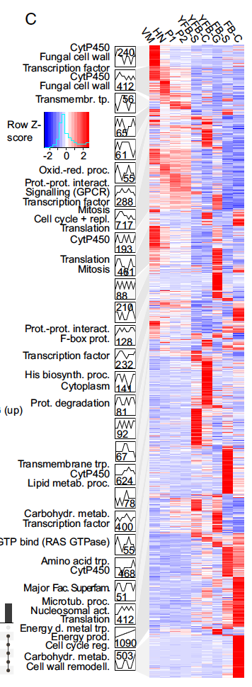

**Author(s)**: `r params$author`  
**Reviewer(s)**: `r params$reviewer`  
**Date**: `r Sys.Date()`  


# Academic Citation
If you use this code in your work or research, we kindly request that you cite our publication:

Xiaofan Lu, et al. (2025). FigureYa: A Standardized Visualization Framework for Enhancing Biomedical Data Interpretation and Research Efficiency. iMetaMed. https://doi.org/10.1002/imm3.70005

```{r setup, include=FALSE}
knitr::opts_chunk$set(echo = TRUE)
# 设置knitr的全局代码块选项 / Set global chunk options for knitr
```

# 需求描述

左侧画出STEM的profile，右侧对应表达量的热图，输出每个profile对应的基因顺序。

# Requirement description

Draw the STEM profile on the left and the heatmap corresponding to the expression level on the right, and output the gene sequence for each profile.



出自<https://www.pnas.org/content/116/15/7409>

from<https://www.pnas.org/content/116/15/7409>

Fig. 1C. Analysis of coexpression modules in C. cinerea. Heatmap of 7,475 developmentally expressed genes is arranged based on module assignment, with simplified expression profiles and enriched GO terms (no term means no enriched GO) given for each module (see also Dataset S7). We graphically depict **only 27 modules with >50 genes** (refer to SI Appendix, Figs. S4–S9 for the complete list of modules and data for other species). The distribution of key developmental genes is given on the right side of the heatmap.

难点：一共有50个profile，图中左侧只画了基因数量>50的27个profile，然而右侧heatmap却包含所有50个profile里的基因。那么其余的23个profile里的基因要怎样排进右侧的heatmap里呢？

看图中的效果是其余的23个profile里的基因也聚类到相近的profile附近了。

所以，采取的**基因排序策略**是：先按profile聚类，然后在每个profile内部的基因聚类。

Difficulty: There are a total of 50 profiles, and only 27 profiles with a gene count greater than 50 are shown on the left side of the graph. However, the heatmap on the right side contains all the genes in all 50 profiles. So how should the genes from the other 23 profiles be arranged in the heatmap on the right?

The effect in the picture is that the genes in the remaining 23 profiles are also clustered around similar profiles.

So, the adopted gene sorting strategy is to cluster by profile first, and then cluster the genes within each profile.

# 应用场景

同时展示表达趋势和表达量热图。

其中左侧折线图更适合时间序列数据，例如发育时期、处理后的时间点等。

# Application scenarios

Simultaneously display expression trends and expression heatmaps.

The left side line chart is more suitable for time series data, such as developmental stages, processed time points, etc.

# 环境设置

# Environment settings

Use domestic image installation package

```{r}
source("install_dependencies.R")

# 加载readxl包，用于读取Excel文件（Load the readxl package for reading Excel files）
library(readxl)
# 加载data.table包，提供高效数据处理功能（Load data.table for efficient data manipulation）
library(data.table)
# 加载readr包，用于快速读取文本数据（Load readr for fast text data import）
library(readr)
# 加载dplyr包，提供数据处理和转换函数（Load dplyr for data manipulation functions）
library(dplyr)
# 加载ggplot2包，用于创建高质量可视化（Load ggplot2 for data visualization）
library(ggplot2)
# 加载stringr包，提供字符串处理函数（Load stringr for string manipulation）
library(stringr)
# 加载magrittr包，提供管道操作符（Load magrittr for pipe operators）
library(magrittr)
# 加载purrr包，提供函数式编程工具（Load purrr for functional programming tools）
library(purrr)
# 加载tidyr包，用于数据整理和重塑（Load tidyr for data tidying）
library(tidyr)
# 加载tibble包，提供增强型数据框（Load tibble for enhanced data frames）
library(tibble)
# 加载RColorBrewer包，提供色彩方案（Load RColorBrewer for color palettes）
library(RColorBrewer)
# 加载Cairo包，用于高质量图形输出（Load Cairo for high-quality graphics output）
library(Cairo)
# 加载grid包，提供低级图形系统（Load grid for low-level graphics）
library(grid)
# 加载gridExtra包，用于组合多个图形（Load gridExtra for arranging multiple plots）
library(gridExtra)

# 设置环境语言为英文，显示英文报错信息（Set environment language to English for English error messages）
Sys.setenv(LANGUAGE = "en")

# 禁止字符串自动转换为因子类型（Disable automatic conversion of strings to factors）
options(stringsAsFactors = FALSE)
```

# 输入文件的准备

先提取Developmentally regulated genes的表达矩阵，然后运行STEM获得profile。

GSE125184_CCAB_RPKM_ExpMatrix.csv.gz，所有基因的表达矩阵，下载自<https://www.ncbi.nlm.nih.gov/geo/query/acc.cgi?acc=GSE125184>。每行一个基因，每列一个sample，相邻是3到4次重复。

文章筛选developmentally regulated gene的方法描述：These were defined as any gene showing an over four-fold change in expression between any two developmental stages or tissue types and a maximum expression level of FPKM > 4 in at least one developmental stage. 保存在补充材料pnas.1817822116.sd05.xls文件里。然而ID不一致，表达矩阵是jgi，developmentally regulated gene是protID。

然后把表达矩阵拆分成STEM要求的输入格式，即每个重复一个文件，共三个文件。

然后用命令行的方式运行STEM，生成“_profiletable.txt”和“_genetable.txt”两个文件，**用于画左侧的折线图**。与每个profile的相对应，**用右侧热图展示进入profile的基因在各个样品中的表达量**。

# Preparation of input files

First, extract the expression matrix of developmentally regulated genes, and then run STEM to obtain the profile.

GSE125184_CCAB_RPKM_ExpMatrix.csv.gz， The expression matrix of all genes, downloaded from< https://www.ncbi.nlm.nih.gov/geo/query/acc.cgi?acc=GSE125184 >One gene per row, one sample per column, with 3 to 4 repetitions adjacent to each other.

Method description for screening developmentally regulated genes: These were defined as any gene showing an over four-fold change in expression between any two developmental stages or tissue types and a maximum expression level of FPKM > 4 in at least one developmental stage.  Save in the supplementary material pnas.181782216.sd05.xls file. However, the IDs are inconsistent, the expression matrix is jgi, and the developmentally regulated gene is protoID.

Then split the expression matrix into the input format required by STEM, that is, repeat one file each, for a total of three files.

Then run STEM using the command line to generate two files, "_defiletable. txt" and "_genetable. txt", for drawing the line chart on the left. Corresponding to each profile, use the heatmap on the right to display the expression levels of genes entering the profile in each sample.

## 生成STEM所需的输入文件

如果你的数据已经整理成easy_input*.txt的格式，就可以跳过这步，直接进入“运行STEM，获得profile”。

## Generate input files required for STEM

If your data has already been organized into the easy_input *. txt format, you can skip this step and directly enter "Run STEM, Get Profile".

```{r}
# 读取基因表达矩阵数据，check.names=F参数防止列名被自动修改（Read gene expression matrix data, check.names=F prevents column name modification）
# 所有基因的表达矩阵（Expression matrix of all genes）
df <- read.csv("GSE125184_CCAB_RPKM_ExpMatrix.csv", check.names = F)
# 将第一列重命名为基因符号（Rename the first column to GeneSymbol）
colnames(df)[1] <- "GeneSymbol"
# 查看数据维度（Check data dimensions）
dim(df)
# 查看数据集行数和列数（View number of rows and columns in the dataset）
df[1:3,1:6]

# 检查列名，发现其中两组有四次重复，只保留3次重复，并按发育时期给样品排序（Check column names, remove redundant replicates, and sort samples by developmental stage）
df %<>% select(GeneSymbol, 
CC_VM_R1, CC_VM_R2, CC_VM_R3, 
CC_H_R2, CC_H_R3, CC_H_R4, 
CC_P1_R1, CC_P1_R2, CC_P1_R3, 
CC_P2_R1, CC_P2_R2, CC_P2_R3, 
CC_YFB_S_R1, CC_YFB_S_R2, CC_YFB_S_R3, 
CC_YFB_C_R1, CC_YFB_C_R2, CC_YFB_C_R3, 
CC_YFB_L_R1, CC_YFB_L_R2, CC_YFB_L_R3, 
CC_FB_S_R1, CC_FB_S_R2, CC_FB_S_R3,
CC_FB_CL_R1, CC_FB_CL_R2, CC_FB_CL_R3)

# 筛选在任意两个发育阶段或组织类型之间表达变化超过四倍的基因（Filter genes with over four-fold expression change between any two developmental stages or tissue types）
# 这里取了2倍（Note: Using 2-fold change here instead of 4-fold）
myvec <- apply(df[,2:ncol(df)],1,function(x){ifelse(max(x)/min(x)>=2,T,F)}) 
# 统计筛选结果（Count filtered results）
table(myvec)
# 提取差异表达基因（Extract differentially expressed genes）
DRG <- df[myvec,]
# 查看筛选后的数据维度（Check dimensions of filtered data）
dim(DRG)

# 筛选至少在一个发育阶段中FPKM表达水平大于4的基因（Filter genes with maximum FPKM > 4 in at least one developmental stage）
DRGvec <- apply(DRG[,2:ncol(DRG)],1,function(x){ifelse(max(x)>4,T,F)})
# 统计筛选结果（Count filtered results）
table(DRGvec)
# 提取符合条件的基因（Extract qualified genes）
DRG <- DRG[DRGvec,]
# 查看最终筛选结果维度（Check dimensions of final filtered data）
dim(DRG)
# 筛选哪些基因做STEM不是重点，在这里不深入探讨。欢迎感兴趣的小伙伴在群里进一步讨论
# (Gene selection for STEM analysis is not the focus here. Feel free to discuss further in the group.)

# 提取三个生物学重复的数据（Extract data for three biological replicates）
data1 <- DRG[,c(1, seq(2,ncol(DRG),3))]
data2 <- DRG[,c(1, seq(3,ncol(DRG),3))]
data3 <- DRG[,c(1, seq(4,ncol(DRG),3))]

# 定义样品名称（Define sample names）
sampleName <- c("VM", "HN", "P1", "P2", "YFB-S", "YFB-C", "YFB-G", "FB-S", "FB-C")

# 设置列名（Set column names）
colnames(data1) <- c("GeneSymbol", sampleName)
colnames(data2) <- c("GeneSymbol", sampleName)
colnames(data3) <- c("GeneSymbol", sampleName)

# 将三个重复的数据写入制表符分隔的文本文件（Write data of three replicates to tab-separated text files）
write.table(data1, "easy_input_rep1.txt", quote = F, sep = "\t", row.names = F)
write.table(data2, "easy_input_rep2.txt", quote = F, sep = "\t", row.names = F)
write.table(data3, "easy_input_rep3.txt", quote = F, sep = "\t", row.names = F)
```

## 运行STEM，获得profile

下载STEM，进入stem文件夹，手动编辑配置文件example.txt

Default parameters were used, except minimum absolute expression change, which was set to 4.

用命令行方式运行STEM：

```bash
java -mx1024M -jar stem.jar -b example.txt output
```

会在output文件夹下产生两个文件：

example_profiletable.txt和example_genetable.txt

## Run STEM to obtain a profile

Download STEM, enter the STEM folder, manually edit the configuration file 'example. txt'

Default parameters were used, except minimum absolute expression change, which was set to 4.

Run STEM in command-line mode:

```bash
java -mx1024M -jar stem.jar -b example.txt output
```

Two files will be generated in the output folder:

Exed_filetable.txt and exed_genetable.txt

# 输入文件

需要如下三种文件：

- easy_input_rep1.txt，easy_input_rep2.txt，easy_input_rep3.txt，所有基因在三次重复中的表达量。需要借助example_genetable.txt文件，得到进入每个profile的基因的表达量。
- example_profiletable.txt，profile信息，用于画左侧折线图。
- example_genetable.txt，gene所在的profile，用于提取进入每个profile的基因的表达量。

# Input file

The following three types of files are required:

- easy_input_rep1.txt，easy_input_rep2.txt，easy_input_rep3.txt， The expression levels of all genes in three replicates. The expression levels of genes entering each profile need to be obtained using the exemplar_genetable.txt file.
-For example, the file table. txt contains profile information, which is used to draw a line chart on the left side.
-Example: genetable.txt, the profile where the gene is located, used to extract the expression levels of genes entering each profile.

```{r}
# 生成文件路径向量，包含三个重复样本文件、基因列表文件和表达模式文件（Generate file path vector including three replicate sample files, gene list file, and expression pattern file）
file_path <- paste0(c(paste0("easy_input_rep", 1:3), 
                       "example_genetable", "example_profiletable"), 
                     ".txt")

# 读取第一个重复样本数据，check.names=F参数防止列名被自动修改（Read the first replicate sample data, check.names=F prevents column name modification）
data1 <- read.delim(file = file_path[1], check.names = F)
# 查看数据前几行（View the first few rows of the data）
head(data1)

# 读取第二个重复样本数据（Read the second replicate sample data）
data2 <- read.delim(file = file_path[2], check.names = F)
# 读取第三个重复样本数据（Read the third replicate sample data）
data3 <- read.delim(file = file_path[3], check.names = F)

# 读取基因列表文件，包含基因ID及相关信息（Read gene list file containing gene IDs and related information）
genetable <- read.delim(file = file_path[4], check.names = F) 
# 查看基因列表数据前几行（View the first few rows of the gene list data）
head(genetable)

# 读取表达模式文件，包含不同表达模式的信息（Read expression pattern file containing information about different expression patterns）
profiletable <- read.delim(file = file_path[5], check.names = F) 
# 查看表达模式数据前几行（View the first few rows of the expression pattern data）
head(profiletable)
```

## 输出基因名——按STEM原始顺序

提供两种方式输出基因名，这里按STEM原始顺序，后面还有“输出基因名——按热图顺序”的代码可供选择。

有的小伙伴可能想给每个profile做基因功能富集分析等进一步探讨。要把每个profile里的基因输出到文件，每个profile一个文件，就运行下面这段：

## Output gene names - in STEM original order

Provide two ways to output gene names, in the original STEM order, followed by the code "Output gene names - in heat map order" for selection.

Some friends may want to further explore gene function enrichment analysis for each profile. To output the genes in each profile to a file, with one file for each profile, run the following paragraph:

```{r eval=FALSE}
# 遍历所有表达模式编号（从0到genetable$Profile的最大值）
# Loop through all expression profile IDs (from 0 to the maximum value in genetable$Profile)
for (gp in 0:max(genetable$Profile)) {
  # 筛选出属于当前表达模式的所有基因符号
  # Filter all gene symbols belonging to the current expression profile
  geneInProfile <- genetable[genetable$Profile == gp,]$GeneSymbol
  
  # 将该表达模式下的基因列表写入独立文件，文件名格式为"Profile+模式编号.txt"
  # Write the gene list of this expression profile to a separate file named "Profile+ProfileID.txt"
  write.table(geneInProfile, paste0("Profile", gp, ".txt"), 
              sep = "\t", quote = F, row.names=F)
}
```

## 计算表达量均值，用于画右侧热图

右侧的热图使用`data1`, `data2`, `data3`取均值。

我们注意到`data_mean`的`Gene.Symbol`变量中存在小写字母，而`genetable`全是大写字母。所以还要大小写转换。

## Calculate the mean expression level for drawing the heatmap on the right side

The heatmap on the right uses' data1 ',' data2 ', and' data3 'to take the average.

We noticed that there are lowercase letters in the 'Gene. Symbol' variable of 'data_cean', while 'genetable' is all uppercase letters. So there is also a need for capitalization conversion.

```{r}
# 自定义函数：计算多个向量的均值
# Custom function: Calculate the mean of multiple vectors
p_mean <- function(...) {
  tibble(...)  %>% rowMeans()
} 

# 创建一个新的数据框，初始只包含基因符号列
# Create a new data frame initially containing only the gene symbol column
data_mean <- tibble(GeneSymbol = data1$GeneSymbol) 

# 计算三个重复样本的均值，填充到data_mean数据框中
# Calculate the mean of three replicate samples and populate the data_mean data frame
for (i in 2:ncol(data1)) {
  data_mean[,i] <- p_mean(data1[,i], data2[,i], data3[,i])
}

# 设置数据框的列名与原始数据保持一致
# Set the column names of the data frame to be consistent with the original data
colnames(data_mean) <- colnames(data1)

# 将基因符号转换为大写格式，并重新排列列顺序
# Convert gene symbols to uppercase and rearrange column order
data_mean %<>% mutate(Gene = toupper(GeneSymbol)) %>% 
  select(-GeneSymbol) %>% rename(GeneSymbol = Gene)

# 查看处理后数据的前几行
# View the first few rows of the processed data
head(data_mean)
```

## 用于画左侧折线图的profile

每个profile纵坐标被写进`profiletable`中一列里`Profile.Model`，所以需要分开：每个时间点单独一列。

## Profile for drawing the left line chart

Each profile's vertical axis is written into a column called 'Profile. Model' in the 'profiletable', so it needs to be separated: a separate column for each time point.

```{r}
# 使用separate函数将Profile Model列按逗号分隔拆分为多列
# Split the 'Profile Model' column into multiple columns by comma using separate function
profiletable %<>% separate(col = `Profile Model`, 
                           into = as.character(1:9),  # 分列后的列名设为1到9
                           # Column names after splitting are set to 1 through 9
                           sep = ",", convert = TRUE) %>%  # convert=T自动转换数据类型
                           # convert=T automatically converts data types
  # 选择需要的列并重命名Profile ID列为Profile
  # Select required columns and rename 'Profile ID' column to 'Profile'
  select(Profile = `Profile ID`, `p-value`, !!as.character(1:9))  # !!表示拆分向量
  # !! is used to unquote the vector of column names
```

## 取交集，联结表

经过查询，`unique(genetable$Profile)`长度为49，而`profiletable$Profile`长度为50，所以需要取交集。

`data_mean`中没有`Profile`变量，所以需要将其与`genetable`联结表。

## Take the intersection and connect the table

After searching, the length of 'unique (genetable $Profile)' is 49, while the length of 'profiler $Profile' is 50, so the intersection needs to be taken.

`There is no 'Profile' variable in data_cean, so it needs to be linked to the 'genetable' table.

```{r}
# 计算genetable和profiletable中Profile列的交集，确定共同存在的表达模式编号
# Calculate the intersection of Profile IDs between genetable and profiletable to identify common expression profiles
Profile_intersect <- intersect(genetable$Profile, profiletable$Profile)

# 筛选genetable，仅保留存在于交集内的表达模式，并将Profile列转换为字符类型
# Filter genetable to keep only profiles present in the intersection, and convert Profile column to character type
genetable %<>% filter(Profile %in% Profile_intersect) %>% 
  mutate_if(is.integer, as.character) # Convert Profile to string

# 筛选profiletable，仅保留存在于交集内的表达模式，按p值升序排列，并移除p值列
# Filter profiletable to keep only profiles present in the intersection, sort by p-value ascending, and remove the p-value column
profiletable %<>% filter(Profile %in% Profile_intersect) %>% 
  arrange(`p-value`) %>% # Sort by p-value
  mutate_if(is.integer, as.character) %>% # Convert Profile to string
  select(-`p-value`)

# 关联基因表达数据与表达模式信息，添加Profile列并重新排序
# Join gene expression data with profile information, add Profile column, and reorder columns
data_mean <- genetable %>% select(GeneSymbol, Profile) %>% 
  left_join(data_mean, by = "GeneSymbol") %>%  # Add Profile variable
  filter(Profile %in% Profile_intersect) %>% 
  mutate(Profile_f = as.character(Profile)) %>% # Convert Profile to string
  select(-Profile) %>% rename(Profile = Profile_f) %>% 
  select(-sampleName, Profile, sampleName) # Reorder columns

# 查看处理后的数据前几行
# View the first few rows of the processed data
head(data_mean)

#rm(genetable, Profile_intersect) # 可选：删除不再需要的中间变量以节省内存
```

## Scale

用`scale`函数对`data_mean`进行处理，相当于pheatmap里的scale="row"。  

然后根据变量`Profile`对`data_mean`分组并计算每个profile内基因的数量。

## Scale

Using the 'scale' function to process' data_cean 'is equivalent to the scale=' row 'in pheatmap.   

Then, based on the variable 'Profile', group 'data_cean' and calculate the number of genes within each profile.

```{r}
# 对表达数据进行标准化处理
# Standardize the expression data
data_mean <- data_mean %>% select(sampleName) %>% 
  #log2(.) %>% # 根据数据特性选择是否进行对数转换
  #log2(.) %>% # Optional log2 transformation based on data characteristics
  as.matrix() %>% scale() %>%  # 按列进行中心化和标准化
  # Convert to matrix and scale (center and standardize by column)
  as.data.frame() %>% as_tibble() %>% cbind(select(data_mean, -sampleName))  # 合并非表达列

# 按表达模式分组，统计每个模式下的基因数量
# Group genes by expression profile and count genes in each profile
data_nest <- data_mean %>% group_by(Profile) %>% nest()  # 按Profile分组并嵌套数据
# Group by Profile and nest the data
data_nest$n <- map_int(data_nest$data, nrow)  # 计算每个分组中的基因数量
# Calculate the number of genes in each profile
head(data_nest)  # 查看分组统计结果
# View the grouped statistics
```

## 聚类，排序

先按profile聚类，然后在每个profile内部的基因聚类。

通过聚类，获取顺序，然后将顺序通过因子水平的方式，指定给`Profile`变量和`GeneSymbol`变量。

## Clustering, sorting

Cluster by profile first, and then cluster the genes within each profile.

By clustering, obtain the order, and then assign the order to the 'Profile' and 'GeneSymbol' variables at the factor level.

```{r}
# 自定义函数：对数据框按指定变量进行聚类排序
# Custom function: Cluster and sort a data frame by specified variable
clust_order <- function(df, row_name, method_1 = "euclidean", method_2 = "ward.D") {
  rnm <- df[[row_name]] # 提取行名变量（不能用$筛选，避免变量名冲突）
  # Extract row names (using [[ instead of $ to avoid variable name conflicts)
  df[[row_name]] <- NULL # 从数据框中移除行名变量
  # Remove row name variable from data frame
  my_mat <- df %>% as.matrix()
  rownames(my_mat) <- rnm
  order_ <- my_mat %>% dist(method = method_1) %>% # method_1 指定距离计算方法
    # Calculate distance matrix using specified method
    hclust(method = method_2) %>% .$order # method_2 指定聚类方法
    # Perform hierarchical clustering and get order of clusters
  df$order <- order_
  df[[row_name]] <- rnm
  df <- df %>% arrange(order) %>% select(-order) # 按聚类结果排序并移除临时列
  # Sort by clustering order and remove temporary column
  return(df)
}

# 对profiletable按Profile列进行聚类排序
# Cluster and sort profiletable by Profile column
profiletable %<>% clust_order(row_name = "Profile") 

# 按聚类后的profile顺序重新排列data_nest
# Reorder data_nest according to clustered profiles
data_nest %<>% right_join(profiletable, by = "Profile") %>%
  select(Profile, data, n)

# 将Profile转换为有序因子，确保按聚类顺序显示
# Convert Profile to ordered factor for correct ordering
Profile_f <- profiletable$Profile %>% as.factor()
levels(Profile_f) <- profiletable$Profile
Profile_f %<>% sort()
profiletable$Profile <- Profile_f

# 按照Profile_f的水平重新排序data_nest
# Reorder data_nest according to the levels of Profile_f
data_nest$Profile <- factor(data_nest$Profile, levels = levels(Profile_f))
data_nest %<>% .[order(.$Profile),]

# 筛选基因数目大于50的Profile（阈值可根据需要调整）
# Filter profiles with more than 50 genes (threshold can be adjusted)
profile_num <- data_nest %>% select(Profile, n) %>% filter(n > 50) 
profiletable_extract <- profile_num %>% left_join(profiletable, by = "Profile") %>% 
  select(-n)
dim(profiletable_extract)[1] # 显示筛选出的Profile数量
# Show number of profiles passing the filter

# 对每个profile内的基因进行聚类排序（行数少于2的无法聚类）
# Cluster genes within each profile (skip if fewer than 2 genes)
data_nest_1 <- data_nest %>% filter(n < 2) # 行数少于2的profile
data_nest_2 <- data_nest %>% filter(n >= 2)
data_nest_2$data_2 <- map(data_nest_2$data, ~clust_order(.x, row_name = "GeneSymbol"))
data_nest_2 %<>% select(-data) %>% rename(data = data_2) %>% rbind(data_nest_1)
data_nest <- data_nest_2

#rm(data_nest_1, data_nest_2) # 可选：删除中间变量节省内存
```

## 输出基因名——按热图顺序

如果想把基因按图中的顺序输出到文件，每个profile一个文件，就运行下面这行：

## Output gene names - in heat map order

If you want to output genes in the order shown in the image to a file, one file per profile, run the following line:

```{r eval=FALSE}
# 遍历每个表达模式(Profile)，将对应基因列表写入独立文件
# Loop through each expression profile and write gene lists to separate files
for (gh in 1:nrow(data_nest)) {
  # 提取当前Profile下的所有基因符号
  # Extract all gene symbols in the current profile
  geneInheatmap <- data.frame(data_nest[gh,]$data)$GeneSymbol
  
  # 生成文件名，格式为"序号_Profile+模式编号.txt"
  # Generate file name in format "index_Profile+profileID.txt"
  write.table(geneInheatmap, 
              paste0(gh, "_Profile", data_nest[gh,]$Profile, ".txt"), 
              sep = "\t", 
              quote = F,  # 不使用引号包裹文本
              # Do not enclose text with quotes
              row.names=F)  # 不保存行名
              # Do not save row names
}
```

# 计算坐标，计算颜色

## 折线图坐标

`profiletable_extract`数据，宽转长，成为折线图坐标。

# Calculate coordinates, calculate colors

## Line chart coordinates

`The data is converted from width to length and becomes the coordinates of a line chart.

```{r}
# 将宽格式数据转换为长格式，便于后续绘图分析
# Convert wide-format data to long-format for plotting
profiletable_extract %<>% gather(key = "x", value = "y", !!as.character(1:9)) %>% 
  # 将列名1-9转换为数值型x轴坐标
  # Convert column names 1-9 to numeric x-axis coordinates
  mutate_at(vars("x", "y"), as.numeric)  # 将x和y转换为数值类型
  # Convert x and y columns to numeric type
```

## 计算热图坐标、颜色

转换成`x`, `y`, `heat_value`三个变量的长数据框。

## Calculate heatmap coordinates and colors

Convert to a long data box containing three variables: x, y, and heat_falue.

```{r}
# 提取每个Profile下的基因名称
# Extract gene names for each profile
data_nest$Gene <- map(data_nest$data, ~.x$GeneSymbol)

# 计算每个Profile在热图中的纵坐标范围（用于堆叠显示）
# Calculate vertical coordinate ranges for each profile in the heatmap
end_num <- -(data_nest$n) %>% cumsum()  # 每个Profile的结束位置（负数表示从上到下）
# End positions of each profile (negative values for top-down arrangement)
start_num <- c(-1, (end_num[-length(end_num)]) - 1)  # 每个Profile的起始位置
# Start positions of each profile
range_y <- map2(start_num, end_num, rbind) %>% map(as.vector)  # 组合起止位置
# Combine start and end positions into ranges
data_nest$range_y <- range_y  # 将范围添加到数据框

# 自定义函数：生成热图中每个格子的坐标和值
# Custom function: Generate coordinates and values for heatmap tiles
generate_coords <- function(df, width_tile = 1, range_y) {
  nrow_ <- nrow(df)  # 基因数量
  # Number of genes
  ncol_ <- df %>% select_if(is.numeric) %>% ncol()  # 样本数量
  # Number of samples
  
  # 生成横坐标（等距分布）
  # Generate x coordinates (equally spaced)
  x_coord <- (seq(from = 0.5, len = ncol_, by = 1) * width_tile) %>% 
    rep(each = nrow_)
  
  # 生成纵坐标（根据range_y均匀分布）
  # Generate y coordinates (evenly distributed within range_y)
  y_coord <- (seq(from = range_y[1], to = range_y[2], len = nrow_) + 0.5) %>% 
    rep(times = ncol_)
  
  # 提取表达值作为热图颜色值
  # Extract expression values as heatmap colors
  heat_value <- df %>% select_if(is.numeric) %>% as.matrix() %>% as.vector()
  
  # 组合坐标和值为数据框
  # Combine coordinates and values into a data frame
  tile_data <- tibble(x = x_coord,
                      y = y_coord,
                      heat_value = heat_value)
  return(tile_data)
}

# 代入函数计算热图坐标，设置每个小格子的宽度
# Calculate heatmap coordinates with specified tile width
width_tile <- 3 

data_nest$tile_data <- map2(data_nest$data, data_nest$range_y, 
                            ~generate_coords(df = .x, 
                                             range_y = .y, 
                                             width_tile = width_tile))
```

## 计算中间阴影区域坐标

阴影区域坐标分为左侧和右侧两种，左侧纵向均分就行了，右侧需要根据`range_y`变量计算。

## Calculate the coordinates of the middle shadow area

The coordinates of the shadow area are divided into two types: left and right. The left side needs to be evenly divided vertically, while the right side needs to be calculated based on the 'range_y' variable.

```{r}
# 自定义函数：根据纵坐标范围计算热图右侧连接线的坐标
# Custom function: Calculate coordinates for right-side connecting lines of heatmap
link_right <- function(v_2) {
  right_coord <- tibble(
    x = c(0, 0),  # x坐标固定为0（位于热图右侧）
    # x coordinates fixed at 0 (right side of heatmap)
    y = c(v_2[1] + 1, v_2[2]),  # y坐标取范围的起始和结束位置
    # y coordinates at start and end positions of the range
    order = 1:2  # 用于指定绘图顺序的序号
    # Order for plotting sequence
  )
  return(right_coord)
}

# 为每个Profile应用函数，生成右侧连接线坐标
# Apply the function to each profile to generate right-side connection coordinates
data_nest$right_coord <- map(data_nest$range_y, link_right)
```

**左侧坐标，需要指定**`width_link`,即阴影区域的宽度。

**On the left side of the coordinate, it is necessary to specify the width of the shaded area, which is * * ` width_dank `.

```{r}
# 计算左侧连接线的纵坐标位置（均匀分布）
# Calculate y coordinates for left-side connecting lines (evenly spaced)
link_left_y <- seq(from = 0, to = -nrow(data_mean), len = nrow(profile_num) + 1)

# 设置左侧连接线的宽度（水平延伸距离）
# Set width for left-side connecting lines (horizontal extension)
width_link <- 7

# 生成左侧连接线的坐标数据框
# Generate coordinate data frame for left-side connecting lines
left_coord <- data.frame(
  Profile = profile_num$Profile,  # Profile ID
  x1 = -width_link,               # 起始x坐标（左侧固定位置）
  # Starting x coordinate (fixed position on the left)
  x2 = -width_link,               # 结束x坐标（左侧固定位置）
  # Ending x coordinate (fixed position on the left)
  y1 = link_left_y[-length(link_left_y)],  # 起始y坐标（不包含最后一个值）
  # Starting y coordinates (exclude the last value)
  y2 = link_left_y[-1]            # 结束y坐标（不包含第一个值）
  # Ending y coordinates (exclude the first value)
) %>% 
  group_by(Profile) %>% nest() %>% arrange(Profile)  # 按Profile分组并嵌套数据
  # Group by Profile, nest data, and sort by Profile

# 自定义函数：转换坐标格式并添加绘图顺序
# Custom function: Transform coordinate format and add plotting order
trans_coord <- function(df) {
  df <- cbind(c(df$x1, df$x2), c(df$y1, df$y2)) %>% as_tibble() 
  colnames(df) <- c("x", "y")  # 设置列名
  # Set column names
  df$order = c(4,3)  # 添加绘图顺序（控制线段方向）
  # Add plotting order (controls line segment direction)
  return(df)
}

# 应用函数转换左侧坐标格式
# Apply function to transform left-side coordinates
left_coord$coord_left <- map(left_coord$data, trans_coord)  
left_coord %<>% select(-data)  # 移除原始数据列
# Remove original data column
```

**合并左右侧坐标：**   

**Merge left and right coordinates:**

```{r}
# 合并左右两侧连接线的坐标数据
# Merge coordinate data for left and right connecting lines
link_coord <- data_nest %>% select(Profile, right_coord, n) %>% 
  right_join(left_coord, by = "Profile")  # 按Profile列进行右连接

# 将左右坐标合并，并按order列排序
# Combine left and right coordinates and sort by 'order' column
link_coord$coords <- map2(link_coord$coord_left, link_coord$right_coord, rbind)
link_coord$coords_2 <- map(link_coord$coords, ~arrange(.x, order))  # 按order列排序
# Sort by 'order' column to ensure correct line direction
link_coord %<>% select(Profile, coords = coords_2, n)  # 选择需要的列并重命名
# Select required columns and rename

# 展开嵌套的坐标数据，形成长格式数据框
# Unnest the nested coordinate data into a long-format data frame
link_data <- link_coord %>% unnest()
```

# 开始画图

这里使用编造的坐标，用`ggplot2::geom_tile()`画热图。

使用`ggplot2::geom_polygon()`画中间的阴影连接区域。

使用`ggplot2::geom_line()`加**分面**画左侧的折线图。

# Start drawing

Here, fabricated coordinates are used to draw a heatmap using 'ggplot2:: geometile()'.

Use 'ggplot2:: geom_polygon()' to draw the shadow connecting area in the middle.

Use 'ggplot2:: geom_line()' to add * * facets * * and draw a line chart on the left side.

## 热图，阴影区域

首先画热图和中间的阴影连接区域。
提取单独的热图图例。

## Heat map, shaded area

First, draw a heat map and connect the shaded area in the middle.
Extract a separate heatmap legend.

```{r}
# 展开嵌套的瓦片数据，形成长格式数据框
# Unnest the nested tile data into a long-format data frame
tile_data <- data_nest %>% select(Profile, tile_data) %>% unnest()

# 获取样本数量（数值型列的数量）
# Get the number of samples (number of numeric columns)
ncol_ <- data_mean %>% select_if(is.numeric) %>% ncol()

# 计算x轴刻度位置（热图每个样本的中心位置）
# Calculate x-axis tick positions (centers of each sample column)
my_breaks <- seq(from = width_tile/2, by = width_tile, len = ncol_)

# 准备x轴标签（样本名称），并通过添加空格使所有标签长度一致
# Prepare x-axis labels (sample names) with uniform length by padding spaces
my_labels <- data_mean %>% select_if(is.numeric) %>% colnames() %>% 
  str_pad(., width = max(nchar(.)), side = "right") # Add spaces to make strings same length

# 构建右侧热图ggplot对象
# Build the right-side heatmap ggplot object
plot_right <- ggplot(tile_data) + 
  geom_tile(aes(x = x, y = y, fill = heat_value)) +  # 绘制热图瓦片
  # Draw heatmap tiles
  
  # 添加连接线多边形（连接热图与左侧分类）
  # Add connecting polygons (linking heatmap to left-side categories)
  geom_polygon(data = link_data, 
               aes(x = x, y = y, group = Profile), 
               fill = "grey90", color = "white", size = 0.25, linetype = "solid") + 
  
  # 自定义颜色渐变（参考FigureYa179AMDAplot）
  # Custom color gradient (referenced from FigureYa179AMDAplot)
  scale_fill_gradientn(limits = c(-3, 3), na.value="#ff0000",  # 设置颜色范围和缺失值颜色
    breaks = c(-2, 0, 2),  # 刻度位置
    labels = c("-2", "0", "2"),  # 刻度标签
    colours = c('#0000ff','#0000ff','#ffffff','#ff351c', '#ff0000')  # 颜色映射
    # Color mapping from blue to white to red
  ) +
  
  # 设置x轴刻度和标签（置于顶部）
  # Configure x-axis ticks and labels (positioned at the top)
  scale_x_continuous(breaks = my_breaks, labels = my_labels, position = "top") + 
  
  # 自定义主题：去除背景、边框和不必要的元素
  # Custom theme: Remove background, borders, and unnecessary elements
  theme(
    panel.background = element_blank(),  # 去除绘图区背景
    # Remove plot area background
    axis.title = element_blank(),  # 去除坐标轴标题
    # Remove axis titles
    axis.ticks = element_blank(),  # 去除坐标轴刻度线
    # Remove axis tick marks
    axis.text.y = element_blank(),  # 去除y轴标签
    # Remove y-axis labels
    axis.text.x.top = element_text(angle = 45, hjust = 0.05, vjust = -0.9),  # 设置x轴标签样式
    # Configure x-axis label style
    plot.margin = unit(c(0.25,0.25,0.25,0.25), "cm"),  # 设置边距（最后一个值为左侧边距）
    # Set plot margins (last value is left margin)
    panel.border = element_blank()  # 去除绘图区边框
    # Remove plot area border
  )

# 显示热图
# Display the heatmap
plot_right
```

## 折线图

## Line chart

```{r}
# 自定义函数：生成表达模式折线图
# Custom function: Generate line plot for expression patterns
line_generate <- function(df) {
  myplot <- 
    ggplot(df) + 
    geom_line(aes(x = x, y = y)) +  # 绘制表达模式折线
    # Plot expression pattern line
    theme(
      axis.title = element_blank(),  # 去除坐标轴标题
      # Remove axis titles
      axis.ticks = element_blank(),  # 去除坐标轴刻度线
      # Remove axis tick marks
      axis.text = element_blank(),   # 去除坐标轴标签
      # Remove axis labels
      plot.margin = unit(c(0,0,0,0), "mm"),  # 零边距设置
      # Zero plot margins
      panel.background = element_rect(fill = "white"),  # 白色背景
      # White background
      panel.border = element_rect(color = "black", fill = NA,  # 添加边框
                                  size = 0.25, linetype = "solid")
      # Add border around plot
    )
  return(myplot)
}

# 按Profile分组数据并生成折线图
# Group data by Profile and generate line plots
line_data <- profiletable_extract %>% group_by(Profile) %>% 
  nest() %>% arrange(Profile)  # 按Profile排序
  # Sort by Profile
line_data$plot_ls <- map(line_data$data, line_generate)  # 应用函数生成折线图
# Apply function to generate line plots

# 关联左侧连接线坐标数据
# Join with left connection line coordinate data
line_data <- left_join(line_data, left_coord, by = "Profile")

# 自定义函数：根据左侧连接线坐标计算折线图的位置和大小
# Custom function: Calculate position and size of line plots based on left connection coordinates
line_coord <- function(df, width_line) {
  df %<>% arrange(order)  # 确保点按正确顺序连接
  # Ensure points are connected in correct order
  xmax <- df$x %>% .[1]  # 折线图右侧边界
  # Right boundary of line plot
  ymin <- df$y %>% .[1]  # 折线图底部边界
  # Bottom boundary of line plot
  ymax <- df$y %>% .[2]  # 折线图顶部边界
  # Top boundary of line plot
  xmin <- xmax - width_line  # 折线图左侧边界（宽度为负值向左延伸）
  # Left boundary of line plot (extends left by width_line)
  rectangle_range <- c(xmin, xmax, ymin, ymax)  # 返回坐标范围
  # Return coordinate range
  return(rectangle_range)
}

# 计算每个折线图的位置和大小
# Calculate position and size for each line plot
width_line <- 10  # 折线图宽度
# Width of line plots
line_data$rectangle_range <- map(line_data$coord_left,~line_coord(.x, width_line = width_line))
line_data %<>% select(Profile, plot_ls, rectangle_range)  # 选择需要的列
# Select required columns
```

## 添加文字

P*是STEM给的profile的序号，括号里是该profile里基因的数量。

## Add Text

P * is the sequence number of the profile given by STEM, and the number of genes in the profile is in parentheses.

```{r}
# 从左侧连接线坐标中提取上下边界的y坐标
# Extract upper and lower y coordinates from left connection lines
left_coord$y <- map(left_coord$coord_left, ~.x$y)
left_coord$y_up <- map(left_coord$y, ~.x[1])  # 上边界y坐标
# Upper boundary y-coordinate
left_coord$y_down <- map(left_coord$y, ~.x[2])  # 下边界y坐标
# Lower boundary y-coordinate

# 整理数据框，计算中间位置和文本标注位置
# Process data frame to calculate midpoints and text annotation positions
left_coord %<>% select(Profile, y_up, y_down) %>% unnest() %>% arrange(Profile) %>%
  mutate(y_inter = (y_up + y_down)/2) %>%  # 计算中间位置
  # Calculate midpoint
  mutate(y_1 = (y_up + y_inter)/2, y_2 = (y_down + y_inter)/2) %>%  # 计算上下两个文本位置
  # Calculate two text positions (upper and lower)
  select(Profile, y_1, y_2) %>% 
  left_join(profile_num, by = "Profile") %>%  # 关联基因数量信息
  # Join with gene count information
  mutate(text_1 = paste0("P", Profile),  # 生成第一行文本：P+模式编号
         # Generate first line of text: P+ProfileID
         text_2 = paste0("(", n, ")"))  # 生成第二行文本：括号内的基因数量
         # Generate second line of text: (gene count)

# 存储文本标注数据
# Store text annotation data
text_data <- left_coord

# 指定文本标注的x轴坐标（在左侧连接线左侧）
# Specify x-coordinate for text annotations (to the left of left connection lines)
x_just <- -4  # 文本x坐标微调（负值表示向左偏移）
# Fine-tune x-position (negative value shifts left)
text_data$x <- (-width_link - width_line + x_just) %>%  # 计算最终x坐标
  # Calculate final x-coordinate
  rep(., nrow(profile_num))  # 复制以匹配行数
  # Repeat to match number of rows
```

## 拼图输出

采用`gridExtra`包拼图。
如果需要改变图例位置的，自己在前面的`plot_right`中调整。
或者使用`cowplot`包提取图例。

## Puzzle output

Use the 'gridExtra' puzzle package.
If you need to change the position of the legend, adjust it in the previous' plot_right '.
Alternatively, use the 'cowplot' package to extract the legend.

```{r, fig.width=4, fig.height=7}
# 创建PDF输出文件，设置宽度和高度
# Create PDF output file with specified dimensions
CairoPDF(file = "STEMheatmap.pdf", width = 5, height = 7)

# 在热图上添加文本标注（Profile编号和基因数量）
# Add text annotations (Profile IDs and gene counts) to the heatmap
plot_draw <- plot_right + 
  geom_text(data = text_data, 
            aes(x = x, y = y_1, label = text_1), size = 3) +  # 添加Profile编号
  # Add Profile labels
  geom_text(data = text_data,
            aes(x = x, y = y_2, label = text_2), size = 3)  # 添加基因数量
  # Add gene count labels

# 循环将每个Profile的表达模式折线图添加到热图左侧
# Loop to add expression pattern line plots to the left of the heatmap
for (i in 1:nrow(profile_num)) {
  plot_draw <- plot_draw + 
    annotation_custom(
      grob = line_data$plot_ls %>% .[[i]] %>% ggplotGrob(),  # 获取折线图对象
      # Get line plot object
      xmin = line_data$rectangle_range %>% .[[i]] %>% .[1],  # 折线图左侧边界
      # Left boundary of line plot
      xmax = line_data$rectangle_range %>% .[[i]] %>% .[2],  # 折线图右侧边界
      # Right boundary of line plot
      ymin = line_data$rectangle_range %>% .[[i]] %>% .[3],  # 折线图底部边界
      # Bottom boundary of line plot
      ymax = line_data$rectangle_range %>% .[[i]] %>% .[4]   # 折线图顶部边界
      # Top boundary of line plot
    ) 
}

# 显示并保存最终图形
# Display and save the final plot
plot_draw
dev.off()  # 关闭PDF设备
# Close PDF device
```

# Session Info

```{r}
sessionInfo()
```