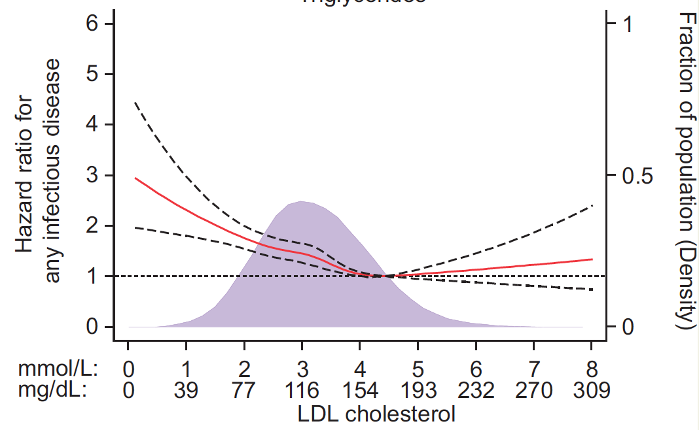

**Author(s)**: `r params$author`  
**Reviewer(s)**: `r params$reviewer`  
**Date**: `r Sys.Date()`  


# Academic Citation
If you use this code in your work or research, we kindly request that you cite our publication:

Xiaofan Lu, et al. (2025). FigureYa: A Standardized Visualization Framework for Enhancing Biomedical Data Interpretation and Research Efficiency. iMetaMed. https://doi.org/10.1002/imm3.70005

```{r setup, include=FALSE}
knitr::opts_chunk$set(echo = TRUE)
```

## 需求描述

限制性三次样条插值法（RCS）解决连续性变量对风险的非线性影响。

## Requirement description

Restricted cubic spline interpolation (RCS) is used to address the nonlinear impact of continuous variables on risk.



出自<https://academic.oup.com/eurheartj/article/39/14/1181/4710060>

from<https://academic.oup.com/eurheartj/article/39/14/1181/4710060>

## 应用场景

1. 连续变量对风险的影响可能是非线性的，忽略这种非线性影响会对结果造成干扰；
2. 量化连续变量对各个取值处，以基线（参考点）为参考时候的风险比。

具体理论推导和细节请见文档中“理论参考”文件夹

## Application scenarios

The impact of continuous variables on risk may be non-linear, and ignoring this non-linear effect can interfere with the results;
2. Quantify the risk ratio of continuous variables at each value point, using the baseline (reference point) as a reference.

Please refer to the "Theoretical References" folder in the document for specific theoretical derivation and details

## 环境设置

## Environment settings

```{r}
source("install_dependencies.R")
# 加载smoothHR包 - 用于平滑危险比分析
# Load the smoothHR package - used for smooth hazard ratio analysis
library(smoothHR)

# 加载生存分析包 - 提供生存分析所需的核心函数
# Load the survival analysis package - provides core functions for survival analysis
library(survival)

# library(rms) # 用于产生限制性三次样条（注释掉未使用的包）
# library(rms) # Used to generate restricted cubic splines (commented out unused package)

# 加载Hmisc包 - 用于产生限制性三次样条（推荐，参数更精确）
# Load the Hmisc package - used to generate restricted cubic splines (recommended for more accurate parameters)
library(Hmisc)

# 设置环境语言为英文 - 确保报错信息以英文显示
# Set the environment language to English - ensures error messages are displayed in English
Sys.setenv(LANGUAGE = "en")

# 配置选项 - 禁止字符串自动转换为因子类型
# Configure options - disable automatic conversion of strings to factor type
options(stringsAsFactors = FALSE)
```

## 输入文件

easy_input.csv，因为是生存分析的风险计算，所以生存状态（fstat），生存时间（lenfol），以及至少一个协变量（连续变量bmi）是必须的，此处还加了个协变量（二分类变量gender）。

数据来源：smmothHR包自带数据whas500，选了4个变量保存到easy_input.csv文件，便于小伙伴模仿格式。该测试结果仅展示如何对连续变量进行RCS下的Cox回归，无任何临床意义。

具体到实际问题，如果要控制其他因素对风险的影响，就要纳入更多的变量，这个没有固定的。这次只是实现如何利用三次样条量化连续变量对HR的影响，具体要多少变量，具体问题具体分析，毕竟这是一个统计问题，没有通解。

## Input file

easy_input.csv， As it is a risk calculation for survival analysis, survival status (fstat), survival time (lenfol), and at least one covariate (continuous variable BMI) are necessary, and a covariate (binary variable gender) is also added here.

Data source: The smmothHR package comes with the built-in data whas500. Four variables were selected and saved to the easy_input.csv file for easy imitation by users. The test results only demonstrate how to perform Cox regression under RCS for continuous variables and have no clinical significance.

In practical terms, if we want to control the impact of other factors on risk, we need to include more variables, which is not fixed. This time is just about how to use cubic spline to quantify the impact of continuous variables on HR, how many variables are needed, and how to analyze the specific problems. After all, this is a statistical problem and there is no general solution.

```{r}
# 读取心脏病研究数据集 - 从CSV文件导入数据
# Read the Heart Disease Study Dataset - Import data from a CSV file
whas500 <- read.csv("easy_input.csv")

# 查看数据集前几行 - 快速预览数据结构和内容
# View the first few rows of the dataset - Quick preview of data structure and content
head(whas500)
```

## 开始计算

### 寻找样条knot数

对于RCS而言，knots一般在3-5，太多会造成过拟合。

具体选择参考文献补充材料（supplementary_appendix，根据AIC准则筛选AIC最小的knots，一般为3）：

The number of knots was chosen as the number that gave the best fit as assessed by the lowest value of the Akaike information criterion. 

If results were similar (within 2 units of the best fit), the model with fewest knots were chosen to avoid overfitting. 

## Start calculating

### Find spline knot number

For RCS, knots are generally between 3-5, and too many can cause overfitting.

Specific selection of reference materials (supplementary.appendix, selecting the knots with the smallest AIC based on AIC criteria, generally 3):

The number of knots was chosen as the number that gave the best fit as assessed by the lowest value of the Akaike information criterion. 

If results were similar (within 2 units of the best fit), the model with fewest knots were chosen to avoid overfitting. 

```{r}
# 循环测试不同节点数对模型的影响 - Iterate over different knot numbers to evaluate model performance
for (i in 3:5) {
  # 构建Cox比例风险模型，使用受限三次样条处理BMI变量 - Build Cox Proportional Hazards Model with restricted cubic spline for BMI
  # 参数说明：
  # Surv(lenfol, fstat): 生存分析数据结构，lenfol为随访时间，fstat为事件状态
  # rcspline.eval(): 生成受限三次样条函数，nk为节点数，inclx=T包含线性项
  # gender: 性别作为分类协变量
  # data=whas500: 指定数据集
  # x=TRUE: 保存模型矩阵用于后续计算
  # Parameter Description:
  # Surv(lenfol, fstat): Survival analysis data structure, lenfol=follow-up time, fstat=event status
  # rcspline.eval(): Generate restricted cubic spline, nk=number of knots, inclx=T includes linear term
  # gender: Categorical covariate for gender
  # data=whas500: Specify dataset
  # x=TRUE: Save model matrix for subsequent calculations
  fit <- coxph(Surv(lenfol, fstat)~rcspline.eval(whas500$bmi,nk=i,inclx = T)+gender,data=whas500, x=TRUE)
  
  # 提取模型AIC信息准则值 - Extract Akaike Information Criterion (AIC) for model evaluation
  tmp <- extractAIC(fit)
  
  # 初始化最优AIC和节点数 - Initialize optimal AIC and knot number
  if(i == 3) {AIC = tmp[2]; nk = 3}
  
  # 比较并更新最优模型参数 - Compare and update optimal model parameters
  # nk保存最优的节点数目，样条数为nk-2（具体见参考文献“理论1.pdf”第2页2.3节公式1）
  # nk stores the optimal number of knots, spline count = nk-2 (see Formula 1, Section 2.3, Page 2 of Reference "理论1.pdf")
  if(tmp[2] < AIC) {AIC = tmp[2]; nk = i} 
}
```

### 拟合Cox比例风险回归模型 ###

这里Cox回归模型考虑两个变量：bmi以及gender，其中bmi为连续变量，而gender为分类变量

连续变量对风险的影响有时可能是非线性的，因此使用RCS样条化做非线性处理。

### Fit Cox proportional hazards regression model###

Here, the Cox regression model considers two variables: BMI and gender, where BMI is a continuous variable and gender is a categorical variable

The impact of continuous variables on risk may sometimes be nonlinear, so RCS spline is used for nonlinear processing.

```{r}
# 连续变量bmi被样条化 - Continuous variable BMI transformed by restricted cubic spline
# 使用之前循环确定的最优节点数nk构建最终Cox模型 - Build final Cox model using optimal knots (nk) from previous loop
fit <- coxph(Surv(lenfol, fstat)~rcspline.eval(whas500$bmi,nk=nk,inclx = T)+gender,data=whas500, x=TRUE) 
# 这里Hmisc包中的rcspline.eval有多个参数，inclx=T表示包含被样条的数据本身，具体请参考?rcspline.eval
# The rcspline.eval function from Hmisc package has multiple parameters. inclx=T includes the original variable in the spline transformation. See ?rcspline.eval for details

# 计算平滑的风险比(Smooth Hazard Ratio) - Compute smoothed hazard ratios
hr1 <- smoothHR(data=whas500, coxfit=fit) #光滑HR

# 打印模型摘要，检查显著性 - Print model summary to check significance
print(hr1) #注意到此时模型p值，协变量bmi以及样条p值均显著，说明该连续变量对生存的风险可能是非线性的
# Note that if the global model p-value, BMI covariate p-value, and spline term p-values are all significant, 
# it suggests a non-linear association between BMI and survival risk

# 提取模型概要信息 - Extract model summary statistics
p <- summary(hr1$coxfit) #注意如果有超过3个knots，也就是多于2个样条，个人觉得p-non-linear就不止一个了
# Note: If nk >3 (i.e., more than 2 spline terms), there will be multiple p-values for non-linear effects

# 设置参考值 - Set reference value for hazard ratio calculation
refvalue <- (18.5+25)/2 #这是一个具有生物/医学意义的参考值，见参考文献“理论2.pdf”第18页标黄。无论参考值为何，该点处的HR为1，即Zi=Ziref，具体见第6页公式2.6
# This is a biologically/medically meaningful reference value (see highlighted text on page 18 of "理论2.pdf"). 
# HR is always 1 at the reference value (Zi=Ziref), as per Equation 2.6 on page 6

# 将参考值转换为prob参数(predict函数中直接使用pred.value似乎存在bug)
# Convert reference value to quantile probability (direct use of pred.value in predict() may have bugs)
prob <- max(which(quantile(whas500$bmi, seq(0, 1, len = 1000)) <= refvalue))/1000

# 取出光滑的HR散点 - Generate smoothed HR points for visualization
smoothlogHR.point <- as.data.frame(predict(hr1, 
                          predictor="bmi", # 这是预测变量 - The predictor variable
                          prob = prob, 
 #这里替代为参考值转换的prob，当然也可以直接根据分位数设置参考值，比如bmi的中位数，也可以设置上四分位等等，总之是有生物学意义的
 # Instead of using pred.value, we use the quantile probability converted from reference value. 
 # This can also be set to median/quartiles with biological significance
                          prediction.values = seq(min(whas500$bmi), max(whas500$bmi), length.out = 1000), conf.level=0.95)) 
#预测精度，输出1000个散点用于自定义图形绘制 - Output 1000 points for custom visualization with 95% confidence interval
```

## 开始画图

绘制RCS曲线

## Start drawing

Draw RCS curve

```{r}
# 设置密度曲线的背景色 - Set background color for density plot
violet <- "#89439B"

# 绘制左右双坐标轴baseplot - Create base plot with dual y-axes
pdf("smooth HR with RCS.pdf",width = 5,height = 5)
par(mar = c(5, 4, 4, 4) + 0.3) # 设置边距 - Set plot margins
par(xpd=NA) # 允许图形超出边界 - Allow plotting outside plot area

# 计算HR的上下限 - Calculate HR limits for y-axis
ylim.bot <- min(exp(smoothlogHR.point$LnHR),exp(smoothlogHR.point$`lower .95`),exp(smoothlogHR.point$`upper .95`))
ylim.top <- max(exp(smoothlogHR.point$LnHR),exp(smoothlogHR.point$`lower .95`),exp(smoothlogHR.point$`upper .95`))

# 先画密度图以免遮挡下面的线图 - Plot density curve first to avoid overlapping
dens <- density(whas500$bmi) # 计算密度 - Calculate density
plot(dens$x,dens$y, col=ggplot2::alpha(violet,0.5), type="l", xlab = "", ylab = "",xaxt="n",yaxt="n")
polygon(dens$x,dens$y,col = ggplot2::alpha(violet,0.5),border = ggplot2::alpha(violet,0.5)) # 颜色透明化防遮盖线条 - Transparent fill to avoid overlapping
axis(side=4, at = pretty(range(dens$y))[-length(pretty(range(dens$y)))]) # 添加右侧坐标轴 - Add right y-axis
mtext("Fraction of population (Density)", side=4, line=2) # 添加右侧轴标签 - Add right y-axis label

par(new=TRUE) # 新增画布 - Add new plot on top
plot(smoothlogHR.point[,1],exp(smoothlogHR.point$LnHR), # 由于文献里用的是HR，所以将logHR求指数转为HR - Convert logHR to HR by exponentiation
     xlab = "BMI",ylab = paste0("HR where the refvalue for BMI is ",refvalue),
     type = "l",ylim = c(ylim.bot,ylim.top),
     col="red",lwd=2) # 可以看出以refvalue为参考点，随着BMI升高，风险下降较快，但当BMI越大于30时风险趋近稳定
lines(smoothlogHR.point[,1],exp(smoothlogHR.point$`lower .95`),lty=2,lwd=1.5) # 添加95%置信区间下限 - Add lower CI
lines(smoothlogHR.point[,1],exp(smoothlogHR.point$`upper .95`),lty=2,lwd=1.5) # 添加95%置信区间上限 - Add upper CI
lines(x=range(smoothlogHR.point[,1]),y=c(1,1),lty=3,col="grey40",lwd=1.3) # 由于是HR，所以阈值为1，如果想用logHR，阈值则为0 - Add HR=1 reference line
points(refvalue,1,pch=16,cex=1.2) # 标记参考值位置 - Mark reference value
text(refvalue + 5, 1.5, paste0("refvalue = ",refvalue)) # 附上refvalue的值，具体位置可以自己修改 - Add reference value label

# 绘制图例，注意非线性p值在变量p中的位置 - Add legend with p-values
legend("topright",
       paste0("P-overall ",ifelse(round(p$logtest[3],3) < 0.001,"< 0.001",round(p$logtest[3],3)),
              "\nP-non-linear = ",ifelse(round(p$coefficients[2,5],3) < 0.001,"< 0.001",round(p$coefficients[2,5],3))),
       bty="n",cex=0.8)

legend("bottomleft",lty = c(1,2),col = c("red","black"),
       c("Estimation","95% CI"),
       bty="n",cex=0.8)

invisible(dev.off()) # 关闭图形设备 - Close PDF device
```


# Session Info

```{r}
sessionInfo()
```